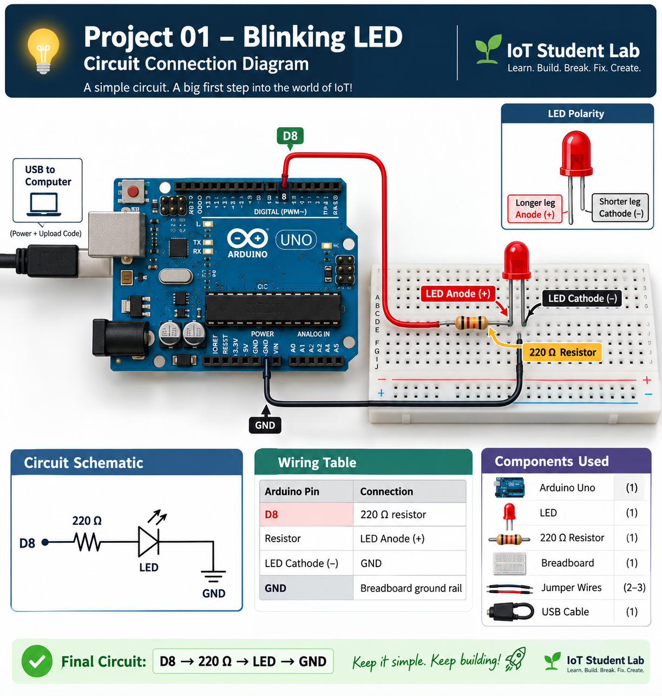

# 💡 Project 01 — Blinking LED

<p align="center">

**🌱 IoT Student Lab**

### Learn. Build. Break. Fix. Create.

*Your first step into the world of Embedded Systems & IoT*

</p>

---

## 🚀 Project Overview

Welcome to your **first hands-on project** in the IoT Student Lab!

The **Blinking LED** project may look simple, but it introduces one of the most fundamental concepts in embedded systems:

> 💡 **Using a microcontroller to control a physical device.**

In this project, an **Arduino Uno** will control an LED connected to one of its GPIO pins.

The LED will:

```text
🟢 ON  → 1 second
🔴 OFF → 1 second
🔄 Repeat continuously

🔗 The Core Idea

┌──────────────┐
│   Arduino    │
│ Microcontroller│
└──────┬───────┘
       │
       │ GPIO
       ▼
┌──────────────┐
│     LED      │
└──────┬───────┘
       │
       ▼
  💡 Physical
     Output

This simple principle will eventually allow you to control:

💡 LEDs
🔊 Buzzers
⚡ Relays
⚙️ Motors
🔄 Servos
💧 Pumps
🖥️ Displays
🏠 Smart-home devices
# 🔌 9. Circuit Connection


The circuit is:

**Arduino D8 → 220 Ω resistor → LED Anode (+) → LED Cathode (-) → GND**

🎯 1. Project Mission

Before working with sensors, motors, displays, Wi-Fi, cloud platforms and automation, you need to understand how a microcontroller interacts with the physical world.

This project establishes that foundation.

Your First Embedded-System Chain
💻 Program
    ↓
⚙️ GPIO
    ↓
⚡ Electrical Signal
    ↓
💡 LED
    ↓
👀 Physical Result
🧩 2. Problem Statement

Build a simple electronic system in which an Arduino repeatedly switches an LED ON and OFF.

The LED should:

🟢 Turn ON
⏱️ Remain ON for 1 second
🔴 Turn OFF
⏱️ Remain OFF for 1 second
🔄 Repeat continuously
Expected Behaviour
🟢 ON
   │
   ├── Wait 1 second
   │
🔴 OFF
   │
   ├── Wait 1 second
   │
🟢 ON
   │
   └── Repeat...
🎓 3. Learning Objectives

After completing this project, you should be able to:

🔌 Understand what a GPIO pin is
⚙️ Configure a GPIO pin as an output
🔢 Understand digital HIGH and LOW
💡 Identify LED polarity
🛡️ Understand why a resistor is required
🔧 Connect an LED safely to an Arduino
🧠 Use pinMode()
✍️ Use digitalWrite()
⏱️ Use delay()
🔄 Understand setup() and loop()
📤 Upload a program to an Arduino
🧪 Test a physical circuit
🐞 Identify basic hardware and software errors
🚀 Modify the program to create different blinking patterns
📍 4. Where This Project Fits

This is:

Level 1 → Arduino Fundamentals → Project 01

The Level 1 learning progression is:

💡 Digital Output
       ↓
⏱️ Timing
       ↓
🎲 Randomness
       ↓
💡💡 Multiple Outputs
       ↓
🔘 Inputs
       ↓
🔢 Patterns

Project 01 establishes the first building block:

Arduino → GPIO → LED
📊 5. Project Information
🏷️ Item	📋 Details
📚 Level	Level 1 — Arduino Fundamentals
🔢 Project	01 — Blinking LED
⭐ Difficulty	Beginner
🧠 Main Concept	Digital Output
🔌 Platform	Arduino Uno
📥 Input	None
📤 Output	LED
💻 Programming	Arduino C/C++
⏱️ Estimated Time	30–45 minutes
🧰 6. Components Required
Component	Quantity	Purpose
🔵 Arduino Uno	1	Main microcontroller
💡 LED	1	Visual output
🟫 220 Ω Resistor	1	Limits LED current
🟦 Breadboard	1	Circuit assembly
🔗 Jumper Wires	2–3	Electrical connections
🔌 USB Cable	1	Programming & power
🔍 7. Understanding the Components
🔵 7.1 Arduino Uno

The Arduino Uno is the controller of this project.

It executes the program and controls the electrical state of its GPIO pins.

For this project:

Arduino Digital Pin 8
        │
        ▼
   Controls LED
💡 7.2 LED

LED stands for:

Light Emitting Diode

An LED has two terminals:

Terminal	Typical Identification
➕ Anode	Longer leg
➖ Cathode	Shorter leg

LEDs are polarity-sensitive.

That means the direction in which you connect the LED matters.

      LED
   ┌────────┐
 + │        │ -
   └────────┘
 Anode    Cathode
🟫 7.3 Resistor

A resistor limits the current flowing through the LED.

For this project we use:

220 Ω resistor

The resistor is connected in series with the LED.

Arduino → Resistor → LED → GND

⚠️ Never connect an LED directly to a GPIO pin without an appropriate current-limiting resistor.

⚙️ 8. What Is GPIO?

GPIO means:

General Purpose Input/Output

A microcontroller GPIO pin can interact with external electronic components.

A GPIO can generally be configured as:

        GPIO
         │
    ┌────┴────┐
    ▼         ▼
 INPUT      OUTPUT

In this project, Arduino pin D8 is configured as an OUTPUT.

The Arduino can then set the pin to two basic digital states:

State	Meaning
🟢 HIGH	Output voltage is high
🔴 LOW	Output voltage is low

For an Arduino Uno, HIGH is approximately 5 V and LOW is approximately 0 V under normal operation.

🔌 9. Circuit Connection

The circuit is:

Arduino D8
    │
    ▼
  220 Ω
 Resistor
    │
    ▼
 LED Anode (+)
    │
 LED Cathode (-)
    │
    ▼
   GND
🔗 Wiring Table
Arduino Pin	Connection
D8	220 Ω resistor
Resistor	LED Anode (+)
LED Cathode (-)	GND
🧠 Remember
D8 → 220 Ω → LED → GND
🛡️ 10. Safety Checklist

Before connecting the Arduino to USB:

 🔍 Check LED polarity
 🟫 Check that the resistor is connected
 🧮 Check that the resistor is approximately 220 Ω
 🔌 Check the GND connection
 ⚡ Make sure there is no short circuit
 🔢 Check that D8 is connected correctly
 🔧 Check all breadboard connections

⚠️ SAFETY NOTE

Never connect an LED directly between a GPIO pin and GND without an appropriate current-limiting resistor.

🏆 25. Practical Assessment

You have successfully completed Project 01 when you can independently:

 🔧 Build the circuit
 💡 Explain LED polarity
 🟫 Explain the resistor's purpose
 🔢 Identify the GPIO pin
 ⚙️ Explain pinMode()
 🔌 Explain digitalWrite()
 ⏱️ Explain delay()
 📤 Upload the program
 🚀 Change the blink speed
 🔢 Change the GPIO pin
 🐞 Diagnose a simple wiring problem
 💡 Create your own LED pattern
🌍 26. Real-World Connection

The principle behind this tiny project appears throughout embedded systems.

A microcontroller can control:

             🧠 MICROCONTROLLER
                    │
       ┌────────────┼────────────┐
       │            │            │
       ▼            ▼            ▼
      💡 LED      🔊 Buzzer     ⚡ Relay
       │            │            │
       ▼            ▼            ▼
     Light        Sound        Device

The fundamental relationship remains:

💻 PROGRAM
    ↓
⚙️ GPIO
    ↓
⚡ ELECTRICAL SIGNAL
    ↓
🔧 DEVICE
    ↓
🌍 PHYSICAL ACTION

Later projects will use the same principle with:

Sensors
Actuators
Displays
Motors
Relays
Wi-Fi
Cloud platforms
Automation systems
🔗 27. Connection to Future Projects

This project is the foundation for everything that follows.

The progression is:

💡 LED
  ↓
💡💡 Multiple LEDs
  ↓
🔘 Buttons
  ↓
🌡️ Sensors
  ↓
🧠 Decision Making
  ↓
⚙️ Actuators
  ↓
🖥️ Displays
  ↓
📡 Wi-Fi
  ↓
☁️ IoT
  ↓
🏠 Automation
  ↓
🚀 Capstone Projects

You are therefore learning much more than how to blink an LED.

You are learning the relationship between:

Software ↔ Hardware ↔ Physical World

🎯 28. Learning Outcome

After completing this project, you should understand:

┌─────────────────────┐
│   Arduino Program   │
└──────────┬──────────┘
           ↓
┌─────────────────────┐
│   GPIO Configuration│
└──────────┬──────────┘
           ↓
┌─────────────────────┐
│  Electrical Signal  │
└──────────┬──────────┘
           ↓
┌─────────────────────┐
│         LED         │
└──────────┬──────────┘
           ↓
┌─────────────────────┐
│   Physical Result   │
└─────────────────────┘
🔄 Your First Engineering Cycle
✍️ WRITE
   ↓
📤 UPLOAD
   ↓
▶️ RUN
   ↓
👀 OBSERVE
   ↓
🐞 DEBUG
   ↓
🔧 MODIFY
   ↓
💡 CREATE
📁 29. Project File Structure
01-blinking-led/
│
├── 📄 README.md
│
├── 💻 code/
│   └── blinking_led.ino
│
├── 🔌 circuit/
│   └── wiring.md
│
├── 🖼️ images/
│
└── 📚 resources/
    └── notes.md
✅ 30. Before Moving to Project 02

Before proceeding, you should be able to answer:

💭 How does Arduino code ultimately cause an LED to physically turn ON?

A strong answer should connect:

💻 Code
   ↓
⚙️ GPIO Pin State
   ↓
⚡ Electrical Voltage
   ↓
🔌 Current Through Resistor
   ↓
💡 LED
   ↓
✨ Light

If you can explain it, build it, test it, modify it and troubleshoot it, you are ready for the next project.

🚀 Next Project
🎲 Project 02 — Random LED Glow & Variable Timing

In the next project, you will move beyond fixed blinking.

You will learn:

📦 Variables
🎲 Random numbers
⏱️ Variable timing
🧠 Program-controlled behaviour
Learning Progression
Fixed Behaviour
      ↓
Variable Behaviour
      ↓
Programmable Behaviour
<p align="center">
🌱 IoT Student Lab
Learn. Build. Break. Fix. Create.

Project 01 Complete? → Move to Project 02 🚀

</p> ```
