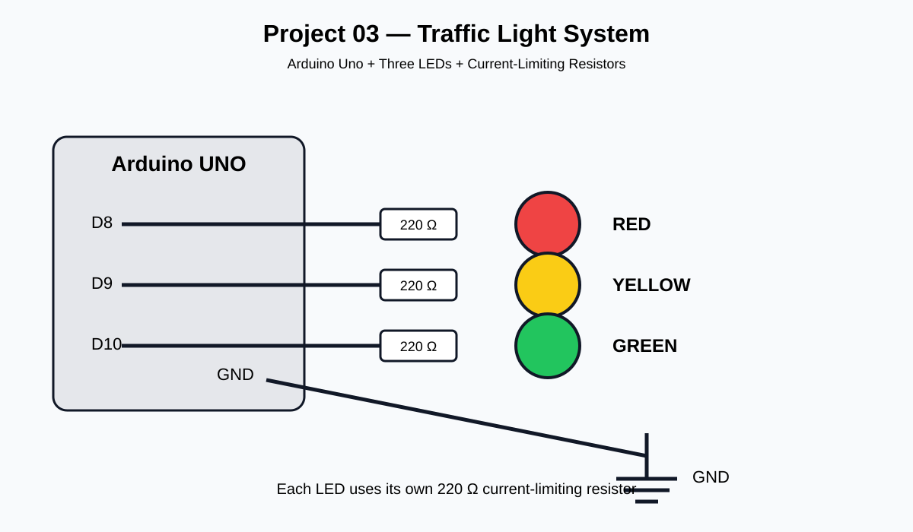

# 🚦 Project 03 — Traffic Light System

> **Control multiple outputs and turn them into a coordinated system.**

---

## 🎯 Project Story

A single LED is easy to control.

But real systems rarely have only one output.

A traffic signal must coordinate multiple lights so that the system follows a meaningful sequence.

In this project, three LEDs are controlled by an Arduino to simulate a basic traffic light.

The hardware introduces **multiple GPIO outputs**, while the software introduces **sequencing, timing, and system states**.

---

## 🧠 What You Will Learn

By completing this project, you will understand:

- Multiple digital output pins
- GPIO configuration
- Sequential program execution
- System states
- Timed state transitions
- Functions
- Coordinating multiple outputs
- Basic automation logic

The course source identifies Project 03 as **“Traffic Light System”** with the main concept **multiple outputs + sequencing**.

---

## 📈 Learning Progression

```text
Project 01
Blinking LED
Digital Output
      ↓
Project 02
Random LED Glow
Variables + Randomness
      ↓
Project 03
Traffic Light
Multiple Outputs + Sequencing

🎯 Objective

Build a three-light traffic signal using an Arduino Uno.

The system will cycle through:

🔴 RED → 🟢 GREEN → 🟡 YELLOW → 🔴 RED → ...

The project introduces the idea of managing several digital output signals according to an ordered timeline.

🧰 Hardware
Component	Quantity
Arduino Uno	1
Red LED	1
Yellow LED	1
Green LED	1
220 Ω resistor	3
Breadboard	1
Jumper wires	Several

⚠️ Each LED must have its own current-limiting resistor.

🔌 Pin Mapping
Arduino Pin	Function
D8	Red LED
D9	Yellow LED
D10	Green LED
🔧 Circuit


See the detailed wiring guide:

circuit/wiring.md


Basic Connection
Arduino D8  → 220 Ω → Red LED    → GND
Arduino D9  → 220 Ω → Yellow LED → GND
Arduino D10 → 220 Ω → Green LED  → GND
💡 LED Polarity

For each LED:

Longer leg → Anode (+)
Shorter leg → Cathode (-)
Cathode → GND

Each LED must be connected through its own resistor.

🔄 How It Works

The Arduino repeatedly executes three states.

State 1 — RED
🔴 RED    → ON
🟡 YELLOW → OFF
🟢 GREEN  → OFF

Duration: 5 seconds

State 2 — GREEN
🔴 RED    → OFF
🟡 YELLOW → OFF
🟢 GREEN  → ON

Duration: 5 seconds

State 3 — YELLOW
🔴 RED    → OFF
🟡 YELLOW → ON
🟢 GREEN  → OFF

Duration: 2 seconds

Then the system returns to RED.

🧭 System Flow
             START
               │
               ▼
        Configure GPIOs
               │
               ▼
        🔴 RED = ON
        🟡 YELLOW = OFF
        🟢 GREEN = OFF
               │
             5 sec
               │
               ▼
        🔴 RED = OFF
        🟡 YELLOW = OFF
        🟢 GREEN = ON
               │
             5 sec
               │
               ▼
        🔴 RED = OFF
        🟡 YELLOW = ON
        🟢 GREEN = OFF
               │
             2 sec
               │
               └──────────────► RED
💻 Code

The complete Arduino program is available here:

code/traffic_light.ino

The key idea is to represent each traffic-light state explicitly:

setLights(HIGH, LOW, LOW);
delay(RED_TIME);

setLights(LOW, LOW, HIGH);
delay(GREEN_TIME);

setLights(LOW, HIGH, LOW);
delay(YELLOW_TIME);
🔍 Code Walkthrough
1. Pin Definitions
const int RED_LED = 8;
const int YELLOW_LED = 9;
const int GREEN_LED = 10;

These give meaningful names to the GPIO pins.

Instead of writing:

digitalWrite(8, HIGH);

we can write:

digitalWrite(RED_LED, HIGH);

This makes the program easier to understand.

2. Timing Constants
const unsigned long RED_TIME = 5000;
const unsigned long YELLOW_TIME = 2000;
const unsigned long GREEN_TIME = 5000;

The values are in milliseconds.

Therefore:

5000 ms = 5 seconds
2000 ms = 2 seconds

Using named constants makes the timing easy to modify.

3. Configure the GPIOs
pinMode(RED_LED, OUTPUT);
pinMode(YELLOW_LED, OUTPUT);
pinMode(GREEN_LED, OUTPUT);

All three pins are configured as digital outputs.

4. Control the Lights

The project uses a function:

setLights(redState, yellowState, greenState);

For example:

setLights(HIGH, LOW, LOW);

means:

RED    = ON
YELLOW = OFF
GREEN  = OFF
🧩 Why Use a Function?

Without a function, we would repeatedly write:

digitalWrite(RED_LED, HIGH);
digitalWrite(YELLOW_LED, LOW);
digitalWrite(GREEN_LED, LOW);

Instead, the function groups the three related operations.

setLights()
    │
    ├── RED
    ├── YELLOW
    └── GREEN

This makes the program easier to maintain and extend.

🧠 Understanding System States

A state describes the current condition of a system.

For this project:

RED STATE
    ↓
GREEN STATE
    ↓
YELLOW STATE
    ↓
RED STATE

Each state defines the required output of every LED.

State	Red	Yellow	Green
RED	ON	OFF	OFF
GREEN	OFF	OFF	ON
YELLOW	OFF	ON	OFF

This idea becomes extremely important in larger embedded systems.

🧪 Testing Procedure
Test 1 — Power

Connect the Arduino and verify that the board powers normally.

Test 2 — Red

The red LED should turn ON first.

Test 3 — Green

After approximately 5 seconds, green should turn ON.

Test 4 — Yellow

After approximately 5 seconds, yellow should turn ON.

Test 5 — Repeat

The sequence should continuously repeat.

✅ Expected Behaviour
🔴 RED     → 5 sec
🟢 GREEN   → 5 sec
🟡 YELLOW  → 2 sec
🔴 RED     → repeat

Only one traffic light should be ON during each programmed state.

🐛 Troubleshooting
❌ No LED turns on

Check:

Arduino power
GND connection
Breadboard connections
LED polarity
Resistors
❌ One LED does not work

Check:

Correct GPIO pin
LED orientation
Resistor connection
Breadboard row
Jumper wire
❌ Wrong LED turns on

Verify the wiring:

D8  → RED
D9  → YELLOW
D10 → GREEN
❌ Two LEDs turn on together

Check for:

Incorrect breadboard connections
Shorted rows
Incorrect wiring
LED legs placed in the same connected row
Incorrect code
🧪 Experiments
Experiment 1 — Change Red Timing

Change:

const unsigned long RED_TIME = 5000;

to:

const unsigned long RED_TIME = 3000;

Observe the difference.

Experiment 2 — Change Green Timing

Try:

const unsigned long GREEN_TIME = 8000;

Observe how the system changes.

Experiment 3 — Change Yellow Timing

Try:

const unsigned long YELLOW_TIME = 1000;

Compare the behaviour.

🧩 Challenge — Add a Transition State

Create a more realistic sequence:

🔴 RED
   ↓
🔴🟡 RED + YELLOW
   ↓
🟢 GREEN
   ↓
🟡 YELLOW
   ↓
🔴 RED

Before changing the program, write down the required state of each GPIO.

🚀 Challenge 2 — Create Your Own Timing Profile

Design your own traffic-light timing.

For example:

RED    → 8 seconds
GREEN  → 6 seconds
YELLOW → 2 seconds

Explain why you selected those values.

🔬 Engineering Challenge

Try to answer:

What would happen if the program accidentally turned RED and GREEN ON at the same time?

Think about why software must maintain valid system states.

This is the beginning of thinking about fault conditions and system safety.

🧠 Knowledge Check
Why does each LED require its own resistor?
Why are three different GPIO pins required?
What does HIGH mean for an LED output?
Why are named timing constants useful?
What is a system state?
Why is sequencing important?
What does the setLights() function accomplish?
How can software change the behaviour of the same hardware?
