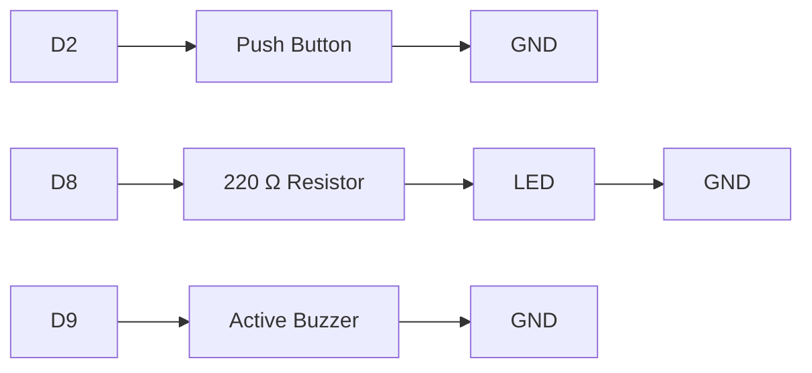
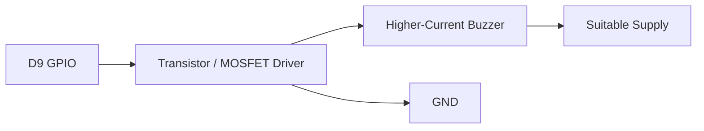
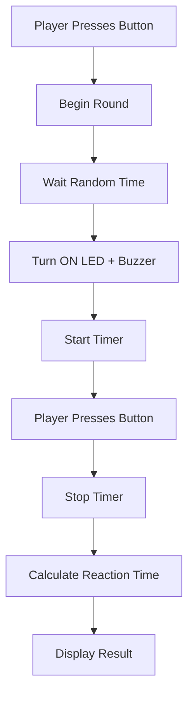

# Project 17 — Reaction Timer Wiring

> **Learning Notes · Arduino & Embedded Systems**
>
> **Core concept:** Build a simple reaction-time tester that waits for a random signal, starts a timer, detects the player's response, and reports the elapsed reaction time.

---

## 📘 Components

| Component | Quantity | Purpose |
|---|---:|---|
| Arduino Uno | 1 | Main controller |
| Push button | 1 | User input / reaction trigger |
| LED | 1 | Visual start signal |
| 220 Ω resistor | 1 | Limits LED current |
| Small active buzzer | 1 | Audible start signal |
| Breadboard | 1 | Circuit assembly |
| Jumper wires | As required | Electrical connections |

---

# 1. Pin Assignment

| Arduino Pin | Component | Function |
|---|---|---|
| **D2** | Push button | Digital input |
| **D8** | LED | Visual output |
| **D9** | Active buzzer | Audio output |
| **GND** | Button, LED, buzzer | Common ground |

### Wiring Overview



---

# 2. Push Button Wiring

Connect the push button between **D2** and **GND**.

| Component | Arduino |
|---|---|
| Button side 1 | **D2** |
| Button side 2 | **GND** |

The program uses Arduino's internal pull-up resistor:

```cpp
pinMode(buttonPin, INPUT_PULLUP);
```

With `INPUT_PULLUP`, the input logic is inverted:

| Button Condition | Arduino Reads |
|---|---|
| Released | `HIGH` |
| Pressed | `LOW` |

### Electrical Concept

```text
             Arduino
               D2
                │
        Internal Pull-up
                │
                ●
                │
          ┌─────────┐
          │ BUTTON  │
          └─────────┘
                │
               GND
```

> 💡 **Important:** Because `INPUT_PULLUP` is used, a pressed button reads **LOW**, not HIGH.

---

# 3. LED Wiring

Connect the LED to **D8** through a **220 Ω current-limiting resistor**.

```text
Arduino D8
    │
    ▼
  220 Ω
    │
    ▼
LED Anode (+)
LED Cathode (-)
    │
    ▼
   GND
```

| LED Connection | Goes To |
|---|---|
| Arduino output | **D8** |
| Resistor | **220 Ω** |
| LED anode (+) | Resistor |
| LED cathode (−) | GND |

> ⚠️ Verify LED polarity before powering the circuit.

---

# 4. Active Buzzer Wiring

For a **small active buzzer suitable for GPIO control**:

| Buzzer Terminal | Arduino |
|---|---|
| `+` | **D9** |
| `−` | **GND** |

```text
Arduino D9
    │
    ▼
 ┌─────────┐
 │ BUZZER  │
 └─────────┘
    │
    ▼
   GND
```

If the buzzer requires more current than the Arduino GPIO can safely supply, use a suitable **transistor or MOSFET driver** and an appropriate external supply.



> ⚠️ **Do not assume every buzzer can be driven directly from a GPIO pin. Check its electrical specifications.**

---

# 5. Complete Circuit

```text
                         ARDUINO UNO
                    ┌──────────────────┐
                    │                  │
             D2 ────┤ Button Input     │
                    │                  │
             D8 ────┤ LED Output       │── 220 Ω ── LED ── GND
                    │                  │
             D9 ────┤ Buzzer Output    │──────────── Buzzer ── GND
                    │                  │
            GND ────┤ Common Ground    │
                    │                  │
                    └──────────────────┘


             PUSH BUTTON

             D2 ───────── BUTTON ───────── GND
```

### Complete Connection Summary

| Device | Pin / Terminal | Arduino Connection |
|---|---|---|
| Push button | Side 1 | D2 |
| Push button | Side 2 | GND |
| LED | Anode | Through 220 Ω resistor to D8 |
| LED | Cathode | GND |
| Active buzzer | `+` | D9 |
| Active buzzer | `−` | GND |

---

# 6. How the Reaction Timer Works



### Sequence Explained

1. The player starts a round by pressing the button.
2. The Arduino waits for a **random amount of time**.
3. The LED and buzzer provide the start signal.
4. The timer begins.
5. The player presses the button as quickly as possible.
6. The Arduino detects the response.
7. The timer stops.
8. The elapsed time is calculated.
9. The reaction time is displayed through the Serial Monitor.

---

# 7. Reaction-Time Measurement

The basic measurement is:

```text
Reaction Time = Response Time − Signal Time
```

Example:

```text
Signal occurs:     5230 ms
Button response:   5498 ms

Reaction time = 5498 − 5230
              = 268 ms
```

A typical Arduino implementation can capture the signal time with:

```cpp
startTime = millis();
```

Then calculate the elapsed time after the response:

```cpp
reactionTime = millis() - startTime;
```

> 🧠 **Key idea:** `millis()` provides elapsed time in milliseconds since the Arduino program started.

---

# 8. Testing Procedure

1. Upload the Arduino program.
2. Open the **Serial Monitor**.
3. Set the baud rate to **9600 baud**.
4. Press the button to begin a round.
5. Wait for the LED and buzzer signal.
6. Press the button as quickly as possible after the signal.
7. Read the reaction time.
8. Repeat the test several times.
9. Compare your results.

### Suggested Experiment Log

| Trial | Reaction Time (ms) | Observation |
|---:|---:|---|
| 1 | ______ | __________________ |
| 2 | ______ | __________________ |
| 3 | ______ | __________________ |
| 4 | ______ | __________________ |
| 5 | ______ | __________________ |
| **Best** | ______ | |
| **Average** | ______ | |

---

# 9. Troubleshooting

## 🔴 Timer Starts Immediately

Check:

- Push-button wiring
- Button orientation on the breadboard
- `INPUT_PULLUP` configuration
- Whether the program correctly interprets `LOW` as pressed

```text
INPUT_PULLUP

Released → HIGH
Pressed  → LOW
```

## 🔴 Reaction Time Is Extremely Large

Check:

- Whether the timer starts exactly when the signal occurs.
- Whether `startTime` is captured correctly.
- Whether the response calculation uses:

```cpp
reactionTime = millis() - startTime;
```

- Whether the button is being detected correctly.

## 🔴 LED Does Not Turn ON

Check:

- LED polarity
- 220 Ω resistor
- D8 connection
- GND connection
- LED condition in the program

A typical LED has:

```text
Longer leg → Anode (+)
Shorter leg → Cathode (−)
```

> ⚠️ LED package markings vary, so verify the component before relying solely on lead length.

## 🔴 Buzzer Does Not Sound

Check:

- Buzzer polarity, if polarized
- Whether the buzzer is an **active** buzzer
- D9 connection
- GND connection
- Whether the buzzer requires more current than the GPIO can provide

### Active vs Passive Buzzer

| Type | Behavior |
|---|---|
| **Active buzzer** | Produces a tone when powered |
| **Passive buzzer** | Usually requires a changing/PWM signal to produce a tone |

---

# 10. Safety and Electrical Notes

Use only **low-voltage components** suitable for Arduino projects.

### Do Not

- Connect high-power buzzers directly to an Arduino GPIO.
- Exceed the electrical limits of Arduino pins.
- Connect an LED directly to a GPIO without appropriate current limiting.
- Assume every buzzer is safe for direct GPIO control.

### If More Current Is Required

```text
Arduino GPIO
     │
     ▼
Transistor / MOSFET Driver
     │
     ▼
Load
     │
     ▼
Suitable Power Supply
```

The Arduino controls the load without supplying the load's full current directly from the GPIO.

---

# 11. Learning Checkpoint

Before moving to the next project, students should be able to explain:

- Why `INPUT_PULLUP` makes the button read **LOW when pressed**.
- Why the LED needs a **220 Ω resistor**.
- The difference between an **active and passive buzzer**.
- Why `millis()` is useful for reaction-time measurement.
- How a random delay prevents the player from predicting the signal.
- How the Arduino calculates elapsed reaction time.
- Why GPIO current limitations matter.

---

# 12. Key Takeaway

The reaction timer combines several important embedded-system concepts:

```text
INPUT
  ↓
BUTTON STATE
  ↓
RANDOM EVENT
  ↓
VISUAL + AUDIO SIGNAL
  ↓
TIME MEASUREMENT
  ↓
USER RESPONSE
  ↓
REACTION-TIME CALCULATION
  ↓
SERIAL OUTPUT
```

> 🚀 **This project introduces students to event-driven programming, timing, user input, hardware outputs, and measurement—all concepts that appear repeatedly in real embedded and IoT systems.**

---

## Project 17 · Quick Reference

| Item | Value |
|---|---|
| **Platform** | Arduino Uno |
| **Input** | Push button |
| **Button pin** | D2 |
| **LED pin** | D8 |
| **Buzzer pin** | D9 |
| **LED resistor** | 220 Ω |
| **Button mode** | `INPUT_PULLUP` |
| **Pressed state** | `LOW` |
| **Released state** | `HIGH` |
| **Timer function** | `millis()` |
| **Serial baud rate** | 9600 |
| **Main concepts** | Digital input · Digital output · Timing · Event detection · Reaction-time measurement |
