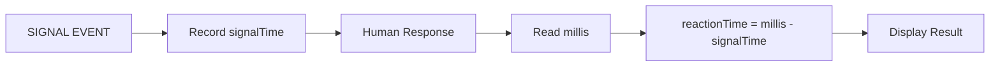
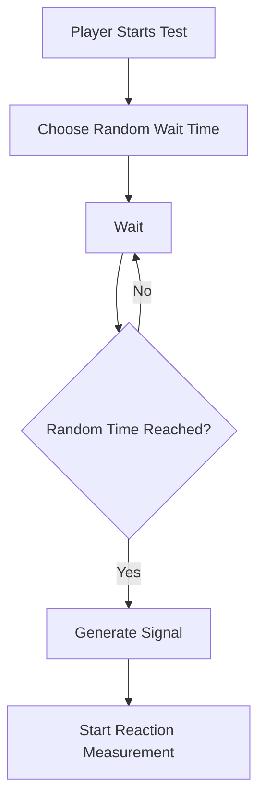
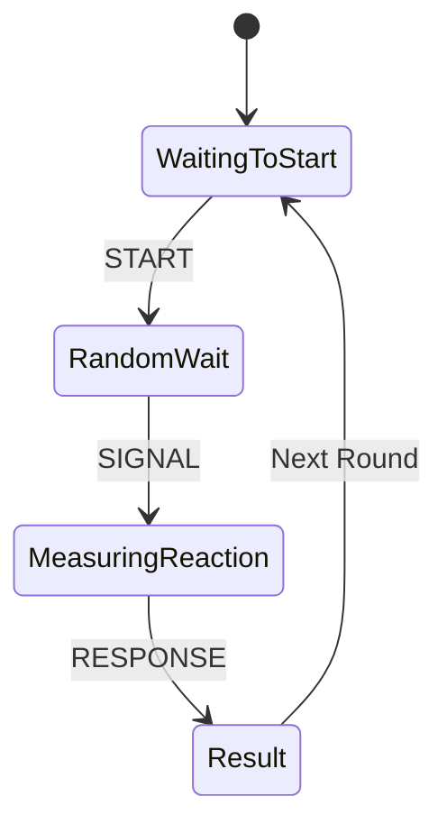
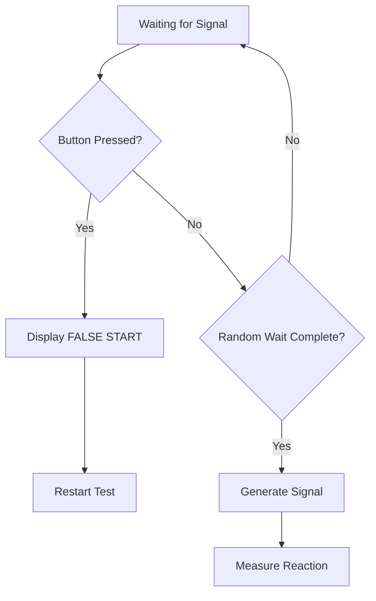
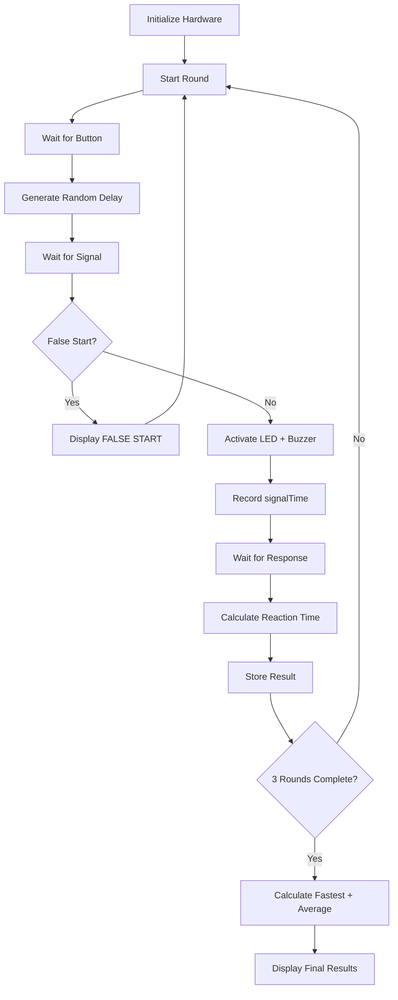

# Project 17 — Reaction Timer

> **Learning Notes · Arduino & Embedded Systems**
>
> **Core concept:** Use timestamps and elapsed-time measurement to determine how quickly a person responds to a signal.

---

## 📘 Learning Objectives

By the end of this project, students should be able to:

- Understand **event timing** in embedded systems.
- Use Arduino's `millis()` function.
- Calculate elapsed time between two events.
- Understand why a **random delay** is useful in a reaction-time game.
- Use **state variables** to control different stages of a program.
- Detect and handle **false starts**.
- Record and compare multiple reaction-time measurements.
- Calculate **fastest** and **average** reaction times.

---

# 1. The Big Idea

A timer can be used not only to control an output, but also to **measure when an event occurs**.

This project measures how quickly a person responds to a signal.

The basic process is:

```text
SIGNAL
  ↓
START TIMER
  ↓
HUMAN RESPONSE
  ↓
STOP TIMER
  ↓
CALCULATE ELAPSED TIME
```

The Arduino records the time at which the signal appears and then records the time when the player responds.

The difference between these timestamps is the player's **reaction time**.

---

# 2. Understanding `millis()`

Arduino provides the function:

```cpp
millis()
```

`millis()` returns the number of **milliseconds elapsed since the Arduino program started running**.

### Time Examples

| Milliseconds | Equivalent Time |
|---:|---:|
| `1000 ms` | 1 second |
| `2000 ms` | 2 seconds |
| `2500 ms` | 2.5 seconds |
| `5000 ms` | 5 seconds |

For example, if:

```text
Signal time    = 5000 ms
Response time  = 5284 ms
```

then:

```text
Reaction time = 5284 − 5000
              = 284 ms
```

---

# 3. Calculating Reaction Time

The core calculation is:

```cpp
reactionTime = millis() - signalTime;
```

Where:

| Variable | Meaning |
|---|---|
| `millis()` | Current timestamp |
| `signalTime` | Timestamp recorded when the signal appeared |
| `reactionTime` | Time elapsed between signal and response |

### Conceptual Flow



> 💡 **Key idea:** The Arduino does not need a stopwatch that physically starts and stops. It can simply compare two timestamps.

---

# 4. Why Random Delay?

If the player knows exactly when the signal will appear, they can **anticipate** it.

For example, if the signal always appears exactly 3 seconds after pressing the button:

```text
0 s ───────── 1 s ───────── 2 s ───────── 3 s
                                           ↓
                                         SIGNAL
```

The player can predict the signal and press the button early.

Instead, the program waits for a random period.

```cpp
random(MIN_WAIT_TIME, MAX_WAIT_TIME + 1);
```

The signal therefore appears at an unpredictable time.

### Randomized Timing



> 🎯 **Purpose:** Random timing makes the test measure reaction rather than anticipation.

---

# 5. Event Timing

The reaction timer can be understood as three important events:

```text
START
  ↓
SIGNAL
  ↓
RESPONSE
```

The Arduino records a timestamp at the **SIGNAL** event.

When the **RESPONSE** occurs, it records another timestamp.

The reaction time is:

```text
Response Time − Signal Time
```

### Timeline Example

```text
Time ───────────────────────────────────────────────►

START                SIGNAL                 RESPONSE
  │                     │                       │
  │                     │                       │
  ▼                     ▼                       ▼
  0 ms               5230 ms                 5514 ms
                        │<──── 284 ms ───────>│
```

Therefore:

```text
5514 ms − 5230 ms = 284 ms
```

---

# 6. Understanding Program State

The program needs to know **which stage of the test it is currently in**.

For this reason, it can use state variables such as:

```cpp
waitingForReaction
measuringReaction
```

These variables represent the current operating state of the reaction timer.

### Example State Model



### State Meaning

| State | Meaning |
|---|---|
| `waitingForReaction` | The system is waiting for the appropriate user action/event |
| `measuringReaction` | The signal has occurred and the Arduino is measuring the response |
| Result state | The reaction time has been calculated and displayed |

> 🧠 **Why use states?** State variables prevent the program from treating every button press the same way. A press during the waiting stage means something different from a press after the signal.

---

# 7. Experiment 1 — Change the Waiting Period

Change the waiting period to:

```cpp
const unsigned long MIN_WAIT_TIME = 1000;
const unsigned long MAX_WAIT_TIME = 3000;
```

This creates a random waiting period between approximately:

```text
1 second → 3 seconds
```

### Observe

Run several tests and ask:

- Does the signal feel predictable?
- Is the test easier or harder?
- Do you find yourself anticipating the signal?
- How does changing the range affect your performance?

### Record Your Observation

```text
Observation:
____________________________________________________
____________________________________________________
```

---

# 8. Experiment 2 — Record Multiple Attempts

Perform **five reaction-time tests**.

Record each result:

| Attempt | Reaction Time |
|---:|---:|
| 1 | ______ ms |
| 2 | ______ ms |
| 3 | ______ ms |
| 4 | ______ ms |
| 5 | ______ ms |

### Questions

1. Which attempt was fastest?
2. Which attempt was slowest?
3. Did your reaction time improve with practice?
4. Were your results consistent?

---

# 9. Experiment 3 — Calculate the Average

Modify the program so that it calculates the **average reaction time after five attempts**.

The basic mathematical concept is:

```text
Total Reaction Time
        ÷
Number of Attempts
        =
Average Reaction Time
```

### Example

Suppose the results are:

```text
284 ms
311 ms
267 ms
295 ms
278 ms
```

Then:

```text
Total = 1435 ms

Average = 1435 ÷ 5
        = 287 ms
```

### Formula

```text
Average Reaction Time =
    (Attempt 1 + Attempt 2 + ... + Attempt N)
    ÷ N
```

> 🧮 **Programming challenge:** Think about what variables you need to store the total and number of attempts.

---

# 10. Experiment 4 — False Start Detection

A reaction test should not allow the player to press the button **before the signal**.

Improve the program so that a button press during the waiting period is detected as a **false start**.

### Expected Output

```text
FALSE START
```

Then restart the test.

### False-Start Logic



### Why Is This Important?

Without false-start detection, a player could press the button before the signal and obtain an artificially low reaction time.

This makes false-start handling an important part of **measurement integrity**.

---

# 11. Challenge — Three-Round Reaction Game

Create a complete reaction game with **three rounds**.

## Requirements

The program should include:

- Random signal timing
- Reaction-time measurement
- Three attempts
- Average reaction time
- Fastest reaction time
- False-start detection

### Example Output

```text
========================
       REACTION TEST
========================

Round 1: 284 ms
Round 2: 311 ms
Round 3: 267 ms

Fastest: 267 ms
Average: 287 ms

========================
```

---

# 12. Suggested Program Architecture

A clean implementation can separate the project into logical stages:



This structure introduces students to a useful programming principle:

> **Break a larger problem into smaller states and operations.**

---

# 13. Data Collection

For the three-round challenge, maintain a simple results table:

| Round | Reaction Time | Result |
|---:|---:|---|
| 1 | ______ ms | |
| 2 | ______ ms | |
| 3 | ______ ms | |
| **Fastest** | ______ ms | Best result |
| **Average** | ______ ms | Overall performance |

### Suggested Extension

After completing three rounds, challenge students to modify the program to support:

```text
5 rounds
10 rounds
Custom number of rounds
```

This introduces the concept of **scalable program design**.

---

# 14. Real-World Connection

Precise event timing is used in many real systems.

| Application | Example |
|---|---|
| 🏭 **Industrial control** | Measuring machine events and process timing |
| 🤖 **Robotics** | Coordinating sensors, motors, and actions |
| 🔬 **Digital instruments** | Measuring intervals between signals |
| 🖥️ **Human-machine interfaces** | Measuring user interaction |
| 🎮 **Game controllers** | Timing player input and events |
| 📡 **Communication systems** | Measuring signal intervals and timing relationships |
| 📊 **Performance measurement** | Measuring response and process times |

The reaction timer is therefore a small but realistic example of **event-based measurement**.

---

# 15. The General Timing Principle

The same fundamental method can be used far beyond this project:

```text
EVENT A
   ↓
RECORD TIMESTAMP
   ↓
EVENT B
   ↓
RECORD TIMESTAMP
   ↓
CALCULATE ELAPSED TIME
```

Mathematically:

```text
Elapsed Time = Timestamp B − Timestamp A
```

This is one of the most important patterns in embedded-system programming.

---

# 16. Learning Outcome

After completing this project, students should understand:

| Learning Area | Expected Understanding |
|---|---|
| **Event timing** | Events can be measured using timestamps |
| **`millis()`** | Provides elapsed milliseconds since program start |
| **Elapsed-time calculation** | Difference between two timestamps gives elapsed time |
| **Random delays** | Make the signal unpredictable |
| **State variables** | Represent the current stage of a program |
| **Human-machine interaction** | Buttons and outputs allow users to interact with the system |
| **Measurement** | Software can quantify real-world user responses |
| **False-start detection** | Invalid early responses can be identified and rejected |

---

# 17. Quick Review Questions

1. What does `millis()` return?
2. Why is reaction time calculated using the difference between two timestamps?
3. Why should the waiting period be random?
4. What is the difference between a **timestamp** and **elapsed time**?
5. What does a state variable represent?
6. Why is false-start detection important?
7. How would you calculate the average of five reaction times?
8. How could you modify the project for ten rounds?
9. What happens if the signal timestamp is recorded too early?
10. Where else could timestamp-based event measurement be used?

---

# 18. Key Takeaway

The reaction timer demonstrates a powerful embedded-systems concept:

> **Record when something happens, record when it happens again, and calculate the difference.**

The complete learning chain is:

```text
USER INPUT
    ↓
PROGRAM STATE
    ↓
RANDOM WAIT
    ↓
SIGNAL EVENT
    ↓
TIMESTAMP
    ↓
HUMAN RESPONSE
    ↓
SECOND TIMESTAMP
    ↓
ELAPSED TIME
    ↓
RESULT
```

Students are not simply building a reaction game—they are learning the foundation of **event timing, state machines, timestamp-based measurement, and human-machine interaction**.

---

## 🧠 Remember

```text
Event A
  ↓
Record Timestamp A
  ↓
Event B
  ↓
Record Timestamp B
  ↓
Timestamp B − Timestamp A
  ↓
Elapsed Time
```

**Build → Measure → Analyze → Improve**

---

## Project 17 · Quick Reference

| Item | Value |
|---|---|
| **Project** | Reaction Timer |
| **Platform** | Arduino |
| **Primary function** | `millis()` |
| **Timing unit** | Milliseconds |
| **Core measurement** | `Response Time − Signal Time` |
| **Timing strategy** | Randomized delay |
| **Program concept** | State-based control |
| **Input** | Push button |
| **Outputs** | LED + buzzer |
| **Advanced features** | False-start detection · Multiple rounds · Average · Fastest result |
| **Main skills** | Event timing · State management · Measurement · Human-machine interaction |

---

# Project Completion Checklist

- [ ] Understand `millis()`
- [ ] Understand timestamps
- [ ] Calculate elapsed time
- [ ] Implement random waiting
- [ ] Understand program states
- [ ] Test five reaction attempts
- [ ] Calculate average reaction time
- [ ] Implement false-start detection
- [ ] Complete the three-round challenge
- [ ] Identify at least three real-world applications

---

