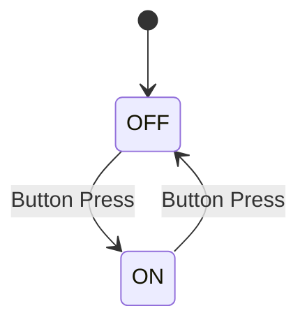
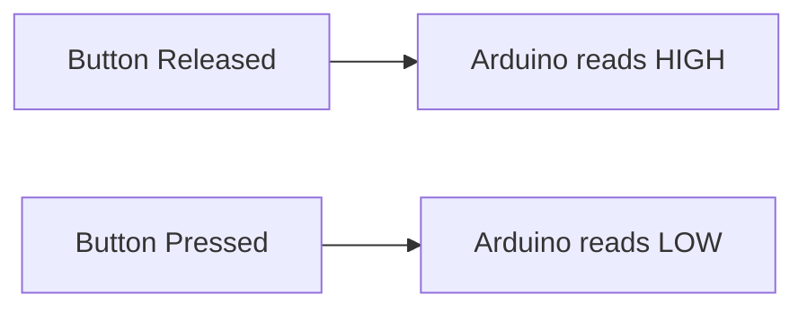
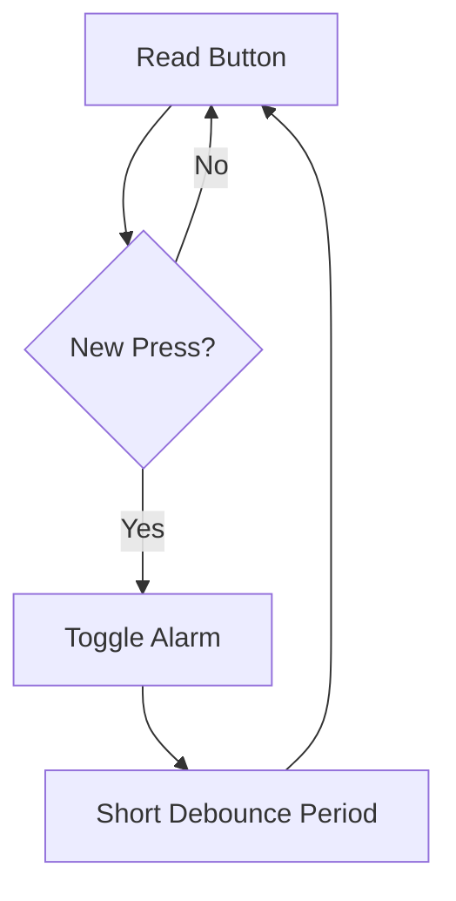
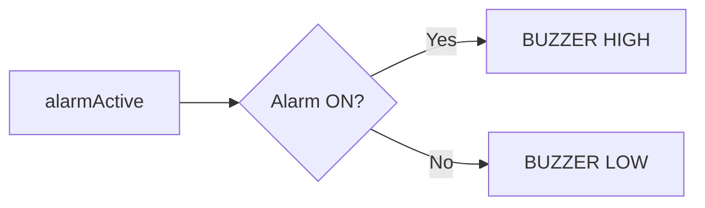
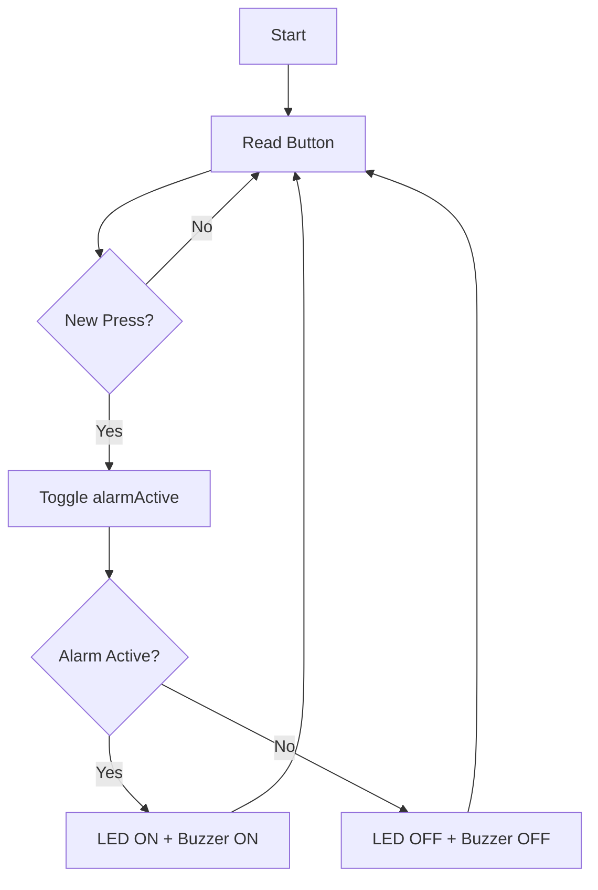
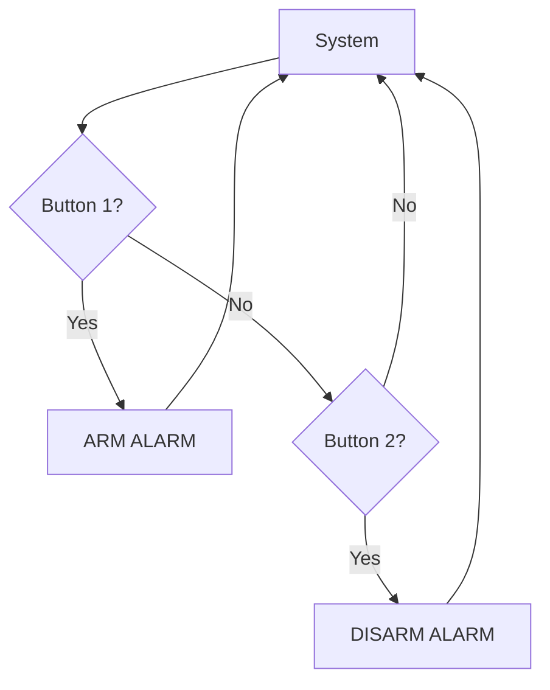
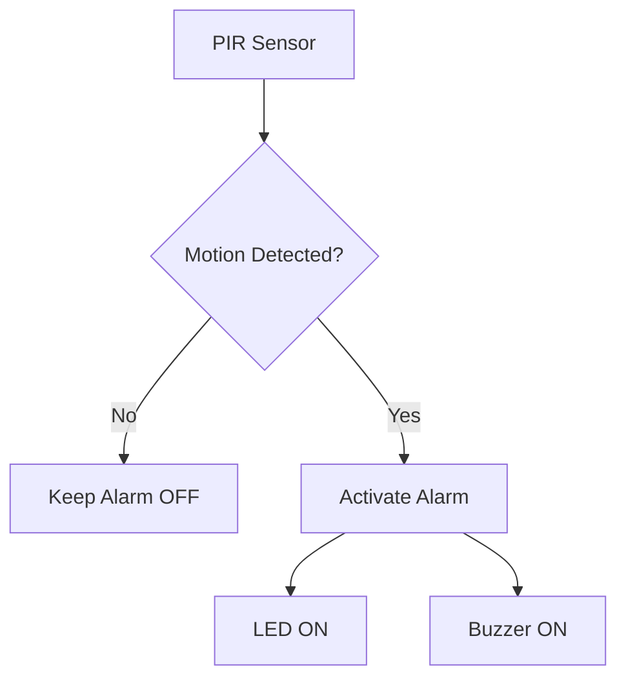
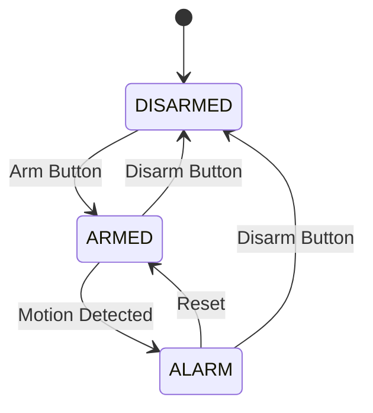

# Project 18 — Buzzer Alarm

> **Learning Notes · Arduino & Embedded Systems**
>
> **Core concept:** Use a button to control an alarm made from a visual output (LED) and an audible output (buzzer).

---

## 1. The Big Idea

This project introduces an **audible output** and shows how one input can control multiple outputs.

The basic system follows:

```text
       INPUT
         │
         ▼
   Button Press
         │
         ▼
   Detect Event
         │
         ▼
   Change State
         │
     ┌───┴───┐
     ▼       ▼
    LED    Buzzer
```

The important programming pattern is:

> **Input → State → Outputs**

The button does not directly "turn on" the LED and buzzer. Instead, the button changes the **alarm state**, and the alarm state determines what the outputs should do.

---

# 2. Alarm State

The program stores the current alarm condition using a Boolean variable:

```cpp
bool alarmActive = false;
```

A Boolean has only two possible values:

```text
false → Alarm OFF
true  → Alarm ON
```

### State Diagram



### State Table

| `alarmActive` | Alarm | LED | Buzzer |
|---|---|---|---|
| `false` | OFF | OFF | OFF |
| `true` | ON | ON | ON |

> 💡 **Key idea:** The variable stores the system's current condition. The outputs simply follow that condition.

---

# 3. Toggle Logic

When the button is pressed, the alarm state is reversed:

```cpp
alarmActive = !alarmActive;
```

The `!` operator means **NOT**.

Therefore:

```text
false → true
true  → false
```

### Visualizing the Toggle

```text
             BUTTON PRESS
                  │
                  ▼
        ┌──────────────────┐
        │ Reverse the state│
        │  !alarmActive    │
        └────────┬─────────┘
                 │
          ┌──────┴──────┐
          ▼             ▼
       OFF → ON      ON → OFF
```

This allows a simple momentary push button to behave like an **ON/OFF switch**.

---

# 4. Button Input

The button is connected between **D2** and **GND**.

The program uses:

```cpp
pinMode(BUTTON_PIN, INPUT_PULLUP);
```

With the internal pull-up resistor:

```text
Released → HIGH
Pressed  → LOW
```

### Button Circuit

```text
             Arduino D2
                 │
                 │
             ┌───┴───┐
             │       │
             │ Button│
             │       │
             └───┬───┘
                 │
                GND
```

### Button Logic



> ⚠️ Because `INPUT_PULLUP` is used, **LOW means pressed**.

---

# 5. Detecting a Button Event

The program should react to a **new press**, rather than continuously reacting while the button is held.

The important transition is:

```text
HIGH → LOW
```

This represents:

```text
Released
   ↓
Pressed
```

### Event Detection

```text
Previous State       Current State
      HIGH                LOW
        │                   │
        └───────┬───────────┘
                ▼
          NEW PRESS EVENT
                │
                ▼
         Toggle Alarm
```

This makes:

```text
1 physical press
       ↓
1 alarm toggle
```

rather than repeatedly switching the alarm while the button remains pressed.

---

# 6. Debouncing

Mechanical buttons do not always produce a clean electrical transition.

A single physical press may look like:

```text
HIGH → LOW → HIGH → LOW → HIGH
```

for a very short time.

This is called **switch bounce**.

### Ideal vs Real Button Signal

```text
IDEAL

HIGH ──────────────┐
                   │
                   └──────── LOW


REAL

HIGH ─────────┐
              └─ LOW ┐
                     └─ HIGH ┐
                             └─ LOW
```

Without debouncing, the Arduino could interpret one press as several presses.

A simple learning implementation may use:

```cpp
delay(DEBOUNCE_DELAY);
```

after detecting a press.

### Debounce Concept



> 🧠 **Goal:** One physical button press should produce one logical event.

---

# 7. Audible Output

The buzzer provides an **audible indication** of the alarm state.

For a suitable active buzzer:

```cpp
digitalWrite(BUZZER_PIN, HIGH);
```

turns the buzzer on, while:

```cpp
digitalWrite(BUZZER_PIN, LOW);
```

turns it off.

### Basic Logic

```text
HIGH → Sound
LOW  → Silent
```

### Output Flow



---

# 8. Why Add a Buzzer?

An LED gives the user a **visual indication**.

A buzzer gives the user an **audible indication**.

Using both makes the alarm easier to notice.

```text
             ALARM
               │
        ┌──────┴──────┐
        ▼             ▼
      LED           Buzzer
        │             │
     Visual        Audible
     Warning       Warning
```

### Example Applications

| Output | Useful When |
|---|---|
| LED | User can see the device |
| Buzzer | User may not be looking at the device |
| LED + Buzzer | Warning must be immediately noticeable |

---

# 9. LED Output

The LED is controlled from an Arduino digital output.

```cpp
digitalWrite(LED_PIN, HIGH);
```

turns the LED on.

```cpp
digitalWrite(LED_PIN, LOW);
```

turns the LED off.

The LED should be connected through a **220 Ω current-limiting resistor**.

```text
Arduino D8
    │
    ▼
  220 Ω
    │
    ▼
LED
    │
    ▼
   GND
```

### Output Relationship

```text
Alarm OFF
   ├── LED OFF
   └── Buzzer OFF

Alarm ON
   ├── LED ON
   └── Buzzer ON
```

---

# 10. Complete System Logic

The complete project can be represented as:



The system continuously repeats this process.

---

# 11. Operating Sequence

```text
Initial State
     ↓
ALARM OFF
     │
     │ Button Press
     ▼
ALARM ON
     │
     ├── LED ON
     └── Buzzer ON
     │
     │ Button Press
     ▼
ALARM OFF
     │
     ├── LED OFF
     └── Buzzer OFF
```

### State Transition Table

| Current State | Button Event | Next State | Outputs |
|---|---|---|---|
| OFF | Press | ON | LED + Buzzer ON |
| ON | Press | OFF | LED + Buzzer OFF |

---

# 12. Experiment 1 — Change the Alarm Output

Modify the project so that the LED **flashes** while the buzzer remains active.

Current behavior:

```text
Alarm ON
   ↓
LED ON
Buzzer ON
```

Try:

```text
Alarm ON
   ↓
LED ON
   ↓
LED OFF
   ↓
LED ON
   ↓
LED OFF
```

### Think About

How could timing be implemented so that the LED flashes without stopping the rest of the program?

A useful Arduino function to investigate is:

```cpp
millis()
```

---

# 13. Experiment 2 — Create an Alarm Pattern

Instead of keeping the buzzer continuously ON, create a repeating pattern:

```text
ON → OFF → ON → OFF
```

For example:

```text
BEEP ── pause ── BEEP ── pause
```

### Challenge

Try to create different patterns:

```text
Pattern A:
ON → OFF → ON → OFF

Pattern B:
ON → ON → OFF → ON → ON → OFF

Pattern C:
Short beep → Long beep → Short beep
```

This introduces the idea that an output can contain **timing and patterns**, not just ON/OFF states.

---

# 14. Experiment 3 — Add a Second Button

Add a second button and change the control system from a toggle interface to a two-command interface.

```text
Button 1 → Arm Alarm
Button 2 → Disarm Alarm
```

### New Logic



This is different from the original toggle system because each button has a **specific command**.

---

# 15. Experiment 4 — Add a PIR Sensor

Replace the manual alarm trigger with a **PIR motion sensor**.

The basic system becomes:

```text
Motion Detected
      ↓
Alarm ON
      ↓
┌─────┴─────┐
▼           ▼
LED ON    Buzzer ON
```

### System Flow



This combines sensor input with the output concepts learned in this project.

---

# 16. Challenge — Security Alarm

Build an improved security alarm using:

- PIR sensor
- Arm/disarm button
- LED
- Buzzer
- Alarm state
- Timing

### Suggested State Model



### Basic Operation

```text
DISARMED
    │
    │ Arm Button
    ▼
 ARMED
    │
    │ Motion Detected
    ▼
 ALARM
    │
    │ Reset
    ▼
 ARMED
```

### Expected Outputs

| System State | LED | Buzzer |
|---|---|---|
| DISARMED | OFF | OFF |
| ARMED | Optional indicator | OFF |
| ALARM | ON / Flashing | ON / Beeping |

---

# 17. Real-World Connection

Audible indicators are used in many embedded systems:

| Application | Example |
|---|---|
| 🚨 Security systems | Intrusion alarms |
| 🏭 Industrial machines | Fault and warning indicators |
| 🏥 Medical equipment | Alerts and notifications |
| 🚗 Vehicles | Warning sounds |
| 🏠 Appliances | Completion or fault alerts |
| 🎛️ Control panels | User feedback |
| ⚠️ Warning systems | Immediate attention signals |

The same design principle applies:

```text
INPUT
  ↓
DETECT EVENT
  ↓
CHANGE STATE
  ↓
ACTIVATE OUTPUT
```

---

# 18. Learning Outcome

After completing this project, students should understand:

- How a buzzer provides an audible output.
- How a Boolean variable represents an alarm state.
- How `!` reverses a Boolean value.
- How a button event can toggle a system.
- Why button debouncing is required.
- How one input can control multiple outputs.
- How sensor input can later replace a manual button.
- How the same state-based design can be extended into a security system.

---

# 19. Quick Review Questions

1. What does `bool alarmActive = false;` represent?
2. What does the `!` operator do?
3. Why does `INPUT_PULLUP` make a pressed button read `LOW`?
4. What is the difference between a button state and a button event?
5. Why is debouncing required?
6. What is the difference between an active and passive buzzer?
7. Why is a 220 Ω resistor used with the LED?
8. How could `millis()` be used to create a repeating alarm pattern?
9. How could a PIR sensor replace the button?
10. What states would you use in a complete security alarm?

---

# 20. Key Takeaway

The most important pattern in this project is:

```text
INPUT
  ↓
EVENT
  ↓
STATE CHANGE
  ↓
OUTPUT
```

A button press changes the internal alarm state, and that state controls the LED and buzzer.

```text
Button Press
     ↓
Toggle Alarm State
     ↓
┌────┴────┐
▼         ▼
ON        OFF
│          │
▼          ▼
LED ON    LED OFF
Buzzer ON Buzzer OFF
```

> **The same pattern can be expanded from a simple Arduino alarm into a complete sensor-based security system.**

---

## Project 18 · Quick Reference

| Item | Value |
|---|---|
| **Project** | Buzzer Alarm |
| **Platform** | Arduino Uno |
| **Input** | Push button |
| **Input mode** | `INPUT_PULLUP` |
| **Pressed state** | `LOW` |
| **LED** | Visual alarm |
| **LED resistor** | 220 Ω |
| **Buzzer** | Small active buzzer |
| **Control** | Digital output |
| **Core state** | `alarmActive` |
| **Main concept** | Input → State → Outputs |

---

# Project Completion Checklist

- [ ] Understand alarm state
- [ ] Understand Boolean values
- [ ] Understand toggle logic
- [ ] Wire the push button
- [ ] Wire the LED with a 220 Ω resistor
- [ ] Wire the active buzzer
- [ ] Test one button press → alarm ON
- [ ] Test second button press → alarm OFF
- [ ] Verify button debouncing
- [ ] Complete at least one experiment
- [ ] Explain how a PIR sensor could trigger the alarm

---

**Project 18 · Buzzer Alarm**  
*Input → State → Outputs*

