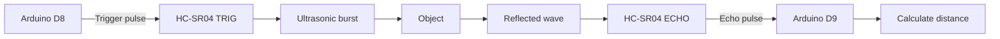

# Project 19 — Ultrasonic Distance Meter Wiring

## 1. Project Overview

The **Ultrasonic Distance Meter** uses an **HC-SR04 ultrasonic sensor** with an **Arduino Uno** to measure the distance between the sensor and an object.

The sensor sends an ultrasonic pulse, waits for the reflected signal, and measures how long the echo takes to return. The Arduino then converts this time into distance.

> **Project goal:** Learn how a sensor converts physical distance into a measurable electrical signal and how the Arduino processes that signal.

---

## 2. Components Required

| Component | Quantity | Purpose |
|---|---:|---|
| Arduino Uno | 1 | Reads the echo time and calculates distance |
| HC-SR04 Ultrasonic Sensor | 1 | Measures distance using ultrasonic waves |
| Breadboard | 1 | Makes temporary circuit connections |
| Jumper Wires | As required | Connects the sensor to the Arduino |

---

## 3. HC-SR04 Pin Identification

The HC-SR04 has four pins:

```text
        HC-SR04 ULTRASONIC SENSOR
       ┌─────────────────────────┐
       │                         │
       │   ◯               ◯     │
       │  Ultrasonic Transducers │
       │                         │
       └─────────────────────────┘
          │    │     │     │
         VCC  TRIG  ECHO   GND
          │    │     │     │
          ▼    ▼     ▼     ▼
         5V   D8    D9    GND
```

### Pin Functions

| HC-SR04 Pin | Function |
|---|---|
| **VCC** | Power supply |
| **TRIG** | Receives the trigger pulse from Arduino |
| **ECHO** | Sends the measured echo pulse back to Arduino |
| **GND** | Ground connection |

---

## 4. Arduino Uno Pin Connections

| HC-SR04 | Arduino Uno | Purpose |
|---|---|---|
| **VCC** | **5V** | Powers the sensor |
| **TRIG** | **D8** | Sends trigger pulse |
| **ECHO** | **D9** | Reads echo pulse |
| **GND** | **GND** | Common ground |

### Simple Wiring Diagram

```text
             HC-SR04
          ┌───────────┐
          │           │
    5V ───┤ VCC       │
   D8 ────┤ TRIG      │
   D9 ────┤ ECHO      │
   GND ───┤ GND       │
          └───────────┘
                │
                │
                ▼
          ┌─────────────┐
          │ ARDUINO UNO │
          │             │
          │ 5V  ◄── VCC │
          │ D8  ──► TRIG│
          │ D9  ◄── ECHO│
          │ GND ◄── GND │
          └─────────────┘
```

---

## 5. Recommended Breadboard Layout

The breadboard is only being used to make the connections easier to organize.

```text
HC-SR04                         Arduino Uno

 VCC  ──────────────────────────► 5V
 TRIG ──────────────────────────► D8
 ECHO ──────────────────────────► D9
 GND  ──────────────────────────► GND

       ┌─────────────────────┐
       │      BREADBOARD     │
       │                     │
       │  +  ───────── 5V    │
       │  -  ───────── GND   │
       │                     │
       │  Sensor connections │
       └─────────────────────┘
```

> **Important:** The Arduino and HC-SR04 must share the same **GND**.

---

# 6. How the Ultrasonic Sensor Works

The HC-SR04 works using the principle of **time of flight**.

The basic sequence is:

```text
Arduino
   │
   │ Trigger pulse
   ▼
HC-SR04
   │
   │ Ultrasonic wave
   ▼
Object
   │
   │ Reflected wave
   ▼
HC-SR04
   │
   │ Echo pulse
   ▼
Arduino
   │
   ▼
Distance calculation
```

### Complete Signal Flow



---

## 7. What Happens During a Measurement?

### Step 1 — Arduino Sends a Trigger

The Arduino sends a short HIGH pulse to the **TRIG** pin.

Typically, the trigger pulse is approximately **10 microseconds**.

```text
TRIG

LOW  ─────────┐
              │
              └──────────────
                ~10 µs HIGH
```

### Step 2 — Sensor Sends Ultrasonic Waves

The HC-SR04 emits a burst of ultrasonic sound through its transmitter.

```text
HC-SR04
   │
   │  ))))))))))))))))))
   │
   ▼
 Object
```

### Step 3 — Sound Reflects from the Object

When the ultrasonic wave reaches an object, part of the wave reflects back toward the sensor.

```text
Sensor                       Object
  │                            │
  │ ))))))))))))))))))))))))) ►│
  │                            │
  │ ◄((((((((((((((((((((((((( │
  │                            │
```

### Step 4 — ECHO Goes HIGH

The **ECHO** pin stays HIGH for the amount of time required for the ultrasonic wave to travel to the object and return.

```text
ECHO

LOW  ────────┐
             │
             │<──── measured time ────>
             │
             └─────────────────────────
                 HIGH
```

The Arduino measures this HIGH duration.

---

# 8. Why Does the Arduino Divide by Two?

This is one of the most important concepts in this project.

The measured time represents the **complete journey**:

```text
        Distance being measured
        ◄────────────────────►

Sensor ──────────────────────► Object
       ───────────────────────►
       ◄───────────────────────
Sensor ◄────────────────────── Object

        Outgoing + Return
```

The sound travels:

**Sensor → Object → Sensor**

Therefore, the measured distance is twice the actual one-way distance.

### Formula

```text
Distance = Time × Speed of Sound ÷ 2
```

At approximately room temperature:

```text
Speed of sound ≈ 343 m/s
```

For practical Arduino calculations using microseconds and centimetres, a commonly used approximation is:

```text
Distance (cm) ≈ Echo time (µs) ÷ 58
```

The exact speed of sound changes slightly with temperature and environmental conditions, so the result should be treated as a practical measurement rather than laboratory-grade precision.

---

# 9. Complete Measurement Diagram

```text
                  ULTRASONIC DISTANCE MEASUREMENT

 Arduino Uno
 ┌─────────────┐
 │             │
 │ D8 ─────────┼──────────► TRIG
 │             │
 │ D9 ◄────────┼─────────── ECHO
 │             │
 │ 5V ─────────┼──────────► VCC
 │             │
 │ GND ────────┼──────────► GND
 └─────────────┘
                     │
                     ▼
              ┌─────────────┐
              │   HC-SR04   │
              │             │
              │  )))))))))  │
              └──────┬──────┘
                     │
                     │ Ultrasonic wave
                     ▼
                 ┌───────┐
                 │OBJECT │
                 └───────┘
                     │
                     │ Reflected wave
                     ▼
              HC-SR04 ECHO
                     │
                     ▼
               Arduino D9
                     │
                     ▼
             Distance in cm
```

---

# 10. Trigger and Echo Timing

The relationship between the trigger pulse and echo pulse can be visualized as:

```text
Time ─────────────────────────────────────────────►

TRIG:  _________|‾‾|________________________________
                ~10 µs

                    Ultrasonic transmission
                         ↓
                    )))))))))) ►
                         ↓
                       Object
                         ↓
                    ◄ ((((((((

ECHO:  ________________|‾‾‾‾‾‾‾‾‾‾‾|______________
                       <---- time ---->

Arduino measures the duration of ECHO HIGH.
```

### Key idea

**Longer echo time → object is farther away**

**Shorter echo time → object is closer**

```text
Closer object
Sensor ─────► Object
      short travel time
             ↓
       short ECHO pulse


Farther object
Sensor ─────────────────────► Object
       longer travel time
                  ↓
          longer ECHO pulse
```

---

# 11. Sensor Orientation

For reliable readings, point the two ultrasonic transducers toward the target.

```text
GOOD

HC-SR04  ───────────────►  FLAT OBJECT
                          │
                          │
                          │
```

Avoid measuring objects at extreme angles:

```text
LESS RELIABLE

HC-SR04  ───────────────►  /
                           /
                          /
                     reflected wave
                         ↗
```

A large, hard, flat surface generally produces a stronger and more predictable reflection than a soft, irregular, or highly angled surface.

---

# 12. Testing Procedure

Follow these steps after completing the wiring:

1. Connect **VCC → 5V**.
2. Connect **GND → GND**.
3. Connect **TRIG → D8**.
4. Connect **ECHO → D9**.
5. Upload the ultrasonic distance measurement program.
6. Open the **Serial Monitor**.
7. Set the baud rate to **9600 baud** if that is what the program uses.
8. Place a flat object in front of the sensor.
9. Move the object closer to the sensor.
10. Observe the reported distance.
11. Move the object farther away.
12. Confirm that the measured distance changes.

### Expected Behavior

```text
Object position        Arduino reading

     CLOSE             Small distance
       │
       ▼
   [SENSOR] ████          ~10 cm


     FARTHER
       │
       ▼
   [SENSOR] ───────── ████ ~50 cm
```

---

# 13. Troubleshooting

| Problem | Possible Cause | What to Check |
|---|---|---|
| No reading | Sensor not powered | Check VCC and GND |
| No echo | Incorrect pin connection | Check TRIG → D8 and ECHO → D9 |
| Always zero/timeout | No reflected signal | Move a suitable object in front of sensor |
| Unstable distance | Target is angled or irregular | Use a large flat target |
| Very small reading | Object is too close | Move target farther away |
| Incorrect reading | Wiring or calculation error | Check connections and formula |
| Random readings | Electrical noise or reflections | Keep wiring secure and test with a flat target |
| Reading changes unexpectedly | Sensor or object moved | Keep the sensor fixed and perpendicular to the target |

---

# 14. Quick Wiring Checklist

Before powering the circuit, verify:

```text
☐ HC-SR04 VCC  → Arduino 5V
☐ HC-SR04 TRIG → Arduino D8
☐ HC-SR04 ECHO → Arduino D9
☐ HC-SR04 GND  → Arduino GND
☐ All jumper wires are firmly connected
☐ Sensor faces the target
☐ Target is suitable for ultrasonic reflection
☐ Serial Monitor baud rate matches the program
```

---

# 15. Student Checkpoint

Before moving to the next project, you should be able to explain:

- What the **TRIG** pin does.
- What the **ECHO** pin does.
- Why the sensor needs **5V and GND**.
- Why the Arduino measures the duration of the ECHO pulse.
- Why the measured travel time is divided by **2**.
- How changing the object's distance changes the ECHO duration.
- Why a flat target generally gives more stable readings.

> **Core concept:** The HC-SR04 does not directly send the Arduino a distance value. It sends a timing signal, and the Arduino converts that timing information into distance.
