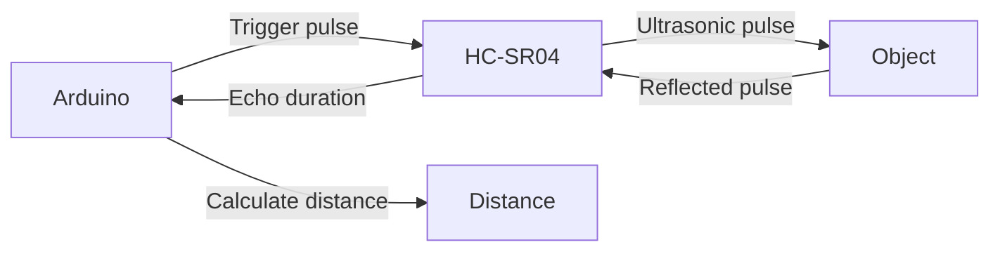
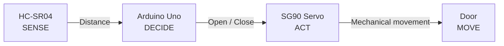
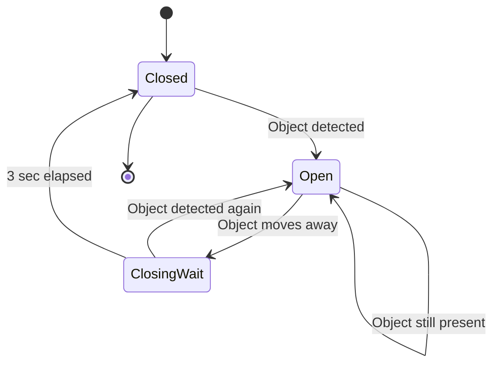
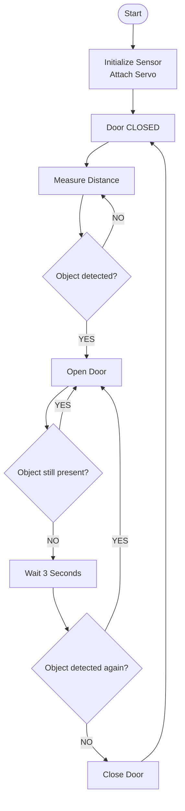
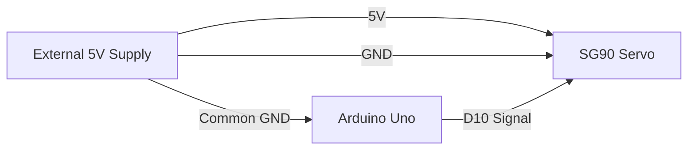
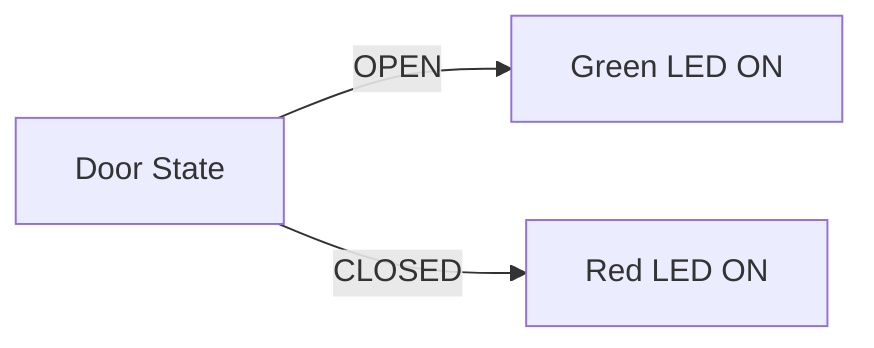
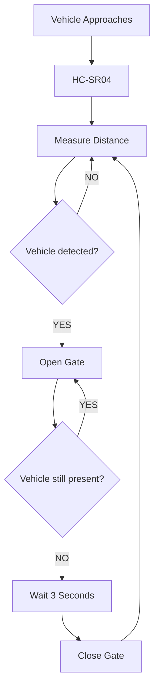
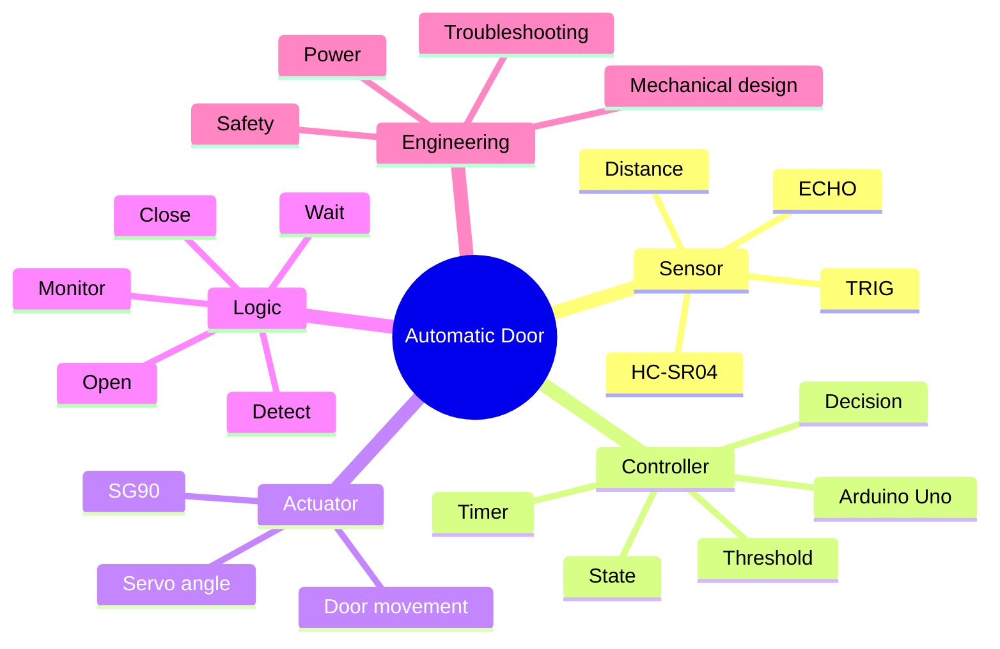
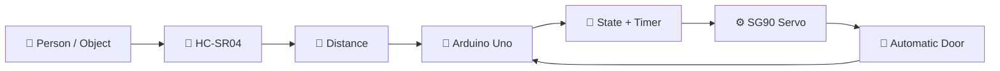

# 🚪 Project 22 — Automatic Door
## Detailed Student Learning Notes

> **Platform:** Arduino Uno  
> **Level:** Beginner → Intermediate  
> **Project Theme:** Smart sensing + decision making + servo actuation  
> **Core Pattern:** `SENSE → DECIDE → ACT → WAIT → CHECK AGAIN`

---

## 🎯 What Are We Building?

In this project, we build a **miniature automatic door** that detects a person or object using an **HC-SR04 ultrasonic sensor** and opens a model door using an **SG90 servo motor**.

Instead of pressing a button, the system reacts automatically to distance.

```text
             PERSON
                │
                ▼
        ┌──────────────┐
        │   HC-SR04    │
        │    SENSOR    │
        └──────┬───────┘
               │
          Distance data
               │
               ▼
        ┌──────────────┐
        │  ARDUINO UNO │
        │    DECISION  │
        └──────┬───────┘
               │
          Servo command
               │
               ▼
        ┌──────────────┐
        │   SG90 SERVO │
        │   ACTUATOR   │
        └──────┬───────┘
               │
               ▼
        ┌──────────────┐
        │  MODEL DOOR  │
        │  OPEN/CLOSE  │
        └──────────────┘
```

The important lesson is not simply how to rotate a servo. It is how a microcontroller turns **sensor information into an automatic physical action**.

---

# 🧠 1. Learning Objectives

By completing this project, you should be able to:

- Explain the purpose of an ultrasonic sensor.
- Explain how the HC-SR04 detects distance.
- Understand `TRIG` and `ECHO`.
- Read distance data with an Arduino.
- Use a threshold to make a decision.
- Control an SG90 servo.
- Understand sensor → controller → actuator architecture.
- Use state-based automation.
- Understand why timing is needed before closing the door.
- Explain why a servo may require a separate power supply.
- Build a basic automatic access mechanism.
- Troubleshoot both electrical and mechanical problems.
- Extend the project into a smart parking/access-control system.

---

# 🔌 2. Components

| Component | Purpose |
|---|---|
| Arduino Uno | Main controller |
| HC-SR04 | Detects distance |
| SG90 servo | Moves the door |
| Breadboard | Circuit prototyping |
| Jumper wires | Connections |
| USB cable | Programming/power during development |

---

# 📍 3. Pin Configuration

| Device | Pin | Arduino Uno |
|---|---|---|
| HC-SR04 | VCC | 5V |
| HC-SR04 | GND | GND |
| HC-SR04 | TRIG | D8 |
| HC-SR04 | ECHO | D9 |
| SG90 | Signal | D10 |
| SG90 | VCC | 5V* |
| SG90 | GND | GND* |

> **Power note:** A small SG90 may work from the Arduino 5V supply in a lightweight classroom model, but servo current demand can cause voltage drops, jitter, or resets. If that occurs, use a suitable external 5V supply and connect its ground to Arduino GND.

---

# 📡 4. Understanding the HC-SR04

The HC-SR04 is an **ultrasonic distance sensor**.

It sends an ultrasonic pulse toward an object and detects the reflected sound.

```text
HC-SR04
   │
   │ Ultrasonic pulse
   ▼
  ))))))))))))))))))  →  PERSON
                           │
                           │ Reflection
  ((((((((((((((((((((    │
   │                       │
   └───────────────────────┘
```

The Arduino uses the time taken for the sound to travel out and return to estimate distance.

### The four pins

```text
┌──────────────────────────┐
│         HC-SR04          │
│                          │
│ VCC  TRIG  ECHO  GND     │
└──────────────────────────┘
```

- **VCC** → power
- **GND** → electrical reference
- **TRIG** → starts a measurement
- **ECHO** → reports the duration of the returning pulse

---

# ⚙️ 5. How Distance Detection Works

The measurement process can be visualized as:



The key idea is:

```text
TRIGGER
   ↓
Ultrasonic wave travels
   ↓
Wave hits object
   ↓
Reflection returns
   ↓
ECHO duration measured
   ↓
Distance calculated
```

---

# 📏 6. Distance and Decision Making

The Arduino does not need to know only the exact distance. It can use the distance to make a decision.

For example:

```text
Detection threshold = 30 cm
```

Then:

```text
Distance > 30 cm
       ↓
No person detected
       ↓
Keep door closed
```

But:

```text
Distance < 30 cm
       ↓
Object detected
       ↓
Open door
```

This is called **threshold-based decision making**.

---

# 🚦 7. Threshold Logic

A threshold is simply a value that separates two conditions.

```text
                 30 cm
                   │
                   ▼
───────────────┬───┬────────────────
   FAR         │   │       NEAR
               │
             Threshold
```

A program might conceptually use:

```cpp
if (distance < DETECTION_DISTANCE) {
    openDoor();
}
```

The threshold can be adjusted according to the physical model.

For example:

```cpp
const int DETECTION_DISTANCE = 30;
```

---

# 🧩 8. Sensor → Decision → Actuator

This project demonstrates a very important embedded-systems architecture.



Think of each component as having a job:

| Component | Job |
|---|---|
| HC-SR04 | Sense |
| Arduino | Think / decide |
| Servo | Act |
| Door | Produce physical movement |

---

# 🚪 9. Understanding the Servo

The SG90 is a small positional servo.

A servo allows the Arduino to request a particular angular position.

For example:

```text
0°  → Door closed
90° → Door open
```

These are **example positions**, not universal requirements.

The correct angles depend on the mechanical construction.

```text
CLOSED                         OPEN

   │                              /
   │                             /
   │                            /
   │                           /
   │                          /
   └──────────────          ──────────────
      Servo 0°                  Servo 90°
```

---

# 🛠️ 10. Software-to-Mechanical Chain

The complete process is:

```text
Arduino command
      ↓
Servo rotates
      ↓
Servo horn rotates
      ↓
Linkage moves
      ↓
Door moves
```

This means the software and mechanical design are connected.

If the code says:

```cpp
servo.write(90);
```

but the door is mounted incorrectly, the physical result may not be correct.

---

# 🧠 11. The Door as a State Machine

A useful way to think about the automatic door is through states.



The system has three useful operating states:

### CLOSED

The door is waiting for a person/object.

### OPEN

The door remains open because an object is detected.

### CLOSING WAIT

The object has moved away, so the system waits for a short period before closing.

---

# ⏱️ 12. Why Do We Need a Closing Timer?

Imagine the person moves slightly outside the detection threshold.

Without a timer:

```text
Object detected
     ↓
Open
     ↓
Object not detected
     ↓
Close
     ↓
Object detected again
     ↓
Open
     ↓
Close
     ↓
Open...
```

This could cause rapid movement.

Instead, use a short closing delay:

```text
Object leaves
      ↓
Wait 3 seconds
      ↓
Still clear?
      ↓
Close
```

This provides more stable behavior.

---

# 🔄 13. Automatic Door Control Flow



---

# 🔍 14. Step-by-Step Operation

## Step 1 — Start

Arduino powers up.

```text
START
  ↓
Initialize sensor
  ↓
Attach servo
  ↓
Set door to CLOSED
```

---

## Step 2 — Measure

The Arduino repeatedly requests a distance measurement.

```text
HC-SR04
   ↓
Distance
   ↓
Arduino
```

---

## Step 3 — Compare

The Arduino compares the measured distance with the threshold.

```text
distance < 30 cm?
       │
   ┌───┴───┐
  NO      YES
   │        │
   ▼        ▼
Closed     Open
```

---

## Step 4 — Open

If an object is detected:

```text
Object detected
      ↓
Arduino commands servo
      ↓
Servo rotates
      ↓
Door opens
```

---

## Step 5 — Monitor

The Arduino continues checking the sensor.

```text
Door OPEN
   │
   ▼
Measure distance
   │
   ▼
Object still present?
   │
 ┌─┴─┐
YES  NO
 │    │
 ▼    ▼
Keep  Start
open  closing timer
```

---

## Step 6 — Close

If the object remains absent for the required time:

```text
3 seconds elapsed
       ↓
Close door
       ↓
Return to CLOSED state
```

---

# 🧮 15. Understanding the Distance Calculation

The HC-SR04 gives an echo duration.

The basic idea is:

```text
Distance depends on:

Travel time × Speed of sound
```

But the measured sound travels:

```text
Sensor → Object → Sensor
```

So the distance to the object is only half of the total travel distance.

Conceptually:

```text
                 Object
                   ●
                  / \
                 /   \
                /     \
               /       \
              ▼         ▼
           Sensor ◄─────┘

Total travel = outgoing + return
Object distance = total travel / 2
```

This is why ultrasonic distance calculations commonly include a division by two.

---

# 💻 16. Important Programming Concepts

This project introduces several important programming ideas.

### Constants

```cpp
const int TRIG_PIN = 8;
const int ECHO_PIN = 9;
const int SERVO_PIN = 10;

const int DETECTION_DISTANCE = 30;
```

### Servo object

```cpp
Servo doorServo;
```

### Servo attachment

```cpp
doorServo.attach(SERVO_PIN);
```

### Servo position

```cpp
doorServo.write(90);
```

### Conditional logic

```cpp
if (distance < DETECTION_DISTANCE) {
    openDoor();
}
```

---

# 🔁 17. Why the Program Uses loop()

Arduino continuously executes:

```cpp
void loop() {
    // read sensor
    // make decisions
    // control servo
}
```

Conceptually:

```text
┌───────────────┐
│ Read distance │
└───────┬───────┘
        ↓
┌───────────────┐
│ Make decision │
└───────┬───────┘
        ↓
┌───────────────┐
│ Move actuator │
└───────┬───────┘
        ↓
┌───────────────┐
│ Check timing  │
└───────┬───────┘
        │
        └──────────► Repeat
```

This repeated execution is the foundation of Arduino control programs.

---

# ⏳ 18. delay() vs millis()

A beginner implementation might use:

```cpp
delay(3000);
```

This is easy to understand but blocks the program.

A more scalable approach is:

```cpp
millis()
```

With `millis()`, the Arduino can continue:

```text
Measure sensor
      ↓
Check timer
      ↓
Read sensor again
      ↓
Process other logic
      ↓
Repeat
```

This becomes especially important when the project grows.

---

# 🧠 19. Why State + Timer Is Better

A robust automatic door should remember:

```text
What state am I in?
        +
When did this state begin?
        +
What condition should cause the next transition?
```

For example:

```text
CLOSED
  │
  │ object detected
  ▼
OPEN
  │
  │ object leaves
  ▼
CLOSING WAIT
  │
  │ 3 seconds clear
  ▼
CLOSED
```

This is much more reliable than simply issuing commands based on one sensor reading.

---

# ⚡ 20. Servo Power

A servo is not just another digital component.

It contains a motor and can draw significant current, especially during movement or when resisting a load.

Possible problem:

```text
Servo moves
     ↓
Current demand increases
     ↓
Supply voltage drops
     ↓
Arduino resets
```

Symptoms can include:

- Arduino restarting
- Servo jittering
- Door movement stopping
- Unstable sensor readings
- Random behavior

---

# 🔋 21. External Servo Supply

If necessary, power the servo from a suitable external 5V supply.



### Critical rule

The grounds must be connected:

```text
External GND
     │
     ├──── Servo GND
     │
     └──── Arduino GND
```

The shared ground provides a common reference for the servo control signal.

---

# 🧱 22. Mechanical Design

The door should be lightweight.

The servo should be firmly mounted.

```text
        MODEL DOOR
    ┌───────────────┐
    │               │
    │      DOOR     │
    │               │
    └───────┬───────┘
            │
         linkage
            │
            ▼
        ┌────────┐
        │  SG90  │
        │ SERVO  │
        └────────┘
```

Check:

- Servo horn is secure.
- Door moves freely.
- Linkage does not bind.
- Servo is not overloaded.
- Servo does not hit a hard stop.
- Door does not require excessive force.

---

# 📐 23. Sensor Placement

The sensor should face the intended detection zone.

```text
           PERSON
              │
              ▼
        Detection Zone
              │
              │
              ▼
       ┌─────────────┐
       │   HC-SR04   │
       └─────────────┘
              │
              ▼
           Arduino
```

Avoid placing the sensor where it constantly detects:

- Walls
- Tables
- Breadboards
- The servo mechanism
- Nearby fixed objects

The sensor should have a reasonably clear path to the object being detected.

---

# 🎯 24. Choosing a Detection Threshold

A threshold of approximately:

```text
30 cm
```

can be a convenient starting point for a classroom model.

But the best value depends on:

- Door size
- Sensor position
- Detection area
- Object size
- Room arrangement
- Sensor behavior

Students should experiment rather than assuming one threshold is always correct.

---

# 🧪 25. Experiment 1 — Change the Detection Distance

Start with:

```cpp
const int DETECTION_DISTANCE = 30;
```

Try:

```text
20 cm
30 cm
40 cm
50 cm
```

Record what happens.

| Threshold | Door behavior | Observation |
|---:|---|---|
| 20 cm | | |
| 30 cm | | |
| 40 cm | | |
| 50 cm | | |

### Think about it

At what distance does the door become most convenient to use?

---

# 🧪 26. Experiment 2 — Change the Servo Angle

Try:

```cpp
const int DOOR_OPEN_ANGLE = 90;
```

Then experiment with:

```text
60°
90°
120°
```

Observe the physical movement.

> Never force the servo against its mechanical limits.

---

# 🧪 27. Experiment 3 — Change the Closing Time

Try:

```text
1 second
3 seconds
5 seconds
10 seconds
```

Compare:

```text
Short timer
   ↓
Fast closing

Long timer
   ↓
Slower closing
```

Ask:

> What timer gives the best balance between convenience and responsiveness?

---

# 🧪 28. Experiment 4 — Add LEDs

Add:

```text
GREEN → Door OPEN
RED   → Door CLOSED
```

The system becomes easier to understand visually.



---

# 🧪 29. Experiment 5 — Add a Buzzer

Add a buzzer to indicate movement.

Example:

```text
Door opening
    ↓
Short beep
```

or:

```text
Door closing
    ↓
Warning beep
```

This introduces another actuator/output.

---

# 🚗 30. Challenge — Automatic Parking Gate

Transform the automatic door into a miniature parking gate.



---

# 🚀 31. Advanced Challenge

Upgrade the system with:

- Red and green LEDs
- Buzzer
- LCD/OLED display
- Vehicle counter
- Entry sensor
- Exit sensor
- Adjustable detection threshold
- Safety timeout
- Obstacle detection
- Servo position control
- Serial Monitor diagnostics

The architecture could become:

```text
             VEHICLE
                │
                ▼
        ┌──────────────┐
        │    SENSOR    │
        └──────┬───────┘
               │
               ▼
        ┌──────────────┐
        │   ARDUINO    │
        │              │
        │ Distance     │
        │ State        │
        │ Timer        │
        │ Decision     │
        └───┬────┬─────┘
            │    │
            │    ├────────► LEDs
            │    │
            │    ├────────► Buzzer
            │    │
            ▼    │
         Servo   │
            │    │
            ▼    ▼
          GATE  DISPLAY
```

---

# 🛑 32. Why Safety Logic Matters

A real automatic door must not simply:

```text
Timer expires
     ↓
Close
```

because an object could still be in the doorway.

A better model is:

```text
Timer expired?
      │
      ▼
Object detected?
   │          │
  YES         NO
   │           │
   ▼           ▼
Keep open   Close
```

This is an introduction to **safety interlocks**.

---

# 🔧 33. Troubleshooting

| Problem | Possible Cause | Solution |
|---|---|---|
| No distance reading | HC-SR04 wiring incorrect | Check VCC, GND, TRIG, ECHO |
| Distance is unstable | Poor wiring or unsuitable target | Secure wiring and test with a suitable object |
| Door never opens | Threshold too small / sensor problem | Test sensor readings |
| Door opens immediately | Sensor detects nearby object | Check sensor placement |
| Servo does not move | Signal/power issue | Check D10, VCC and GND |
| Arduino resets | Servo power demand | Use suitable external 5V supply |
| Servo jitters | Power or mechanical problem | Improve power and mounting |
| Door moves too far | Open angle too large | Reduce servo angle |
| Door opens/closes repeatedly | No stable state/timer logic | Add state and closing-delay logic |

---

# 🧪 34. Testing Checklist

## Sensor

- [ ] HC-SR04 powers correctly.
- [ ] TRIG is connected to D8.
- [ ] ECHO is connected to D9.
- [ ] Distance changes when an object moves.
- [ ] Sensor faces the detection zone.

## Servo

- [ ] Signal is connected to D10.
- [ ] Servo power is correct.
- [ ] Servo ground is connected.
- [ ] Servo moves to the closed position.
- [ ] Servo moves to the open position.
- [ ] Door moves freely.

## Automation

- [ ] Object approaches.
- [ ] Distance crosses threshold.
- [ ] Door opens.
- [ ] Door remains open while object is present.
- [ ] Object moves away.
- [ ] Closing timer starts.
- [ ] Door closes after the required delay.
- [ ] Door can open again.

---

# 📋 35. Student Observation Table

| Test | Condition | Expected | Actual | Pass/Fail |
|---|---|---|---|---|
| 1 | Power ON | Door closed | | |
| 2 | Object far away | Door closed | | |
| 3 | Object enters detection zone | Door opens | | |
| 4 | Object remains present | Door stays open | | |
| 5 | Object leaves | Timer starts | | |
| 6 | 3 sec clear | Door closes | | |
| 7 | Object returns | Door remains/reopens | | |
| 8 | Servo angle changed | Door movement changes | | |

---

# 🧩 36. Debugging Strategy

Do not debug the entire project at once.

Use a modular approach.

### Stage 1 — Sensor only

```text
HC-SR04
   ↓
Serial Monitor
   ↓
Distance values
```

Confirm that the sensor works.

### Stage 2 — Servo only

```text
Arduino
   ↓
Servo
   ↓
Open / Close
```

Confirm that the servo works.

### Stage 3 — Combine

```text
HC-SR04
   ↓
Arduino
   ↓
Servo
```

### Stage 4 — Add timing

```text
Sensor
  ↓
Decision
  ↓
Servo
  ↓
Timer
  ↓
Close
```

This approach makes troubleshooting much easier.

---

# 🧠 37. Engineering Connection

The classroom model:

```text
HC-SR04
    ↓
Arduino
    ↓
SG90
    ↓
Door
```

is conceptually similar to larger systems:

```text
Sensor
   ↓
Controller
   ↓
Motor Driver
   ↓
Motor / Actuator
   ↓
Mechanical System
```

The hardware changes, but the architecture remains similar.

---

# 🌐 38. Real-World Applications

The same basic pattern appears in:

- Automatic doors
- Parking barriers
- Access-control systems
- Robotic mechanisms
- Smart gates
- Railway crossing models
- Industrial automation
- Conveyor systems
- Presence-triggered mechanisms

A professional system would use much more sophisticated safety and control hardware, but the fundamental logic is related.

---

# 🧠 39. Important Concepts to Remember

### Sensor

> A device that collects information from the environment.

### Controller

> A device that processes information and makes decisions.

### Actuator

> A device that converts a control signal into physical action.

### Threshold

> A value used to separate one condition from another.

### State

> The current condition of a system.

### Timer

> A mechanism used to determine how long an event or state has lasted.

---

# 📚 40. Quick Concept Map



---

# ❓ 41. Student Quiz

### Q1. What is the main purpose of the HC-SR04?

A. Rotate the door  
B. Measure distance  
C. Store data  
D. Produce sound

**Answer:** B

---

### Q2. What does TRIG do?

A. Supplies power  
B. Starts the ultrasonic measurement  
C. Moves the servo  
D. Stores the distance

**Answer:** B

---

### Q3. What does ECHO provide?

A. Echo pulse duration  
B. Servo angle  
C. Motor power  
D. LED brightness

**Answer:** A

---

### Q4. Why is a threshold used?

A. To make wires longer  
B. To make a decision based on distance  
C. To power the servo  
D. To reset the Arduino

**Answer:** B

---

### Q5. What is the servo's job?

A. Sense distance  
B. Calculate distance  
C. Produce mechanical movement  
D. Store program code

**Answer:** C

---

### Q6. Why can a servo cause Arduino resets?

A. It uses too little current  
B. It can demand significant current during movement  
C. It changes the program  
D. It disables D8

**Answer:** B

---

### Q7. Why should a real automatic door have safety logic?

A. To make it look better  
B. To prevent unsafe closing when an object is still present  
C. To increase sensor voltage  
D. To make the servo faster

**Answer:** B

---

# 🏆 42. Final Challenge

Build the complete automatic door and demonstrate:

```text
          PERSON
             ↓
        HC-SR04 detects
             ↓
       Distance measured
             ↓
      Threshold evaluated
             ↓
        Door opens
             ↓
   Object still present?
       │           │
      YES          NO
       │            │
       ▼            ▼
   Keep open    Wait 3 sec
                    │
                    ▼
               Close door
                    │
                    ▼
              Monitor again
```

Then improve it with:

```text
                 AUTOMATIC DOOR
                       │
       ┌───────────────┼───────────────┐
       ▼               ▼               ▼
   Distance         Door State       Timer
    Sensor             │               │
       │               │               │
       └───────────────┼───────────────┘
                       ▼
                  Arduino Logic
                       │
            ┌──────────┼──────────┐
            ▼          ▼          ▼
          Servo       LEDs      Buzzer
            │
            ▼
          Door
```

---

# 🔑 43. Final Takeaways

The most important lesson from Project 22 is:

```text
SENSE
  ↓
MEASURE
  ↓
COMPARE
  ↓
DECIDE
  ↓
ACT
  ↓
WAIT
  ↓
CHECK
  ↓
ACT AGAIN
```

The HC-SR04 provides environmental information.

The Arduino processes that information.

The SG90 converts the Arduino's decision into physical movement.

Together:

```text
HC-SR04 → Arduino → SG90 → Door
```

This is a fundamental embedded-automation pattern.

Once you understand this pattern, you can replace the components with different sensors, controllers, and actuators while keeping the same basic engineering approach.

---

# 📖 Glossary

| Term | Meaning |
|---|---|
| Ultrasonic | Using high-frequency sound for sensing |
| Sensor | Device that detects/measures something |
| Controller | Device that processes inputs and makes decisions |
| Actuator | Device that performs a physical action |
| Servo | Position-controlled motor/actuator |
| Threshold | Decision boundary |
| State | Current system condition |
| Timer | Mechanism for measuring elapsed time |
| TRIG | HC-SR04 trigger input |
| ECHO | HC-SR04 echo output |
| Common ground | Shared electrical reference |
| Non-blocking | Allowing the program to continue other work while timing |
| State machine | Model of states and transitions |
| Safety interlock | Logic that prevents an unsafe action under defined conditions |

---

# ✅ Project Completion Checklist

- [ ] Understand HC-SR04 operation
- [ ] Understand TRIG and ECHO
- [ ] Wire sensor correctly
- [ ] Read distance successfully
- [ ] Understand threshold logic
- [ ] Wire SG90 correctly
- [ ] Control servo position
- [ ] Build the model door
- [ ] Detect an approaching object
- [ ] Open door automatically
- [ ] Keep door open while object is present
- [ ] Wait before closing
- [ ] Close automatically
- [ ] Test different thresholds
- [ ] Test different servo angles
- [ ] Test different timers
- [ ] Troubleshoot power issues
- [ ] Attempt the automatic parking-gate challenge

---

## 🚪 Project 22 in One Diagram



> **Core idea:** The automatic door is a small embedded system that senses its environment, makes a decision, controls an actuator, remembers its state, and uses timing to determine what should happen next.
