# Project 23 — OLED Sensor Dashboard Wiring

> **Platform:** Arduino Uno  
> **Project Type:** Sensors + Analog Inputs + I2C Display  
> **Core Wiring Pattern:** `LDR + LM35 → Arduino → I2C → OLED`

---

# 1. Project Overview

In this project, the Arduino Uno reads two sensors:

- **LDR** → measures relative light level
- **LM35** → measures temperature

The Arduino then displays the sensor information on a **0.96-inch SSD1306 OLED I2C display**.

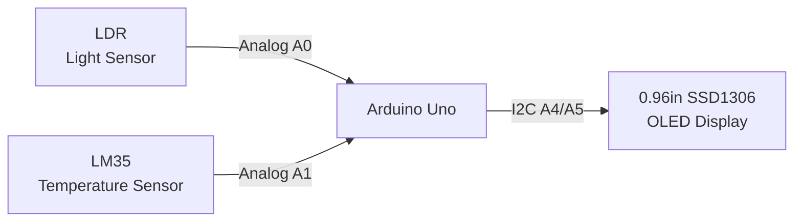

### Core concept

```text
        SENSOR INPUTS
        ┌────────────┐
        │    LDR     │
        │   Light    │
        └─────┬──────┘
              │ A0
              │
              ▼
        ┌────────────┐
        │  ARDUINO   │
        │    UNO     │
        └─────┬──────┘
              │
              │ A1
              ▲
        ┌─────┴──────┐
        │    LM35    │
        │Temperature │
        └────────────┘

              Arduino
                 │
                 │ I2C
                 ▼
        ┌────────────────┐
        │  OLED SSD1306  │
        │                │
        │ TEMP: 24.5 C   │
        │ LIGHT: 632     │
        └────────────────┘
```

---

# 2. Components Required

| Component | Quantity | Purpose |
|---|---:|---|
| Arduino Uno | 1 | Main controller |
| 0.96" SSD1306 OLED I2C | 1 | Displays sensor data |
| LDR | 1 | Detects relative light level |
| 10kΩ resistor | 1 | Forms LDR voltage divider |
| LM35 temperature sensor | 1 | Measures temperature |
| Breadboard | 1 | Circuit prototyping |
| Jumper wires | As required | Electrical connections |
| USB cable | 1 | Programming and power |

---

# 3. Arduino Uno Pin Mapping

| Component | Pin / Connection | Arduino Uno |
|---|---|---|
| OLED | VCC | 5V* |
| OLED | GND | GND |
| OLED | SDA | A4 |
| OLED | SCL | A5 |
| LDR divider output | Analog output | A0 |
| LM35 | OUT | A1 |
| LM35 | VCC | 5V |
| LM35 | GND | GND |

> **OLED voltage warning:** Verify the voltage requirement of the exact OLED module before powering it. Some SSD1306 modules include onboard regulation/level handling and are commonly used with 5V Arduino boards, while other modules may require a different supply voltage. Follow the module's markings or datasheet.

> **LM35 warning:** LM35 packages and breakout modules can have different physical pin arrangements. **Verify the exact package/module pinout before connecting power.**

---

# 4. Complete Circuit Architecture

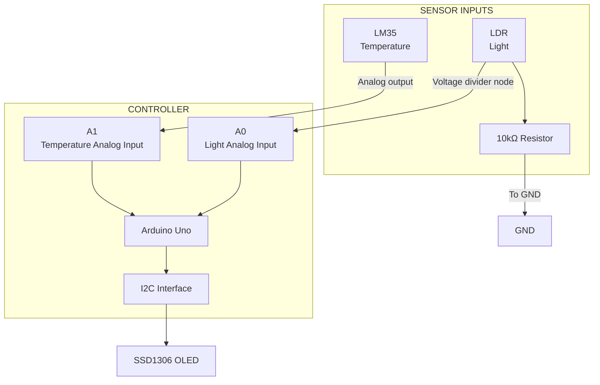

---

# 5. OLED I2C Wiring

The OLED communicates with the Arduino using the **I2C communication bus**.

For an Arduino Uno:

```text
OLED SDA → Arduino A4
OLED SCL → Arduino A5
OLED VCC → Arduino 5V*
OLED GND → Arduino GND
```

### Connection table

| OLED Pin | Arduino Uno | Function |
|---|---|---|
| VCC | 5V* | Power |
| GND | GND | Ground/reference |
| SDA | A4 | I2C data |
| SCL | A5 | I2C clock |

---

# 6. Understanding I2C

I2C is a communication protocol that allows devices to exchange data using two main signal lines:

```text
SDA → Serial Data
SCL → Serial Clock
```

The Arduino Uno provides:

```text
A4 → SDA
A5 → SCL
```

Conceptually:

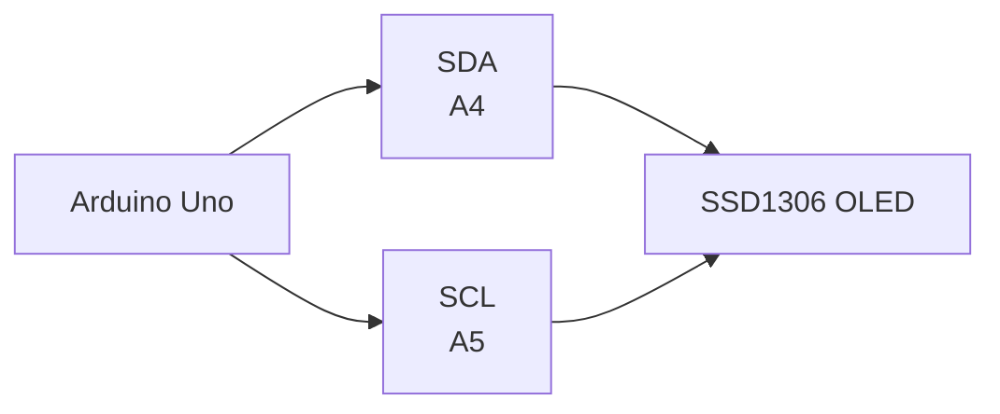

### Important

The OLED is **not** connected like a normal LED.

You do not normally control individual OLED pixels using `digitalWrite()`.

Instead:

```text
Arduino
   ↓
I2C communication
   ↓
OLED controller
   ↓
Display pixels/text
```

---

# 7. I2C Bus Concept

Multiple I2C devices can share the same SDA and SCL lines, provided their addresses and electrical requirements are handled correctly.

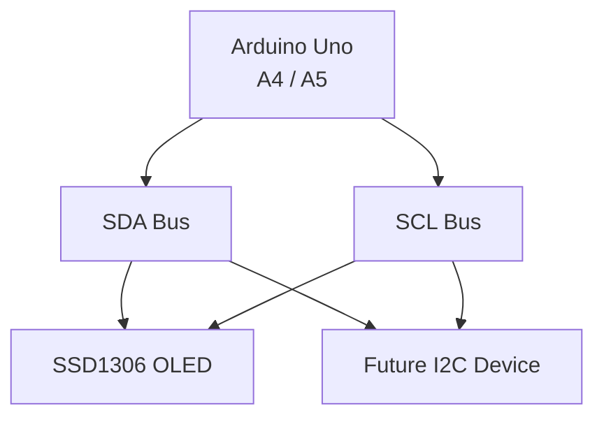

For this project, there is only one I2C display.

---

# 8. LDR Voltage Divider

An LDR changes its resistance depending on the amount of light.

The Arduino cannot directly measure resistance with `analogRead()`.

Instead, we create a **voltage divider**.

### Wiring

```text
                 5V
                  │
                [ LDR ]
                  │
                  ├────────────► A0
                  │
               [ 10kΩ ]
                  │
                  ▼
                 GND
```

### Mermaid representation

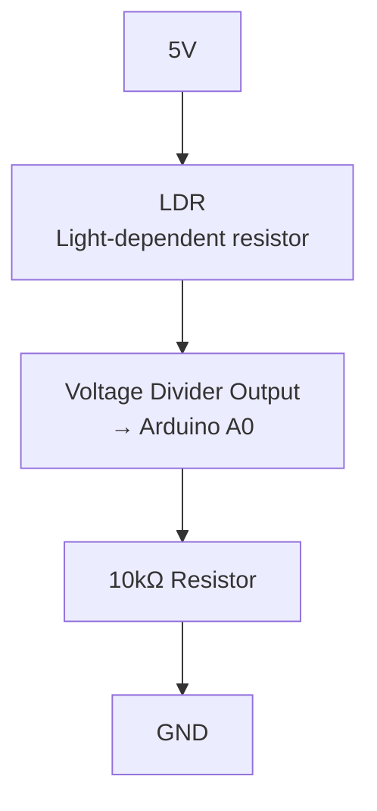

---

# 9. Why Do We Need the 10kΩ Resistor?

The Arduino's analog input measures **voltage**, not resistance directly.

The LDR and 10kΩ resistor create a changing voltage.

```text
Light changes
      ↓
LDR resistance changes
      ↓
Voltage-divider output changes
      ↓
A0 voltage changes
      ↓
analogRead(A0) changes
```

This converts a physical light change into an electrical value that the Arduino can process.

---

# 10. LDR Data Path

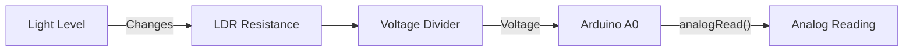

The exact direction of the numerical reading depends on which side of the divider the LDR is placed.

With the wiring shown above, the LDR is connected to 5V and the 10kΩ resistor to GND, so the A0 voltage generally **increases as light increases**.

---

# 11. Understanding analogRead()

Arduino Uno analog inputs use an ADC to convert an input voltage into a digital reading.

A common Arduino Uno `analogRead()` range is:

```text
0 → 1023
```

Conceptually:

```text
0V
 │
 ▼
Analog input
 │
 ▼
0

Higher voltage
 │
 ▼
Higher ADC reading

Near 5V
 │
 ▼
1023
```

The exact measured value depends on the circuit and reference voltage.

---

# 12. LM35 Temperature Sensor

The LM35 is an analog temperature sensor.

A typical basic connection is:

```text
LM35 VCC → 5V
LM35 OUT → A1
LM35 GND → GND
```

### Important

Different LM35 physical packages/modules can present their pins differently.

Always verify:

```text
VCC
OUT
GND
```

from the exact component documentation before applying power.

---

# 13. LM35 Data Path

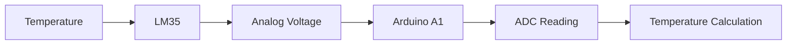

The sensor produces an analog voltage related to temperature.

The Arduino reads that voltage through A1 and converts it into a temperature value in software.

---

# 14. Complete Sensor Data Flow

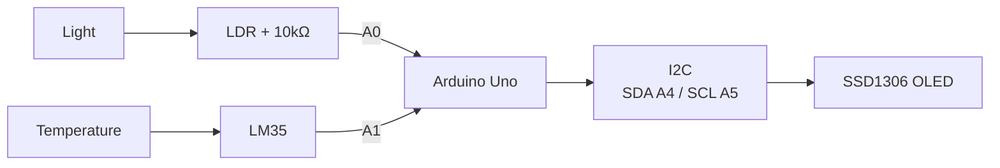

---

# 15. Complete Wiring Diagram

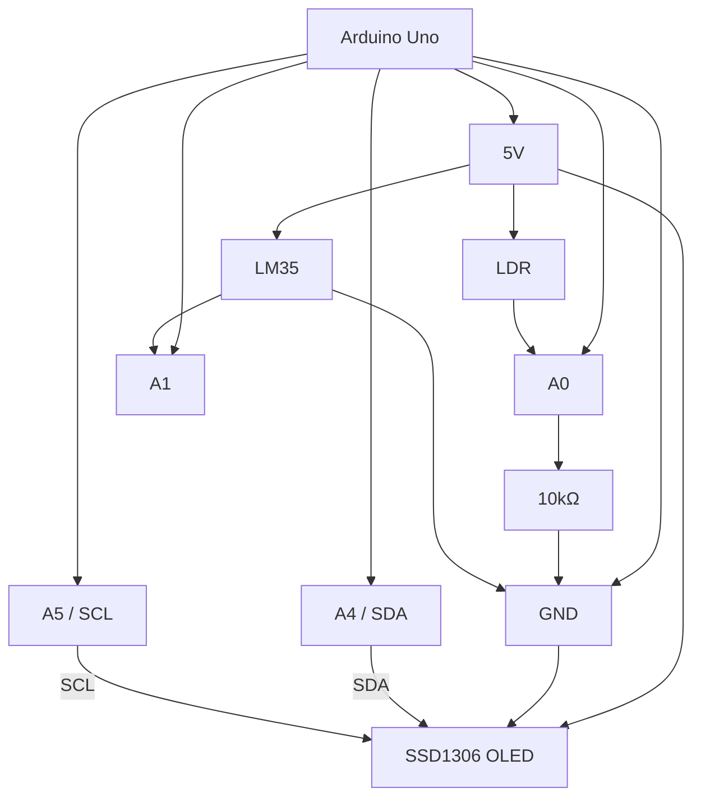

---

# 16. Physical Breadboard Arrangement

A convenient arrangement is:

```text
┌────────────────────────────────────────────────────┐
│                    BREADBOARD                      │
│                                                    │
│  LDR         10kΩ             LM35                │
│  ●──────┬────/\/\/──────●     ● ● ●               │
│         │               │       │ │ │              │
│         └────── A0      └── GND  │ │               │
│                                  │ │               │
│                                VCC OUT GND          │
│                                  │  │   │           │
│                                  │  └── A1          │
│                                  │                  │
│                                                    │
└────────────────────────────────────────────────────┘

                     │
                     ▼

              ┌─────────────┐
              │ Arduino Uno │
              │             │
              │ A0 ← LDR    │
              │ A1 ← LM35   │
              │ A4 → SDA    │
              │ A5 → SCL    │
              └──────┬──────┘
                     │
                     ▼
              ┌─────────────┐
              │    OLED     │
              │  SSD1306    │
              └─────────────┘
```

---

# 17. Recommended Power Connections

For a basic classroom setup:

```text
Arduino 5V
   ├────────► OLED VCC*
   ├────────► LDR divider
   └────────► LM35 VCC

Arduino GND
   ├────────► OLED GND
   ├────────► LDR resistor
   └────────► LM35 GND
```

All components should have the correct electrical reference.

---

# 18. Power Rail Layout

Using breadboard power rails can make the circuit cleaner.

```text
Arduino 5V  ─────────────► + Rail
Arduino GND ─────────────► - Rail

+ Rail
 │
 ├── OLED VCC
 ├── LM35 VCC
 └── LDR

- Rail
 │
 ├── OLED GND
 ├── LM35 GND
 └── 10kΩ resistor
```

This can reduce the number of long jumper wires.

---

# 19. OLED Display Data Flow

The complete display process is:

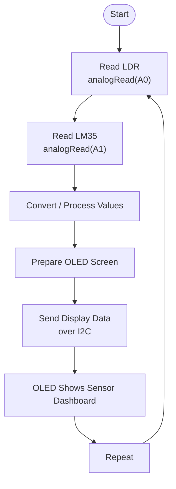

---

# 20. Dashboard Concept

The OLED can display something like:

```text
┌────────────────────┐
│ SENSOR DASHBOARD   │
├────────────────────┤
│ TEMP: 24.5 °C      │
│                    │
│ LIGHT: 632         │
│                    │
│ STATUS: DAY        │
└────────────────────┘
```

The OLED is therefore acting as a small **human-machine interface (HMI)**.

---

# 21. Sensor → Display Architecture

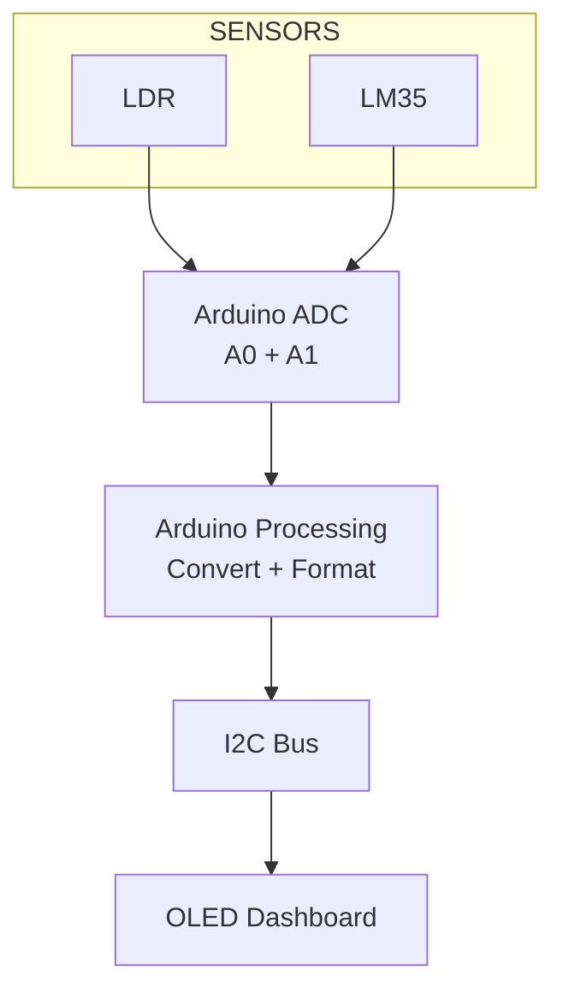

---

# 22. Troubleshooting — OLED

### OLED stays blank

Check:

- VCC connection.
- GND connection.
- SDA → A4.
- SCL → A5.
- Correct OLED module voltage.
- Correct I2C address in software.
- Correct SSD1306 library configuration.
- Display dimensions selected correctly.

Common I2C addresses may include:

```text
0x3C
0x3D
```

Do not assume the address; verify the module or use an I2C scanner.

---

# 23. Troubleshooting — LDR

### LDR value does not change

Check:

```text
5V
 │
LDR
 │
 ├──── A0
 │
10kΩ
 │
GND
```

Also:

- Make sure A0 is connected to the divider midpoint.
- Test the LDR under bright and dark conditions.
- Check that the 10kΩ resistor is actually 10kΩ.
- Make sure the breadboard connections are correct.

---

# 24. Troubleshooting — LM35

### Temperature reading is incorrect

Check:

- LM35 pinout.
- VCC.
- GND.
- OUT → A1.
- Sensor package orientation.
- Software conversion formula.
- ADC/reference assumptions.

Do not connect an LM35 based solely on a memorized pin order. Verify the exact package/module.

---

# 25. Troubleshooting — I2C

If the OLED is not detected:

```text
Arduino
   │
   ├── A4 → SDA
   │
   └── A5 → SCL
          │
          ▼
        OLED
```

Check for:

- Swapped SDA/SCL.
- Missing ground.
- Incorrect supply voltage.
- Wrong I2C address.
- Loose breadboard connections.

---

# 26. Common Wiring Mistakes

### Mistake 1 — Connecting OLED SDA/SCL incorrectly

Arduino Uno:

```text
A4 → SDA
A5 → SCL
```

---

### Mistake 2 — Treating OLED like a digital output

Do not wire the OLED as though it were an LED.

It communicates through:

```text
I2C
 ├── SDA
 └── SCL
```

---

### Mistake 3 — Forgetting the LDR resistor

An LDR analog input needs a suitable voltage-divider arrangement.

```text
LDR + resistor
       ↓
Voltage
       ↓
A0
```

---

### Mistake 4 — Connecting A0 to the wrong point

A0 should connect to the **voltage-divider midpoint**:

```text
5V
 │
LDR
 │
 ├──────► A0
 │
10kΩ
 │
GND
```

---

### Mistake 5 — Incorrect LM35 pinout

Different packages/modules can differ.

Always verify:

```text
VCC
OUT
GND
```

before power-up.

---

# 27. Testing Procedure

Test each section independently.

## Test 1 — Arduino

Confirm:

```text
Arduino powers on
      ↓
USB connection works
      ↓
Sketch uploads
```

## Test 2 — LDR

Read A0 and shine light on the LDR.

Expected:

```text
Light changes
    ↓
A0 reading changes
```

## Test 3 — LM35

Read A1.

Expected:

```text
Temperature changes
       ↓
Sensor voltage changes
       ↓
A1 reading changes
```

## Test 4 — OLED

Run a simple display test.

Expected:

```text
Arduino
   ↓
I2C
   ↓
OLED
   ↓
Text appears
```

## Test 5 — Complete system

```text
LDR + LM35
     ↓
Arduino
     ↓
Process values
     ↓
I2C
     ↓
OLED
```

---

# 28. Final Wiring Verification

Before powering the project:

```text
┌──────────────────────────────────────┐
│         WIRING CHECK                 │
├──────────────────────────────────────┤
│                                      │
│ OLED SDA ───────────────► A4         │
│ OLED SCL ───────────────► A5         │
│ OLED VCC ───────────────► 5V*        │
│ OLED GND ───────────────► GND        │
│                                      │
│ LDR divider output ─────► A0         │
│ 10kΩ resistor ──────────► GND        │
│                                      │
│ LM35 OUT ────────────────► A1        │
│ LM35 VCC ───────────────► 5V        │
│ LM35 GND ───────────────► GND        │
│                                      │
└──────────────────────────────────────┘
```

---

# 29. Quick Reference

## OLED

```text
SDA → A4
SCL → A5
VCC → 5V*
GND → GND
```

## LDR

```text
5V
 │
LDR
 │
 ├──── A0
 │
10kΩ
 │
GND
```

## LM35

```text
VCC → 5V
OUT → A1
GND → GND
```

## Data path

```text
LDR ──────► A0 ───┐
                  │
                  ▼
               Arduino
                  │
LM35 ──────► A1 ──┘
                  │
                  ▼
             I2C A4/A5
                  │
                  ▼
             OLED SSD1306
```

---

# 30. Student Wiring Checklist

### Arduino

- [ ] Arduino Uno identified.
- [ ] 5V rail identified.
- [ ] GND rail identified.
- [ ] A0 available for LDR.
- [ ] A1 available for LM35.
- [ ] A4 used for OLED SDA.
- [ ] A5 used for OLED SCL.

### OLED

- [ ] OLED voltage requirement verified.
- [ ] VCC connected correctly.
- [ ] GND connected correctly.
- [ ] SDA → A4.
- [ ] SCL → A5.

### LDR

- [ ] LDR connected to 5V.
- [ ] 10kΩ resistor connected to GND.
- [ ] Divider midpoint connected to A0.
- [ ] No accidental short between 5V and GND.

### LM35

- [ ] Exact LM35 pinout verified.
- [ ] VCC connected to 5V.
- [ ] OUT connected to A1.
- [ ] GND connected to GND.

### Final

- [ ] All grounds connected.
- [ ] No loose jumper wires.
- [ ] No 5V-to-GND short.
- [ ] OLED supply verified.
- [ ] Sensor outputs connected to correct analog pins.
- [ ] Test each module before running the complete dashboard.

---

# 31. Important Electrical Notes

### OLED

Do not assume every SSD1306 module accepts 5V.

```text
VERIFY MODULE
      ↓
Check voltage requirement
      ↓
Connect correct supply
```

### LM35

Do not assume every physical LM35 has the same visible pin arrangement.

```text
IDENTIFY PACKAGE
       ↓
VERIFY DATASHEET
       ↓
CONNECT VCC / OUT / GND
```

### LDR

The LDR is not a polarized component.

Its resistance changes with light.

The 10kΩ resistor creates the measurable voltage divider.

---

# 32. Final Project Architecture

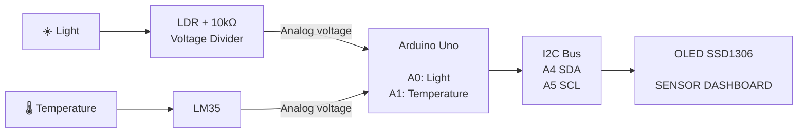

---

# 33. Core Wiring Concept

The complete project can be remembered with one line:

```text
       ANALOG SENSORS
       ┌───────┬───────┐
       ▼       ▼
      LDR     LM35
       │       │
      A0      A1
       │       │
       └───┬───┘
           ▼
      ARDUINO UNO
           │
       A4 / A5
           │
          I2C
           │
           ▼
     SSD1306 OLED
           │
           ▼
     SENSOR DASHBOARD
```

> **Core idea:** The sensors provide analog information to the Arduino, and the Arduino communicates the processed information to the OLED using the I2C bus.
