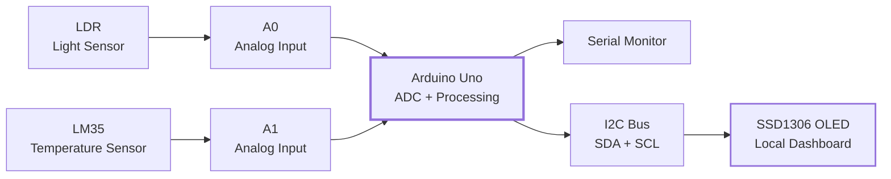
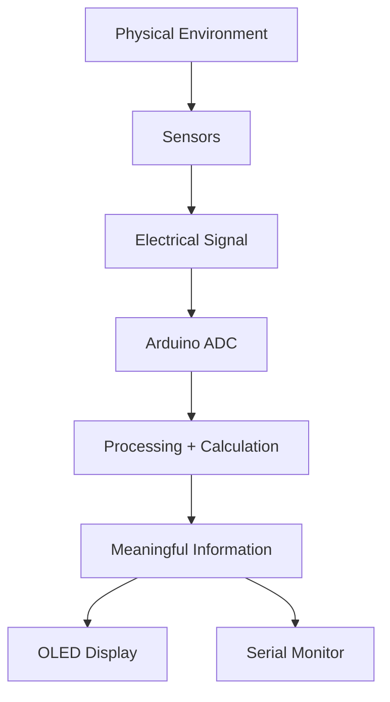
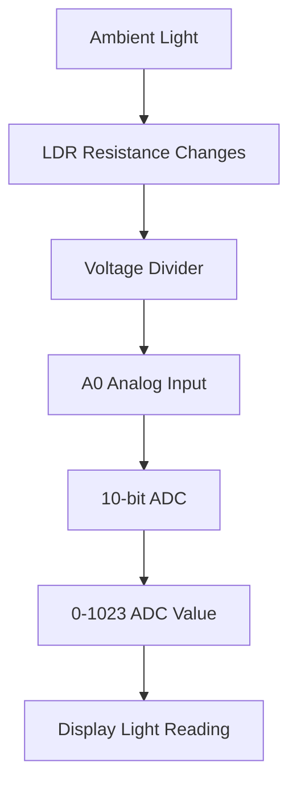
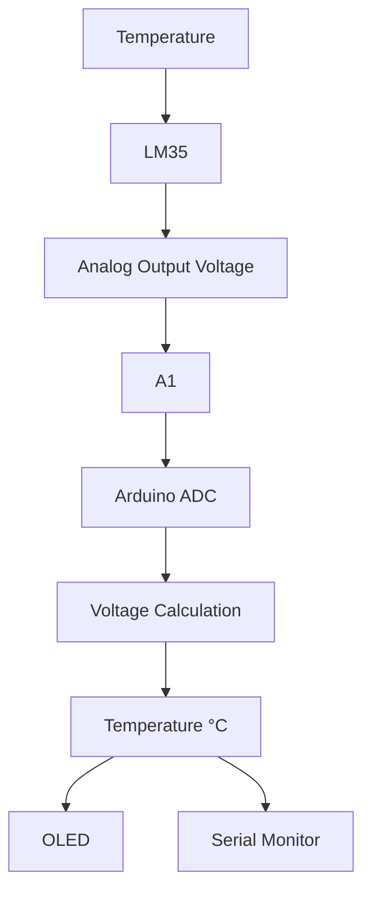
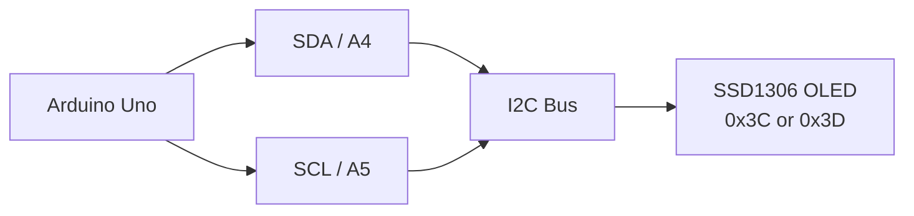
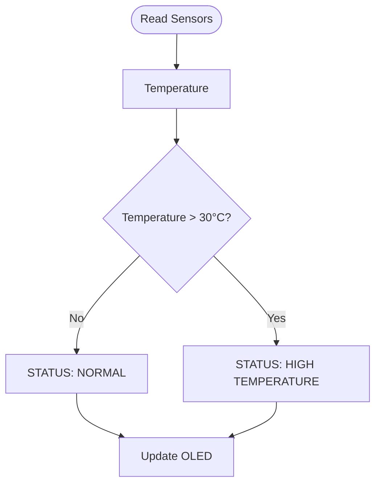
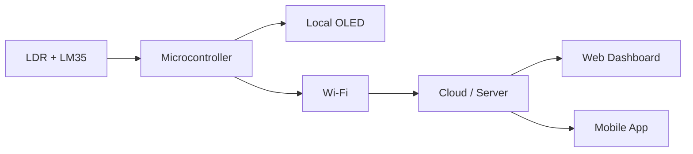

# Project 23 — OLED Sensor Dashboard
## Detailed Student Learning Notes

> **Project Type:** Sensors + Analog Inputs + I2C Display  
> **Platform:** Arduino Uno  
> **Core Pattern:** `LDR + LM35 → Arduino → I2C → OLED`  
> **Difficulty:** Beginner → Intermediate  
> **Main Skill:** Turning raw sensor readings into human-readable information

---

## 1. Project Overview

We are building a small **embedded sensor dashboard**.

The Arduino Uno reads:

- **Light level** from an LDR
- **Temperature** from an LM35

It then processes the measurements and presents them in two places:

1. **SSD1306 OLED display**
2. **Serial Monitor**

The important idea is not simply reading sensors. It is the complete embedded-systems pipeline:

```text
┌──────────────┐
│    SENSORS   │
│ LDR + LM35   │
└──────┬───────┘
       │ Analog signals
       ▼
┌──────────────┐
│  ARDUINO UNO │
│ Read +       │
│ Calculate    │
│ + Decide     │
└──────┬───────┘
       │
       ├───────────────► Serial Monitor
       │
       ▼
┌──────────────┐
│ I2C OLED     │
│ Information  │
│ Display      │
└──────────────┘
```

### Big idea: Data visualization at the edge

A microcontroller does not have to send every measurement to a cloud server before it becomes useful.

It can:

**Sense → Process → Display**

This is called **edge data visualization**.

---

# 2. Learning Objectives

By completing this project, you should be able to:

- Explain what an OLED display is.
- Explain the purpose of the SSD1306 controller.
- Understand the basic I2C protocol.
- Identify Arduino Uno I2C pins.
- Read analog sensors using `analogRead()`.
- Understand the Arduino Uno's 10-bit ADC.
- Convert an LM35 reading into temperature.
- Understand an LDR voltage divider.
- Display text and numbers on an OLED.
- Use an I2C device address.
- Use `Wire`, `Adafruit_GFX`, and `Adafruit_SSD1306`.
- Update a display using `millis()`.
- Design a simple sensor dashboard.
- Debug sensor, display, power, and communication problems.

---

# 3. Components

| Component | Purpose |
|---|---|
| Arduino Uno | Main microcontroller |
| 0.96" SSD1306 OLED I2C | Displays measurements |
| LDR | Measures changes in light |
| 10 kΩ resistor | Forms the LDR voltage divider |
| LM35 | Measures temperature |
| Breadboard | Temporary circuit assembly |
| Jumper wires | Electrical connections |
| USB cable | Power + programming |

### System architecture

```text
              ┌─────────────────────┐
              │     ARDUINO UNO     │
              │                     │
 LDR ────────►│ A0              A4 ├──── SDA ────► OLED
              │                     │
 LM35 ───────►│ A1              A5 ├──── SCL ────► OLED
              │                     │
              │ USB/Serial         │
              └─────────┬───────────┘
                        │
                        ▼
                  Serial Monitor
```

---

# 4. What Is an OLED?

**OLED** stands for:

> **Organic Light-Emitting Diode**

Unlike a conventional character LCD, an OLED can directly render graphical pixels.

It can display:

- Text
- Numbers
- Symbols
- Lines
- Shapes
- Sensor readings
- Status indicators
- Simple graphs

A small monochrome SSD1306 OLED is commonly used in Arduino projects because it is compact and relatively easy to control.

### Typical 128 × 64 OLED

```text
       128 pixels wide
┌──────────────────────────────────────────┐
│                                          │
│          OLED SENSOR DASHBOARD           │
│                                          │
│          TEMP: 25.4 C                    │
│          LIGHT: 712                      │
│                                          │
└──────────────────────────────────────────┘
                  64 pixels high
```

The exact resolution depends on the module. A common module is **128 × 64**.

---

# 5. OLED Controller: SSD1306

The **SSD1306** is the display controller used by many small monochrome OLED modules.

The Arduino does not directly control every OLED pixel using ordinary GPIO pins.

Instead:

```text
Arduino
   │
   │ I2C commands/data
   ▼
SSD1306 Controller
   │
   ▼
OLED Pixel Matrix
```

The controller receives commands and display data and drives the OLED pixels.

---

# 6. What Is I2C?

**I2C** is a serial communication protocol designed to allow devices to communicate using a small number of wires.

The two main communication lines are:

```text
SDA → Serial Data
SCL → Serial Clock
```

For the Arduino Uno:

```text
A4 → SDA
A5 → SCL
```

### Important

A4 and A5 are being used as **I2C communication pins** in this project.

```text
Arduino Uno

A4 ───────────── SDA ─────────────► OLED
A5 ───────────── SCL ─────────────► OLED
GND ──────────────────────────────► OLED GND
5V* ──────────────────────────────► OLED VCC
```

`*` Verify the voltage requirement of the exact OLED breakout module.

---

# 7. How I2C Works — Simple Model

Think of I2C as a shared communication bus.

```text
                    ┌─────────────┐
                    │  Arduino    │
                    │   MASTER    │
                    └──────┬──────┘
                           │
                 ┌─────────┴─────────┐
                 │                   │
                SDA                 SCL
                 │                   │
        ┌────────┴───────────────────┴────────┐
        │             I2C BUS                 │
        └──────────────┬──────────────┬───────┘
                       │              │
                       ▼              ▼
                 ┌──────────┐   ┌──────────┐
                 │ OLED     │   │ Other    │
                 │ Address  │   │ I2C      │
                 │ 0x3C     │   │ Device   │
                 └──────────┘   └──────────┘
```

The Arduino generally acts as the **I2C controller/master**, while the OLED is an I2C target/slave device.

Each target normally has an address.

For this project, a common OLED address is:

```cpp
const int OLED_ADDRESS = 0x3C;
```

Another commonly encountered address is:

```text
0x3D
```

The correct address depends on the particular module.

---

# 8. Why Use I2C?

A display can require several signals if driven using a parallel interface.

I2C reduces the communication interface to two signal lines:

```text
Before:
Many control/data connections

After:
SDA + SCL
```

This leaves more Arduino pins available for:

- Buttons
- LEDs
- Relays
- Additional sensors
- Actuators
- Communication modules

### Multiple I2C devices

Several compatible devices can share the same bus:

```text
                    Arduino
                       │
                ┌──────┴──────┐
                │   I2C BUS   │
                │ SDA + SCL    │
                └──────┬──────┘
                       │
          ┌────────────┼────────────┐
          ▼            ▼            ▼
        OLED        Sensor       RTC
       0x3C         0x76        0x68
```

The devices need distinct addresses, unless the hardware provides another way to select or isolate addresses.

---

# 9. I2C Address: What Does `0x3C` Mean?

An address identifies a device on the I2C bus.

For example:

```text
OLED → 0x3C
```

Conceptually:

```text
Arduino:
"Send this display data to address 0x3C."

I2C bus:
"Device 0x3C, this message is for you."

OLED:
"Received."
```

If your OLED uses `0x3D` but your program is configured for `0x3C`, the display may remain blank even when the wiring is correct.

---

# 10. Required Libraries

The project uses:

```cpp
#include <Wire.h>
#include <Adafruit_GFX.h>
#include <Adafruit_SSD1306.h>
```

### `Wire.h`

Handles I2C communication.

```text
Arduino
  │
  ▼
Wire library
  │
  ▼
I2C bus
```

### `Adafruit_GFX.h`

Provides general-purpose graphics functions such as:

- Text rendering
- Lines
- Shapes
- Positioning
- Font handling

### `Adafruit_SSD1306.h`

Provides functions specifically for SSD1306 displays.

---

# 11. Install the Libraries

In Arduino IDE:

```text
Sketch
  ↓
Include Library
  ↓
Manage Libraries
  ↓
Search
```

Install:

```text
Adafruit GFX Library
Adafruit SSD1306
```

`Wire` is normally included with the Arduino environment.

### Library relationship

```text
Your Arduino Program
        │
        ├──────────────► Wire
        │                 │
        │                 └── I2C
        │
        ├──────────────► Adafruit_GFX
        │                 │
        │                 └── Graphics
        │
        └──────────────► Adafruit_SSD1306
                          │
                          └── SSD1306 OLED
```

---

# 12. LDR — Light Sensor

An **LDR** is a Light Dependent Resistor.

Its resistance changes according to the amount of light.

A simplified relationship is:

```text
More light
    ↓
LDR resistance changes
    ↓
Voltage divider output changes
    ↓
Arduino ADC reading changes
```

An LDR does not directly output a digital message such as:

```text
LIGHT = 712
```

Instead, its changing resistance is converted into a changing voltage.

---

# 13. LDR Voltage Divider

The LDR is paired with a resistor to create a **voltage divider**.

A common arrangement is:

```text
             5V
              │
             [LDR]
              │
              ├────────────► A0
              │
            [10 kΩ]
              │
             GND
```

The voltage at A0 depends on the relative resistance of the LDR and the 10 kΩ resistor.

### Important observation

With the divider orientation shown above, the analog reading generally increases as illumination increases because the LDR resistance typically decreases in brighter light.

If the LDR and fixed resistor are swapped, the direction reverses.

---

# 14. Voltage Divider Concept

A voltage divider converts resistance changes into voltage changes.

For two resistors:

```text
Vin
 │
[R1]
 │
 ├──── Vout
 │
[R2]
 │
GND
```

The ideal divider equation is:

```text
Vout = Vin × R2 / (R1 + R2)
```

For an LDR circuit, one of the resistances changes with light.

Therefore:

```text
Light changes
     ↓
LDR resistance changes
     ↓
Voltage divider changes
     ↓
A0 voltage changes
     ↓
ADC value changes
```

---

# 15. Arduino Analog-to-Digital Conversion

The Arduino Uno's analog input uses a **10-bit ADC**.

This produces values from:

```text
0 → 1023
```

Conceptually:

```text
Analog voltage
      │
      ▼
┌─────────────┐
│     ADC     │
│   10-bit    │
└──────┬──────┘
       │
       ▼
Digital number
0 ───────────► 1023
```

With a typical 5 V reference:

```text
ADC ≈ 0       → 0 V
ADC ≈ 512     → 2.5 V
ADC ≈ 1023    → 5 V
```

These are approximate ideal values.

---

# 16. LDR Reading in Code

The Arduino reads the LDR using:

```cpp
int lightValue = analogRead(A0);
```

The result is typically:

```text
0 to 1023
```

The number itself is not automatically "lux".

It is an **ADC count**.

To calculate physical illuminance such as lux accurately, the sensor circuit and calibration model would need to be characterized.

---

# 17. LM35 — Temperature Sensor

The LM35 is an analog temperature sensor.

Its output voltage is approximately proportional to temperature.

A commonly used educational approximation is:

```text
10 mV / °C
```

Therefore:

```text
25 °C → approximately 0.25 V
30 °C → approximately 0.30 V
```

The exact measurement depends on:

- Sensor characteristics
- Supply
- ADC reference
- Wiring
- Electrical noise
- Calibration
- Package/module

---

# 18. LM35 Connection

A typical bare LM35 arrangement is:

```text
           LM35
        ┌─────────┐
5V ────►│ VCC     │
A1 ◄────│ OUT     │
GND ───►│ GND     │
        └─────────┘
```

### Critical warning

**Do not rely only on physical pin position or wire color.**

LM35 package pinouts can differ by package/module and viewing orientation.

Always verify the exact sensor/module datasheet or silkscreen before applying power.

---

# 19. LM35 Measurement Pipeline

The Arduino first reads an ADC value:

```cpp
int sensorValue = analogRead(A1);
```

Then it converts that ADC value into voltage.

A simplified formula is:

```cpp
voltage =
    sensorValue * ADC_REFERENCE / ADC_RESOLUTION;
```

Then:

```cpp
temperatureC = voltage * 100.0;
```

because approximately:

```text
10 mV / °C
=
0.010 V / °C
```

Therefore:

```text
Temperature = Voltage / 0.010
            = Voltage × 100
```

---

# 20. Example Temperature Calculation

Suppose:

```text
ADC reading = 51
Reference = 5.0 V
ADC resolution = 1023
```

Then approximately:

```text
Voltage = 51 × 5 / 1023
        ≈ 0.249 V
```

Then:

```text
Temperature ≈ 0.249 × 100
            ≈ 24.9 °C
```

This demonstrates the conversion chain:

```text
ADC Count
   ↓
Voltage
   ↓
Temperature
```

---

# 21. Full Sensor Data Pipeline

```text
┌───────────────┐
│      LDR      │
└───────┬───────┘
        │
        ▼
   Voltage Divider
        │
        ▼
       A0
        │
        │
┌───────▼────────┐
│                │
│   ARDUINO UNO  │
│                │
│  ADC + Logic   │
│                │
└───────┬────────┘
        │
        ├──────────────► Serial Monitor
        │
        │ I2C
        ▼
┌────────────────┐
│   SSD1306 OLED │
└────────────────┘

┌───────────────┐
│     LM35      │
└───────┬───────┘
        │ Analog voltage
        ▼
       A1
```

---

# 22. Dashboard Architecture

The project follows a classic embedded-system architecture:

```text
      INPUTS
        │
        ▼
┌─────────────────┐
│     SENSORS     │
│                 │
│ LDR + LM35      │
└────────┬────────┘
         │
         ▼
┌─────────────────┐
│   PROCESSING    │
│                 │
│ ADC             │
│ Conversion      │
│ Calculations    │
└────────┬────────┘
         │
         ▼
┌─────────────────┐
│  PRESENTATION   │
│                 │
│ OLED + Serial   │
└─────────────────┘
```

This can be remembered as:

> **Sense → Process → Present**

---

# 23. Dashboard Design

A dashboard should not simply place random values on the screen.

A useful dashboard prioritizes:

1. Important information
2. Readability
3. Clear labels
4. Consistent layout
5. Appropriate update rate
6. Minimal unnecessary graphics

Example:

```text
┌────────────────────────┐
│ ENVIRONMENT MONITOR    │
├────────────────────────┤
│                        │
│ TEMP: 25.4 C           │
│                        │
│ LIGHT: 712             │
│                        │
│ STATUS: NORMAL         │
└────────────────────────┘
```

### Information hierarchy

```text
Most important
      │
      ▼
Temperature
      │
      ▼
Light level
      │
      ▼
System status
      │
      ▼
Decorative information
Least important
```

---

# 24. OLED Update Cycle

The display should be refreshed repeatedly.

A simple cycle is:

```text
START
  │
  ▼
Read LDR
  │
  ▼
Read LM35
  │
  ▼
Calculate temperature
  │
  ▼
Clear OLED buffer
  │
  ▼
Draw values
  │
  ▼
Send buffer to OLED
  │
  ▼
Print values to Serial
  │
  ▼
Wait until next update
  │
  └──────────────► REPEAT
```

---

# 25. Why Use `millis()`?

The project uses:

```cpp
millis()
```

instead of relying on a long blocking `delay()`.

The update interval is:

```cpp
const unsigned long UPDATE_INTERVAL = 500;
```

So the dashboard is refreshed approximately every:

```text
500 ms
=
0.5 seconds
```

That is about:

```text
2 updates per second
```

---

# 26. `delay()` vs `millis()`

### Blocking approach

```cpp
readSensor();

delay(500);

updateDisplay();
```

During `delay(500)`, the program is largely waiting.

### Non-blocking timing

Conceptually:

```cpp
if (millis() - lastUpdate >= 500) {
    lastUpdate = millis();

    readSensor();
    updateDisplay();
}
```

Now the Arduino can perform other work between display updates.

### Comparison

| `delay()` | `millis()` |
|---|---|
| Simple | Slightly more advanced |
| Blocks program flow | Non-blocking timing |
| Fine for simple demos | Better for multitasking-style projects |
| Harder to combine with many tasks | Easier to coordinate tasks |

---

# 27. Dashboard as a State Machine

The project can later be expanded into states.

```text
             ┌─────────────┐
             │   NORMAL    │
             └──────┬──────┘
                    │
          Temperature high
                    ▼
             ┌─────────────┐
             │   WARNING   │
             └──────┬──────┘
                    │
            Temperature normal
                    ▼
             ┌─────────────┐
             │   NORMAL    │
             └─────────────┘
```

A dashboard therefore becomes more than a display. It can become a **human-machine interface (HMI)**.

---

# 28. Serial Monitor vs OLED

Both are useful, but for different reasons.

| Serial Monitor | OLED |
|---|---|
| Excellent for debugging | Excellent for user feedback |
| Can show detailed values | Limited screen space |
| Connected to computer | Standalone |
| Useful during development | Useful in deployed prototypes |

A strong embedded project often uses both during development.

```text
                 Arduino
                    │
             ┌──────┴──────┐
             │             │
             ▼             ▼
        Serial Monitor    OLED
        Debugging         User Interface
```

---

# 29. Recommended Main Program Structure

A clean Arduino program can be organized into:

```text
setup()
  │
  ├── Start Serial
  ├── Start OLED
  └── Configure initial state

loop()
  │
  ├── Check update timer
  │
  ├── Read LDR
  │
  ├── Read LM35
  │
  ├── Calculate temperature
  │
  ├── Update OLED
  │
  └── Print Serial data
```

This structure becomes very useful as projects become larger.

---

# 30. Important Programming Concepts

## `analogRead()`

Reads an analog input.

```cpp
int value = analogRead(A0);
```

Typical Uno result:

```text
0–1023
```

---

## `display.clearDisplay()`

Clears the display buffer before drawing the next frame.

---

## `display.setCursor()`

Sets the position where text will begin.

Conceptually:

```text
(0,0)
  ┌──────────────────► X
  │
  │
  ▼
  Y
```

---

## `display.setTextSize()`

Controls text scale.

```cpp
display.setTextSize(1);
```

or:

```cpp
display.setTextSize(2);
```

Larger text is easier to read but consumes more screen space.

---

## `display.display()`

Transfers the prepared graphics buffer to the OLED.

A useful mental model is:

```text
Arduino RAM buffer
      │
      ▼
display.display()
      │
      ▼
OLED screen
```

---

# 31. Example Dashboard Layout

```text
┌────────────────────────┐
│  IoT SENSOR DASHBOARD  │
├────────────────────────┤
│                        │
│  Temperature           │
│  25.4 C                │
│                        │
│  Light                 │
│  712                   │
│                        │
└────────────────────────┘
```

The layout should be designed before coding.

### Design question

Ask:

> If I look at the display for only one second, can I understand the current condition?

If not, simplify the interface.

---

# 32. Experiments

## Experiment 1 — Change Text Size

Try:

```cpp
display.setTextSize(1);
```

and:

```cpp
display.setTextSize(2);
```

Observe:

- Readability
- Number of characters per line
- Available screen area

---

## Experiment 2 — Add Sensor Status

Create:

```text
TEMP: 24.5 C
LIGHT: 632

STATUS: NORMAL
```

Ask students:

- What should `NORMAL` mean?
- Which threshold should trigger `WARNING`?
- Should temperature and light have separate statuses?

---

## Experiment 3 — Add Temperature Threshold

Create:

```text
Temperature
     │
     ▼
Is temperature > 30°C?
    /       \
  NO         YES
  │           │
  ▼           ▼
NORMAL      HIGH
```

Example logic:

```cpp
if (temperatureC > 30.0) {
    // High-temperature state
}
```

---

## Experiment 4 — Add an LED

Add an LED to indicate high temperature.

```text
Temperature
     │
     ▼
Above threshold?
   /       \
 NO         YES
 │           │
 ▼           ▼
LED OFF     LED ON
```

This introduces:

**Sensor → Decision → Actuator**

---

## Experiment 5 — Add a Buzzer

Create an audible warning when temperature exceeds the selected threshold.

```text
LM35
 │
 ▼
Temperature
 │
 ▼
Threshold check
 │
 ├── Normal ──► Buzzer OFF
 │
 └── High ────► Buzzer ON
```

For a classroom prototype, use a suitable small buzzer. Do not drive high-current loads directly from an Arduino GPIO.

---

## Experiment 6 — Add an I2C Device

Explore adding another I2C device.

```text
             Arduino
                │
        ┌───────┴───────┐
        │   SDA + SCL   │
        └───┬─────┬─────┘
            │     │
            ▼     ▼
          OLED   Sensor
          0x3C   Other address
```

Investigate what happens if two devices use the same address.

---

# 33. Challenge — Build a Better Dashboard

Upgrade the display to:

```text
┌────────────────────────┐
│  ENVIRONMENT MONITOR   │
├────────────────────────┤
│ TEMP:  25.4 C          │
│ LIGHT: 712             │
│ STATUS: NORMAL         │
├────────────────────────┤
│ SENSOR SYSTEM: OK      │
└────────────────────────┘
```

Then add:

- Temperature threshold
- Light threshold
- LED warning
- Buzzer warning
- Sensor fault indication
- Additional sensor
- Better graphics
- Simple bar graph
- Min/max values
- Average temperature

---

# 34. Advanced Challenge — Mini HMI

Turn the OLED into a simple human-machine interface.

Example:

```text
┌────────────────────────┐
│ ENVIRONMENT STATUS     │
├────────────────────────┤
│ TEMP  31.2 C   HIGH    │
│ LIGHT 820       BRIGHT  │
├────────────────────────┤
│ ⚠ WARNING              │
└────────────────────────┘
```

Possible next features:

```text
Sensors
   │
   ▼
Decision Engine
   │
   ├────► OLED
   ├────► LED
   ├────► Buzzer
   └────► Relay/Actuator
```

This transforms the project from a basic dashboard into a small **embedded monitoring system**.

---

# 35. Troubleshooting

## Problem 1 — OLED Is Blank

Check:

- OLED VCC
- OLED GND
- SDA → A4
- SCL → A5
- I2C address
- Library installation
- OLED module voltage compatibility

Try:

```cpp
const int OLED_ADDRESS = 0x3C;
```

and, if appropriate:

```cpp
const int OLED_ADDRESS = 0x3D;
```

Do not assume the address; an I2C scanner can identify the address actually responding on the bus.

---

## Problem 2 — OLED Initialization Failed

Likely causes:

```text
Wrong address
     OR
Wrong SDA/SCL
     OR
Power problem
     OR
Library/configuration problem
```

Debug in this order:

```text
Power
  ↓
Ground
  ↓
SDA/SCL
  ↓
Address
  ↓
Libraries
  ↓
Code
```

---

## Problem 3 — Temperature Is Unrealistic

Check:

- LM35 orientation
- Exact package/module pinout
- VCC
- GND
- OUT connection
- A1 connection
- ADC reference assumption
- Conversion formula

If the value is extremely high or negative, suspect wiring or configuration before assuming the sensor is defective.

---

## Problem 4 — Light Reading Changes Unexpectedly

LDR readings depend on:

- Ambient light
- Sensor orientation
- Shadows
- Resistor value
- Breadboard connections
- Supply/reference conditions

Use Serial Monitor:

```text
Light: 402
Light: 438
Light: 611
Light: 790
```

Cover and uncover the LDR and observe the direction of change.

---

## Problem 5 — Display Updates Slowly

Check the update interval:

```cpp
const unsigned long UPDATE_INTERVAL = 500;
```

Also check whether unnecessary `delay()` calls have been introduced.

---

# 36. Debugging Strategy

Do not debug the whole project simultaneously.

Use this sequence:

```text
STEP 1
Test OLED only
     ↓
STEP 2
Test LDR only
     ↓
STEP 3
Test LM35 only
     ↓
STEP 4
Test Serial output
     ↓
STEP 5
Combine sensors
     ↓
STEP 6
Add OLED dashboard
     ↓
STEP 7
Add thresholds
     ↓
STEP 8
Add actuators
```

This is a professional debugging habit:

> **Isolate → Test → Verify → Integrate**

---

# 37. Testing Plan

| Test | Action | Expected Result |
|---|---|---|
| OLED power | Power circuit | OLED powers correctly |
| OLED communication | Run display test | Text appears |
| LDR | Shine light / cover sensor | ADC value changes |
| LM35 | Touch sensor gently | Temperature changes gradually |
| Serial | Open Serial Monitor | Values are printed |
| Dashboard | Run complete program | OLED shows values |
| Timing | Observe refresh | Updates about every 500 ms |
| Threshold | Warm sensor carefully | Warning state can trigger |

---

# 38. Student Observation Table

Record your results.

| Test | LDR ADC | Temperature °C | OLED | Status |
|---|---:|---:|---|---|
| Room light | | | | |
| Covered LDR | | | | |
| Bright light | | | | |
| Normal temperature | | | | |
| Warm sensor | | | | |

### Questions

1. Did the LDR value increase or decrease in brighter light?
2. Why does the LDR need a resistor?
3. Why is the LM35 connected to an analog input?
4. Why does the OLED need SDA and SCL?
5. What does `0x3C` represent?
6. Why might another OLED use `0x3D`?
7. Why is `millis()` useful?
8. What is the maximum normal `analogRead()` value on an Uno?
9. Why should the dashboard use labels such as `TEMP` and `LIGHT`?
10. How could this project become an IoT system?

---

# 39. From Sensor Data to Information

This project demonstrates an important engineering transformation.

```text
RAW WORLD
   │
   ▼
Physical quantity
   │
   ▼
Sensor
   │
   ▼
Electrical signal
   │
   ▼
ADC
   │
   ▼
Digital measurement
   │
   ▼
Processing
   │
   ▼
Meaningful information
   │
   ▼
OLED / Human
```

Example:

```text
Room temperature
      ↓
LM35 voltage
      ↓
ADC = 51
      ↓
≈ 0.249 V
      ↓
≈ 24.9 °C
      ↓
"24.9 °C"
```

The last step is important.

The user does not need to understand ADC counts to operate a monitoring system.

---

# 40. Engineering Connection

OLED dashboards are used in:

- Environmental monitors
- Industrial controllers
- Robotics
- Laboratory instruments
- Portable measurement devices
- Smart appliances
- IoT edge devices
- Embedded test equipment

The fundamental progression is:

```text
Sensor
  ↓
Measurement
  ↓
Processing
  ↓
Information
  ↓
Human-readable Display
```

This is the foundation of many real embedded products.

---

# 41. How This Becomes IoT

This project is currently a local embedded dashboard.

To convert it into an IoT system:

```text
LDR + LM35
     │
     ▼
Microcontroller
     │
     ├────────► OLED
     │
     ▼
Wi-Fi / Internet
     │
     ▼
Cloud / Server
     │
     ▼
Web / Mobile Dashboard
```

For example, an ESP32 could replace or complement the Arduino Uno and send sensor data over Wi-Fi.

The OLED can still provide **local feedback**, while the network provides **remote monitoring**.

---

# 42. Local + Remote Architecture

A more complete system could be:

```text
                     ┌───────────────┐
                     │    Sensors    │
                     │ LDR + LM35    │
                     └───────┬───────┘
                             │
                             ▼
                     ┌───────────────┐
                     │ Microcontroller│
                     └───────┬───────┘
                             │
              ┌──────────────┼──────────────┐
              │                             │
              ▼                             ▼
        ┌───────────┐                ┌────────────┐
        │ OLED HMI  │                │ Wi-Fi      │
        │ Local     │                │ Network    │
        └───────────┘                └─────┬──────┘
                                           │
                                           ▼
                                    Cloud / Server
                                           │
                                           ▼
                                    Web / Mobile App
```

This is a natural bridge from **Arduino fundamentals → IoT engineering**.

---

# 43. Safety and Good Engineering Practice

### Power

Always verify the voltage requirements of the exact OLED and sensor modules.

### Ground

All components communicating electrically with the Arduino should share an appropriate common ground.

### Breadboard

Check that wires are inserted into the correct connected rows.

### Sensors

Do not short sensor output pins to 5 V or GND.

### LM35

Verify the exact package pinout before connecting power.

### OLED

Do not assume every OLED breakout has the same voltage tolerance or address.

### Actuators

If LEDs, buzzers, motors, relays, or other loads are added, check their current requirements. High-current loads should use an appropriate driver circuit and separate supply where required.

---

# 44. Common Mistakes

| Mistake | Result |
|---|---|
| SDA/SCL reversed | OLED communication fails |
| Wrong I2C address | OLED may remain blank |
| OLED VCC/GND reversed | Possible damage |
| LM35 orientation wrong | Invalid temperature |
| Missing LDR resistor | Incorrect/no voltage divider |
| No common ground | Unreliable measurements |
| Long blocking delays | Poor responsiveness |
| Treating LDR ADC as lux | Incorrect physical interpretation |
| Assuming every OLED accepts 5 V | Possible hardware damage |
| Driving high-current loads from GPIO | Possible Arduino damage |

---

# 45. Quick Reference

## Arduino Uno

```text
A0 → LDR divider output
A1 → LM35 OUT
A4 → SDA
A5 → SCL
```

## OLED

```text
VCC → appropriate supply
GND → GND
SDA → A4
SCL → A5
```

## LDR

```text
5V
 │
LDR
 │
 ├──► A0
 │
10kΩ
 │
GND
```

## LM35

```text
VCC → 5V
OUT → A1
GND → GND
```

Verify the exact LM35 pinout for the package/module being used.

## Common OLED address

```text
0x3C
```

Alternative commonly encountered address:

```text
0x3D
```

## ADC

```text
0 → 1023
```

## Update interval

```text
500 ms
```

---

# 46. Mermaid Diagrams

The following diagrams can be rendered by GitHub, Mermaid-compatible Markdown editors, documentation systems, and many modern IDEs.

## 46.1 Complete System Architecture



## 46.2 Sensor-to-Information Flow



## 46.3 LDR Measurement Flow



## 46.4 LM35 Temperature Flow



## 46.5 I2C Communication



## 46.6 Main Program Flow

```mermaid
flowchart TD
    START([Start]) --> SETUP[setup()]
    SETUP --> SERIAL[Start Serial]
    SERIAL --> OLEDINIT[Initialize OLED]
    OLEDINIT --> LOOP[loop()]

    LOOP --> TIMER{500 ms elapsed?}
    TIMER -- No --> LOOP
    TIMER -- Yes --> LDR[Read LDR]
    LDR --> LM35[Read LM35]
    LM35 --> CALC[Calculate Temperature]
    CALC --> DRAW[Draw Dashboard]
    DRAW --> UPDATE[Send Display Buffer]
    UPDATE --> PRINT[Print Serial Values]
    PRINT --> LOOP
```

## 46.7 Dashboard Decision Flow



## 46.8 Future IoT Architecture



---

# 47. Final Project Checklist

Before declaring the project complete:

### Hardware

- [ ] Arduino Uno connected
- [ ] OLED VCC verified
- [ ] OLED GND connected
- [ ] OLED SDA → A4
- [ ] OLED SCL → A5
- [ ] LDR divider connected
- [ ] 10 kΩ resistor connected
- [ ] LDR output → A0
- [ ] LM35 VCC verified
- [ ] LM35 GND connected
- [ ] LM35 OUT → A1
- [ ] Breadboard connections checked

### Software

- [ ] `Wire.h` available
- [ ] Adafruit GFX installed
- [ ] Adafruit SSD1306 installed
- [ ] OLED address checked
- [ ] Correct pins selected
- [ ] Temperature conversion checked
- [ ] Serial Monitor tested
- [ ] OLED update tested
- [ ] `millis()` timing tested

### Understanding

- [ ] I can explain I2C
- [ ] I know SDA and SCL
- [ ] I know why A4/A5 are used
- [ ] I can explain an LDR voltage divider
- [ ] I understand ADC values
- [ ] I can explain LM35 conversion
- [ ] I understand OLED buffering
- [ ] I can explain why `millis()` is useful
- [ ] I can add a threshold
- [ ] I can troubleshoot the project systematically

---

# 48. Final Takeaway

This project looks simple because the hardware is small.

But it introduces several important embedded-systems concepts:

```text
             ┌─────────────────┐
             │     SENSING     │
             │   LDR + LM35    │
             └────────┬────────┘
                      ▼
             ┌─────────────────┐
             │   MEASUREMENT   │
             │      ADC        │
             └────────┬────────┘
                      ▼
             ┌─────────────────┐
             │    PROCESSING   │
             │  Calculations   │
             └────────┬────────┘
                      ▼
             ┌─────────────────┐
             │  COMMUNICATION  │
             │      I2C        │
             └────────┬────────┘
                      ▼
             ┌─────────────────┐
             │ PRESENTATION    │
             │ OLED + Serial   │
             └─────────────────┘
```

The core lesson is:

> **A sensor reading becomes valuable when a system can measure it, process it, communicate it, and present it clearly.**

That is the foundation for larger systems such as:

- Smart home controllers
- Industrial monitoring systems
- Environmental stations
- Robotics
- IoT devices
- Edge-computing systems
- Human-machine interfaces

