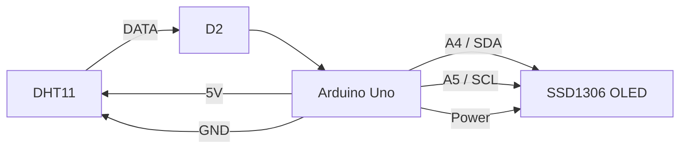

# 🔌 Project 24 — Mini Weather Station Wiring

## Components

- Arduino Uno
- DHT11 temperature/humidity sensor
- SSD1306 0.96" I2C OLED
- Breadboard
- Jumper wires

## Pin Mapping

| Component | Pin | Arduino Uno | Purpose |
|---|---|---|---|
| DHT11 | VCC | 5V | Sensor power |
| DHT11 | DATA | D2 | Digital data |
| DHT11 | GND | GND | Ground |
| OLED | VCC | 5V* | Display power |
| OLED | GND | GND | Ground |
| OLED | SDA | A4 | I2C data |
| OLED | SCL | A5 | I2C clock |

> **Important:** Verify the voltage requirement of the exact OLED module.

> **DHT11:** Bare sensors may require a DATA pull-up resistor. Many breakout modules already include one. Verify the exact module.

## DHT11

```text
        DHT11
     ┌──────────┐
5V ─►│ VCC      │
D2 ◄─│ DATA     │
GND ─│ GND      │
     └──────────┘
```

## OLED

```text
OLED                 Arduino Uno
──────────────────────────────────
VCC   ──────────────► 5V*
GND   ──────────────► GND
SDA   ──────────────► A4
SCL   ──────────────► A5
```

## Complete Wiring



## Physical Arrangement

```text
┌─────────────────────────────────────────┐
│                 BREADBOARD              │
│                                         │
│  DHT11                         OLED      │
│ ┌───────┐                 ┌───────────┐ │
│ │ DHT11 │                 │ SSD1306   │ │
│ └───┬───┘                 └─────┬─────┘ │
│     │ DATA                      │ SDA   │
│     └─────────► D2              ├──► A4 │
│                                 │ SCL   │
│                                 └──► A5 │
└─────────────────────────────────────────┘
                  │
                  ▼
           ┌─────────────┐
           │ Arduino Uno │
           └─────────────┘
```

## Power and Ground

```text
                 Arduino
              ┌───────────┐
         5V ──┤───────────┼────► DHT11 VCC
        GND ──┤───────────┼────► DHT11 GND
              │           ├────► OLED GND
              │           └────► OLED VCC*
              └───────────┘
```

All connected devices should share the appropriate common ground.

## Wiring Checklist

- [ ] DHT11 VCC → 5V
- [ ] DHT11 DATA → D2
- [ ] DHT11 GND → GND
- [ ] DHT11 pinout verified
- [ ] Pull-up requirement checked
- [ ] OLED VCC verified
- [ ] OLED GND → GND
- [ ] OLED SDA → A4
- [ ] OLED SCL → A5
- [ ] No 5V/GND short
- [ ] Connections inspected before power

## Common Errors

| Error | Likely result |
|---|---|
| SDA/SCL swapped | OLED communication fails |
| Wrong DHT DATA pin | Sensor reading fails |
| Missing ground | Unreliable/non-working circuit |
| Incorrect DHT orientation | Invalid readings |
| Missing required pull-up | DHT communication may fail |
| OLED voltage mismatch | Malfunction or possible damage |

## Recommended Build Order

```text
Place Arduino
     ↓
Establish ground
     ↓
Connect DHT11
     ↓
Connect OLED
     ↓
Inspect wiring
     ↓
Power
     ↓
Test OLED
     ↓
Test DHT11
     ↓
Run dashboard
```
