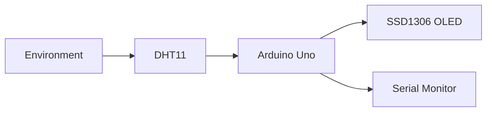
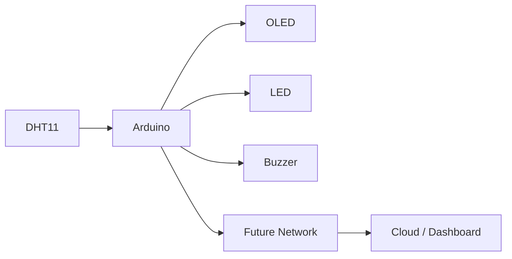

# 🌦️ Project 24 — Mini Weather Station

> **Arduino Uno • DHT11 • SSD1306 OLED • I2C • Environmental Monitoring**

## Overview

Build a compact environmental monitoring station that measures **temperature** and **relative humidity** with a DHT11 sensor and presents the measurements on an SSD1306 OLED.

The same measurements are also sent to the Serial Monitor for observation and debugging.



## Learning Objectives

By completing this project, students learn to:
- Read temperature and humidity from a digital sensor.
- Work with a sensor library.
- Validate sensor readings.
- Communicate with an I2C OLED.
- Use `millis()` for periodic updates.
- Design a simple environmental dashboard.
- Extend a sensor node with status indicators and actuators.

## Components

| Component | Purpose |
|---|---|
| Arduino Uno | Microcontroller and processing |
| DHT11 | Temperature + humidity sensing |
| SSD1306 OLED I2C | Local display |
| Breadboard | Prototype assembly |
| Jumper wires | Electrical connections |
| USB cable | Power/programming |

## Pin Summary

| Device | Pin | Arduino Uno |
|---|---|---|
| DHT11 | VCC | 5V |
| DHT11 | DATA | D2 |
| DHT11 | GND | GND |
| OLED | VCC | 5V* |
| OLED | GND | GND |
| OLED | SDA | A4 |
| OLED | SCL | A5 |

\* Verify the voltage requirement of the exact OLED breakout.

For a bare DHT11, use the appropriate DATA pull-up arrangement specified for the sensor. Many modules include this circuitry.

## How It Works

```text
        ┌─────────────┐
        │   DHT11     │
        │ Temperature │
        │ Humidity    │
        └──────┬──────┘
               │
               ▼
        ┌─────────────┐
        │ Arduino Uno │
        │ Read +      │
        │ Validate    │
        └──────┬──────┘
               │
        ┌──────┴──────┐
        ▼             ▼
     Serial          I2C
     Monitor           │
                       ▼
                  ┌─────────┐
                  │  OLED   │
                  └─────────┘
```

The program initializes the sensor and display, periodically reads temperature and humidity, validates the readings, prints valid values to Serial, and updates the OLED.

The update interval is approximately **2 seconds**.

## OLED Output

```text
┌────────────────────────┐
│ MINI WEATHER STATION   │
│────────────────────────│
│ Temperature:           │
│ 24.5 C                 │
│                        │
│ Humidity: 62.0 %       │
└────────────────────────┘
```

## Libraries

```cpp
#include <Wire.h>
#include <Adafruit_GFX.h>
#include <Adafruit_SSD1306.h>
#include <DHT.h>
```

Install missing libraries through the Arduino IDE Library Manager.

## Testing

| Test | Expected result |
|---|---|
| Power-on | System starts |
| OLED | Startup/dashboard appears |
| DHT11 | Temperature and humidity are returned |
| Serial | Values appear at 9600 baud |
| Complete test | OLED and Serial show the measurements |
| Sensor fault | Error message appears |

## Troubleshooting

### OLED blank
Check VCC, GND, SDA → A4, SCL → A5, the OLED address, libraries, and module voltage compatibility.

### DHT11 reading fails
Check sensor pinout, VCC, GND, DATA → D2, sensor type, and the required pull-up arrangement.

### Values seem inaccurate
First verify wiring and sensor configuration. The DHT11 is a basic sensor, so do not interpret it as a laboratory-grade instrument.

## Extensions

Add:
- Temperature and humidity status
- LED warning
- Buzzer warning
- Third environmental sensor
- Rotating OLED screens
- Min/max values
- Simple graphs
- Network/IoT monitoring



## Engineering Connection

```text
Physical Environment
        ↓
      Sensor
        ↓
   Measurement
        ↓
 Data Validation
        ↓
   Processing
        ↓
  Visualization
```

This architecture appears in weather stations, greenhouses, HVAC monitoring, smart buildings, laboratory equipment, and IoT sensor nodes.
