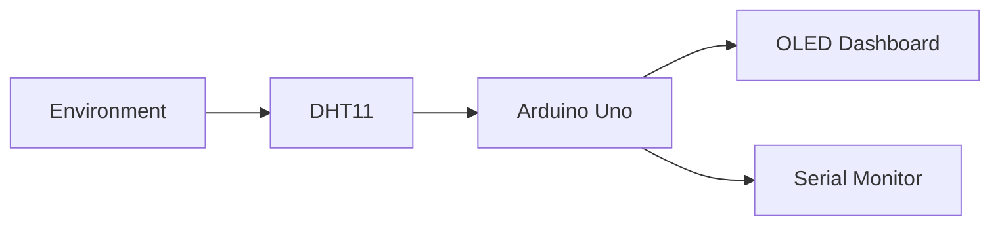
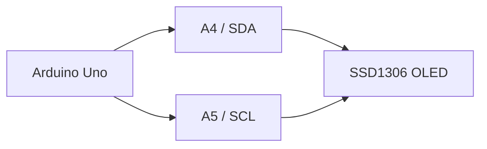
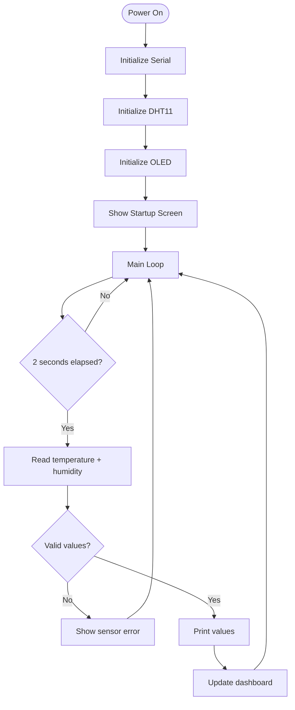
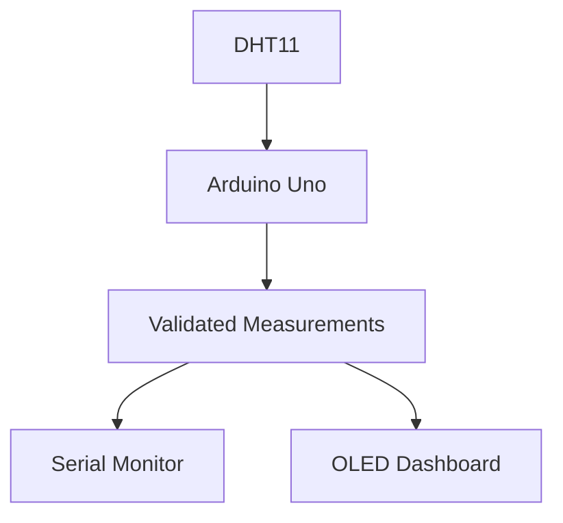
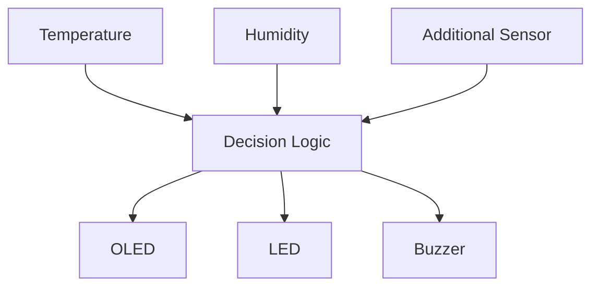
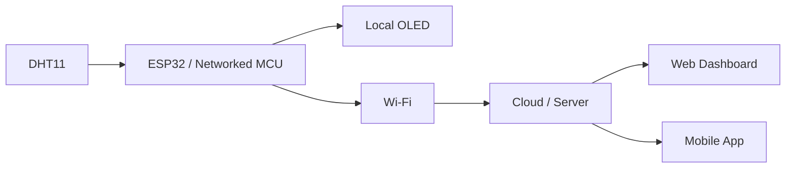

# 📘 Project 24 — Mini Weather Station Notes

## What Are We Building?

A compact environmental monitoring system using a DHT11 to measure temperature and relative humidity, with an SSD1306 OLED providing local visualization and the Serial Monitor providing development feedback.



## Learning Objectives

Students should be able to:

- Explain temperature and relative humidity.
- Identify the DHT11 as a digital environmental sensor.
- Read a sensor through a library.
- Detect invalid sensor readings.
- Explain I2C and identify SDA/SCL.
- Control an SSD1306 OLED.
- Display multiple measurements.
- Use `millis()` for periodic updates.
- Extend a sensor node with thresholds and outputs.

## The Big Picture

```text
┌──────────────┐
│   SENSING    │
│    DHT11     │
└──────┬───────┘
       ↓
┌──────────────┐
│ VALIDATION   │
│ Is data OK?  │
└──────┬───────┘
       ↓
┌──────────────┐
│  PROCESSING  │
│ Arduino Uno  │
└──────┬───────┘
       ↓
┌──────────────┐
│ COMMUNICATION│
│ I2C / Serial │
└──────┬───────┘
       ↓
┌──────────────┐
│ VISUALIZATION│
│ OLED         │
└──────────────┘
```

The core model is:

> **Sense → Validate → Process → Visualize**

# DHT11

The DHT11 is a digital sensor that provides:

```text
Temperature → °C
Humidity    → %
```

The Arduino does not use `analogRead()` for these measurements. The sensor communicates digitally, and the DHT library returns the values.

```text
DHT11
  │ Digital communication
  ▼
Arduino
  │
  ▼
DHT library
  ├──► Temperature
  └──► Humidity
```

## Temperature

Temperature describes how hot or cold the environment is.

The program obtains it with:

```cpp
float temperature = dht.readTemperature();
```

## Relative Humidity

Relative humidity is expressed as a percentage and describes the amount of water vapor in air relative to the amount the air can hold at the current temperature.

The program obtains it with:

```cpp
float humidity = dht.readHumidity();
```

Treat these as sensor measurements rather than assuming laboratory-grade accuracy.

# Digital vs Analog Sensors

| DHT11 | LM35 |
|---|---|
| Digital communication | Analog voltage |
| Temperature + humidity | Temperature |
| Digital DATA line | Analog input |
| Library handles protocol | Arduino ADC performs conversion |

This comparison illustrates that sensors can use very different electrical and software interfaces.

# Sensor Library

```cpp
#include <DHT.h>
```

The library abstracts the low-level communication.

```cpp
DHT dht(DHT_PIN, DHT_TYPE);
```

Initialize:

```cpp
dht.begin();
```

Read:

```cpp
dht.readTemperature();
dht.readHumidity();
```

This is an example of **software abstraction**:

```text
Low-level protocol
       ↓
    Library
       ↓
Simple application functions
```

# OLED

OLED means:

> **Organic Light-Emitting Diode**

It can display text, numbers, symbols, graphics, sensor values, and status information.

The SSD1306 is a controller used by many small monochrome OLED modules.

## Why Use an OLED?

The Serial Monitor requires a computer. The OLED allows the device to communicate information locally.

```text
Sensor → Arduino → OLED
                  ↓
             Standalone UI
```

# I2C

I2C is a serial communication protocol using:

```text
SDA → Serial Data
SCL → Serial Clock
```

For Arduino Uno:

```text
A4 → SDA
A5 → SCL
```



## I2C Address

A common SSD1306 address is:

```text
0x3C
```

Some modules use:

```text
0x3D
```

The configured address must match the actual hardware.

```text
Arduino
   │
   ▼
I2C bus
   │
   ▼
Device address
   │
   ▼
OLED
```

## Multiple I2C Devices

```text
                Arduino
                   │
             ┌─────┴─────┐
             │ SDA + SCL │
             └─────┬─────┘
                   │
          ┌────────┼────────┐
          ▼        ▼        ▼
        OLED      RTC     Sensor
```

Compatible devices can share the bus when their addresses and electrical configuration permit it.

# OLED Libraries

```cpp
#include <Wire.h>
#include <Adafruit_GFX.h>
#include <Adafruit_SSD1306.h>
#include <DHT.h>
```

### Wire
I2C communication.

### Adafruit GFX
Graphics and text functions.

### Adafruit SSD1306
SSD1306 display control.

### DHT
DHT-series sensor communication.

# OLED Buffer

The display can be understood as a buffered graphics system:

```text
Arduino RAM
   ↓
Display buffer
   ↓
display.display()
   ↓
OLED
```

The program prepares the screen, then transfers the resulting display buffer.

# Dashboard Design

A useful dashboard prioritizes:

1. Clear labels
2. Readable values
3. Consistent spacing
4. Important information first
5. Minimal clutter
6. Appropriate refresh rate

Example:

```text
┌────────────────────────┐
│ MINI WEATHER STATION   │
│────────────────────────│
│ Temperature:           │
│ 24.5 C                 │
│                        │
│ Humidity: 62.0 %       │
└────────────────────────┘
```

# Main Program Flow



# Why Use `millis()`?

The project uses an approximately 2000 ms update interval.

Conceptually:

```cpp
if (millis() - lastUpdateTime >= UPDATE_INTERVAL) {
    lastUpdateTime = millis();

    // Read and display data
}
```

This is preferable to making the main program spend the whole interval inside a long blocking delay, especially as more functions are added.

```text
Arduino running
      ↓
Check elapsed time
      ↓
2 seconds reached?
   /          \
 NO            YES
 │              │
 ▼              ▼
Continue      Read sensors
                ↓
             Validate
                ↓
             Update OLED
                ↓
             Serial output
```

# Data Validation

Sensor communication can fail.

The project checks:

```cpp
if (isnan(humidity) || isnan(temperature))
```

`isnan()` means **is Not a Number**.

The principle is:

```text
Read data
   ↓
Validate data
   ↓
Use only valid data
```

This is an important engineering habit:

> **Never blindly trust input data.**

# Error Display

When a reading fails, the OLED can show:

```text
┌────────────────────────┐
│ WEATHER STATION        │
│                        │
│ Sensor read error!     │
│                        │
│ Check DHT wiring.      │
└────────────────────────┘
```

This prevents an invalid measurement from being presented as real information.

# Serial Monitor

The Serial Monitor is useful for debugging and observation.

Example:

```text
Temperature: 24.5 C | Humidity: 62.0 %
Temperature: 24.6 C | Humidity: 62.0 %
Temperature: 24.6 C | Humidity: 61.0 %
```

Both outputs can be used together:



| Output | Purpose |
|---|---|
| Serial Monitor | Debugging and observation |
| OLED | Local user interface |

# Experiment 1 — Humidity Warning

Add a demonstration threshold:

```text
Humidity > 80%
      ↓
HIGH HUMIDITY
```

Then display a warning.

The threshold should be treated as a project setting, not as a universal environmental safety limit.

# Experiment 2 — Temperature Status

Example classification:

```text
< 18°C   → COOL
18–30°C  → NORMAL
> 30°C   → HOT
```

These are demonstration thresholds for the exercise.

# Experiment 3 — Add an LED

```text
Temperature
     ↓
Threshold check
   /       \
Normal      High
  │          │
  ▼          ▼
LED OFF     LED ON
```

This introduces:

> **Sensor → Decision → Actuator**

# Experiment 4 — Add a Buzzer

```text
Temperature / Humidity
          ↓
     Threshold check
       /          \
   Normal        Warning
      │              │
      ▼              ▼
 Buzzer OFF       Buzzer ON
```

Use an appropriate small buzzer/driver arrangement. Do not drive high-current loads directly from an Arduino GPIO.

# Experiment 5 — Add a Third Sensor

Possible additions:

- LDR
- Soil-moisture sensor
- Pressure sensor
- Air-quality sensor

The architecture becomes:

```text
Sensor 1 ──┐
Sensor 2 ──┼──► Arduino ──► OLED
Sensor 3 ──┘
```

The new engineering challenge is organizing several measurements on limited display space.

# Experiment 6 — Rotating Dashboard

```text
Screen 1
Temperature + Humidity
        ↓
Screen 2
Additional Sensor
        ↓
Screen 3
System Status
        ↓
Screen 1
```

This introduces screen states, timing, and state variables.

# Challenge — Environmental Monitor

Build an improved version with:

1. Temperature
2. Humidity
3. Temperature status
4. Humidity status
5. OLED dashboard
6. LED warning
7. Buzzer warning
8. Third sensor
9. Sensor-error handling
10. System status



# Advanced Challenge — Mini HMI

Turn the OLED into a simple human-machine interface.

```text
┌────────────────────────┐
│ ENVIRONMENT STATUS     │
├────────────────────────┤
│ TEMP  31.2 C    HIGH   │
│ HUM   78 %       OK    │
├────────────────────────┤
│ WARNING                │
└────────────────────────┘
```

Explore:

- Icons
- Progress bars
- Simple graphs
- Min/max values
- Averaging
- Screen navigation
- Sensor health indicators

# Troubleshooting

## OLED Blank

Check:

```text
Power
  ↓
Ground
  ↓
SDA / SCL
  ↓
I2C address
  ↓
Libraries
  ↓
Configuration
```

Verify VCC, GND, SDA → A4, SCL → A5, address, libraries, and module voltage.

## DHT11 Reading Failed

Check:

- VCC
- GND
- DATA → D2
- Sensor orientation
- Exact module pinout
- `DHT11` selected in software
- Required pull-up arrangement

## OLED Works but DHT11 Fails

Test the sensor separately through Serial output.

```text
DHT11 alone
    ↓
Verify
    ↓
OLED alone
    ↓
Verify
    ↓
Combine
```

## Values Seem Inaccurate

The DHT11 is a basic sensor. Verify wiring, configuration, sensor placement, and measurement conditions before diagnosing the hardware as faulty.

# Professional Debugging Method

Use:

> **Isolate → Test → Verify → Integrate**

```text
┌──────────────┐
│ Test DHT11   │
└──────┬───────┘
       ▼
┌──────────────┐
│ Test OLED    │
└──────┬───────┘
       ▼
┌──────────────┐
│ Test Serial  │
└──────┬───────┘
       ▼
┌──────────────┐
│ Integrate    │
└──────────────┘
```

# Student Observation Table

| Test | Temperature °C | Humidity % | OLED | Serial |
|---|---:|---:|---|---|
| Initial room condition | | | | |
| After warming sensor | | | | |
| After moving sensor | | | | |
| After environmental change | | | | |

Think about:

- Did temperature change immediately?
- Did humidity change at the same rate?
- Did OLED and Serial values agree?
- What happens if the sensor is disconnected?
- How long does the displayed value take to update?

# Questions

1. Is the DHT11 analog or digital?
2. What two measurements does it provide?
3. What does relative humidity mean?
4. Why is `DHT.h` used?
5. What does `isnan()` check?
6. What are SDA and SCL?
7. Which Uno pins provide SDA and SCL?
8. What is an I2C address?
9. Why can the OLED use only two communication lines?
10. Why is `millis()` useful?
11. Why should sensor data be validated?
12. How would you add a third sensor?
13. How would you display four measurements on a small OLED?
14. What is the difference between Serial Monitor and OLED?

# From Weather Station to IoT

The current project is local:

```text
DHT11
  ↓
Arduino
  ↓
OLED
```

A networked version could become:



The OLED can provide local feedback even when network connectivity is unavailable.

# Real-World Applications

This architecture is relevant to:

- Weather stations
- Greenhouse monitoring
- HVAC monitoring
- Smart buildings
- Environmental monitoring
- Laboratory equipment
- IoT sensor nodes

The pattern is:

```text
Environment
     ↓
Sensor
     ↓
Measurement
     ↓
Validation
     ↓
Processing
     ↓
Visualization
     ↓
Action / Monitoring
```

# Final Checklist

### Hardware
- [ ] Arduino Uno connected
- [ ] DHT11 power verified
- [ ] DHT11 DATA → D2
- [ ] DHT11 GND connected
- [ ] DHT11 pinout verified
- [ ] OLED power verified
- [ ] OLED GND connected
- [ ] OLED SDA → A4
- [ ] OLED SCL → A5
- [ ] Common ground established

### Software
- [ ] Wire available
- [ ] Adafruit GFX installed
- [ ] Adafruit SSD1306 installed
- [ ] DHT library installed
- [ ] DHT type configured correctly
- [ ] OLED address verified
- [ ] Serial Monitor set to 9600 baud
- [ ] Sensor-error handling tested
- [ ] OLED update tested
- [ ] Timing tested

### Understanding
- [ ] I can explain DHT11
- [ ] I can explain temperature and humidity
- [ ] I can explain I2C
- [ ] I know A4/A5
- [ ] I understand validation
- [ ] I understand `millis()`
- [ ] I can add a threshold
- [ ] I can add an output device
- [ ] I can troubleshoot systematically

# Final Takeaway

A weather station is a miniature embedded monitoring system:

```text
┌───────────────┐
│ ENVIRONMENT   │
└───────┬───────┘
        ▼
┌───────────────┐
│ DHT11 SENSOR  │
└───────┬───────┘
        ▼
┌───────────────┐
│ DATA VALIDATE │
└───────┬───────┘
        ▼
┌───────────────┐
│ ARDUINO       │
│ PROCESSING    │
└───────┬───────┘
        ▼
┌───────────────┐
│ OLED + SERIAL │
└───────┬───────┘
        ▼
┌───────────────┐
│ HUMAN         │
│ INFORMATION   │
└───────────────┘
```

> **Useful embedded systems do not merely collect measurements; they validate, process, communicate, and present those measurements in a form people can understand.**
