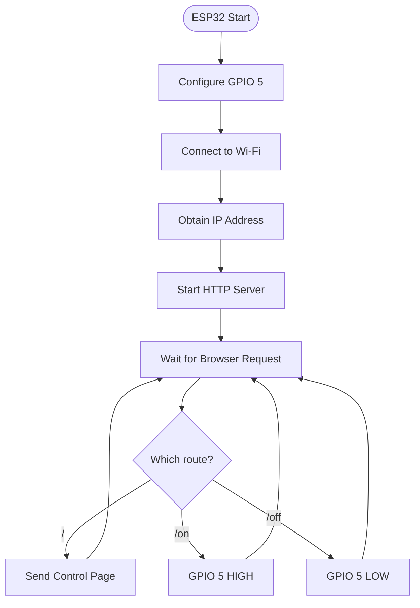
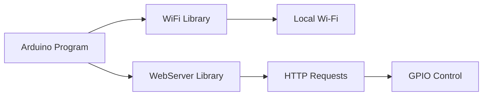

# 📡 Project 25 — ESP32 Wi-Fi LED Control

> **ESP32 • Wi-Fi • HTTP • Web Server • Remote GPIO Control**

## Project Overview

This project introduces network-controlled hardware.

Instead of controlling an LED directly with a physical button, a browser sends a command over the local Wi-Fi network to an ESP32. The ESP32 receives the HTTP request and changes the state of an external LED connected to GPIO 5.


## The Core Learning Model

```text
Browser
   ↓
Wi-Fi
   ↓
ESP32 Web Server
   ↓
HTTP Request
   ↓
GPIO 5
   ↓
LED
```

This is the first project in the connectivity sequence where a network becomes part of the control path.

## Learning Objectives

By completing this project, students should be able to:

- Connect an ESP32 to a Wi-Fi network.
- Understand station-mode Wi-Fi operation.
- Identify an ESP32 IP address.
- Understand the basic role of HTTP.
- Run a simple web server on the ESP32.
- Create browser-accessible routes.
- Control a GPIO from a web request.
- Understand local-network IoT control.
- Debug Wi-Fi, web-server, and GPIO problems.

## Hardware

| Component | Purpose |
|---|---|
| ESP32 development board | Wi-Fi-enabled microcontroller |
| LED | Controlled output |
| 220Ω resistor | LED current limiting |
| Breadboard | Circuit assembly |
| Jumper wires | Connections |
| USB cable | Power and programming |

## Pin Summary

| ESP32 Pin | Function |
|---|---|
| GPIO 5 | LED output |
| GND | LED ground |
| USB | Power/programming |

### LED circuit

```text
ESP32 GPIO 5
      │
     220Ω
      │
      ▼
 LED Anode
 LED Cathode
      │
      ▼
     GND
```

> **Important:** ESP32 GPIO uses 3.3V logic. Do not connect 5V directly to an ESP32 GPIO.

## How the System Works

The ESP32 starts by configuring GPIO 5 as an output. It then connects to the configured Wi-Fi network.

After obtaining an IP address, the ESP32 starts an HTTP server on port 80.

Three routes are used:

| Route | Action |
|---|---|
| `/` | Display the control page |
| `/on` | Turn LED ON |
| `/off` | Turn LED OFF |



## Browser Control

When the ESP32 prints an IP address such as:

```text
ESP32 IP Address: 192.168.1.25
```

a device on the same local network can request:

```text
http://192.168.1.25
```

The browser receives a simple HTML page containing:

```text
IoT Student Lab
Project 25: ESP32 Wi-Fi LED Control

LED Status: OFF

[Turn ON] [Turn OFF]
```

Clicking **Turn ON** sends a request to:

```text
/on
```

Clicking **Turn OFF** sends:

```text
/off
```

## Software Architecture

The project uses:

```cpp
#include <WiFi.h>
#include <WebServer.h>
```

### WiFi

Provides ESP32 wireless networking functions.

### WebServer

Provides a simple HTTP server and route-handling interface.



## State Representation

The program keeps a software representation of the LED state:

```cpp
bool ledState = false;
```

The physical output and software state are updated together:

```text
Browser command
      ↓
Update ledState
      ↓
digitalWrite(GPIO 5)
      ↓
Physical LED changes
      ↓
Updated page reports status
```

## Serial Monitor

Use the Serial Monitor at:

```text
115200 baud
```

It provides useful information such as:

```text
Wi-Fi connected!
ESP32 IP Address: 192.168.x.x
Web server started.
```

It also reports:

```text
LED → ON
LED → OFF
```

## Testing

### Wi-Fi Test

Expected sequence:

```text
Connecting to Wi-Fi....
        ↓
Wi-Fi connected!
        ↓
ESP32 IP Address: ...
        ↓
Web server started.
```

### Browser Test

Open the printed IP address.

Expected:

```text
LED Status: OFF
[Turn ON] [Turn OFF]
```

### LED ON Test

Press **Turn ON**.

Expected:

```text
Browser → /on → ESP32 → GPIO 5 HIGH → LED ON
```

### LED OFF Test

Press **Turn OFF**.

Expected:

```text
Browser → /off → ESP32 → GPIO 5 LOW → LED OFF
```

## Troubleshooting

### ESP32 does not connect

Check:

- Wi-Fi SSID
- Wi-Fi password
- Availability of a compatible 2.4 GHz network
- ESP32 power
- Serial Monitor baud rate

### No IP address appears

The Wi-Fi connection has probably not completed.

Look for:

```text
Connecting to Wi-Fi....
```

and verify the credentials.

### Browser cannot reach ESP32

Check:

- ESP32 is powered
- ESP32 is still connected to Wi-Fi
- Browser device is on the same local network
- IP address is correct
- Web server started

### LED does not respond

Check:

- GPIO 5 connection
- LED polarity
- 220Ω resistor
- GND connection

## Security Note

This is a classroom/local-network demonstration.

The simple HTTP server has no authentication, encryption, or access control. It should **not be exposed directly to the public Internet**.

## Extensions

- Add a `/blink` route.
- Add a second LED.
- Display Wi-Fi signal strength.
- Add separate routes for multiple outputs.
- Build a more polished web interface.
- Add sensor readings to the same page.
- Add authentication in a later project.
- Move from local control toward cloud-connected IoT.

## Engineering Progression

```text
GPIO Control
     ↓
Wi-Fi Connectivity
     ↓
IP Address
     ↓
HTTP
     ↓
Web Server
     ↓
Remote GPIO Control
     ↓
IoT Device
```

> **Project 25 introduces the fundamental idea that a physical device can expose its hardware through a network interface.**
