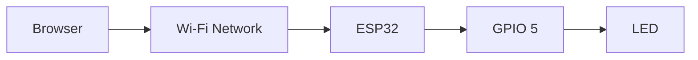
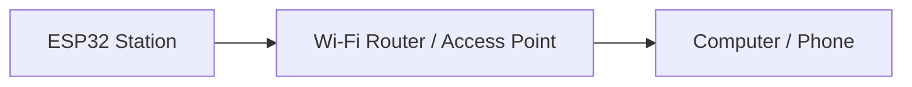
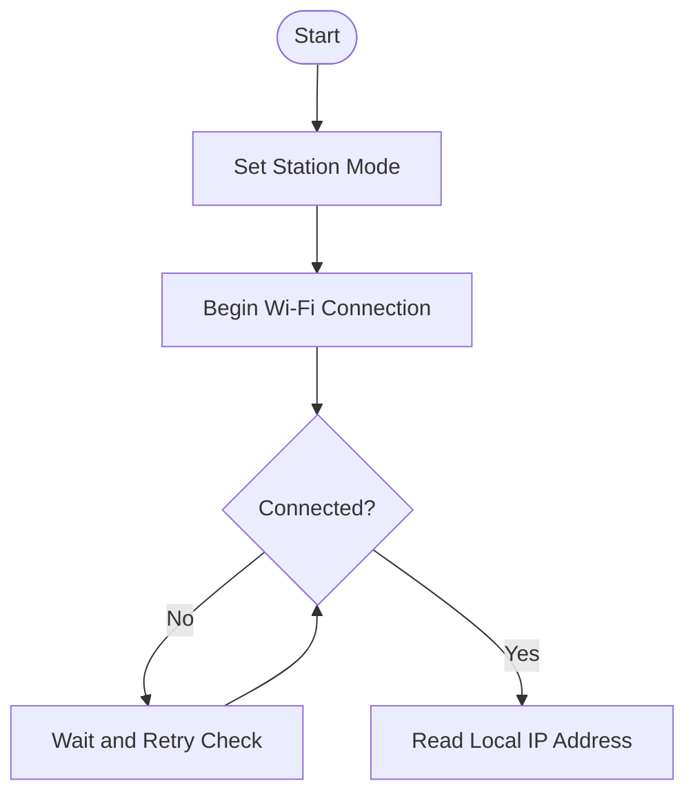
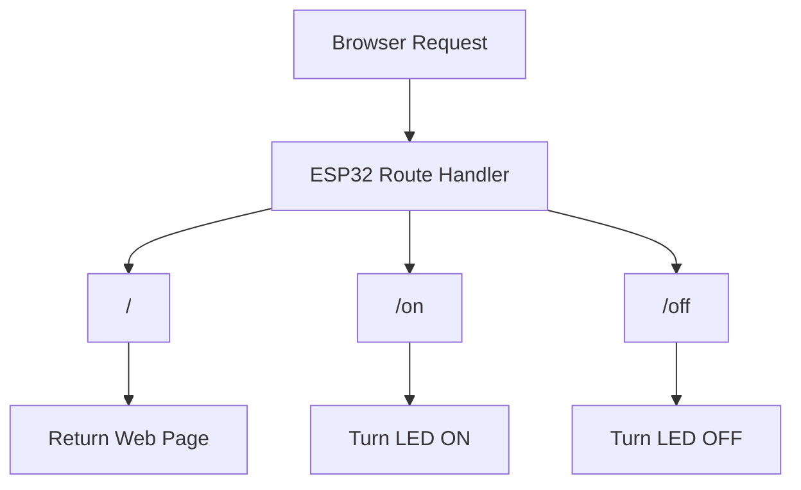
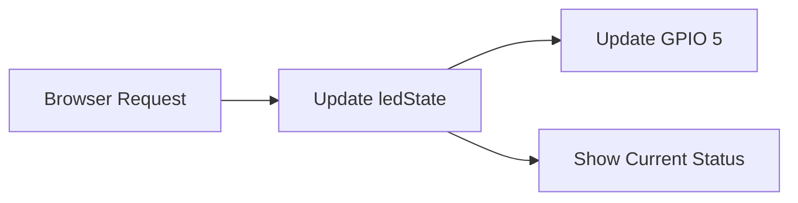
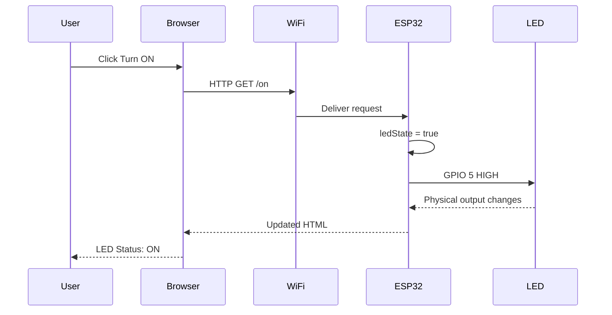
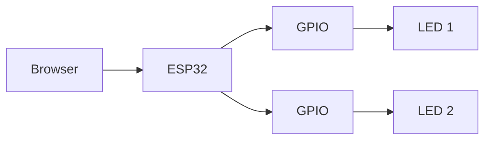
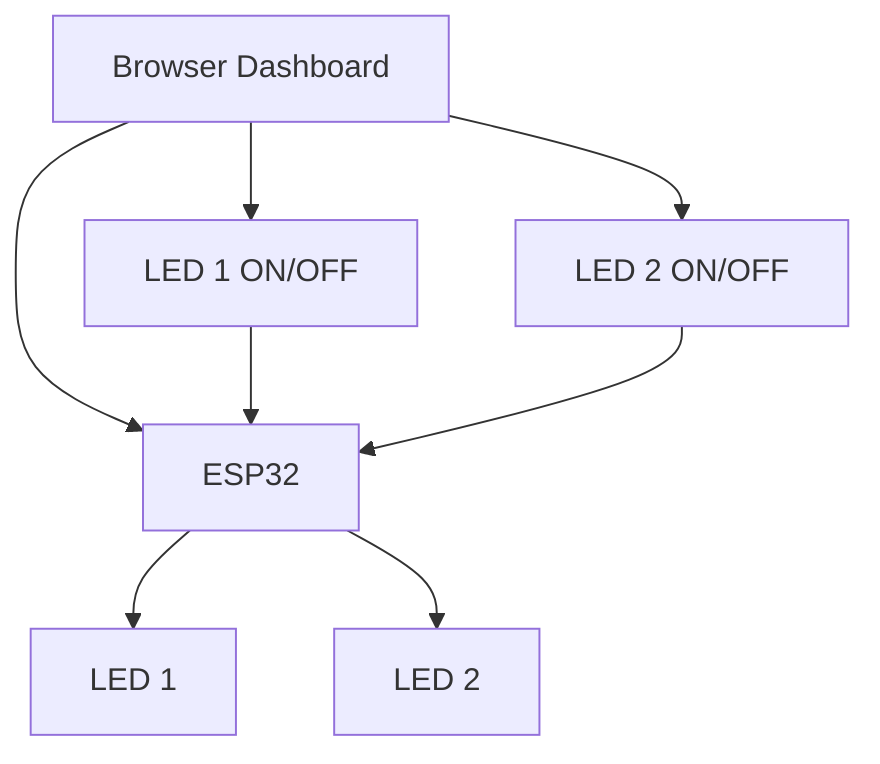
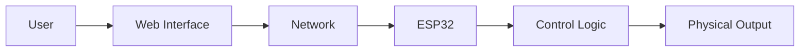

# 📘 Project 25 — ESP32 Wi-Fi LED Control Notes

## 1. What Are We Learning?

This project introduces a major transition in the course:

**network-connected hardware control.**

Instead of a local button controlling an LED, a browser sends a command to an ESP32 over a Wi-Fi network.



The core learning model is:

> **Browser → Wi-Fi → ESP32 → GPIO → LED**

---

# 2. Learning Objectives

By completing this project, you should be able to:

- Explain why the ESP32 is useful for IoT.
- Connect an ESP32 to Wi-Fi.
- Understand station-mode Wi-Fi.
- Identify an IP address.
- Explain the basic purpose of HTTP.
- Describe what a web server does.
- Create simple HTTP routes.
- Connect a browser request to a GPIO action.
- Use Serial Monitor for network debugging.
- Explain the difference between local hardware control and network control.
- Identify basic security limitations of an unauthenticated local HTTP server.

---

# 3. From Arduino Control to IoT Control

A traditional embedded control pattern might be:

```text
Button
  ↓
Microcontroller
  ↓
LED
```

This project changes the input mechanism:

```text
Browser
  ↓
Network
  ↓
ESP32
  ↓
LED
```

The physical output remains simple, but the command now travels through a communication network.

That is an important IoT concept.

---

# 4. Why ESP32?

The ESP32 combines a microcontroller with wireless networking capabilities.

That means one board can provide:

```text
                 ESP32
                   │
        ┌──────────┼──────────┐
        ▼          ▼          ▼
       GPIO       Wi-Fi    Processing
        │          │
        ▼          ▼
     Hardware    Network
```

This makes it suitable for projects involving:

- Remote control
- Sensor monitoring
- Web interfaces
- IoT communication
- Network-connected automation

---

# 5. What Is Wi-Fi?

Wi-Fi provides wireless network communication.

In this project, the ESP32 joins an existing local wireless network.

The ESP32 is configured in **station mode**.



The ESP32 does not need to create the Wi-Fi network for this project. It joins an existing network.

---

# 6. Wi-Fi Credentials

The program contains placeholders for:

```cpp
const char* WIFI_SSID = "YOUR_WIFI_NAME";
const char* WIFI_PASSWORD = "YOUR_WIFI_PASSWORD";
```

These values identify the wireless network and its authentication credentials.

For real projects, credentials should be handled carefully and should not be publicly committed to source repositories.

---

# 7. Connecting to Wi-Fi

The program uses:

```cpp
WiFi.mode(WIFI_STA);
WiFi.begin(WIFI_SSID, WIFI_PASSWORD);
```

The program then waits until the connection is established.



---

# 8. What Is an IP Address?

An IP address identifies a device on an IP network.

Example:

```text
192.168.1.25
```

Once connected, the ESP32 prints its local IP address.

```text
ESP32 IP Address: 192.168.1.25
```

The browser can then use that address to reach the ESP32.

```text
Browser
   │
   │ http://192.168.1.25
   ▼
ESP32
```

The actual address will depend on the local network.

---

# 9. What Is HTTP?

**HTTP** stands for:

> **Hypertext Transfer Protocol**

It is a common protocol used for communication between web clients and web servers.

In this project:

```text
Browser = Client
ESP32   = Web Server
```

The browser sends a request.

The ESP32 processes the request and sends a response.

```text
Browser
   │
   │ HTTP request
   ▼
ESP32
   │
   │ HTTP response
   ▼
Browser
```

---

# 10. What Is a Web Server?

A web server listens for HTTP requests and responds to them.

The ESP32 creates:

```cpp
WebServer server(80);
```

Port `80` is the conventional port associated with HTTP.

The ESP32 therefore behaves like a small embedded web server.

```text
┌───────────────────────┐
│       ESP32           │
│                       │
│   HTTP Web Server     │
│                       │
│ /                     │
│ /on                   │
│ /off                  │
└───────────────────────┘
```

---

# 11. Routes

A route connects a URL path to a function.

The project uses:

```cpp
server.on("/", sendHomePage);
server.on("/on", handleLedOn);
server.on("/off", handleLedOff);
```

This can be visualized as:



---

# 12. The `/` Route

When the browser opens the main IP address:

```text
http://ESP32_IP/
```

the root route is selected.

The ESP32 sends an HTML page containing:

```text
IoT Student Lab
Project 25: ESP32 Wi-Fi LED Control

LED Status: OFF

Turn ON
Turn OFF
```

The browser renders that HTML as a web interface.

---

# 13. The `/on` Route

When the user presses **Turn ON**, the browser requests:

```text
/on
```

The ESP32 executes the LED-on handler.

Conceptually:

```text
/on
 ↓
ledState = true
 ↓
digitalWrite(GPIO 5, HIGH)
 ↓
LED ON
 ↓
Send updated page
```

---

# 14. The `/off` Route

The OFF operation follows the opposite sequence:

```text
/off
 ↓
ledState = false
 ↓
digitalWrite(GPIO 5, LOW)
 ↓
LED OFF
 ↓
Send updated page
```

---

# 15. GPIO Control

The LED uses:

```cpp
const int LED_PIN = 5;
```

The pin is configured as an output:

```cpp
pinMode(LED_PIN, OUTPUT);
```

The initial state is OFF:

```cpp
digitalWrite(LED_PIN, LOW);
```

When the browser requests `/on`:

```cpp
digitalWrite(LED_PIN, HIGH);
```

When `/off` is requested:

```cpp
digitalWrite(LED_PIN, LOW);
```

This creates a direct link between an HTTP route and a physical GPIO.

---

# 16. Software State

The program stores:

```cpp
bool ledState = false;
```

This variable represents the current logical state.



Why store state?

Because the web page needs to report whether the LED is currently:

```text
ON
```

or:

```text
OFF
```

---

# 17. Web Page Generation

The ESP32 creates the page as an HTML string.

The page contains:

- Heading
- Project name
- Current LED status
- ON control
- OFF control

The important idea is:

```text
ESP32
  ↓
Generate HTML
  ↓
HTTP response
  ↓
Browser
  ↓
Rendered interface
```

This demonstrates that an embedded device can generate its own user interface.

---

# 18. Serial Monitor

The Serial Monitor is an important debugging tool.

The project uses:

```cpp
Serial.begin(115200);
```

Expected startup information includes:

```text
Wi-Fi connected!

ESP32 IP Address: 192.168.x.x

Web server started.
```

When buttons are pressed:

```text
LED → ON
LED → OFF
```

This provides visibility into what the ESP32 is doing.

---

# 19. Complete Communication Flow



This is the complete journey from user action to physical hardware.

---

# 20. Main Loop

The main loop contains:

```cpp
void loop() {
  server.handleClient();
}
```

This keeps the server responsive to incoming browser requests.

Conceptually:

```text
ESP32
  │
  ▼
Check for client request
  │
  ▼
Request?
 /     No      Yes
│        │
▼        ▼
Repeat  Process
          │
          ▼
       GPIO / Page
          │
          └────► Repeat
```

---

# 21. Why This Is an IoT Project

The LED itself is not an IoT device.

The important feature is the **network connection between the user interface and the physical output**.

```text
Digital World
     │
     ▼
Browser
     │
     ▼
Network
     │
     ▼
Embedded Device
     │
     ▼
Physical World
     │
     ▼
LED
```

This is a fundamental cyber-physical interaction.

---

# 22. Testing Procedure

## Test 1 — Wi-Fi

Open Serial Monitor at:

```text
115200 baud
```

Look for:

```text
Wi-Fi connected!
ESP32 IP Address: ...
Web server started.
```

If these messages appear, continue.

---

## Test 2 — Main Web Page

Open the printed IP address in a browser.

Expected:

```text
IoT Student Lab
Project 25: ESP32 Wi-Fi LED Control

LED Status: OFF

[Turn ON] [Turn OFF]
```

---

## Test 3 — Turn ON

Press:

```text
Turn ON
```

Expected sequence:

```text
Browser
  ↓
/on
  ↓
ESP32
  ↓
GPIO 5 HIGH
  ↓
LED ON
```

---

## Test 4 — Turn OFF

Press:

```text
Turn OFF
```

Expected:

```text
Browser
  ↓
/off
  ↓
ESP32
  ↓
GPIO 5 LOW
  ↓
LED OFF
```

---

# 23. Troubleshooting

## ESP32 does not connect to Wi-Fi

Check:

- SSID spelling
- Password
- Compatible 2.4 GHz Wi-Fi availability
- ESP32 power
- Serial Monitor baud rate

The connection process should eventually produce:

```text
Wi-Fi connected!
```

---

## No IP address appears

If the IP address never appears, the Wi-Fi connection has not completed.

Check the credentials first.

---

## Browser cannot reach ESP32

Check:

```text
ESP32 powered?
      ↓
Wi-Fi connected?
      ↓
IP address correct?
      ↓
Browser device on same network?
      ↓
Web server started?
```

The browser device normally needs network access to the same local network as the ESP32.

---

## LED does not turn on

Check:

- GPIO 5
- Resistor
- LED polarity
- GND
- Breadboard connections

Test the LED circuit independently if necessary.

---

# 24. Security

The project uses a simple HTTP server intended for local learning.

It does not provide:

- Authentication
- HTTPS encryption
- Access control
- User management

Therefore:

> **Do not expose this demonstration directly to the public Internet.**

This limitation is itself an important IoT lesson.

A device being connected to a network does not automatically make it secure.

---

# 25. Experiment 1 — Add `/blink`

Create a new route:

```text
/blink
```

The route should make the LED blink.

Architecture:

```text
Browser
  ↓
/blink
  ↓
ESP32
  ↓
GPIO 5
  ↓
ON → OFF → ON → OFF
```

---

# 26. Experiment 2 — Add a Second LED

Add another LED on a suitable GPIO.

The web interface could contain:

```text
LED 1
[ON] [OFF]

LED 2
[ON] [OFF]
```

The architecture becomes:



---

# 27. Experiment 3 — Display Wi-Fi Signal Strength

Investigate:

```cpp
WiFi.RSSI()
```

The page could eventually show:

```text
LED Status: ON
Wi-Fi Signal: -58 dBm
```

Students can observe how signal strength changes with distance and obstacles.

---

# 28. Experiment 4 — Add Sensor Data

A future version can combine the web interface with sensors:

```text
Sensor
  ↓
ESP32
  ├────► OLED
  └────► Web Browser
```

This creates a two-way relationship between the physical device and digital interface.

---

# 29. Engineering Challenge — Two-Device Control Panel

Build a browser interface capable of controlling two LEDs independently.



Students should design the routes and user interface themselves.

---

# 30. Advanced Direction

The project can evolve into:

```text
Browser
   ↓
Wi-Fi
   ↓
ESP32
   ├──► LED
   ├──► Sensor
   ├──► OLED
   ├──► Relay
   └──► Motor Driver
```

At this point, the ESP32 becomes a small network-connected controller.

For higher-current devices, use suitable driver circuitry rather than connecting the load directly to a GPIO.

---

# 31. IoT Architecture



The essential idea is:

> **A digital command travels through a network and produces a physical action.**

---

# 32. Real-World Connections

The same basic architecture appears in systems such as:

- Smart lighting
- Local device dashboards
- Network-controlled laboratory equipment
- Building automation
- Home automation
- Remote monitoring systems
- IoT prototypes

Real systems add stronger security, authentication, error handling, reliability, and appropriate hardware drivers.

---

# 33. Student Observation Table

| Test | Wi-Fi | IP Address | Browser | LED |
|---|---|---|---|---|
| Initial connection | | | | |
| Open page | | | | |
| Turn ON | | | | |
| Turn OFF | | | | |
| Repeat commands | | | | |

Record what happened and note any delay or unexpected behavior.

---

# 34. Questions

1. Why is the ESP32 suitable for IoT?
2. What is Wi-Fi station mode?
3. What is an IP address?
4. What does HTTP stand for?
5. What is a web server?
6. What is a route?
7. What does `/on` do?
8. What does `/off` do?
9. Why is GPIO 5 configured as an output?
10. Why is a resistor used with the LED?
11. Why does the browser need the ESP32 IP address?
12. Why should the browser device normally be on the same local network?
13. What does `server.handleClient()` do?
14. Why is `ledState` useful?
15. Why should this simple HTTP server not be exposed directly to the Internet?
16. How could this project control a sensor-driven actuator?

---

# 35. Final Checklist

### Hardware

- [ ] ESP32 connected
- [ ] GPIO 5 identified
- [ ] 220Ω resistor installed
- [ ] LED polarity checked
- [ ] LED cathode → GND
- [ ] No 5V connected directly to GPIO
- [ ] Circuit inspected

### Network

- [ ] Wi-Fi credentials configured
- [ ] ESP32 connected
- [ ] IP address obtained
- [ ] Browser device has local-network access
- [ ] Web server started

### Software

- [ ] WiFi library available
- [ ] WebServer library available
- [ ] GPIO initialized
- [ ] `/` route works
- [ ] `/on` route works
- [ ] `/off` route works
- [ ] Serial output works

### Understanding

- [ ] I can explain Wi-Fi station mode
- [ ] I can explain an IP address
- [ ] I can explain HTTP
- [ ] I can explain a web route
- [ ] I can connect a route to GPIO
- [ ] I understand local network control
- [ ] I understand the project's security limitation

---

# 36. Final Takeaway

Project 25 introduces a major change in the way we interact with embedded hardware.

Previously:

```text
Human
  ↓
Local Input
  ↓
Microcontroller
  ↓
Output
```

Now:

```text
Human
  ↓
Browser
  ↓
Wi-Fi
  ↓
ESP32
  ↓
GPIO
  ↓
Physical Output
```

The key lesson is:

> **Networking turns a standalone microcontroller into a connected device that can exchange information and commands with other systems.**

That is the foundation on which more advanced IoT applications are built.
