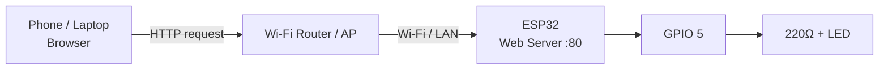
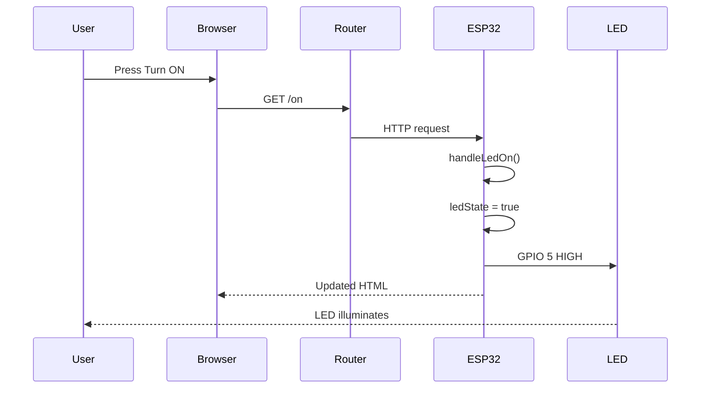

# Project 26 — ESP32 Web Server

> **Learning progression:** Wi-Fi → IP Address → HTTP → Web Server → HTML → GPIO → Physical Output

## 🎯 Project Overview

This project builds on the ESP32 Wi-Fi fundamentals from the previous project. Students will make the ESP32 **host a complete local webpage** that displays network information and controls an LED.

### Complete system

```text
Phone / Laptop
    │
    │ HTTP
    ▼
Wi-Fi Router / AP
    │
    │ Wi-Fi / LAN
    ▼
ESP32 Web Server :80
    │
  GPIO 5
    │
   220Ω
    │
   LED
```

## Learning Objectives

Students will learn to:
- Explain the client-server model.
- Understand HTTP, URLs, routes and port 80.
- Run a web server on an ESP32.
- Generate HTML from an embedded device.
- Display SSID, IP, RSSI and LED state dynamically.
- Map HTTP routes to C++ functions.
- Control GPIO hardware from browser requests.
- Use Serial Monitor for debugging.
- Troubleshoot hardware, Wi-Fi, IP and HTTP layers separately.
- Extend the system into a multi-output IoT dashboard.

## Hardware

| Component | Qty | Purpose |
|---|---:|---|
| ESP32 development board | 1 | Controller, Wi-Fi and web server |
| USB cable | 1 | Power/programming/serial |
| LED | 1 | Physical output |
| 220Ω resistor | 1 | Current limiting |
| Breadboard | 1 | Prototyping |
| Jumper wires | As required | Connections |
| Wi-Fi router/AP | 1 | Local network |
| Phone/laptop | 1 | Browser client |

## Wiring

```text
ESP32 GPIO 5
     │
    220Ω
     │
 LED Anode (+)
 LED Cathode (-)
     │
    GND
```

| ESP32 | Component | Function |
|---|---|---|
| GPIO 5 | LED through 220Ω | Digital output |
| GND | LED cathode | Ground |
| USB | ESP32 | Power/programming |

> ESP32 GPIO is generally 3.3V logic. Do not connect 5V directly to GPIO 5. Verify pin capabilities for the exact ESP32 variant.

## Network Architecture



## Client and Server

```text
Browser = Client
ESP32   = Server
```

The browser sends an HTTP request. The ESP32 processes it and sends an HTTP response.

## Routes

| Route | Handler | Result |
|---|---|---|
| `/` | `handleRoot()` | Displays webpage |
| `/on` | `handleLedOn()` | LED ON |
| `/off` | `handleLedOff()` | LED OFF |
| Other | `handleNotFound()` | 404 response |

### URL structure

```text
http://192.168.1.42/on
  │       │          │
  │       │          └── route/path
  │       └───────────── ESP32 IP
  └───────────────────── protocol
```

## HTTP Flow



## Dynamic Webpage

The ESP32 builds an HTML page containing current:
- SSID
- IP address
- RSSI
- LED status
- GPIO number

```text
ESP32 data
   ↓
HTML generation
   ↓
HTTP response
   ↓
Browser
```

This introduces dynamic web content.

## Software Architecture

```mermaid
flowchart TD
    A[Startup] --> B[Configure GPIO]
    B --> C[Start Serial]
    C --> D[Connect Wi-Fi]
    D --> E[Register /]
    E --> F[Register /on]
    F --> G[Register /off]
    G --> H[Register 404 handler]
    H --> I[Start server on port 80]
    I --> J[Main loop]
    J --> K[server.handleClient()]
    K --> J
```

## LED State

```cpp
bool ledState = false;
```

```text
false → OFF → GPIO LOW
true  → ON  → GPIO HIGH
```

When `/on` is requested:

```cpp
ledState = true;
digitalWrite(LED_PIN, HIGH);
```

When `/off` is requested:

```cpp
ledState = false;
digitalWrite(LED_PIN, LOW);
```

## Testing Procedure

1. Program the ESP32.
2. Open Serial Monitor at `115200`.
3. Wait for `Wi-Fi connected!`.
4. Record the IP address.
5. Open `http://ESP32-IP` in a browser.
6. Verify SSID, IP, RSSI, GPIO and LED state.
7. Press **Turn ON**.
8. Verify the LED turns on.
9. Press **Turn OFF**.
10. Verify the LED turns off.
11. Test an invalid path such as `/test` and observe the 404 response.

### Expected Serial output

```text
================================
      IoT Student Lab
 Project 26: ESP32 Web Server
================================

Connecting to Wi-Fi....
Wi-Fi connected!

SSID: IoT-Lab
IP Address: 192.168.1.42
RSSI: -54 dBm

Web server started.
Open: http://192.168.1.42
```

## Troubleshooting

### Webpage does not load

```text
ESP32 powered?
   ↓
Wi-Fi connected?
   ↓
Correct IP?
   ↓
Browser can reach ESP32?
   ↓
Web server started?
```

### LED does not respond

Check:
- GPIO 5 wiring
- LED polarity
- 220Ω resistor
- GND
- Serial Monitor messages
- Correct route

### IP changed

DHCP may assign a different address after reconnection. Use the current IP printed by the ESP32.

### One device works but another does not

Investigate local-network reachability, client isolation, firewall and network policy.

## Experiments

### 1. `/blink`
Add a route that blinks the LED three times.

### 2. `/status`
Return:

```text
LED: ON
```

or:

```text
LED: OFF
```

### 3. Uptime
Use `millis()` and display device uptime.

### 4. Second LED
Add another GPIO and routes such as `/led2/on` and `/led2/off`.

### 5. Dashboard
Display both outputs and network information on one webpage.

## Security

This is a simple local HTTP demonstration. It does not implement authentication, HTTPS or authorization.

Do not:
- Expose it directly to the public Internet.
- Publish real Wi-Fi passwords.
- Use it for safety-critical control.
- Connect mains equipment directly to GPIO.

## Completion Checklist

- [ ] LED wired correctly
- [ ] 220Ω resistor installed
- [ ] Wi-Fi connected
- [ ] IP obtained
- [ ] Web server started
- [ ] Browser reaches `/`
- [ ] `/on` works
- [ ] `/off` works
- [ ] 404 tested
- [ ] Serial messages observed
- [ ] One extension completed

## Key Takeaway

```text
Browser
   ↓
HTTP
   ↓
Wi-Fi / LAN
   ↓
ESP32 Web Server
   ↓
Route Handler
   ↓
GPIO
   ↓
LED
```

A network request has now been connected to a physical action—the fundamental transition from a connected microcontroller toward an IoT device.
