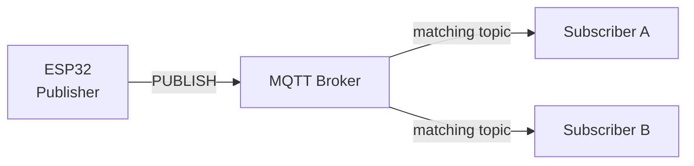
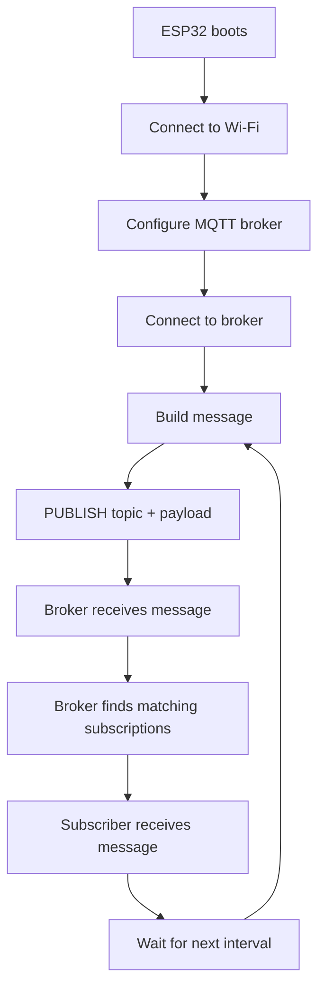
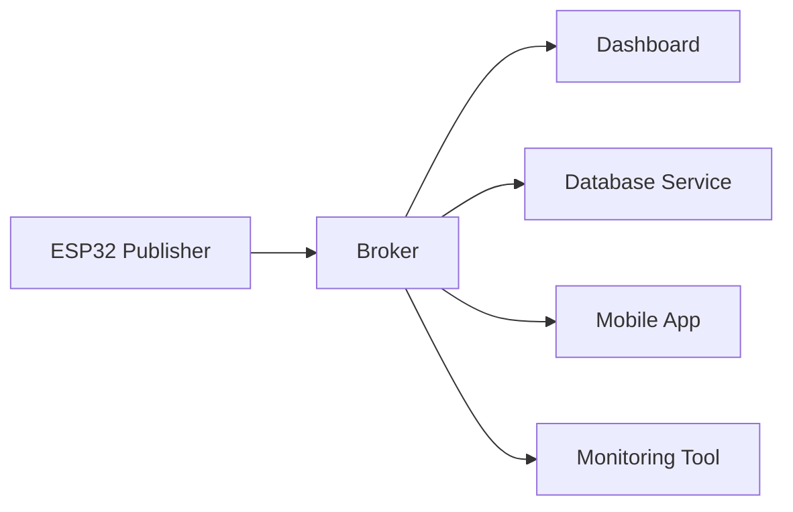
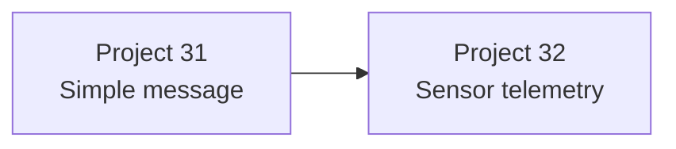

# 🧩 Project 31 — MQTT Fundamentals Circuit & Communication Diagrams

> **Important:** This is primarily a **network architecture project**, not a GPIO electronics project.

---

## 1. Physical System

```text
                ┌─────────────────────┐
                │        ESP32        │
                │                     │
                │ Wi-Fi + MQTT Client │
                └──────────┬──────────┘
                           │
                           │ Wi-Fi
                           ▼
                ┌─────────────────────┐
                │ Network / Router    │
                └──────────┬──────────┘
                           │
                           ▼
                ┌─────────────────────┐
                │    MQTT Broker      │
                │                     │
                │   Message Router    │
                └──────────┬──────────┘
                           │
                           │ MQTT
                           ▼
                ┌─────────────────────┐
                │ MQTT Subscriber     │
                │ PC / Laptop         │
                └─────────────────────┘
```

---

## 2. MQTT Architecture



### Key observation

The ESP32 does **not** need a direct connection to Subscriber A or B.

The broker handles message distribution.

---

## 3. Message Structure

```text
┌─────────────────────────────────────────────┐
│ MQTT MESSAGE                                │
├─────────────────────────────────────────────┤
│ Topic                                       │
│ iot-student-lab/project31/message           │
│                                             │
│ Payload                                     │
│ Hello from ESP32 | Message #1               │
└─────────────────────────────────────────────┘
```

---

## 4. Complete Data Flow



---

## 5. Timing Flow

```mermaid
flowchart TD
    A[loop()]
    B[mqttClient.loop()]
    C[Read millis()]
    D{Interval reached?}
    E[Publish]
    F[Continue loop]

    A --> B --> C --> D
    D -- No --> F
    D -- Yes --> E --> F
    F --> A
```

---

## 6. Client Roles

```text
                   MQTT SYSTEM

        ┌────────────────────────────┐
        │       MQTT Broker          │
        └─────────────┬──────────────┘
                      │
        ┌─────────────┴──────────────┐
        │                            │
   Publisher                    Subscriber
     ESP32                     PC / Laptop
```

An MQTT client can perform different roles depending on the application.

---

## 7. Multiple Subscribers



This is a simplified representation of how a single published message can become useful to multiple applications.

---

## 8. Topic Namespace

```text
iot-student-lab/
└── project31/
    ├── message
    └── status
```

A larger system could evolve toward:

```text
iot-student-lab/
├── device01/
│   ├── status
│   ├── temperature
│   └── humidity
├── device02/
│   ├── status
│   ├── temperature
│   └── humidity
└── device03/
    ├── status
    ├── temperature
    └── humidity
```

This demonstrates why topic naming should be planned rather than improvised.

---

## 9. Project 31 → Project 32



### Project 31

```text
ESP32
  ↓
"Hello from ESP32"
  ↓
MQTT Broker
  ↓
Subscriber
```

### Project 32

```text
DHT22
  ↓
Temperature / Humidity
  ↓
ESP32
  ↓
MQTT Broker
  ↓
Subscriber
```

The communication layer remains the foundation.
