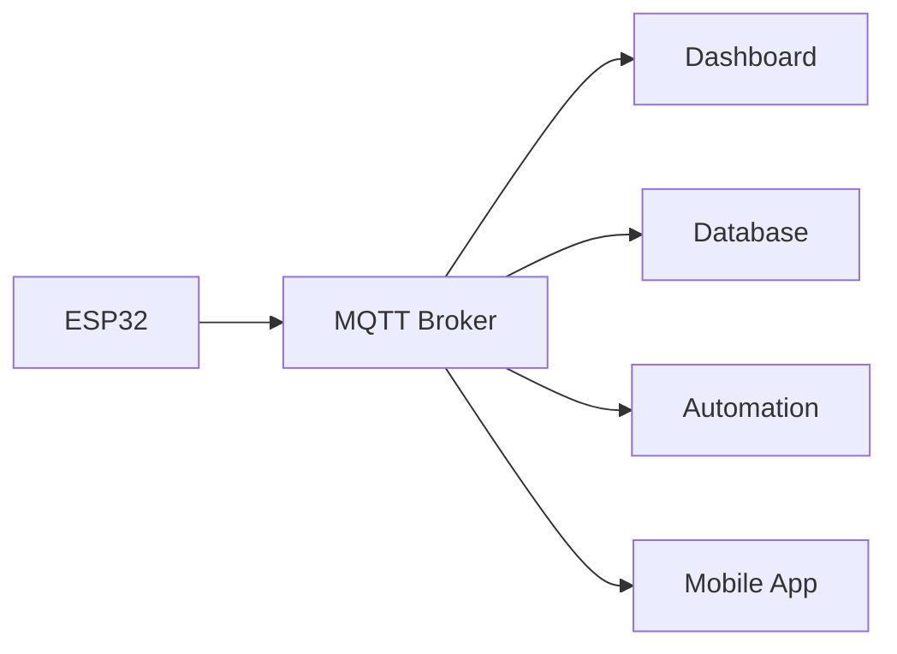
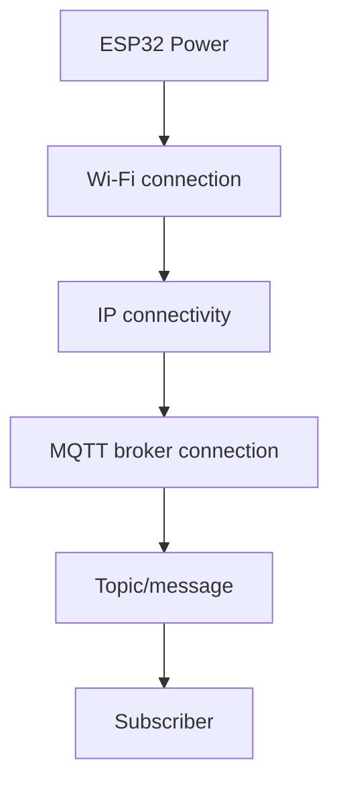
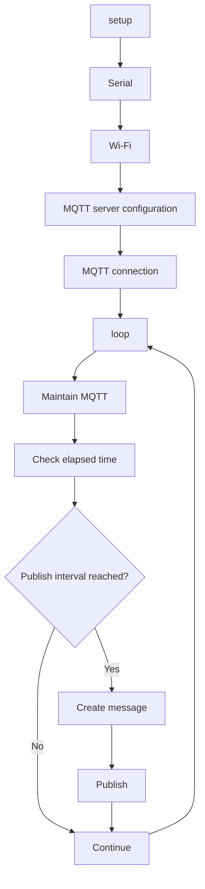
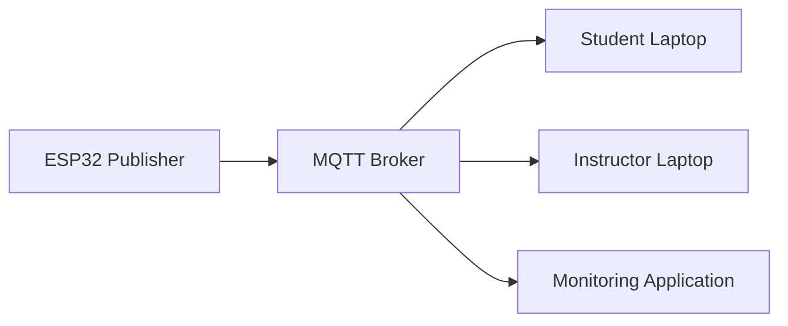
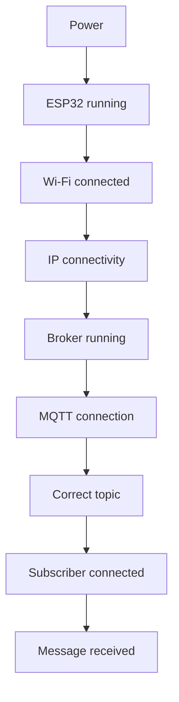

# 📘 Project 31 — MQTT Fundamentals — Detailed Learning Notes

> **Level 5 Foundation Chapter**
>
> **Main idea:** Move from device-centric communication to message-centric IoT architecture.

---

# 1. Why MQTT Matters in IoT

In earlier projects, the ESP32 directly controlled a physical output or served a web page.

Examples:

```text
ESP32 → LED
ESP32 → Relay
Browser → ESP32 → GPIO
```

These architectures are useful, but larger IoT systems require devices to exchange information with many different applications.

MQTT introduces a messaging layer:

```text
Publisher → Broker → Subscriber
```

The broker becomes a central communication point.

This allows an ESP32 to publish information without needing to know whether the information will eventually be displayed by a dashboard, stored in a database, processed by an automation service, or consumed by another device.

That separation is a major systems-engineering concept.

---

# 2. What Are We Actually Building?

The project contains four logical stages:

```text
┌───────────────┐
│     ESP32     │
│   Publisher   │
└───────┬───────┘
        │
        │ Wi-Fi
        ▼
┌───────────────┐
│ MQTT Broker   │
│ Message Hub   │
└───────┬───────┘
        │
        │ MQTT
        ▼
┌───────────────┐
│  Subscriber   │
│ PC / Laptop   │
└───────────────┘
```

The ESP32 repeatedly publishes:

```text
Hello from ESP32 | Message #1
Hello from ESP32 | Message #2
Hello from ESP32 | Message #3
```

The messages are associated with:

```text
iot-student-lab/project31/message
```

The subscriber listens to that topic.

---

# 3. MQTT Mental Model

A useful classroom analogy is a postal sorting system.

### Direct communication

Imagine a person wants to send a letter directly to another person:

```text
Sender ───────────────► Receiver
```

The sender needs to know the receiver.

### MQTT-style communication

Now imagine:

```text
Sender → Postal system → Interested recipients
```

The sender places information into the system according to a routing/category mechanism.

In MQTT:

```text
Publisher → Broker → Subscribers
```

The **topic** helps determine which subscribers should receive the message.

> 💡 Do not think of MQTT as "ESP32 sends data to laptop." Think of it as "an MQTT client publishes data into a messaging system."

---

# 4. MQTT Client

A **client** is any device or software application that connects to an MQTT broker.

Examples include:

- ESP32
- Raspberry Pi
- Laptop
- Server
- Industrial controller
- Cloud service
- Dashboard application
- Mobile application

A client may publish, subscribe, or perform both roles.

In this project:

```text
ESP32 = MQTT client
PC     = MQTT client
```

Their roles differ:

```text
ESP32 → Publisher
PC    → Subscriber
```

---

# 5. MQTT Broker

The **broker** is the central message-routing component.

It accepts MQTT connections and handles message distribution.

Conceptually:

```text
             ┌─────────────────┐
             │  MQTT Broker    │
             │                 │
Publisher ──►│ Message Router  │──► Subscriber
             └─────────────────┘
```

The broker helps decouple publishers and subscribers.

### Why is this useful?

Suppose an ESP32 publishes temperature information.

It does not need to know that:

- a dashboard wants the temperature;
- a database wants to store it;
- an alert service wants to analyse it;
- a mobile app wants to display it.

All of these can subscribe to the appropriate topic.

---

# 6. Publisher

A **publisher** sends a message to an MQTT topic.

In this project:

```text
ESP32 = Publisher
```

The code uses:

```cpp
mqttClient.publish(
  MQTT_TOPIC,
  message.c_str()
);
```

Conceptually:

```text
ESP32
  │
  │ PUBLISH
  ▼
Broker
```

The ESP32 provides two important pieces of application information:

```text
Topic + Payload
```

---

# 7. Subscriber

A **subscriber** receives messages associated with topics to which it has subscribed.

For example:

```text
Subscribe:
iot-student-lab/project31/message
```

When the ESP32 publishes:

```text
Topic:
iot-student-lab/project31/message

Payload:
Hello from ESP32 | Message #1
```

the broker can deliver the message to the subscriber.

---

# 8. Topic

A topic is a logical addressing mechanism used by MQTT.

The project uses:

```text
iot-student-lab/project31/message
```

Break it down:

```text
iot-student-lab
      │
      └── Project namespace
              │
              └── project31
                       │
                       └── message
```

A topic is **not the payload**.

It tells the MQTT system how the message is classified/routed.

---

# 9. Payload

The payload is the actual application data.

Example:

```text
Hello from ESP32 | Message #1
```

A payload can be simple text:

```text
online
```

or structured data:

```json
{
  "device": "esp32-31",
  "status": "online"
}
```

Later, sensor telemetry might look like:

```json
{
  "temperature": 25.6,
  "humidity": 61
}
```

This is why MQTT is so useful for IoT: the transport mechanism does not have to change every time the application data changes.

---

# 10. Topic vs Payload

| Concept | Question it answers |
|---|---|
| Topic | **Where/category should this message be routed?** |
| Payload | **What information is being sent?** |

Example:

```text
Topic:
iot-student-lab/project31/temperature

Payload:
25.6
```

Or:

```text
Topic:
iot-student-lab/project31/status

Payload:
online
```

Keeping these concepts separate is essential.

---

# 11. Publish/Subscribe vs Direct Communication

### Direct

```text
ESP32 ─────────► Application
```

The ESP32 is tightly connected to that application.

### Publish/subscribe

```text
ESP32 ─────► Broker ─────► Application
```

Now the ESP32 only needs to know how to publish to the broker.

Additional consumers can be added:



This introduces the idea of **loose coupling**.

---

# 12. Loose Coupling

Loose coupling means components do not need extensive knowledge of each other.

In this project:

```text
ESP32
  │
  │ knows:
  │ broker + topic
  ▼
MQTT Broker
  │
  │ knows:
  │ subscriptions
  ▼
Subscriber
```

The ESP32 does not need the subscriber's IP address or application implementation.

This becomes valuable as the number of devices increases.

---

# 13. Wi‑Fi and MQTT Are Different Layers

A common beginner mistake is to treat "Wi‑Fi connected" as equivalent to "MQTT connected."

They are different.

### Layer 1 — Network connection

```text
ESP32 → Wi‑Fi → IP network
```

### Layer 2 — MQTT session

```text
ESP32 → MQTT CONNECT → Broker
```

### Layer 3 — Application messaging

```text
ESP32 → PUBLISH → Topic → Broker → Subscriber
```

Therefore:



When debugging, identify the highest layer that has been successfully verified.

---

# 14. Wi‑Fi Connection Function

The project contains:

```cpp
void connectToWiFi()
```

Its responsibility is to:

1. Put the ESP32 into station mode.
2. Start the Wi‑Fi connection.
3. Wait for a successful connection.
4. Display the IP address.
5. Display signal strength.

The key calls are:

```cpp
WiFi.mode(WIFI_STA);
WiFi.begin(WIFI_SSID, WIFI_PASSWORD);
```

The program waits while:

```cpp
WiFi.status() != WL_CONNECTED
```

After connection:

```cpp
WiFi.localIP()
```

provides the local IP address.

`WiFi.RSSI()` reports a received-signal-strength value.

---

# 15. Why the IP Address Matters

The broker is a network service.

The ESP32 therefore needs a network route to the broker.

If a broker is running on a laptop at an address such as:

```text
192.168.1.100
```

the ESP32 needs to be able to reach that address.

The exact address is environment-dependent.

> ⚠️ Never assume that an example IP address is your actual broker address.

---

# 16. MQTT Client Object

The sketch creates:

```cpp
WiFiClient espClient;
PubSubClient mqttClient(espClient);
```

Conceptually:

```text
ESP32
 │
 ├── WiFiClient
 │
 └── PubSubClient
          │
          └── MQTT communication
```

The MQTT client uses the network connection supplied by `WiFiClient`.

This is an important software architecture pattern:

```text
Application protocol
        ↓
Network abstraction
        ↓
Hardware/network interface
```

---

# 17. MQTT Broker Configuration

The sketch contains:

```cpp
mqttClient.setServer(
  MQTT_BROKER,
  MQTT_PORT
);
```

This tells the MQTT client where the broker is located.

The common non-TLS MQTT port used in this introductory project is:

```text
1883
```

Students should understand that a port number identifies a network service endpoint. It does not itself guarantee that the service is secure.

---

# 18. MQTT Client ID

The project uses:

```cpp
const char* MQTT_CLIENT_ID = "iot-student-esp32-31";
```

The client ID identifies the MQTT client within the broker session.

In a multi-device deployment, client IDs should be managed so that devices do not unintentionally use the same identity.

For example:

```text
iot-student-esp32-01
iot-student-esp32-02
iot-student-esp32-03
```

This becomes increasingly important in larger systems.

---

# 19. Connecting to MQTT

The function:

```cpp
void connectToMQTT()
```

attempts to establish the MQTT connection.

The conceptual sequence is:

```text
ESP32
  │
  │ MQTT CONNECT
  ▼
Broker
  │
  │ accept / reject
  ▼
ESP32
```

If the connection fails, the program reports the MQTT client's state value and retries after a delay.

This introduces a fundamental reliability concept:

> Network communication can fail, so IoT software needs connection handling.

---

# 20. Why Connection Handling Matters

A classroom demo may run continuously for several minutes.

A real IoT device may need to run for:

- days,
- months,
- or years.

Networks can experience:

- temporary signal loss,
- router restarts,
- broker restarts,
- DHCP changes,
- power interruptions,
- firewall changes.

Therefore, robust IoT software should not assume that communication is permanently available.

---

# 21. Publishing a Message

The function:

```cpp
void publishMessage()
```

creates a message:

```text
Hello from ESP32 | Message #N
```

The counter is increased:

```cpp
messageNumber++;
```

Then the message is published:

```cpp
mqttClient.publish(
  MQTT_TOPIC,
  message.c_str()
);
```

The return value is checked.

Conceptually:

```text
Create payload
     ↓
Select topic
     ↓
PUBLISH
     ↓
Check success
     ↓
Log result
```

---

# 22. Why Use a Message Counter?

The counter is not necessary for MQTT itself.

It is included because it gives students a visible way to observe message progression:

```text
#1
#2
#3
#4
```

This helps answer:

- Is the publisher still running?
- Is the message rate correct?
- Are messages being skipped?
- Did the connection restart?
- Is the subscriber receiving new messages?

This is a simple example of **observability**.

---

# 23. `millis()` and Periodic Publishing

The project defines:

```cpp
const unsigned long PUBLISH_INTERVAL = 5000;
```

and:

```cpp
unsigned long lastPublishTime = 0;
```

The loop obtains:

```cpp
unsigned long currentTime = millis();
```

Then checks:

```text
currentTime - lastPublishTime >= PUBLISH_INTERVAL
```

If true:

```text
Publish
Update lastPublishTime
```

### Timeline

```text
0s      5s      10s      15s      20s
│-------│-------│--------│--------│
        ↑       ↑        ↑        ↑
      msg #1  msg #2   msg #3   msg #4
```

---

# 24. Why Not Use a Long `delay()`?

A long blocking delay can make an application less responsive.

The project instead uses elapsed-time logic.

Conceptually:

```text
loop()
 ├── service MQTT
 ├── check time
 ├── publish if needed
 └── repeat
```

This pattern scales better when future projects need to perform multiple tasks.

For example:

```text
loop()
 ├── MQTT service
 ├── read sensor
 ├── check alarm
 ├── update display
 └── publish telemetry
```

---

# 25. `mqttClient.loop()` vs `millis()`

These solve different problems.

| Function/concept | Purpose |
|---|---|
| `mqttClient.loop()` | Services MQTT communication |
| `millis()` | Measures elapsed time |
| `publish()` | Sends MQTT application data |
| `delay()` | Blocks execution for a period |

Students should not treat them as interchangeable.

---

# 26. Main Program Flow



---

# 27. Subscriber Concept

The subscriber does not need to know how the ESP32 generated the message.

It only needs:

```text
Broker address
Broker port
Topic
```

This is a powerful separation of responsibilities.

```text
Publisher responsibility:
Generate and publish data

Broker responsibility:
Route messages

Subscriber responsibility:
Consume data
```

---

# 28. Multiple Subscribers

Suppose three applications subscribe to:

```text
iot-student-lab/project31/message
```

The architecture can be:



The publisher does not have to implement three separate communication channels.

---

# 29. Topic Naming as System Design

A topic name may look trivial, but topic organisation becomes important when systems grow.

Current topic:

```text
iot-student-lab/project31/message
```

A more structured deployment might use:

```text
iot-student-lab/device01/temperature
iot-student-lab/device01/humidity
iot-student-lab/device01/status
```

Another device:

```text
iot-student-lab/device02/temperature
iot-student-lab/device02/humidity
iot-student-lab/device02/status
```

Students should think about:

- device identity,
- data type,
- command vs telemetry,
- location,
- environment,
- future expansion.

---

# 30. Message Flow Experiment

Use two subscribers.

```text
                         ┌──► Subscriber A
                         │
ESP32 ─────► Broker ─────┼──► Subscriber B
                         │
                         └──► Subscriber C
```

### Questions

1. Does the ESP32 need to know the number of subscribers?
2. Does the publisher send one network request to each subscriber?
3. What component is responsible for distributing the message?
4. What happens if a subscriber disconnects?

These questions move students from code-level thinking toward architecture-level thinking.

---

# 31. Experiment — Change the Publishing Rate

Change:

```cpp
const unsigned long PUBLISH_INTERVAL = 5000;
```

to approximately:

```text
1000 ms
```

Then:

```text
10000 ms
```

### Observation

| Interval | Expected relative rate |
|---:|---|
| 1 s | High |
| 5 s | Medium |
| 10 s | Low |

### Engineering question

Is publishing as fast as possible always better?

No.

More frequent publishing can increase:

- network traffic,
- broker workload,
- device processing,
- storage volume downstream,
- power consumption in battery systems.

The appropriate frequency depends on the application.

---

# 32. Experiment — Topic Mismatch

Publisher:

```text
iot-student-lab/project31/test
```

Subscriber:

```text
iot-student-lab/project31/message
```

The subscriber should not receive publications intended for the different topic.

### Learning point

MQTT topic names form part of the communication contract.

A technically healthy network can still appear "broken" if the publisher and subscriber disagree about topic naming.

---

# 33. Experiment — Structured Payload

Replace the simple payload with:

```json
{
  "device": "esp32-31",
  "status": "online"
}
```

Then consider:

```json
{
  "device": "esp32-31",
  "temperature": 25.6,
  "humidity": 61
}
```

Students should recognise that the MQTT layer is carrying application data; the application decides how that data is structured.

---

# 34. Experiment — Status Topic

Publish:

```text
online
```

to:

```text
iot-student-lab/project31/status
```

Now the project has two logical channels:

```text
project31/
├── message
└── status
```

This is the first step toward a real device topic namespace.

---

# 35. Challenge — Device Identity

Imagine a laboratory with 20 ESP32 boards.

Design a topic structure.

One possible conceptual design:

```text
iot-student-lab/
└── device-id/
    ├── status
    ├── temperature
    └── humidity
```

For example:

```text
iot-student-lab/device07/status
iot-student-lab/device07/temperature
iot-student-lab/device07/humidity
```

### Design question

Would it be better to put the device ID in the topic or only inside the payload?

There is no universal answer without considering the complete system. Students should compare both approaches and think about routing, subscriptions, readability, and data processing.

---

# 36. Fault Isolation Method

When the subscriber sees nothing, do not immediately rewrite the MQTT code.

Use this sequence:



At each stage ask:

> **What evidence proves this layer works?**

This is a transferable engineering debugging technique.

---

# 37. Fault Scenarios

## Scenario A — Wi‑Fi fails

Likely causes:

- incorrect SSID,
- incorrect password,
- unavailable network,
- unsuitable network configuration,
- weak signal,
- ESP32 power problem.

First prove Wi‑Fi connectivity.

---

## Scenario B — Wi‑Fi works, MQTT fails

Now the problem is likely above the Wi‑Fi layer.

Inspect:

- broker address,
- broker port,
- broker process,
- routing,
- firewall,
- broker access configuration.

---

## Scenario C — MQTT connects, subscriber sees nothing

Inspect:

- exact topic,
- subscriber connection,
- subscriber subscription,
- broker logs if available,
- whether the ESP32 reports successful publishing.

---

# 38. Observability

The project prints useful information to Serial Monitor:

```text
IP Address
RSSI
Broker
Topic
Publish status
Message number
```

This is not just for beginners.

Production systems also need observability.

Common observability signals include:

- logs,
- metrics,
- timestamps,
- connection state,
- error codes,
- message counts,
- health status.

The message counter in this project is a very simple example.

---

# 39. Why MQTT Is Suitable for IoT

MQTT's publish/subscribe model is useful when:

- many devices communicate,
- devices are distributed,
- applications need shared telemetry,
- publishers should not depend directly on consumers,
- bandwidth should be managed carefully,
- a central broker can coordinate messaging.

However, MQTT is not automatically the right protocol for every application.

Protocol selection depends on requirements such as:

- latency,
- reliability,
- bandwidth,
- device constraints,
- security,
- topology,
- interoperability,
- application semantics.

---

# 40. Security Awareness

This introductory project uses:

```text
MQTT port: 1883
```

Students should understand that a protocol demonstration is not the same as a production security architecture.

A production IoT system may require:

```text
Client authentication
        +
Authorization
        +
Encrypted transport
        +
Credential management
        +
Network segmentation
        +
Monitoring
```

### Important classroom rule

Do not expose an unauthenticated, unencrypted MQTT service directly to the public Internet.

Do not commit:

- Wi‑Fi passwords,
- broker passwords,
- private certificates,
- tokens,
- API keys

to a public repository.

---

# 41. Production vs Classroom Design

| Classroom Project | Production Direction |
|---|---|
| Simple broker | Hardened broker |
| Port 1883 example | Encrypted transport where appropriate |
| Placeholder credentials | Managed secrets |
| Local network | Segmented architecture |
| Plain text payload | Defined data schema |
| Basic reconnect | Robust connection strategy |
| Serial logs | Centralised observability |
| One device | Fleet management |

This comparison helps students understand that a prototype is the beginning of engineering, not the final production architecture.

---

# 42. Open-Loop Communication

Project 31 is primarily a one-way telemetry demonstration:

```text
ESP32
  ↓
Broker
  ↓
Subscriber
```

The subscriber does not yet send commands back.

This is useful because it isolates one direction of communication.

Later systems can introduce:

```text
Command topic
        ↓
Subscriber / controller
        ↓
Broker
        ↓
ESP32
```

This becomes a two-way IoT system.

---

# 43. Project 31 as a Foundation

The important progression is:

```text
Project 31
MQTT message
     ↓
Project 32
Sensor telemetry
     ↓
Future
Commands
     ↓
Future
Automation
     ↓
Future
Cloud / database
     ↓
Future
Production IoT
```

The communication foundation remains reusable.

---

# 44. Mini Design Exercise

Design an IoT room monitoring system.

Requirements:

- temperature,
- humidity,
- motion,
- device status.

Propose topics.

One possible structure:

```text
room01/
├── temperature
├── humidity
├── motion
└── status
```

Now imagine 50 rooms.

How would you extend the namespace?

```text
building01/
├── room01/
├── room02/
└── room03/
```

Students should consider hierarchy and future subscription requirements.

---

# 45. Knowledge Check

### Basic

1. What does MQTT stand for?
2. What is an MQTT client?
3. What is a broker?
4. What is a publisher?
5. What is a subscriber?
6. What is a topic?
7. What is a payload?

### Intermediate

8. Why does the ESP32 not need the subscriber's IP address?
9. Why can multiple subscribers receive the same publication?
10. Why are Wi‑Fi and MQTT debugging separate?
11. Why is `mqttClient.loop()` called repeatedly?
12. Why is elapsed-time logic useful for periodic publishing?

### Advanced

13. What is loose coupling?
14. Why does topic namespace design matter?
15. What problems could occur if multiple devices use the same client ID?
16. What changes when one MQTT topic has hundreds of subscribers?
17. Why is a local classroom broker configuration not automatically suitable for production?
18. How could the project become a two-way command system?

---

# 46. Instructor Discussion Prompts

Use these to turn the project into a classroom discussion rather than only a coding exercise.

### Prompt 1

> If the ESP32 publishes temperature every 5 seconds, why should the ESP32 care whether a dashboard exists?

Expected direction:

The publisher can remain decoupled from the consumer.

### Prompt 2

> What happens if the dashboard is replaced by a database?

The ESP32 can continue publishing if the topic and broker arrangement remain compatible.

### Prompt 3

> What happens if 10 dashboards subscribe?

The broker handles message distribution rather than requiring the ESP32 to maintain 10 direct application connections.

### Prompt 4

> Is MQTT itself "the Internet"?

No. MQTT is an application-layer messaging protocol operating over a network connection.

---

# 47. Student Reflection

Complete these statements:

```text
Before this project, I thought IoT communication was...
__________________________________________________

Now I understand MQTT as...
__________________________________________________

The difference between a topic and payload is...
__________________________________________________

The broker's role is...
__________________________________________________

The hardest debugging layer was...
__________________________________________________

One real-world application of MQTT is...
__________________________________________________

One improvement I would make to this project is...
__________________________________________________
```

---

# 48. Final Engineering Challenge

## 🏠 Design a Small MQTT-Based Smart Room

Without implementing all of it yet, design the architecture for:

- ESP32
- temperature sensor
- humidity sensor
- motion sensor
- light control
- MQTT broker
- dashboard

Draw:

```text
Sensors
   ↓
ESP32
   ↓
MQTT
   ↓
Broker
   ↓
Dashboard
```

Then add the reverse control path:

```text
Dashboard
   ↓
Command topic
   ↓
Broker
   ↓
ESP32
   ↓
Actuator
```

### Required student output

1. Topic namespace.
2. Device ID scheme.
3. Telemetry topics.
4. Command topics.
5. Example payloads.
6. Failure scenarios.
7. Security considerations.
8. Diagram of the architecture.

---

# 49. Project Completion Standard

A student has genuinely completed Project 31 when they can do more than make the serial monitor display "connected."

They should be able to explain:

```text
WHO?
ESP32 = Publisher

WHERE?
MQTT Topic

WHAT?
Payload

WHO ROUTES?
Broker

WHO RECEIVES?
Subscriber

HOW?
Publish / Subscribe

OVER WHAT NETWORK?
Wi-Fi / IP

HOW OFTEN?
Configured interval

HOW DO WE DEBUG?
Layer by layer
```

---

# 50. Final Summary

Project 31 establishes the conceptual bridge from **embedded programming** to **distributed IoT systems**.

The core architecture is:

```text
┌────────────┐
│   ESP32    │
│ Publisher  │
└─────┬──────┘
      │
      │ MQTT PUBLISH
      ▼
┌────────────┐
│   Broker   │
│   Router   │
└─────┬──────┘
      │
      │ Topic match
      ▼
┌────────────┐
│ Subscriber │
└────────────┘
```

The most important lesson is not the `publish()` function itself.

It is the architectural idea:

> **A device can publish information into a messaging system without being tightly coupled to the applications that consume that information.**

That idea is the foundation for the next stages of Advanced IoT.

---

# 🔭 Next Step — Project 32

Project 31 carries a synthetic message:

```text
Hello from ESP32
```

The next project can replace the synthetic payload with actual telemetry:

```text
DHT22
  ↓
Temperature + Humidity
  ↓
ESP32
  ↓
MQTT
  ↓
Broker
  ↓
Subscriber
```

This is where MQTT begins to become a practical IoT telemetry system.
