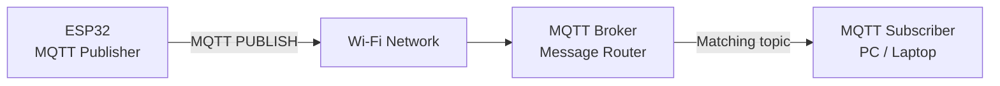
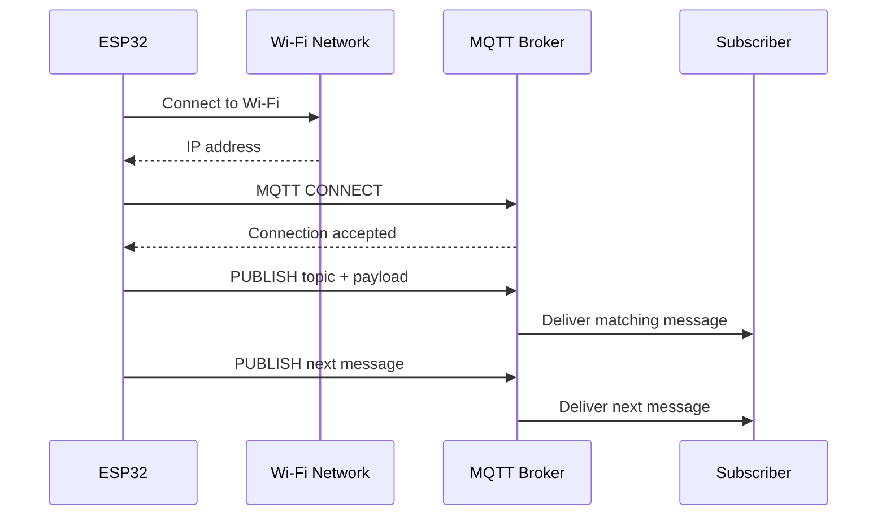
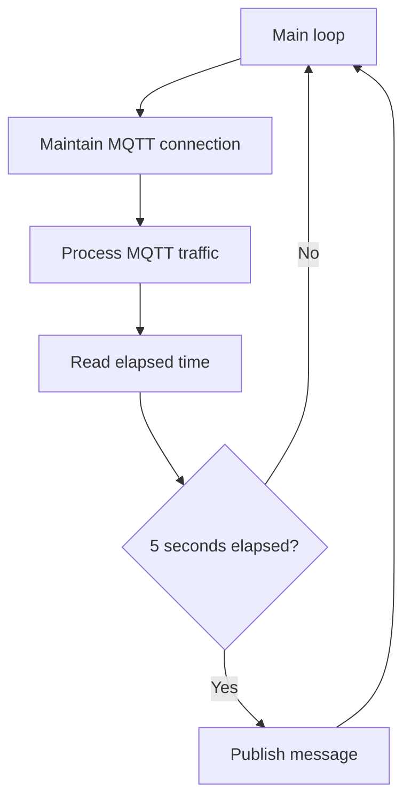
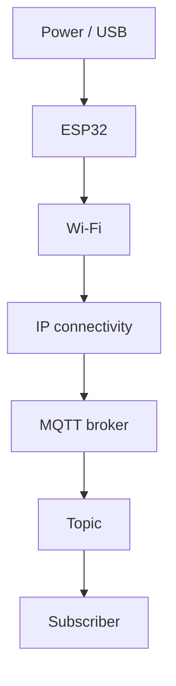
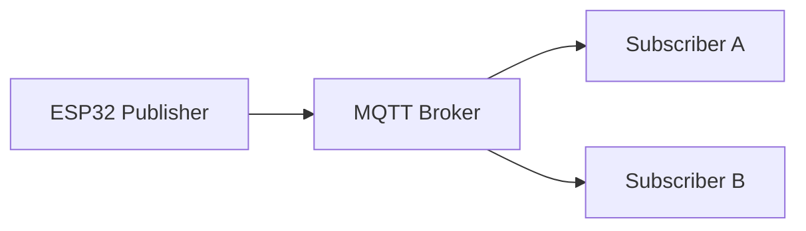
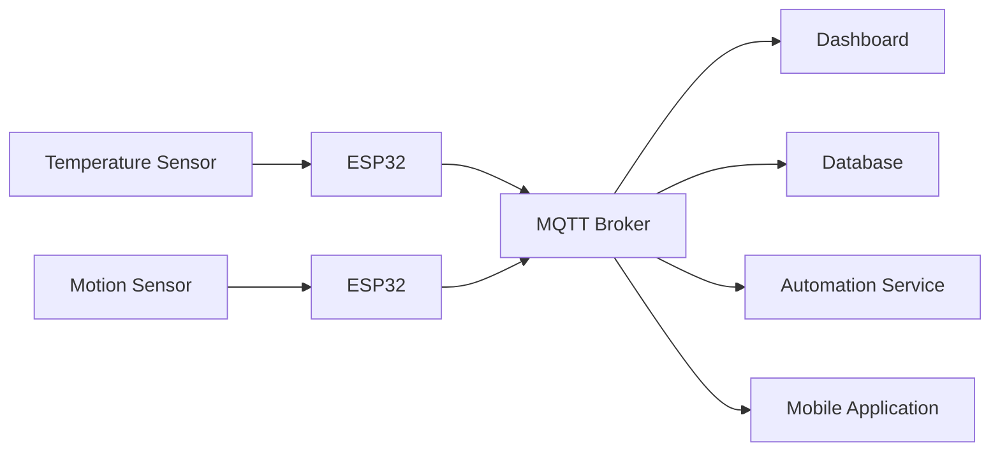

# 📡 Project 31 — MQTT Fundamentals

> **Level 5 · Advanced IoT Communication**
>
> **ESP32 → Wi‑Fi → MQTT Broker → Subscriber**

---

## 🧭 Project Overview

**MQTT (Message Queuing Telemetry Transport)** is one of the most important communication protocols used in IoT systems. It is designed around a **publish/subscribe** model rather than direct device-to-device communication.

In this project, the ESP32 becomes an **MQTT publisher**. It connects to Wi‑Fi, establishes a connection with an MQTT broker, and periodically publishes a simple text message to a topic. A computer or laptop acts as an **MQTT subscriber** and receives those messages.

The project intentionally contains **no sensor, actuator, relay, or dashboard**. The purpose is to isolate the communication layer so that students understand MQTT before real telemetry and control systems are introduced.

### 🎯 Core learning model

```text
┌──────────────┐
│    ESP32     │
│  Publisher   │
└──────┬───────┘
       │
       │ Wi‑Fi
       ▼
┌──────────────┐
│    Network   │
└──────┬───────┘
       │
       │ MQTT
       ▼
┌──────────────┐
│ MQTT Broker  │
│ Message Hub  │
└──────┬───────┘
       │
       │ Topic match
       ▼
┌──────────────┐
│  Subscriber  │
│ PC / Laptop  │
└──────────────┘
```

> 💡 **Key idea:** The publisher does not need to know who the subscribers are. It publishes to a **topic**, and the broker distributes matching messages to interested clients.

---

## 🏁 Learning Objectives

By the end of this project, students should be able to:

- Explain why MQTT is useful in IoT.
- Distinguish between a **client**, **publisher**, **subscriber**, and **broker**.
- Explain the difference between a **topic** and a **payload**.
- Describe the MQTT publish/subscribe communication model.
- Connect an ESP32 to a Wi‑Fi network.
- Configure an MQTT broker address and port.
- Publish a message from an ESP32.
- Subscribe to an MQTT topic using a second client.
- Understand the purpose of `mqttClient.loop()`.
- Understand why periodic publishing can use `millis()`.
- Diagnose failures layer-by-layer.
- Design meaningful MQTT topic names.
- Explain how the same architecture can later carry sensor data.

---

## 🧠 What Makes This a Level 5 Project?

Earlier projects focused on:

```text
Sensor → ESP32 → Decision → Actuator
```

or:

```text
Browser → Wi‑Fi → ESP32 → GPIO
```

This project introduces a different communication abstraction:

```text
Publisher → Broker → Subscriber
```

That change is significant.

The ESP32 is no longer communicating directly with a particular application. Instead, it sends information to a **messaging infrastructure**.

This architecture becomes useful when many devices, applications, dashboards, gateways, and services need to exchange information.

---

## 🏗️ System Architecture



### Communication sequence



---

# 🔩 Hardware

This is a communication-focused project.

| Component | Qty | Purpose |
|---|---:|---|
| ESP32 development board | 1 | IoT client and MQTT publisher |
| USB cable | 1 | Power and programming |
| Computer/laptop | 1 | Subscriber and development system |
| Wi‑Fi network | 1 | IP connectivity |
| MQTT broker | 1 | Message routing |

### 🔌 External GPIO circuit

**None is required.**

The ESP32 uses its built-in Wi‑Fi hardware. This is intentional: students should concentrate on the communication protocol rather than electronics wiring.

---

# 🧩 Software Requirements

### Arduino libraries

| Library | Purpose |
|---|---|
| `WiFi.h` | ESP32 Wi‑Fi connectivity |
| `PubSubClient` | MQTT client implementation |

The project uses:

```cpp
#include <WiFi.h>
#include <PubSubClient.h>
```

`WiFi.h` is provided by the ESP32 Arduino platform. `PubSubClient` must be installed in the Arduino environment.

---

# 🌐 Network Requirements

For a local-broker classroom setup, the ESP32 and the computer running the broker need to be able to reach each other.

```text
              Wi-Fi Router
             /            \
            /              \
       ESP32              Laptop
     Publisher          MQTT Broker
                            │
                            ▼
                       Subscriber
```

> ⚠️ A successful Wi‑Fi connection does **not** automatically mean the MQTT broker is reachable. These are separate layers that must both work.

---

# ⚙️ Configuration

The sketch contains placeholders:

```cpp
const char* WIFI_SSID = "YOUR_WIFI_NAME";
const char* WIFI_PASSWORD = "YOUR_WIFI_PASSWORD";

const char* MQTT_BROKER = "YOUR_MQTT_BROKER";
const int MQTT_PORT = 1883;
```

For an actual classroom test, replace the placeholders locally with the appropriate values.

### 🔐 Credential rule

**Never commit real Wi‑Fi passwords, private broker credentials, API keys, or other secrets to GitHub.**

A good project repository contains configuration placeholders, not private credentials.

---

# 📬 MQTT Vocabulary

Understanding the vocabulary is more important than memorising code.

| Term | Meaning |
|---|---|
| **Client** | Any application/device connected to the MQTT broker |
| **Publisher** | A client that sends messages |
| **Subscriber** | A client that receives messages from subscribed topics |
| **Broker** | Central MQTT message-routing service |
| **Topic** | Named logical channel used to classify messages |
| **Payload** | Actual content carried by a message |
| **Publish** | MQTT operation used to send a message |
| **Subscribe** | MQTT operation used to request messages for a topic |

### Roles in this project

```text
ESP32      = Client + Publisher
MQTT       = Broker
PC/Laptop  = Client + Subscriber
```

---

# 🏷️ Topic and Payload

The project publishes to:

```text
iot-student-lab/project31/message
```

An example payload is:

```text
Hello from ESP32 | Message #1
```

Think of a message as:

```text
┌──────────────────────────────────────────────┐
│ MQTT MESSAGE                                 │
├──────────────────────────────────────────────┤
│ Topic:   iot-student-lab/project31/message   │
│ Payload: Hello from ESP32 | Message #1       │
└──────────────────────────────────────────────┘
```

### Why separate topic and payload?

The **topic tells the broker where the message belongs**.

The **payload contains the information itself**.

Later, the payload can contain:

```json
{
  "temperature": 25.6,
  "humidity": 61
}
```

The communication architecture remains the same.

---

# 🔄 Publish / Subscribe Model

Traditional direct communication can look like:

```text
Device A ───────────────► Application B
```

MQTT introduces an intermediary:

```text
Device A ─────► Broker ─────► Application B
```

With multiple subscribers:

```text
                         ┌──► Dashboard
                         │
ESP32 ─────► Broker ─────┼──► Database
                         │
                         └──► Mobile App
```

This decoupling is one reason publish/subscribe is useful in IoT.

---

# 🧪 Expected Behaviour

After startup:

1. ESP32 initializes serial communication.
2. ESP32 connects to Wi‑Fi.
3. ESP32 obtains an IP address.
4. MQTT client is configured.
5. ESP32 connects to the broker.
6. ESP32 publishes a message approximately every 5 seconds.
7. The subscriber receives messages from the matching topic.

Typical serial output:

```text
========================================
       IoT Student Lab
       Project 31: MQTT Fundamentals
========================================

Wi-Fi connected.
IP Address: ...
RSSI: ... dBm

Connecting to MQTT broker...connected.
Broker: ...
Topic: iot-student-lab/project31/message

Published → iot-student-lab/project31/message :
Hello from ESP32 | Message #1
```

---

# 🧮 Timing Model

The project uses:

```cpp
const unsigned long PUBLISH_INTERVAL = 5000;
```

This represents approximately **5 seconds**.

The program compares elapsed time using:

```cpp
millis()
```

Conceptually:



This approach is more scalable than blocking the entire application for every publishing interval.

---

# 🧠 Why `mqttClient.loop()` Matters

The MQTT client needs regular processing.

The sketch therefore calls:

```cpp
mqttClient.loop();
```

inside the main `loop()`.

This allows the MQTT library to maintain communication and process MQTT traffic.

A useful mental model is:

```text
setup()
  ↓
Establish communication
  ↓
loop()
  ├── maintain MQTT connection
  ├── process MQTT traffic
  ├── check timer
  └── publish when required
```

---

# 🧪 Testing Procedure

## Test 1 — ESP32 Wi‑Fi

**Goal:** Verify network connectivity before debugging MQTT.

Check:

- ESP32 powers correctly.
- Correct Wi‑Fi credentials are used.
- Serial Monitor is set to `115200`.
- `Wi-Fi connected.` appears.
- An IP address is displayed.

---

## Test 2 — MQTT Broker

**Goal:** Verify that the broker is available.

Check:

- Broker is running.
- Broker address is correct.
- Port is correct.
- Network path exists between ESP32 and broker.
- Firewall rules do not block the connection.

---

## Test 3 — Publisher

**Goal:** Verify ESP32 → broker communication.

Look for:

```text
Connecting to MQTT broker...connected.
```

Then:

```text
Published → ...
```

---

## Test 4 — Subscriber

Subscribe to:

```text
iot-student-lab/project31/message
```

The subscriber should receive:

```text
Hello from ESP32 | Message #1
Hello from ESP32 | Message #2
Hello from ESP32 | Message #3
```

---

# 🔍 Observation Table

| Observation | Result |
|---|---|
| ESP32 receives power | ☐ |
| Wi‑Fi connection successful | ☐ |
| IP address displayed | ☐ |
| MQTT broker reachable | ☐ |
| MQTT connection successful | ☐ |
| Message published | ☐ |
| Correct topic used | ☐ |
| Subscriber connected | ☐ |
| Subscriber receives messages | ☐ |
| Messages repeat at expected interval | ☐ |

---

# 🛠️ Troubleshooting

| Symptom | Likely layer | What to inspect |
|---|---|---|
| No serial output | Power/programming | USB, board, serial settings |
| Wi‑Fi never connects | Network | SSID, password, Wi‑Fi availability |
| Wi‑Fi works but MQTT fails | MQTT/network | Broker address, port, broker status |
| MQTT connects but no message appears | Topic/subscriber | Exact topic, subscriber connection |
| Messages arrive intermittently | Network/system | Wi‑Fi stability, broker availability |
| Wrong device receives messages | Topic design | Topic names and subscriptions |

### Layer-by-layer debugging



> 🧠 **Engineering habit:** Debug from the lowest confirmed layer upward. Do not change five things simultaneously.

---

# 🧪 Experiments

## Experiment 1 — Change Publishing Frequency

Try approximately:

```cpp
1000
```

Then:

```cpp
10000
```

Compare the message frequency.

### Questions

1. How many messages appear in one minute?
2. What happens when the interval is reduced?
3. What happens when it is increased?
4. Why might an IoT system avoid unnecessarily frequent messages?

---

## Experiment 2 — Change the Topic

Change:

```text
iot-student-lab/project31/message
```

to:

```text
iot-student-lab/project31/test
```

Keep the subscriber on the old topic.

### Observe

The subscriber should no longer receive messages from the new topic.

This demonstrates that **topic names are part of the communication contract**.

---

## Experiment 3 — Change the Payload

Try payloads such as:

```text
ESP32 is online
```

```text
IoT Student Lab
```

```text
Project 31 message
```

Observe that the topic can remain unchanged while the content changes.

---

## Experiment 4 — Two Subscribers

Connect two subscriber applications to the same topic:



### Question

Why can both subscribers receive the same message without the ESP32 publishing separately to each one?

---

## Experiment 5 — Two Topics

Create:

```text
iot-student-lab/project31/status
iot-student-lab/project31/message
```

Use different payloads for each.

This introduces the idea of **topic namespaces**.

---

# 🚀 Student Challenges

### Challenge 1 — Online Status

Publish:

```text
online
```

to:

```text
iot-student-lab/project31/status
```

---

### Challenge 2 — Multiple Subscribers

Demonstrate that two independent subscriber clients can receive the same publication.

---

### Challenge 3 — Structured Payload

Publish a simple JSON-style payload:

```json
{
  "device": "esp32-31",
  "status": "online"
}
```

The objective is not yet to build a complete JSON system, but to understand that MQTT payloads can carry structured application data.

---

### Challenge 4 — Device Naming

Imagine ten ESP32 boards are deployed.

Design a topic namespace that keeps their messages distinguishable.

For example:

```text
iot-student-lab/device01/status
iot-student-lab/device02/status
iot-student-lab/device03/status
```

Then consider:

```text
iot-student-lab/device01/temperature
iot-student-lab/device01/humidity
```

---

# 🌍 Real-World Connection

The project is intentionally small, but the architecture maps directly to larger IoT systems.

A real deployment might look like:



The important concept is **decoupling**.

The ESP32 does not need to understand how a dashboard stores data or how a mobile application displays it. It publishes information through a common messaging system.

---

# 🔐 Security Note

This introductory project uses the common MQTT port:

```text
1883
```

For production systems, communication should be designed with appropriate security controls such as authenticated clients and encrypted transport.

This classroom project should remain on a controlled/local network.

> ⚠️ Do not expose an unauthenticated, unencrypted MQTT broker directly to the public Internet.

---

# 📚 Key Takeaways

By completing Project 31, you have learned:

- MQTT is a messaging protocol commonly used in IoT.
- An MQTT client connects to a broker.
- A publisher sends messages.
- A subscriber receives messages.
- A broker routes messages.
- Topics classify messages.
- Payloads carry data.
- Publishers and subscribers are decoupled.
- `mqttClient.loop()` is part of maintaining MQTT communication.
- `millis()` can support periodic publishing.
- Debugging should proceed layer-by-layer.
- Topic design becomes increasingly important as systems grow.

---

# 📝 Knowledge Check

1. What is MQTT?
2. What is the role of a broker?
3. What is a publisher?
4. What is a subscriber?
5. What is the difference between a topic and a payload?
6. Why does the ESP32 connect to the broker?
7. Why does the subscriber need to subscribe to the exact topic?
8. Why is `mqttClient.loop()` called repeatedly?
9. What is the purpose of `millis()` in this project?
10. How could the same architecture carry DHT22 temperature data?

### Think Like an Engineer

> If 1,000 ESP32 devices were publishing data, would direct device-to-device communication remain easy to manage?

Explain your answer using **coupling, message routing, scalability, and topic organisation**.

---

# ✅ Project Completion Checklist

### Communication

- [ ] ESP32 connects to Wi‑Fi.
- [ ] ESP32 receives an IP address.
- [ ] MQTT broker is reachable.
- [ ] ESP32 connects to the broker.
- [ ] ESP32 publishes messages.
- [ ] Subscriber receives messages.
- [ ] Correct topic is used.

### Understanding

- [ ] I can explain publisher.
- [ ] I can explain subscriber.
- [ ] I can explain broker.
- [ ] I can explain topic.
- [ ] I can explain payload.
- [ ] I understand publish/subscribe.
- [ ] I understand the basic timing logic.

### Engineering

- [ ] I can isolate Wi‑Fi vs MQTT failures.
- [ ] I can design a basic topic namespace.
- [ ] I can explain why MQTT can support multiple subscribers.
- [ ] I can describe how sensor data could be added later.

---

# 🔭 What Comes Next?

### Project 31

```text
ESP32
  ↓
MQTT
  ↓
Broker
  ↓
Subscriber
```

### Project 32

```text
DHT22
  ↓
ESP32
  ↓
MQTT
  ↓
Broker
  ↓
Subscriber
```

The communication architecture remains largely unchanged.

Only the **source of the payload** becomes real sensor telemetry.

> 🌱 **Systems principle:** Build the communication foundation first, then plug real data into it.
