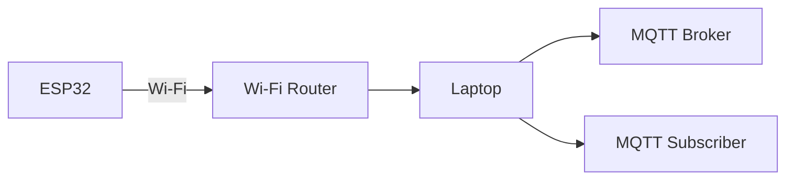
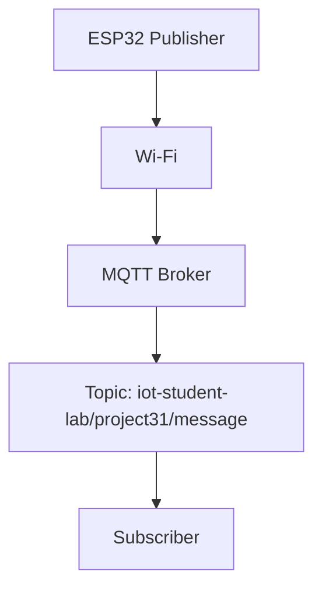

# 🔌 Project 31 — MQTT Fundamentals Wiring

> **Hardware focus:** ESP32 built-in Wi‑Fi communication  
> **External GPIO circuit:** None

---

## 1. Hardware

| Component | Quantity | Purpose |
|---|---:|---|
| ESP32 development board | 1 | MQTT client / publisher |
| USB cable | 1 | Power and programming |
| PC/Laptop | 1 | Development + MQTT subscriber |
| Wi‑Fi network | 1 | Network connectivity |
| MQTT broker | 1 | Message routing |

---

## 2. External Circuit

No sensor or actuator is connected in this project.

The ESP32 communicates using its built-in Wi‑Fi interface:

```text
┌──────────────────────┐
│        ESP32         │
│                      │
│   Built-in Wi-Fi     │
└──────────┬───────────┘
           │
           │ Wi-Fi
           ▼
┌──────────────────────┐
│   Wi-Fi Network      │
│      / Router        │
└──────────┬───────────┘
           │
           ▼
┌──────────────────────┐
│     MQTT Broker      │
└──────────┬───────────┘
           │
           │ MQTT message
           ▼
┌──────────────────────┐
│ PC / Laptop          │
│ MQTT Subscriber      │
└──────────────────────┘
```

---

## 3. ESP32 Connection

```text
USB
 │
 ├── Power
 │
 └── Programming / Serial Monitor

ESP32
 │
 └── Built-in Wi-Fi → Network → MQTT Broker
```

No GPIO pin mapping is required.

---

## 4. Local-Broker Network Arrangement

If the broker is running on the same laptop used as the subscriber:



The ESP32 must be able to reach the broker's network address.

---

## 5. MQTT Configuration

The sketch uses:

```cpp
const char* MQTT_BROKER = "YOUR_MQTT_BROKER";
const int MQTT_PORT = 1883;
```

Example format:

```cpp
const char* MQTT_BROKER = "192.168.1.100";
```

Do **not** use the example address unless it is actually the broker address on your network.

---

## 6. Topic

The default topic is:

```text
iot-student-lab/project31/message
```

Example payload:

```text
Hello from ESP32 | Message #1
```

---

## 7. Signal Flow



---

## 8. Verification

| Check | Expected result |
|---|---|
| USB connected | ESP32 powers |
| Wi‑Fi configured | ESP32 connects |
| IP displayed | Valid local IP |
| Broker running | MQTT connection succeeds |
| Topic correct | Subscriber receives data |
| Subscriber connected | Messages visible |

---

## ⚠️ Safety

There is no mains-voltage circuitry in this project.

Use a suitable USB cable and development board power arrangement. Do not introduce mains wiring merely to demonstrate MQTT.
