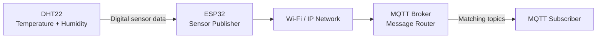
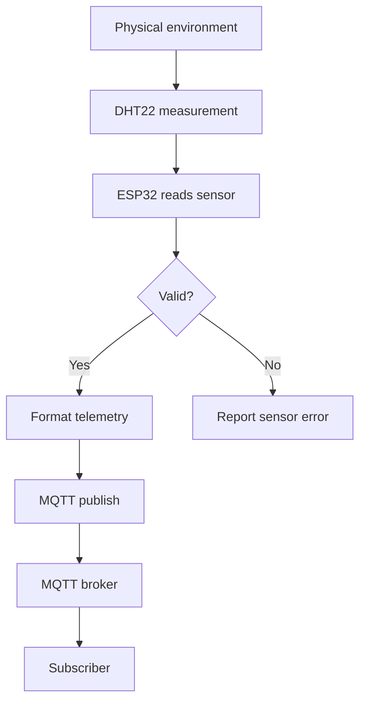
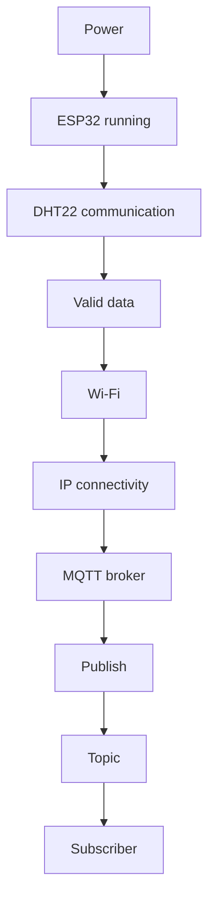

# 🌡️ Project 32 — ESP32 MQTT Sensor Publisher

> **Level 5 · Advanced IoT · Real Sensor Telemetry**
>
> **DHT22 → ESP32 → Wi‑Fi → MQTT Broker → Subscriber**

## 🧭 Project Overview

Project 31 introduced MQTT with a synthetic message. Project 32 replaces that demonstration payload with real environmental telemetry from a **DHT22 temperature and humidity sensor**.

```text
┌──────────────┐
│    DHT22     │
│ Temperature  │
│ + Humidity   │
└──────┬───────┘
       │ DATA
       ▼
┌──────────────┐
│    ESP32     │
│ Read/Validate│
│   Telemetry  │
└──────┬───────┘
       │ Wi‑Fi
       ▼
┌──────────────┐
│ MQTT Broker  │
│ Message Hub  │
└──────┬───────┘
       │
       ▼
┌──────────────┐
│  Subscriber  │
│ PC / Laptop  │
└──────────────┘
```

### 🎯 Learning Objectives

Students will learn to:

- connect a DHT22 to an ESP32;
- read temperature and relative humidity;
- validate sensor readings;
- connect the ESP32 to Wi‑Fi and MQTT;
- publish telemetry to multiple MQTT topics;
- create a combined JSON-style payload;
- use `millis()` for periodic acquisition;
- handle Wi‑Fi and MQTT reconnection;
- debug the system layer-by-layer;
- design topic namespaces for multiple devices.

## 🔗 Connection to Project 31

```text
Project 31
ESP32 → MQTT Broker → Subscriber
             ↓
       Simple message

Project 32
DHT22 → ESP32 → MQTT Broker → Subscriber
             ↓
       Real telemetry
```

The communication infrastructure stays the same; the data source changes. This demonstrates **separation of concerns**.

## 🏗️ Architecture



## 🔩 Hardware

| Component | Qty | Role |
|---|---:|---|
| ESP32 development board | 1 | Controller, Wi‑Fi and MQTT client |
| DHT22 | 1 | Temperature/humidity sensing |
| 10 kΩ resistor* | 1 | DATA pull-up for bare DHT22 |
| Breadboard | 1 | Prototyping |
| Jumper wires | As required | Connections |
| USB cable | 1 | Power/programming |
| Wi‑Fi network | 1 | Connectivity |
| MQTT broker | 1 | Message routing |
| PC/Laptop | 1 | Subscriber/testing |

\*Many DHT22 modules already include a pull-up resistor.

## 🔌 Pin Mapping

| DHT22 | ESP32 |
|---|---|
| VCC | 3.3V |
| DATA | GPIO 4 |
| NC | Not connected |
| GND | GND |

The code defines:

```cpp
#define DHT_PIN 4
#define DHT_TYPE DHT22
```

## 🧷 Bare DHT22 Pull-Up

```text
             3.3V
               │
             [10 kΩ]
               │
               ├──────── DATA → GPIO 4
               │
             DHT22
               │
              GND
```

Always inspect the actual module; breakout boards may already contain the resistor.

## 📡 MQTT Topics

```text
iot-student-lab/project32/temperature
iot-student-lab/project32/humidity
iot-student-lab/project32/telemetry
```

Examples:

```text
temperature → 25.60
humidity    → 61.20
```

Combined:

```json
{
  "reading": 12,
  "temperature": 25.60,
  "humidity": 61.20
}
```

## 🧠 Telemetry Pipeline

```text
SENSE
  ↓
VALIDATE
  ↓
STRUCTURE
  ↓
CONNECT
  ↓
PUBLISH
  ↓
ROUTE
  ↓
CONSUME
```



## 🌡️ DHT22 vs Earlier LM35

| LM35 | DHT22 |
|---|---|
| Analog output | Digital communication |
| ADC conversion involved | Sensor library handles protocol |
| Temperature | Temperature + humidity |
| Voltage → calculation | Digital measurement |

## ⏱️ Sampling

The project uses:

```cpp
const unsigned long SENSOR_INTERVAL = 2000;
```

The elapsed-time pattern is:

```mermaid
flowchart TD
    A[Main loop] --> B[Maintain Wi-Fi]
    B --> C[Maintain MQTT]
    C --> D[mqttClient.loop()]
    D --> E[Read millis()]
    E --> F{2 seconds elapsed?}
    F -- No --> A
    F -- Yes --> G[Read DHT22]
    G --> H{Valid?}
    H -- No --> I[Report error]
    H -- Yes --> J[Publish telemetry]
    J --> A
    I --> A
```

## 🔄 Reliability

The device checks both communication layers:

```text
Wi‑Fi
  ↓
MQTT
```

If Wi‑Fi fails, reconnect. If MQTT fails, reconnect.

> 💡 **Connected is a state, not a permanent guarantee.**

## 🧪 Testing Procedure

### Test 1 — Hardware

Verify power, ground, DATA → GPIO4, and the pull-up arrangement.

### Test 2 — Wi‑Fi

Serial Monitor: **115200 baud**

Expected:

```text
Wi-Fi connected.
IP Address: ...
RSSI: ... dBm
```

### Test 3 — MQTT

```text
Connecting to MQTT broker...connected.
```

### Test 4 — Temperature

Subscribe to:

```text
iot-student-lab/project32/temperature
```

### Test 5 — Humidity

Subscribe to:

```text
iot-student-lab/project32/humidity
```

### Test 6 — Combined telemetry

Subscribe to:

```text
iot-student-lab/project32/telemetry
```

## 📊 Observation Table

| Reading | Temperature °C | Humidity % | Temp MQTT | Humidity MQTT | Combined |
|---:|---:|---:|---|---|---|
| 1 | | | | | |
| 2 | | | | | |
| 3 | | | | | |
| 4 | | | | | |
| 5 | | | | | |

## 🛠️ Troubleshooting

| Symptom | Likely layer | Check |
|---|---|---|
| No serial output | Power/programming | USB, board, serial settings |
| DHT22 read failed | Sensor | VCC, GND, DATA, GPIO, pull-up |
| Wi‑Fi fails | Network | SSID, password, signal |
| Wi‑Fi works, MQTT fails | MQTT/network | Broker, port, firewall |
| MQTT connects, no data | Application | Topic and subscriber |
| Only one topic works | Topic | Exact spelling/subscription |
| Repeated reconnects | Network/power | Signal, broker, supply |

### Fault isolation



## 🧪 Experiments

### Experiment 1 — Sampling interval

Try:

```text
1000 ms
5000 ms
10000 ms
```

Record messages/minute and discuss network, power and storage implications.

### Experiment 2 — Sensor failure

Disconnect DATA. Observe validation and recovery.

### Experiment 3 — Topic isolation

Subscribe separately to temperature, humidity and combined telemetry.

### Experiment 4 — Device identity

Design:

```json
{
  "device_id": "esp32-32",
  "reading": 12,
  "temperature": 25.60,
  "humidity": 61.20
}
```

### Experiment 5 — Status topic

Design:

```text
iot-student-lab/project32/status
```

with a payload such as:

```text
online
```

## 🚀 Engineering Challenges

1. Design topics for three ESP32 devices.
2. Add a device ID to telemetry.
3. Add uptime to the payload.
4. Design a sensor-health status topic.
5. Decide whether sampling and publishing should always occur at the same rate.
6. Design a smart-room telemetry architecture.

## 🔐 Security

This is a controlled learning prototype using the introductory MQTT port `1883`.

Production systems should consider:

- authentication;
- authorization;
- encrypted transport;
- secure credential management;
- network segmentation;
- monitoring.

Never commit Wi‑Fi passwords, broker passwords, API keys, tokens or private certificates to a public repository.

## 🧠 Knowledge Check

1. What does the DHT22 measure?
2. Why is the DHT22 different from an analog LM35?
3. What is a topic?
4. What is a payload?
5. Why validate sensor readings?
6. Why use a combined telemetry payload?
7. Why use `millis()`?
8. What does `mqttClient.loop()` do?
9. Why handle reconnection?
10. How would you design topics for 100 devices?
11. Why might high-frequency publishing be inefficient?
12. How could this system become bidirectional?

## 🏆 Completion Checklist

- [ ] DHT22 wired correctly.
- [ ] DATA reaches GPIO 4.
- [ ] Pull-up arrangement verified.
- [ ] Required libraries installed.
- [ ] Wi‑Fi connection successful.
- [ ] MQTT connection successful.
- [ ] Temperature topic tested.
- [ ] Humidity topic tested.
- [ ] Combined telemetry tested.
- [ ] Sensor failure experiment completed.
- [ ] Topic design challenge completed.
- [ ] I can explain the complete telemetry pipeline.

## 🔭 Next Project

Project 32 is primarily telemetry publishing:

```text
DHT22 → ESP32 → PUBLISH → Broker → Subscriber
```

The next stage introduces commands:

```text
Subscriber
     ↓
   COMMAND
     ↓
   Broker
     ↓
  ESP32
     ↓
  Actuator
```

The ESP32 will move toward **PUBLISH + SUBSCRIBE**, enabling bidirectional IoT communication.
