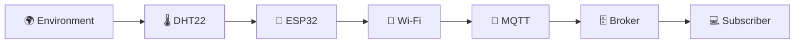
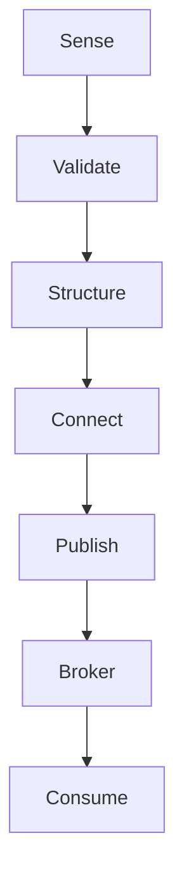
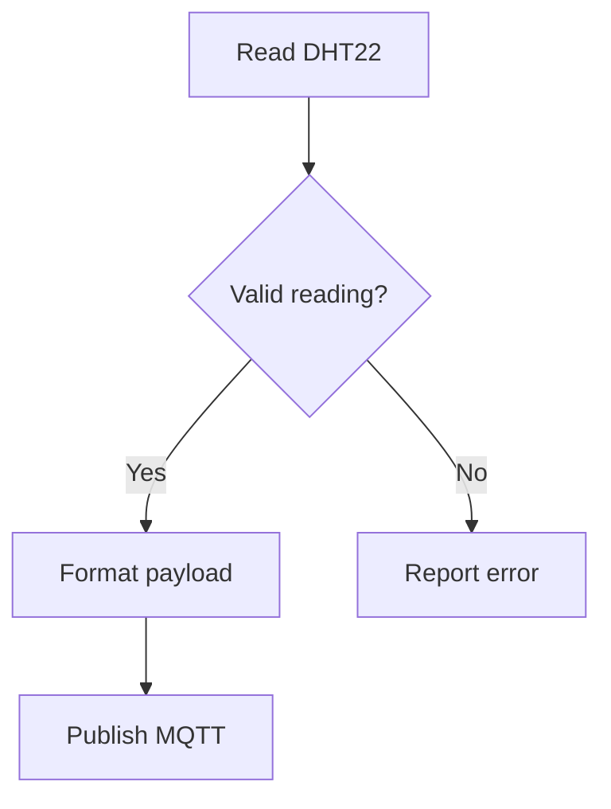
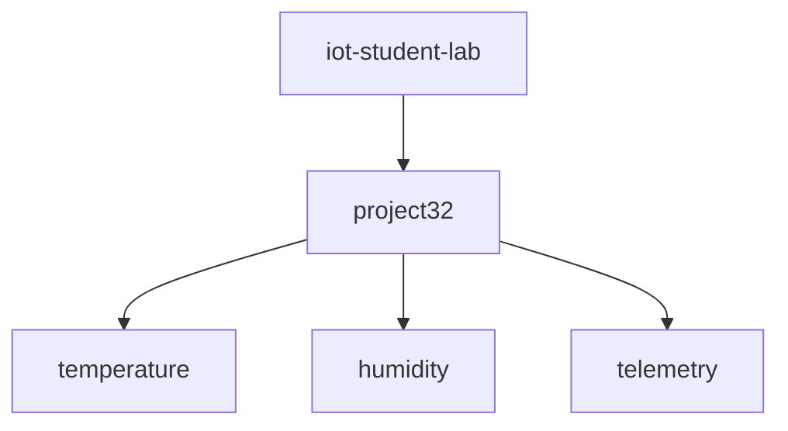
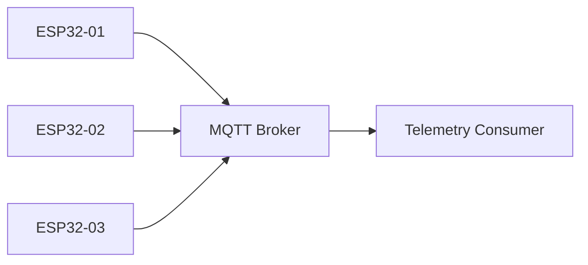
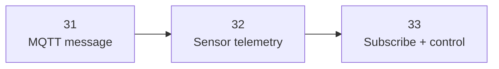

# 🧩 Project 32 — Circuit & Communication Architecture

## 1. Complete System



## 2. Telemetry Pipeline



## 3. Validity Decision



## 4. Timing

```mermaid
flowchart TD
    A[loop()] --> B[Maintain Wi-Fi]
    B --> C[Maintain MQTT]
    C --> D[mqttClient.loop()]
    D --> E[Check millis()]
    E --> F{2 seconds?}
    F -- No --> A
    F -- Yes --> G[Read + publish]
    G --> A
```

## 5. Topic Architecture



## 6. Multiple Devices



Possible pattern:

```text
iot-student-lab/devices/esp32-01/temperature
iot-student-lab/devices/esp32-02/temperature
iot-student-lab/devices/esp32-03/temperature
```

## 7. Project 31 → 32 → 33



Project 32 is the bridge from MQTT theory to real physical-world telemetry.
