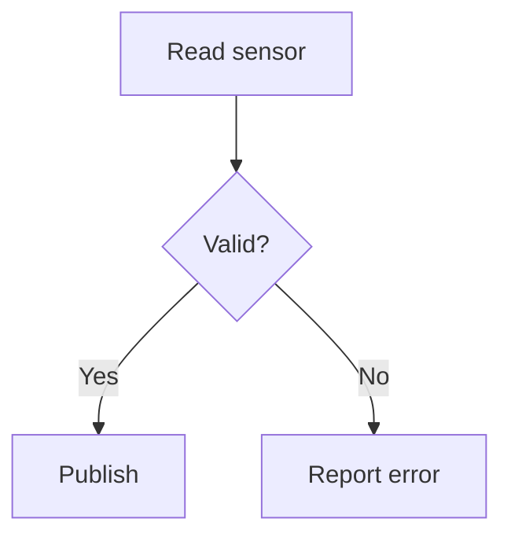
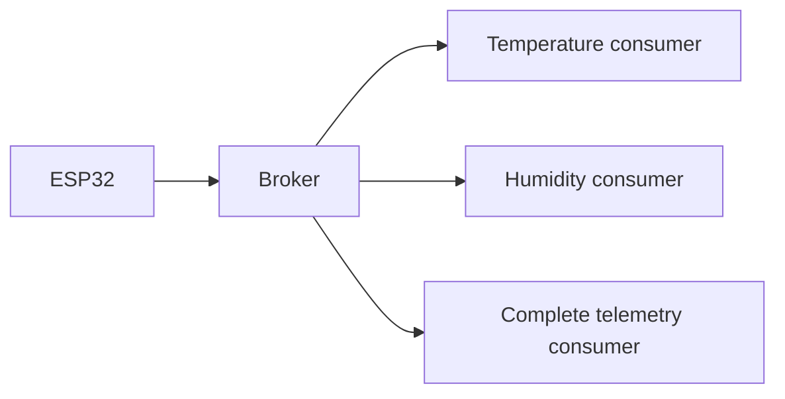
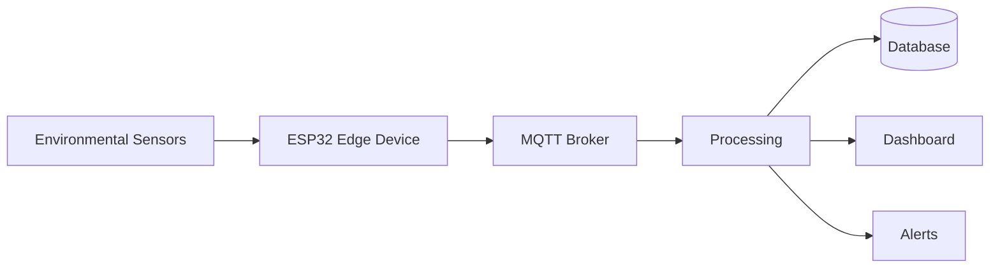
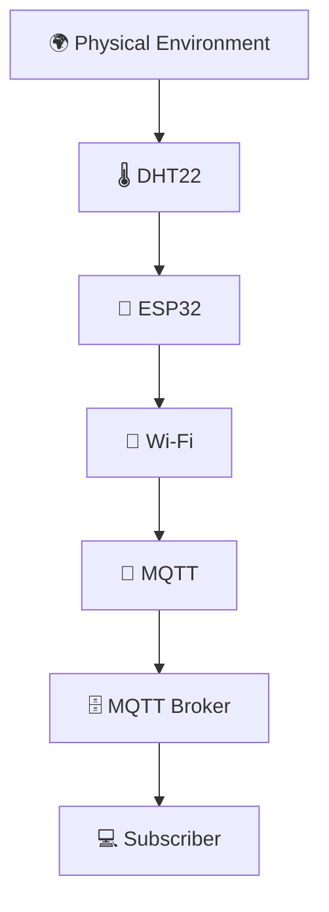

# 📚 Project 32 — ESP32 MQTT Sensor Publisher — Detailed Learning Notes

> **Level 5 classroom chapter:** Physical sensing → validation → structured telemetry → MQTT.

---

# 1. Learning Position

Project 31 established the messaging architecture:

```text
ESP32 → MQTT Broker → Subscriber
```

Project 32 keeps that architecture but replaces the demonstration string with actual measurements.

```text
DHT22 → ESP32 → Wi‑Fi → MQTT Broker → Subscriber
```

The important change is not simply "adding a sensor." The project now demonstrates a **data pipeline**.

```text
SENSE
 ↓
VALIDATE
 ↓
PROCESS
 ↓
CONNECT
 ↓
PUBLISH
 ↓
ROUTE
 ↓
CONSUME
```

---

# 2. What Is Telemetry?

Telemetry is the collection and communication of measurements from a system so that another system can monitor, analyse, store or act on them.

Serial output:

```text
Temperature: 25.60 °C
```

is useful for local diagnostics.

MQTT telemetry:

```text
Topic:
iot-student-lab/project32/temperature

Payload:
25.60
```

is information intended for another system.

That distinction is central to IoT.

---

# 3. DHT22 Fundamentals

The DHT22 measures:

- temperature;
- relative humidity.

It communicates digitally with the ESP32.

The sketch uses:

```cpp
#define DHT_PIN 4
#define DHT_TYPE DHT22
```

Therefore:

```text
DHT22 DATA → GPIO 4
```

The DHT library handles the sensor communication protocol.

---

# 4. DHT22 vs LM35

| Concept | LM35 | DHT22 |
|---|---|---|
| Temperature | Yes | Yes |
| Humidity | No | Yes |
| Output | Analog | Digital |
| ADC in application | Used | Not used to interpret DHT22 data |
| Library | Optional for basic analog reading | Commonly used |

The conceptual difference is:

```text
LM35:
Sensor → Voltage → ADC → Calculation

DHT22:
Sensor → Digital data → Library → Measurement
```

This demonstrates that sensor integration depends on the sensor's electrical and communication interface.

---

# 5. Why Sensor Validation?

A read function does not guarantee a useful measurement.

The project checks:

```cpp
if (isnan(humidity) || isnan(temperature))
```

Invalid readings are not published.



### Engineering principle

> **Bad data can be worse than missing data.**

A missing measurement is visibly unavailable. A physically impossible value may look legitimate to downstream software.

Production systems may add:

- range checks;
- rate-of-change checks;
- timestamps;
- sensor-health flags;
- plausibility checks.

---

# 6. Sensor Acquisition Function

The project reads:

```cpp
float humidity = dht.readHumidity();
float temperature = dht.readTemperature();
```

Then passes valid values to:

```cpp
publishSensorData(temperature, humidity);
```

This separates two responsibilities:

```text
readAndPublishSensor()
 ├── acquire
 └── validate

publishSensorData()
 ├── format
 ├── publish
 └── report
```

This is cleaner than placing every operation in `loop()`.

---

# 7. Why Functions Matter

The project separates:

```cpp
connectToWiFi()
connectToMQTT()
readAndPublishSensor()
publishSensorData()
```

Each function has a clear responsibility.

This improves:

- readability;
- debugging;
- maintenance;
- reuse;
- extension.

As systems become larger, modular software structure becomes increasingly important.

---

# 8. MQTT Topics

Project 32 uses:

```text
iot-student-lab/project32/temperature
iot-student-lab/project32/humidity
iot-student-lab/project32/telemetry
```

A topic is a logical communication channel.

It is not the measurement itself.

---

# 9. Topic vs Payload

Example:

```text
Topic:
iot-student-lab/project32/temperature

Payload:
25.60
```

The topic answers:

> **Which logical data stream is this?**

The payload answers:

> **What information is being transmitted?**

Combined:

```text
Topic + Payload
```

form the basic application-level message content used by this project.

---

# 10. Why Multiple Topics?

Different consumers may need different information.



A temperature-only application does not need to process humidity.

A complete telemetry application may want both.

This is why topic design is part of system design.

---

# 11. Combined Telemetry

The project also publishes:

```json
{
  "reading": 12,
  "temperature": 25.60,
  "humidity": 61.20
}
```

This represents one measurement snapshot.

The `reading` field gives a sequence number that helps students correlate the values during testing.

---

# 12. What Is a Schema?

A schema defines how application data is organised.

For example:

```json
{
  "reading": 12,
  "temperature": 25.60,
  "humidity": 61.20
}
```

implicitly defines:

```text
reading       → sequence number
temperature   → temperature measurement
humidity      → humidity measurement
```

A stable schema allows independent producers and consumers to agree on data structure.

---

# 13. Device Identity

Imagine 100 devices all publish:

```json
{
  "temperature": 25.6
}
```

A downstream application needs to know which device produced each value.

One option:

```json
{
  "device_id": "esp32-32",
  "temperature": 25.6
}
```

Another option is topic identity:

```text
iot-student-lab/devices/esp32-32/temperature
```

The best approach depends on the complete architecture.

---

# 14. Topic Namespace Design

Current:

```text
iot-student-lab/project32/temperature
```

A fleet-oriented structure might be:

```text
iot-student-lab/
└── devices/
    └── esp32-32/
        ├── temperature
        ├── humidity
        ├── telemetry
        └── status
```

For many devices:

```text
iot-student-lab/devices/esp32-01/temperature
iot-student-lab/devices/esp32-02/temperature
iot-student-lab/devices/esp32-03/temperature
```

Students should think about how subscriptions will work before designing the namespace.

---

# 15. Wi‑Fi Is Not MQTT

These are separate layers.

### Network layer

```text
ESP32 → Wi‑Fi → IP network
```

### Messaging layer

```text
ESP32 → MQTT CONNECT → Broker
```

### Application messaging

```text
ESP32 → PUBLISH → Topic + Payload
```

Therefore:

```text
Wi‑Fi connected ≠ MQTT connected
```

This distinction is extremely important during troubleshooting.

---

# 16. Wi‑Fi Station Mode

The project uses:

```cpp
WiFi.mode(WIFI_STA);
WiFi.begin(WIFI_SSID, WIFI_PASSWORD);
```

The ESP32 operates as a Wi‑Fi station.

Once connected, the sketch reports:

```cpp
WiFi.localIP()
```

and:

```cpp
WiFi.RSSI()
```

The IP address provides network identity for communication.

RSSI gives an indication of received signal strength.

---

# 17. MQTT Connection

The broker is configured using:

```cpp
mqttClient.setServer(
    MQTT_BROKER,
    MQTT_PORT
);
```

The project uses the introductory MQTT port:

```text
1883
```

The client connects using:

```cpp
mqttClient.connect(MQTT_CLIENT_ID)
```

The client ID is:

```text
iot-student-esp32-32
```

For fleets, client identity should be unique and managed deliberately.

---

# 18. Why Reconnection Logic?

A real network can fail.

Possible events:

```text
Router restarts
     ↓
Wi‑Fi interruption

Broker restarts
     ↓
MQTT interruption

Signal loss
     ↓
Network interruption
```

The project therefore checks:

```cpp
WiFi.status()
```

and:

```cpp
mqttClient.connected()
```

and attempts recovery.

---

# 19. Reliability Model

A beginner may imagine:

```text
Connected = Forever
```

A real system behaves more like:

```text
CONNECTED
    ↕
DISCONNECTED
    ↓
RECONNECTING
    ↓
CONNECTED
```

Therefore connection state is part of application logic.

---

# 20. `mqttClient.loop()`

The project calls:

```cpp
mqttClient.loop();
```

inside `loop()`.

This services the MQTT client and allows communication to be maintained.

It is not equivalent to:

```cpp
publish()
```

The distinction is:

| Operation | Purpose |
|---|---|
| `mqttClient.loop()` | Service MQTT communication |
| `publish()` | Send application data |
| `millis()` | Measure elapsed time |

---

# 21. `millis()` Timing

The project uses:

```cpp
const unsigned long SENSOR_INTERVAL = 2000;
```

The application checks elapsed time:

```text
current time - previous reading time
              ≥
        sensor interval
```

When the interval is reached:

```text
Read
 ↓
Validate
 ↓
Publish
```

---

# 22. Why Not Use `delay(2000)` Everywhere?

A long blocking delay can prevent other application work from being serviced.

The elapsed-time model supports:

```text
loop()
 ├── maintain Wi‑Fi
 ├── maintain MQTT
 ├── service MQTT
 ├── check sensor timer
 └── read/publish when due
```

This becomes increasingly useful when later projects add:

- actuators;
- command handling;
- multiple sensors;
- displays;
- alarms.

---

# 23. Sampling vs Publishing

This project combines sensor acquisition and publishing.

But conceptually they are different decisions.

### Sampling

```text
When should the physical measurement be obtained?
```

### Publishing

```text
When should the measurement be transmitted?
```

A future design could:

```text
Sample every 1 second
        ↓
Publish every 10 seconds
```

or publish only when the value changes beyond a threshold.

This is an important systems-design distinction.

---

# 24. Why Not Publish as Fast as Possible?

High-frequency transmission may create:

- unnecessary network traffic;
- increased broker load;
- more downstream processing;
- larger databases;
- increased power consumption.

The correct frequency depends on the application's requirements.

Ask:

> **How frequently does the consumer actually need new information?**

---

# 25. Reading Number and Observability

The project uses:

```cpp
readingNumber++;
```

This creates:

```text
Reading #1
Reading #2
Reading #3
```

The counter is not required by MQTT.

It is a testing and observability aid.

It helps identify:

- message sequence;
- repeated reads;
- pauses;
- reconnects;
- missing messages.

Production systems use richer observability mechanisms, but the principle is the same.

---

# 26. Serial Monitor as a Diagnostic Tool

The project prints:

```text
IP address
RSSI
broker
reading number
temperature
humidity
publish status
```

This provides visibility into internal state.

A useful diagnostic model is:

```text
Power
 ↓
Firmware
 ↓
Sensor
 ↓
Wi‑Fi
 ↓
MQTT
 ↓
Topic
 ↓
Subscriber
```

---

# 27. Fault Isolation

If the subscriber sees nothing, do not immediately modify MQTT code.

Ask:

```text
Is the ESP32 running?
       ↓
Is the DHT22 valid?
       ↓
Is Wi‑Fi connected?
       ↓
Is the broker reachable?
       ↓
Did publish succeed?
       ↓
Is the topic correct?
       ↓
Is the subscriber subscribed?
```

This turns debugging into a sequence of evidence-based tests.

---

# 28. Experiment — Sampling Interval

Change:

```cpp
const unsigned long SENSOR_INTERVAL = 2000;
```

Try:

```text
1000 ms
5000 ms
10000 ms
```

Record:

| Interval | Approx. readings/min | Network activity | Usefulness |
|---:|---:|---|---|
| 1 s | | | |
| 5 s | | | |
| 10 s | | | |

### Discussion

Would a room temperature monitor really need hundreds of readings every second?

Why or why not?

---

# 29. Experiment — Disconnect the Sensor

Disconnect the DHT22 DATA line.

Observe:

```text
Read
 ↓
Invalid
 ↓
Error
 ↓
No valid telemetry
```

Reconnect it.

Observe whether normal readings resume.

### Question

How is this failure different from losing Wi‑Fi?

---

# 30. Experiment — Topic Isolation

Subscribe to:

```text
iot-student-lab/project32/temperature
```

Then:

```text
iot-student-lab/project32/humidity
```

Then:

```text
iot-student-lab/project32/telemetry
```

Compare the data available from each.

---

# 31. Experiment — Device Identity

Modify the payload conceptually:

```json
{
  "device_id": "esp32-32",
  "reading": 12,
  "temperature": 25.60,
  "humidity": 61.20
}
```

Now ask:

> What happens when 100 devices publish?

This leads directly to fleet architecture.

---

# 32. Challenge — Status Topic

Design:

```text
iot-student-lab/project32/status
```

Possible payload:

```text
online
```

Then discuss:

- Should status be sent once?
- Periodically?
- Only when it changes?
- What should happen after a network interruption?

These questions prepare students for more advanced MQTT availability concepts.

---

# 33. Challenge — Three ESP32 Devices

Suppose:

```text
ESP32-01
ESP32-02
ESP32-03
```

Each reports temperature and humidity.

Design:

```text
iot-student-lab/devices/esp32-01/temperature
iot-student-lab/devices/esp32-01/humidity

iot-student-lab/devices/esp32-02/temperature
iot-student-lab/devices/esp32-02/humidity

iot-student-lab/devices/esp32-03/temperature
iot-student-lab/devices/esp32-03/humidity
```

Now imagine 1,000 devices.

Does the namespace remain easy to manage?

Students should consider:

- hierarchy;
- subscriptions;
- device identity;
- naming consistency;
- future data types.

---

# 34. Challenge — Telemetry Schema

Design:

```json
{
  "device_id": "esp32-32",
  "reading": 12,
  "temperature": 25.60,
  "humidity": 61.20,
  "uptime_ms": 24000
}
```

Explain the role of each field.

Then discuss whether timestamps should be generated by:

```text
device
```

or:

```text
server/backend
```

This introduces distributed-system thinking.

---

# 35. Real-World Smart Building

A larger system could look like:



Project 32 implements the beginning:

```text
Sensor → Edge Device → MQTT → Broker → Subscriber
```

---

# 36. Agriculture Application

The same pattern can support:

```text
Temperature
Humidity
Soil moisture
Light
       ↓
Edge device
       ↓
MQTT
       ↓
Broker
       ↓
Farm monitoring
```

The project architecture is therefore reusable across domains.

---

# 37. Industrial Application

A factory may have:

```text
Machine sensors
       ↓
Edge controller
       ↓
MQTT
       ↓
Broker
       ↓
Analytics / storage / monitoring
```

The major difference is scale, reliability, security, and operational requirements.

---

# 38. Security Awareness

The project is a controlled learning prototype.

It uses:

```text
1883
```

for introductory MQTT communication.

A production system may require:

```text
Authentication
      +
Authorization
      +
Encryption
      +
Credential management
      +
Network segmentation
      +
Monitoring
```

Do not expose an unauthenticated, unencrypted broker directly to the public Internet.

---

# 39. Repository Security

Keep:

```cpp
const char* WIFI_SSID = "YOUR_WIFI_NAME";
const char* WIFI_PASSWORD = "YOUR_WIFI_PASSWORD";
const char* MQTT_BROKER = "YOUR_MQTT_BROKER";
```

as placeholders in public educational source.

Never commit:

- Wi‑Fi passwords;
- broker passwords;
- API keys;
- tokens;
- private certificates.

---

# 40. Engineering Comparison

| Prototype | Production direction |
|---|---|
| Local broker | Hardened broker infrastructure |
| Placeholder credentials | Managed secrets |
| Simple text/JSON payload | Defined data schema |
| Basic reconnect | Robust connection strategy |
| Serial logs | Central observability |
| One device | Device fleet management |
| Local testing | Segmented deployment |
| Basic MQTT | Security-aware MQTT architecture |

---

# 41. Knowledge Check — Basic

1. What does DHT22 measure?
2. What is relative humidity?
3. Which GPIO receives DHT22 DATA?
4. What is an MQTT topic?
5. What is an MQTT payload?
6. What is the broker's responsibility?

---

# 42. Knowledge Check — Intermediate

7. Why is the DHT22 different from an analog LM35?
8. Why validate sensor readings?
9. Why have separate temperature and humidity topics?
10. Why publish a combined telemetry payload?
11. Why use `millis()`?
12. What is the purpose of `mqttClient.loop()`?
13. Why handle Wi‑Fi and MQTT reconnection separately?

---

# 43. Knowledge Check — Advanced

14. Why is device identity important?
15. How would you design topics for 1,000 devices?
16. Why can high-frequency telemetry be inefficient?
17. What is a telemetry schema?
18. Where could timestamps be generated?
19. How would you detect a stale device?
20. How would you extend this system to bidirectional control?

---

# 44. Instructor Discussion Prompts

### Prompt A

> If the sensor produces an invalid value, should it be published?

Discuss the difference between missing and incorrect information.

### Prompt B

> Should temperature and humidity always be published together?

Compare separate topics with combined telemetry.

### Prompt C

> Does every sensor reading need to be transmitted?

Discuss requirements, bandwidth, power and storage.

### Prompt D

> What changes when one device becomes 1,000 devices?

Discuss identity, topic hierarchy, broker capacity, monitoring and security.

---

# 45. Student Reflection

Complete:

```text
Telemetry means:
____________________________________________________

The DHT22 provides:
____________________________________________________

The broker is responsible for:
____________________________________________________

A topic is:
____________________________________________________

A payload is:
____________________________________________________

Sensor validation is important because:
____________________________________________________

The hardest debugging layer was:
____________________________________________________

My proposed device topic namespace is:
____________________________________________________

One real-world application is:
____________________________________________________
```

---

# 46. Final Architecture



The complete learning chain:

```text
🌍 Environment
      ↓
🌡️ DHT22
      ↓
🧠 ESP32
      ↓
📡 Wi‑Fi
      ↓
📨 MQTT
      ↓
🗄️ Broker
      ↓
💻 Subscriber
```

---

# 47. Project 31 → Project 32 → Project 33

```text
PROJECT 31
ESP32
  ↓
MQTT
  ↓
Broker
  ↓
Subscriber
```

becomes:

```text
PROJECT 32
DHT22
  ↓
ESP32
  ↓
MQTT
  ↓
Broker
  ↓
Subscriber
```

and then:

```text
PROJECT 33
Subscriber
  ↓
Command
  ↓
Broker
  ↓
ESP32
  ↓
Actuator
```

The ESP32 will then support:

```text
PUBLISH
   +
SUBSCRIBE
```

That is the transition from **monitoring** toward **interactive control**.

---

# 🏆 Final Takeaway

Project 32 teaches students to think of an IoT device as a telemetry-producing edge system.

The central architecture is:

```text
SENSE
  ↓
VALIDATE
  ↓
STRUCTURE
  ↓
CONNECT
  ↓
PUBLISH
  ↓
BROKER
  ↓
SUBSCRIBE
  ↓
CONSUME
```

The most important idea is:

> **A useful IoT system does not merely read a sensor. It produces trustworthy, structured information that can travel through a communication architecture and be consumed by other systems.**
