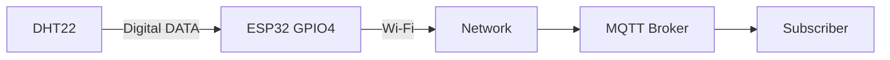

# 🔌 Project 32 — ESP32 MQTT Sensor Publisher Wiring

## Hardware

| Component | Qty | Purpose |
|---|---:|---|
| ESP32 | 1 | Controller + Wi‑Fi |
| DHT22 | 1 | Temperature/humidity |
| 10 kΩ resistor* | 1 | DATA pull-up |
| Breadboard | 1 | Prototyping |
| Jumper wires | As required | Wiring |
| USB cable | 1 | Power/programming |

\*Check whether the DHT22 module already contains a pull-up.

## DHT22 Pinout

Common bare 4-pin arrangement:

```text
DHT22
  1 → VCC
  2 → DATA
  3 → NC
  4 → GND
```

Verify the actual sensor before wiring.

## ESP32 Connection

| DHT22 | ESP32 |
|---|---|
| VCC | 3.3V |
| DATA | GPIO 4 |
| NC | Not connected |
| GND | GND |

## Pull-Up

```text
3.3V
 │
[10 kΩ]
 │
 ├──────── DATA → GPIO 4
 │
DHT22
 │
GND
```

## Network Flow



## Topics

```text
iot-student-lab/project32/temperature
iot-student-lab/project32/humidity
iot-student-lab/project32/telemetry
```

## Verification

| Check | Expected |
|---|---|
| ESP32 power | Correct |
| DHT22 VCC | 3.3V |
| DHT22 GND | Common GND |
| DATA | GPIO 4 |
| Pull-up | Present for bare sensor |
| GPIO 4 | Not shared incorrectly |

## Fault-isolation sequence

```text
Power → Sensor → Wi‑Fi → Broker → Publish → Topic → Subscriber
```

## ⚠️ Safety

Use low-voltage electronics only. Do not connect mains voltage or mains loads to this project.
