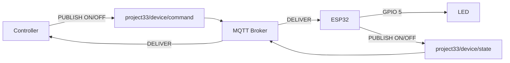
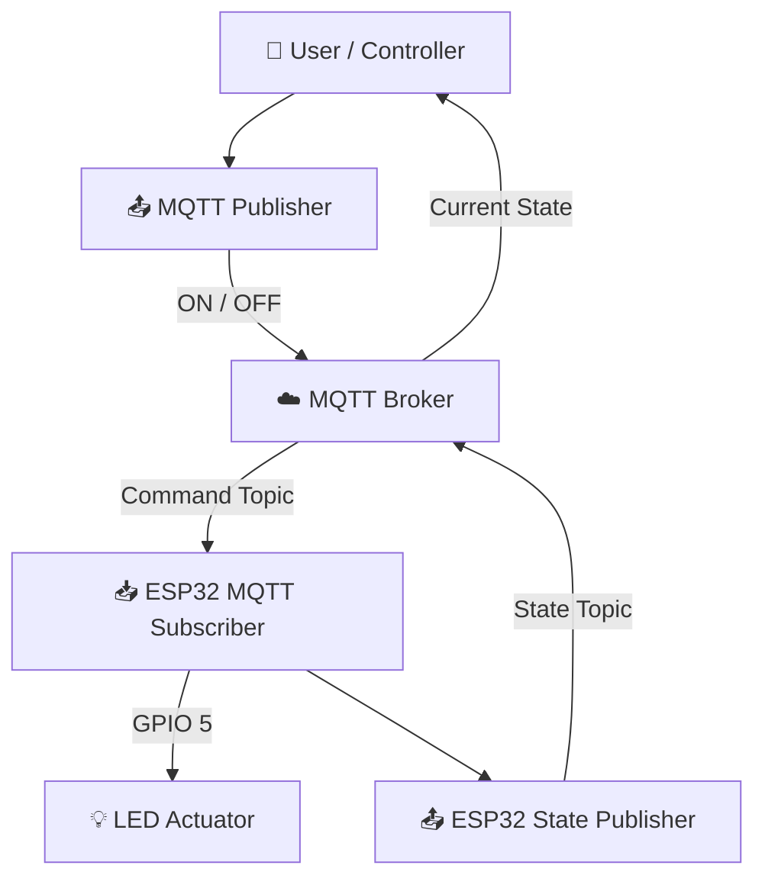
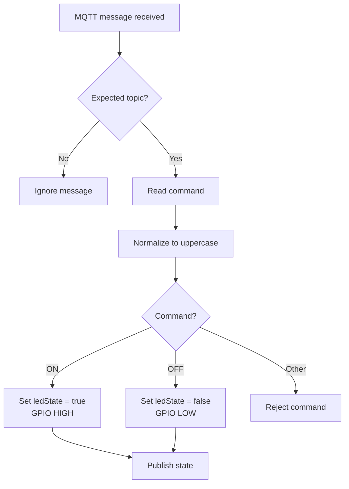

# 📡 Project 33 — MQTT Remote Device Control

> **Level 5 • Advanced IoT • Two-Way MQTT Communication**

## 🎯 Project Overview

In Project 31, the ESP32 learned to **publish MQTT messages**.  
In Project 32, it became a **sensor publisher**, sending temperature and humidity telemetry through MQTT.

Project 33 makes the communication path two-way:

```text
Controller ──► MQTT Broker ──► ESP32 ──► LED
Controller ◄── MQTT Broker ◄── ESP32 ◄── Device State
```

The ESP32 is now both:

- 📥 **Subscriber** — receives commands.
- 📤 **Publisher** — reports its current state.
- ⚙️ **Controller** — changes a physical output according to a received command.
- 🔄 **Recoverable endpoint** — reconnects when MQTT connectivity is lost.

This is an important architectural transition from **monitoring** to **remote control**.

---

## 🧠 What You Will Learn

By completing this project, students should be able to:

- Explain the roles of an MQTT client, broker, publisher and subscriber.
- Distinguish **command messages** from **state messages**.
- Subscribe an ESP32 to an MQTT topic.
- Process an incoming MQTT message with a callback function.
- Convert an MQTT payload into a usable command.
- Validate incoming commands.
- Control a GPIO output from an MQTT command.
- Publish the resulting device state.
- Understand retained MQTT state.
- Implement MQTT reconnection and resubscription.
- Design a simple two-way IoT message architecture.
- Test an IoT endpoint independently from its user interface.

---

## 🚀 What Are We Building?

A controller publishes:

```text
ON
```

or

```text
OFF
```

to the command topic.

The ESP32 receives the message and controls an LED.

The ESP32 then publishes:

```text
ON
```

or

```text
OFF
```

to the state topic.

### Complete flow

```text
              COMMAND PATH
Controller ───── PUBLISH ─────► Broker
                                  │
                                  │ DELIVER
                                  ▼
                                ESP32
                                  │
                                  │ GPIO 5
                                  ▼
                                 LED


               STATE PATH
Controller ◄──── PUBLISH ◄──── Broker ◄──── ESP32
                                             │
                                             │
                                         Current state
```

---

## 🔁 Project 32 → Project 33

| Project | Main capability | Direction |
|---|---|---|
| 31 — MQTT Fundamentals | Basic MQTT publishing | ESP32 → Broker → Subscriber |
| 32 — MQTT Sensor Publisher | Sensor telemetry | Sensor → ESP32 → Broker → Consumer |
| **33 — Remote Device Control** | **Command + state reporting** | **Controller ↔ Broker ↔ ESP32** |
| 34 — Dashboard & Visualization | Data presentation | MQTT → Application → Dashboard |

### The architectural milestone

Project 33 introduces:

> **PUBLISH + SUBSCRIBE = TWO-WAY IoT COMMUNICATION**

---

# 🧩 Hardware

| Component | Qty. | Purpose |
|---|---:|---|
| ESP32 development board | 1 | Wi-Fi + MQTT endpoint |
| LED | 1 | Physical actuator |
| 220 Ω resistor | 1 | Limits LED current |
| Breadboard | 1 | Prototyping |
| Jumper wires | As required | Connections |
| USB cable | 1 | Power/programming |
| Wi-Fi network | 1 | Network connectivity |
| MQTT broker | 1 | Message routing |
| MQTT client | 1 | Publishes commands / receives state |

### Why only one LED?

The project deliberately keeps the physical system simple so students can focus on the **communication architecture** rather than wiring complexity.

Once this pattern is understood, the LED can be replaced conceptually by:

- a relay-controlled low-voltage load,
- a motor driver,
- a servo,
- an RGB LED,
- a fan controller,
- an irrigation valve driver,
- or another actuator interface.

---

# 🔌 Hardware Wiring

### ESP32 → LED

| ESP32 | Connection |
|---|---|
| GPIO 5 | 220 Ω resistor |
| Resistor output | LED anode (+) |
| LED cathode (−) | GND |

```text
ESP32 GPIO 5
     │
     ▼
   220 Ω
     │
     ▼
 LED Anode (+)
 LED Cathode (−)
     │
     ▼
    GND
```

⚠️ **Never connect an LED directly to a GPIO without current limiting.**

ESP32 GPIOs operate at 3.3 V logic. Do not apply 5 V directly to a GPIO.

---

# 🌐 MQTT Configuration

## Command Topic

The controller publishes commands to:

```text
iot-student-lab/project33/device/command
```

Allowed payloads:

```text
ON
OFF
```

## State Topic

The ESP32 reports its current state to:

```text
iot-student-lab/project33/device/state
```

Possible payloads:

```text
ON
OFF
```

### Topic architecture



---

# 🧱 Why Two Topics?

A well-designed IoT system separates **what is requested** from **what the device reports**.

| Topic | Direction | Meaning |
|---|---|---|
| `.../command` | Controller → ESP32 | Requested action |
| `.../state` | ESP32 → Controller | Reported device state |

For example:

```text
COMMAND:
ON
```

means:

> “Please turn the device on.”

Whereas:

```text
STATE:
ON
```

means:

> “The device currently reports that it is on.”

This distinction becomes extremely important when devices can be offline, delayed, busy, or unable to execute a command.

---

# 🧠 System Architecture



---

# ⚙️ How the Program Works

The sketch can be understood as several logical blocks:

| Function / block | Responsibility |
|---|---|
| Wi-Fi configuration | Identifies the local network |
| MQTT configuration | Defines broker, port, client ID and topics |
| `mqttCallback()` | Processes incoming MQTT messages |
| `publishDeviceState()` | Reports current LED state |
| `connectToWiFi()` | Establishes Wi-Fi connectivity |
| `connectToMQTT()` | Connects, subscribes and publishes initial state |
| `setup()` | Initializes the complete system |
| `loop()` | Maintains connections and processes MQTT traffic |

---

## 📥 The MQTT Callback

The most important new concept is the callback:

```cpp
mqttCallback()
```

The MQTT library calls this function when a message arrives on a subscribed topic.

Conceptually:

```text
MQTT message arrives
        ↓
PubSubClient detects it
        ↓
mqttCallback()
        ↓
Read topic + payload
        ↓
Validate command
        ↓
Change device state
        ↓
Update GPIO
        ↓
Publish state
```

### Why a callback?

The ESP32 does not need to constantly ask:

> “Has a message arrived?”

Instead, the MQTT library can notify the program when subscribed data is available.

This is an example of **event-driven programming**.

---

# 🔍 Command Processing

Incoming payloads are converted into a command string.

The program:

1. Builds the payload.
2. Removes unnecessary whitespace.
3. Converts it to uppercase.
4. Checks the topic.
5. Accepts only known commands.



### Why normalize the command?

Without normalization, these could be treated differently:

```text
ON
on
On
oN
```

The program converts them to uppercase so they become:

```text
ON
```

This is a simple form of input normalization.

---

# 📤 State Reporting

After accepting a valid command, the ESP32 publishes its state.

```text
LED changes
    ↓
ledState changes
    ↓
State converted to ON/OFF
    ↓
MQTT publish()
    ↓
State topic
```

The project uses MQTT's retained-message option when publishing state.

That means the broker can retain the most recently published state for later subscribers.

> 💡 **Important:** retained state represents the latest retained report; it is not the same thing as a guarantee that the physical device is currently reachable.

---

# 🔄 Connection Recovery

IoT devices operate on networks that can fail.

The program checks:

```text
Wi-Fi connection
        ↓
MQTT connection
        ↓
MQTT message processing
```

If MQTT disconnects:

```mermaid
flowchart TD
    A[Main loop] --> B{MQTT connected?}
    B -->|Yes| C[mqttClient.loop()]
    B -->|No| D[Reconnect to broker]
    D --> E[Resubscribe to command topic]
    E --> F[Publish current state]
    F --> C
    C --> A
```

This is much more useful than a program that works only until the first network interruption.

---

# 🛡️ Safe Startup

At startup, the LED is explicitly placed in the OFF state.

```cpp
ledState = false;
digitalWrite(LED_PIN, LOW);
```

A known startup state matters because an actuator should not depend on an accidental GPIO condition.

For a classroom LED, this is mainly good engineering practice.

For real equipment, startup behavior can affect:

- motors,
- heaters,
- pumps,
- valves,
- lighting systems,
- machinery.

---

# 🧪 Testing Procedure

## Test 1 — Startup

Open the Serial Monitor at:

```text
115200 baud
```

Verify that:

- Wi-Fi connects.
- An IP address appears.
- MQTT connects.
- The command topic is subscribed.
- Initial state is published.
- The LED starts OFF.

---

## Test 2 — ON Command

Subscribe to:

```text
iot-student-lab/project33/device/state
```

Publish:

```text
ON
```

to:

```text
iot-student-lab/project33/device/command
```

Expected:

```text
Controller
   ↓
ON
   ↓
Broker
   ↓
ESP32
   ↓
GPIO 5 HIGH
   ↓
LED ON
   ↓
State = ON
   ↓
Broker
   ↓
Controller receives ON
```

---

## Test 3 — OFF Command

Publish:

```text
OFF
```

Expected:

```text
LED OFF
```

and:

```text
State topic → OFF
```

---

## Test 4 — Invalid Command

Publish:

```text
HELLO
```

Expected behavior:

```text
Unknown command.
Use only: ON or OFF
```

The LED should **not change state**.

This demonstrates input validation.

---

# 📊 Observation Table

| Test | Command | LED | State Topic | Result |
|---|---|---|---|---|
| 1 | Startup | OFF | OFF | ☐ |
| 2 | ON | ON | ON | ☐ |
| 3 | OFF | OFF | OFF | ☐ |
| 4 | on | ON | ON | ☐ |
| 5 | off | OFF | OFF | ☐ |
| 6 | HELLO | Unchanged | Unchanged | ☐ |
| 7 | Broker reconnect | Expected state restored | State published | ☐ |

---

# 🧰 Troubleshooting

## Wi-Fi does not connect

Check:

- SSID spelling.
- Password.
- Wi-Fi availability.
- ESP32 network compatibility.
- Serial output.

## MQTT does not connect

Check:

- Broker hostname/IP.
- Port.
- Broker availability.
- Network path.
- Client ID uniqueness.

## LED does not respond

Check:

```text
GPIO 5
  ↓
220 Ω resistor
  ↓
LED anode
  ↓
LED cathode
  ↓
GND
```

Then test the LED separately with a simple GPIO program.

## Commands arrive but are ignored

Check the exact topic:

```text
iot-student-lab/project33/device/command
```

A topic mismatch means the ESP32 is listening somewhere different from where the controller publishes.

## State is not received

Verify that the subscriber is connected to:

```text
iot-student-lab/project33/device/state
```

Also check the Serial Monitor for:

```text
State publish: OK
```

---

# 🧪 Experiments

## Experiment 1 — Case-insensitive commands

Test:

```text
ON
on
On
oN
```

and:

```text
OFF
off
Off
```

### Think about

Why should command normalization happen before comparison?

---

## Experiment 2 — Add `BLINK`

Extend the command set:

```text
ON
OFF
BLINK
```

Design the logic so that:

- `ON` keeps the LED on.
- `OFF` turns it off.
- `BLINK` produces a visible blinking behavior.

### Engineering question

Should blinking be implemented with repeated `delay()` calls, or with non-blocking timing? Explain why.

---

## Experiment 3 — Rename the Topic

Change:

```text
iot-student-lab/project33/device/command
```

to:

```text
iot-student-lab/project33/led/command
```

Then update both publisher and subscriber.

### Learning goal

Understand that MQTT topic names form part of the communication contract.

---

## Experiment 4 — Add a Second LED

Design:

```text
project33/led1/command
project33/led1/state

project33/led2/command
project33/led2/state
```

Ask:

- How will commands be routed?
- How will state be represented?
- What GPIO will each LED use?

---

## Experiment 5 — Structured Commands

Move beyond plain text:

```json
{
  "device": "led",
  "command": "ON"
}
```

Discuss:

- Why structured payloads are useful.
- How a device identifies the target.
- What validation becomes necessary.
- Why JSON parsing adds complexity.

Do not implement this until the basic command/state architecture is understood.

---

# 🏗️ Engineering Challenge — Multi-Device Control

Imagine a room containing:

```text
ESP32-01
ESP32-02
ESP32-03
```

Design a scalable topic namespace:

```text
iot-student-lab/devices/esp32-01/command
iot-student-lab/devices/esp32-01/state

iot-student-lab/devices/esp32-02/command
iot-student-lab/devices/esp32-02/state

iot-student-lab/devices/esp32-03/command
iot-student-lab/devices/esp32-03/state
```

Then consider:

> How would the design change if there were 100 devices?

This introduces real IoT system-design concerns such as:

- device identity,
- namespace design,
- command routing,
- state management,
- access control,
- scalability,
- observability.

---

# 🔐 Security Considerations

This classroom project uses a simple MQTT setup and port `1883`.

A production deployment should consider:

- 🔑 MQTT authentication.
- 🔒 TLS encryption.
- 🪪 Unique device identity.
- 🔐 Authorization / topic permissions.
- 🔄 Credential rotation.
- 📝 Logging and auditing.
- 🛡️ Network segmentation.
- 🚫 Protection against unauthorized command publishing.

Never expose an unauthenticated classroom MQTT broker or actuator-control endpoint directly to the public Internet.

---

# ⚠️ Hardware Safety

This project uses only a low-voltage LED.

Do **not** replace it directly with:

- mains appliances,
- exposed AC wiring,
- high-current motors,
- heaters,
- pumps,
- industrial machinery.

If later projects introduce relays or drivers, use appropriately rated modules, isolated interfaces where required, separate power supplies where appropriate, and safe low-voltage classroom loads.

---

# 🌍 Real-World Applications

The same architecture appears in systems such as:

### 🏠 Smart Homes

```text
Mobile App
   ↓
MQTT
   ↓
Home Controller
   ↓
Light / Fan / Appliance
   ↓
State
```

### 🌱 Smart Agriculture

```text
Operator
   ↓
MQTT
   ↓
Field Controller
   ↓
Pump / Valve
   ↓
State
```

### 🏭 Industrial IoT

```text
Control Application
        ↓
      MQTT
        ↓
Industrial Edge Device
        ↓
Actuator
        ↓
Reported State
```

The physical actuator changes, but the communication pattern remains recognizable.

---

# 📝 Knowledge Check

1. What is the difference between publishing and subscribing?
2. Why does Project 33 need an MQTT callback?
3. What is the purpose of the command topic?
4. What is the purpose of the state topic?
5. Why should command and state be separated?
6. What does retained state do?
7. Why is input validation necessary?
8. Why does the ESP32 resubscribe after reconnecting?
9. Why is safe startup important?
10. How could the topic design scale to 100 devices?
11. What is the difference between a requested state and a reported state?
12. Why should an actuator-control system use authentication and authorization in production?

---

# ✅ Completion Checklist

- [ ] ESP32 connects to Wi-Fi.
- [ ] ESP32 connects to MQTT broker.
- [ ] ESP32 subscribes to the command topic.
- [ ] LED is wired through a 220 Ω resistor.
- [ ] `ON` turns the LED on.
- [ ] `OFF` turns the LED off.
- [ ] Invalid commands are rejected.
- [ ] State is published after a valid command.
- [ ] Initial state is published after MQTT connection.
- [ ] MQTT reconnection works.
- [ ] Subscriber receives state messages.
- [ ] Student can explain command vs state.
- [ ] Student can draw the two-way MQTT architecture.
- [ ] Student can propose a multi-device topic namespace.

---

# 🔭 Looking Ahead

Project 33 establishes:

```text
                 Level 5

31 ── MQTT Fundamentals
        │
        ▼
32 ── Sensor Publisher
        │
        ▼
33 ── Remote Device Control
        │
        ▼
34 ── IoT Dashboard & Visualization
```

The key progression is:

```text
SEND DATA
   ↓
SEND SENSOR DATA
   ↓
RECEIVE COMMANDS
   ↓
REPORT STATE
   ↓
VISUALIZE IoT DATA
```

Project 34 will build on this foundation by moving beyond raw MQTT messages toward **visual IoT information and dashboards**.
