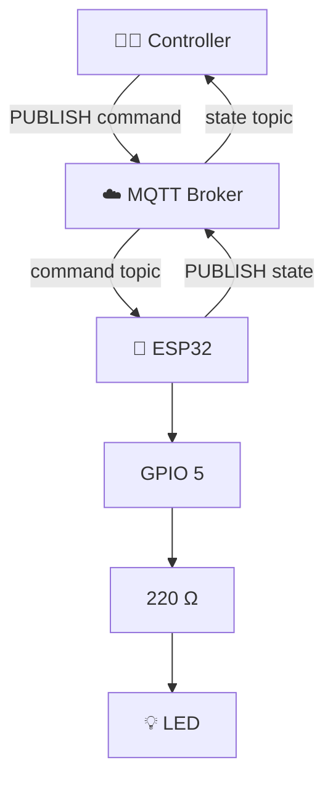
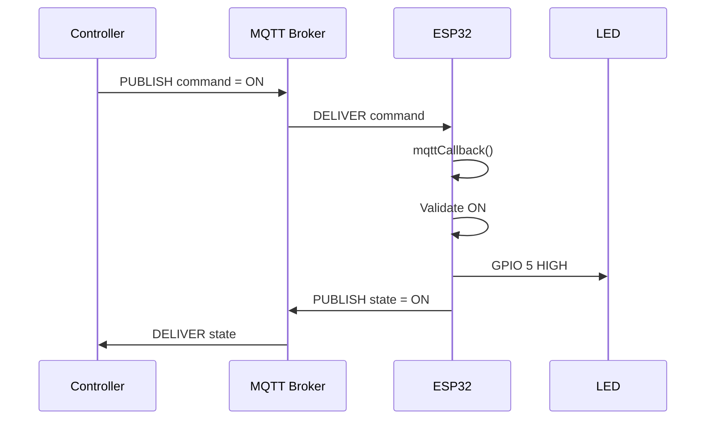
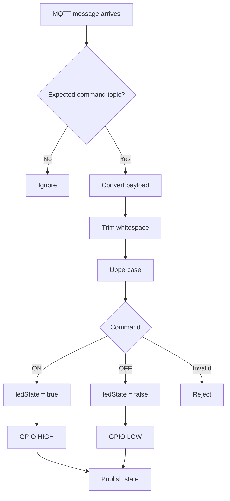
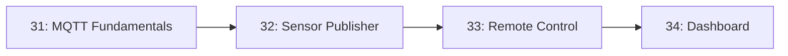

# ⚡ Project 33 — MQTT Remote Device Control Circuit & Communication

## 1. Complete System



---

## 2. Two-Way Message Flow



---

## 3. Command Processing



---

## 4. Connection Recovery

```mermaid
flowchart TD
    A[Main loop] --> B{Wi-Fi connected?}
    B -->|No| C[Reconnect Wi-Fi]
    C --> D{MQTT connected?}
    B -->|Yes| D
    D -->|No| E[Reconnect MQTT]
    E --> F[Subscribe command topic]
    F --> G[Publish current state]
    D -->|Yes| H[mqttClient.loop()]
    G --> H
    H --> A
```

---

## 5. Topic Architecture

```text
iot-student-lab
└── project33
    └── device
        ├── command
        │   ├── ON
        │   └── OFF
        │
        └── state
            ├── ON
            └── OFF
```

---

## 6. Project Progression



### Architectural evolution

```text
31: ESP32 → Broker → Subscriber

32: Sensor → ESP32 → Broker → Consumer

33: Controller ↔ Broker ↔ ESP32 → Actuator

34: MQTT → Data Consumer → Dashboard
```

---

## 7. Command vs State

```text
COMMAND
Controller
   │
   ▼
.../command
   │
   ▼
ESP32

STATE
ESP32
   │
   ▼
.../state
   │
   ▼
Controller
```

This separation allows the system to distinguish **requested action** from **reported device state**.
