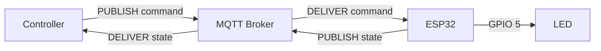
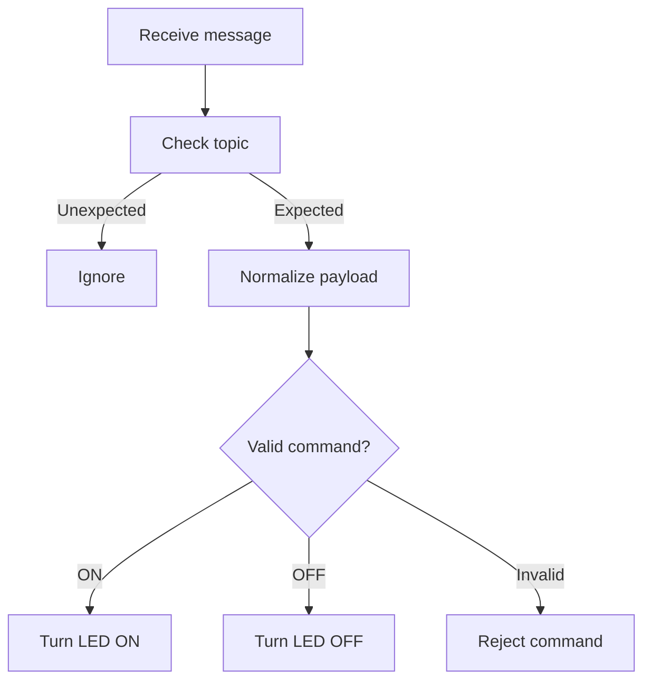
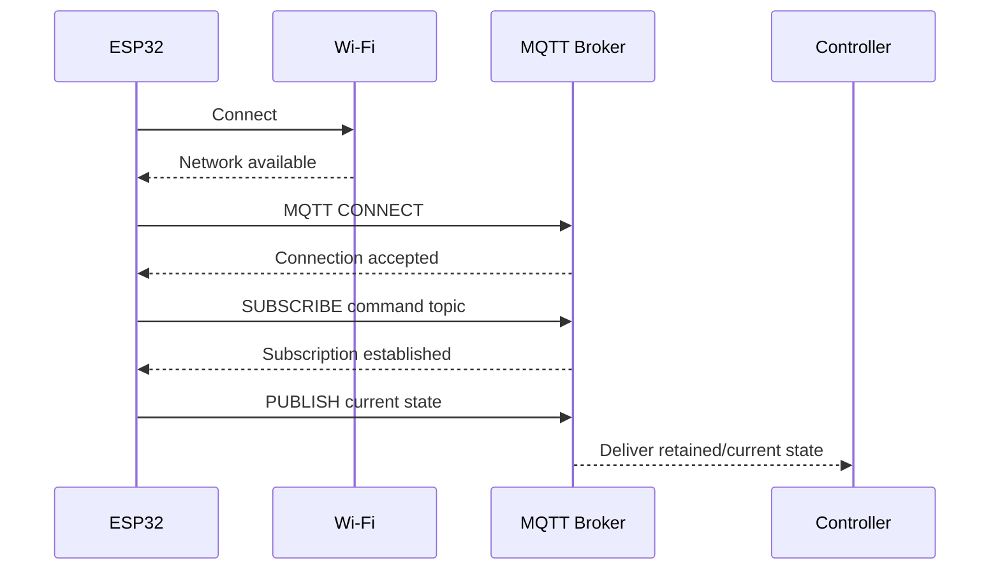
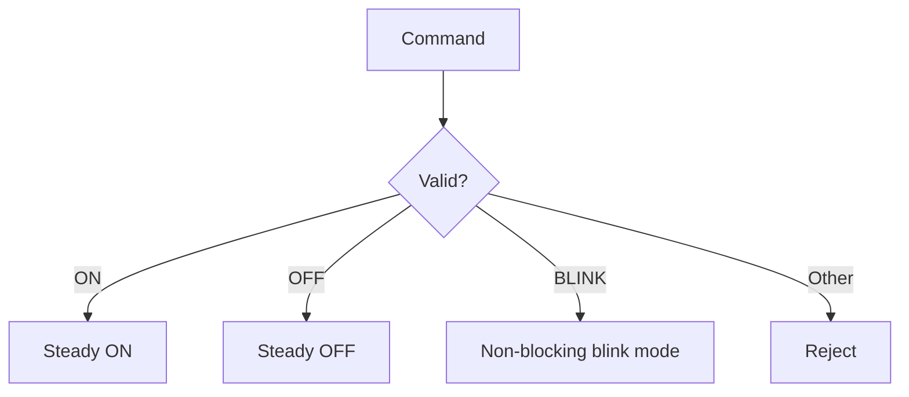
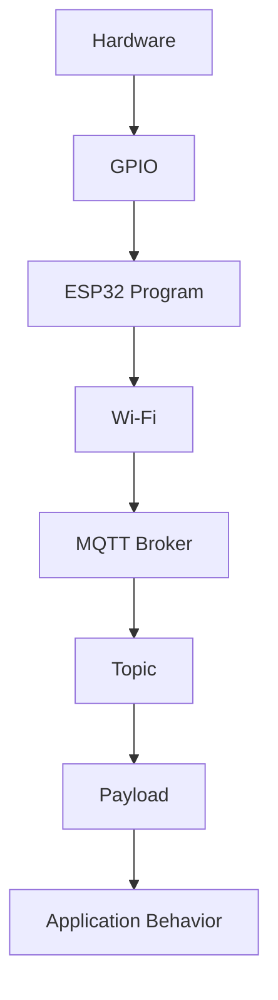
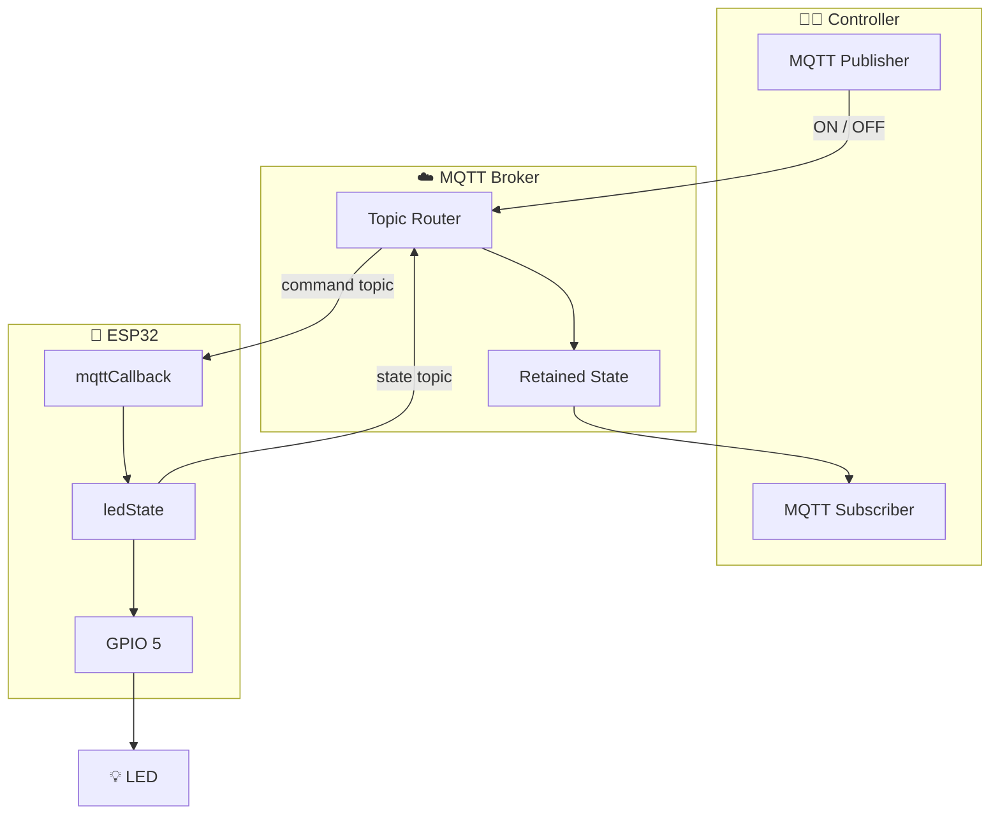

# 📘 Project 33 Notes — MQTT Remote Device Control

> **Classroom Chapter • Maximum-Detail Theory & Practical Notes**

---

# 1. Why Project 33 Matters

Project 33 is one of the most important architectural steps in the Level 5 sequence.

Earlier projects primarily moved information **out of the device**.

Project 31 established MQTT publishing.

Project 32 used MQTT to publish sensor telemetry.

Project 33 introduces the reverse direction:

```text
MQTT → ESP32 → Actuator
```

The ESP32 can now:

```text
RECEIVE
   ↓
INTERPRET
   ↓
DECIDE
   ↓
ACT
   ↓
REPORT
```

This creates a genuine **two-way IoT endpoint**.

The device is no longer merely a sensor node. It can receive instructions, change a physical output, and report what state it believes it has.

---

# 2. Project Progression

| Project | Core concept | Device role |
|---|---|---|
| 31 | MQTT fundamentals | Publisher |
| 32 | Sensor telemetry | Sensor publisher |
| **33** | **Remote control** | **Subscriber + Publisher** |
| 34 | Dashboard | Data consumer / visualization |
| Future | Automation | Closed-loop IoT system |

A useful mental model is:

```text
Project 31
"How do I send an MQTT message?"

Project 32
"How do I send meaningful sensor data?"

Project 33
"How do I receive a command and make the physical world respond?"

Project 34
"How do I turn the messages into useful visual information?"
```

---

# 3. The Central Architecture

The project has two simultaneous message paths.

## Command path

```text
Controller
    │
    │ PUBLISH
    ▼
MQTT Broker
    │
    │ DELIVER
    ▼
ESP32
    │
    │ GPIO
    ▼
LED
```

## State path

```text
ESP32
    │
    │ PUBLISH
    ▼
MQTT Broker
    │
    │ DELIVER
    ▼
Controller
```

Together:



---

# 4. MQTT Roles

An MQTT system is easier to understand when the roles are separated.

## MQTT Client

A client is an application or device that connects to the broker.

In this project:

```text
ESP32 = MQTT Client
Controller = MQTT Client
```

A client can publish, subscribe, or do both.

## MQTT Broker

The broker is the message-routing component.

It receives publications and delivers them to clients whose subscriptions match the published topic.

Conceptually:

```text
Publisher
    ↓
Broker
    ↓
Subscriber
```

The publisher and subscriber do not need a direct connection.

---

# 5. Publisher vs Subscriber

This distinction is fundamental.

### Publisher

A publisher sends a message:

```text
publish(topic, payload)
```

### Subscriber

A subscriber registers interest in a topic:

```text
subscribe(topic)
```

When a matching message arrives, the subscriber receives it.

Project 33 deliberately uses both roles:

```text
ESP32
 ├── SUBSCRIBER → receives command
 └── PUBLISHER  → reports state
```

---

# 6. Why MQTT Is Useful for Control

Imagine a controller connected directly to every device:

```text
Controller ───── ESP32-01
Controller ───── ESP32-02
Controller ───── ESP32-03
Controller ───── ESP32-04
```

As the system grows, direct connections become harder to manage.

With MQTT:

```text
                  Broker
             ┌──────┼──────┐
             │      │      │
           ESP32  ESP32  ESP32
```

The broker provides a common communication layer.

The controller publishes to topics instead of needing to know every device's direct network connection.

This is an example of **loose coupling**.

---

# 7. Topic Design

Project 33 uses two topics.

## Command

```text
iot-student-lab/project33/device/command
```

## State

```text
iot-student-lab/project33/device/state
```

The topic hierarchy can be read conceptually as:

```text
iot-student-lab
       │
       └── project33
              │
              └── device
                    ├── command
                    └── state
```

Topic naming is not just cosmetic.

A topic becomes part of the communication contract between software components.

---

# 8. Command vs State

This is one of the most important concepts in the project.

## Command

A command represents an instruction:

```text
ON
```

It means:

> “Perform the ON action.”

## State

A state represents a reported condition:

```text
ON
```

It means:

> “The device reports its state as ON.”

The same word can appear in both messages while the meanings remain different.

### Why separate them?

Consider:

```text
Controller → ON
```

What if the ESP32 is offline?

The controller has **requested** ON, but the device has not necessarily executed it.

Therefore:

```text
Requested state ≠ automatically guaranteed physical state
```

A good IoT architecture distinguishes commands from reported state.

---

# 9. The Physical Actuator

The project uses an LED because it is:

- inexpensive,
- low voltage,
- visually obvious,
- easy to troubleshoot,
- safe for classroom demonstrations.

The LED is the **actuator**.

An actuator converts an electrical control signal into a physical effect.

Examples:

| Actuator | Physical effect |
|---|---|
| LED | Light |
| Buzzer | Sound |
| Motor | Motion |
| Relay | Electrical switching |
| Servo | Position |
| Valve | Fluid control |

The MQTT architecture does not fundamentally depend on which actuator is attached.

---

# 10. GPIO Control

The LED is connected to GPIO 5.

The basic action is:

```cpp
digitalWrite(LED_PIN, HIGH);
```

for ON and:

```cpp
digitalWrite(LED_PIN, LOW);
```

for OFF.

The important chain is:

```text
MQTT payload
      ↓
Command interpretation
      ↓
Boolean device state
      ↓
GPIO output
      ↓
Electrical signal
      ↓
LED
```

---

# 11. Why Store `ledState`?

The program keeps:

```cpp
bool ledState = false;
```

This variable represents the software's current device state.

It is useful because the program can reason about the device without repeatedly deriving state from hardware.

Conceptually:

```text
ledState = false
       ↓
LED should be OFF
```

After an ON command:

```text
ledState = true
       ↓
LED should be ON
```

Then state reporting can use the same variable.

This gives one logical source of truth for the program's intended output state.

---

# 12. Important Distinction: Software State vs Physical Reality

A variable is not a sensor.

If:

```cpp
ledState = true;
```

the program is saying:

> “The program's commanded/output state is ON.”

That does not independently prove that the physical LED is illuminated.

For a simple classroom circuit, the relationship is straightforward.

In a production system, additional feedback might be required to verify physical state.

This distinction becomes important in larger control systems.

---

# 13. The MQTT Callback

The callback is the key new programming mechanism.

```cpp
void mqttCallback(
  char* topic,
  byte* payload,
  unsigned int length
)
```

The MQTT library invokes this function when a subscribed message is received.

The callback receives:

| Parameter | Meaning |
|---|---|
| `topic` | Topic on which the message arrived |
| `payload` | Message bytes |
| `length` | Payload length |

---

# 14. Why Is the Payload a Byte Array?

MQTT messages are transmitted as data bytes.

The callback receives:

```cpp
byte* payload
```

rather than automatically giving the program a high-level command object.

The program therefore builds a string:

```cpp
String command = "";
```

and copies each payload byte into it.

Conceptually:

```text
MQTT payload bytes
      ↓
Character conversion
      ↓
String
      ↓
"ON"
```

This is an important reminder that network data arrives in a representation that software must interpret.

---

# 15. Input Normalization

The program uses:

```cpp
command.trim();
command.toUpperCase();
```

### `trim()`

Removes surrounding whitespace.

For example:

```text
" ON "
```

can become:

```text
"ON"
```

### `toUpperCase()`

Normalizes:

```text
on
On
oN
ON
```

into:

```text
ON
```

This reduces unnecessary variation in input.

---

# 16. Input Validation

The device should not execute arbitrary input.

Accepted commands:

```text
ON
OFF
```

Rejected example:

```text
HELLO
```

The logic is:



This is a basic but important security and reliability principle:

> **Do not trust external input simply because it arrived through a valid communication channel.**

---

# 17. Event-Driven Programming

Project 32 periodically read a sensor.

Project 33 introduces an event-driven idea:

```text
Message arrives
       ↓
Callback executes
```

The application does not need to write a giant loop that constantly parses incoming messages itself.

Instead:

```text
MQTT library
     ↓
Detect message
     ↓
Call callback
```

This pattern appears throughout software engineering.

Examples include:

- GUI button events,
- web requests,
- network packets,
- interrupts,
- message queues,
- asynchronous application frameworks.

---

# 18. The Main Loop

The main loop includes:

```cpp
mqttClient.loop();
```

This is critical.

The MQTT client library needs regular processing time to:

- receive incoming packets,
- process acknowledgements,
- maintain the MQTT connection,
- invoke callbacks when messages arrive.

Therefore:

```text
loop()
  ↓
mqttClient.loop()
  ↓
Incoming MQTT data processed
  ↓
Callback may execute
```

If the application blocks for long periods, MQTT responsiveness can suffer.

---

# 19. Why Long Delays Are a Problem

Suppose a program does:

```text
delay(30000)
```

During that time, the application is not giving normal execution time to the MQTT client loop.

That can interfere with communication.

A general embedded-systems principle is:

> **Keep the main loop responsive.**

For more advanced behavior such as blinking, timers should preferably be designed with non-blocking techniques such as `millis()`.

---

# 20. MQTT Connection Sequence

At startup:



The exact broker behavior depends on the MQTT session and configuration, but the architectural sequence is the important concept.

---

# 21. Reconnection

Networks fail.

Possible causes include:

- Wi-Fi signal loss,
- router restart,
- broker restart,
- temporary network congestion,
- power interruption,
- access-point changes.

Therefore the device checks its connections.

Conceptually:

```text
Is Wi-Fi connected?
       │
       ├── No → reconnect Wi-Fi
       │
       └── Yes
              ↓
        Is MQTT connected?
              │
              ├── No → reconnect MQTT
              │          ↓
              │       resubscribe
              │          ↓
              │       publish state
              │
              └── Yes → process MQTT traffic
```

---

# 22. Why Resubscription Matters

A subscription belongs to an MQTT connection/session context.

After a successful reconnect, the program explicitly subscribes again:

```cpp
mqttClient.subscribe(MQTT_COMMAND_TOPIC);
```

This ensures the ESP32 continues listening for commands.

A common beginner mistake is:

```text
Connect once
Subscribe once
Assume it will work forever
```

Real IoT systems must consider connection recovery.

---

# 23. Safe Startup

The project starts with:

```cpp
ledState = false;
digitalWrite(LED_PIN, LOW);
```

This establishes a deterministic startup condition.

### Why deterministic state matters

Imagine a future actuator:

```text
Pump
Valve
Motor
Heater
```

An undefined startup condition can become a safety problem.

Therefore:

```text
Power-up
   ↓
Known safe state
   ↓
Network initialization
   ↓
Communication
   ↓
Normal control
```

is a useful design pattern.

---

# 24. Retained MQTT State

The state is published using MQTT's retained-message mechanism.

Conceptually:

```text
ESP32
  │
  │ publish state = ON
  ▼
Broker
  │
  │ retain latest message
  ▼
New subscriber
  │
  │ subscribes
  ▼
Receives latest retained state
```

This is useful for state-like information.

### Important limitation

Retained state does not mean:

> “The broker continuously verifies the physical actuator.”

It means the broker retains the latest published message.

If the device fails after publishing `ON`, the broker may still hold `ON` until another message replaces it or the retained message is cleared.

That is why **reported state, retained state, and actual physical state are distinct concepts**.

---

# 25. Controller → Device Message Flow

Suppose the controller publishes:

```text
Topic:
iot-student-lab/project33/device/command

Payload:
ON
```

The complete sequence is:

```text
Controller
    │
    │ PUBLISH
    ▼
MQTT Broker
    │
    │ Topic matching
    ▼
ESP32 subscription
    │
    ▼
mqttCallback()
    │
    ▼
Topic validation
    │
    ▼
Payload normalization
    │
    ▼
Command = ON
    │
    ▼
ledState = true
    │
    ▼
GPIO 5 HIGH
    │
    ▼
LED ON
    │
    ▼
publishDeviceState()
    │
    ▼
State topic = ON
```

---

# 26. Device → Controller Message Flow

After changing state:

```text
ESP32
  │
  │ PUBLISH
  ▼
Broker
  │
  │ State topic
  ▼
Controller
```

This closes the communication loop.

The controller can therefore observe the device's reported state rather than relying only on the command it previously sent.

---

# 27. Open-Loop vs Feedback-Oriented Control

A simple remote command system could be:

```text
Controller → Device
```

This is effectively one-way control.

Project 33 adds:

```text
Controller → Device
Device → Controller
```

The second direction provides state information.

This is not yet a fully closed-loop control system in the control-engineering sense, because the project does not measure an independent physical process variable and automatically correct it.

However, it introduces the **communication pattern required for richer feedback-oriented systems**.

---

# 28. Command and State as a Contract

The project effectively defines an interface:

```text
COMMAND
Topic: .../command
Payload: ON | OFF
```

and:

```text
STATE
Topic: .../state
Payload: ON | OFF
```

This is a simple protocol contract.

If the controller publishes:

```text
TURNON
```

but the device expects:

```text
ON
```

communication exists, but the application-level protocol is incompatible.

This demonstrates an important principle:

> **Connectivity does not guarantee interoperability.**

Both sides must agree on:

- topic names,
- payload format,
- allowed values,
- state semantics.

---

# 29. Device Identity

The MQTT client ID is:

```text
iot-student-esp32-33
```

A client ID identifies an MQTT client to the broker.

In a multi-device deployment, IDs should be unique.

For example:

```text
iot-student-esp32-33-01
iot-student-esp32-33-02
iot-student-esp32-33-03
```

If multiple devices accidentally use the same client identity, broker behavior can become problematic because the devices are attempting to represent themselves as the same MQTT client.

---

# 30. Scaling Topic Namespaces

For one device:

```text
iot-student-lab/project33/device/command
iot-student-lab/project33/device/state
```

For multiple devices:

```text
iot-student-lab/devices/esp32-01/command
iot-student-lab/devices/esp32-01/state

iot-student-lab/devices/esp32-02/command
iot-student-lab/devices/esp32-02/state
```

For larger systems, topic namespaces might include:

```text
organization
site
building
floor
room
device
data type
```

For example:

```text
lab/building-a/room-101/device-07/command
lab/building-a/room-101/device-07/state
```

The exact namespace is a design decision, but consistency becomes increasingly important as systems grow.

---

# 31. Multiple Devices — Design Exercise

Suppose three ESP32 devices exist:

```text
ESP32-01 = Light
ESP32-02 = Fan
ESP32-03 = Door
```

Design a topic tree.

One possible conceptual model:

```text
lab/devices/esp32-01/command
lab/devices/esp32-01/state

lab/devices/esp32-02/command
lab/devices/esp32-02/state

lab/devices/esp32-03/command
lab/devices/esp32-03/state
```

Now ask:

- Can one controller address one device?
- Can a dashboard subscribe to all state messages?
- How would you identify device type?
- How would you prevent one device from receiving another's commands?

These questions lead naturally toward MQTT wildcard subscriptions and authorization rules.

---

# 32. Experiment: Add BLINK

A useful extension is:

```text
ON
OFF
BLINK
```

The important design question is not simply:

> “How do I make an LED blink?”

Instead ask:

> “How do I add a new command without breaking the existing command protocol?”

A robust design might become:



This introduces **command sets** and eventually **device modes**.

---

# 33. Experiment: Second LED

Add a second actuator.

Possible topics:

```text
project33/led1/command
project33/led1/state

project33/led2/command
project33/led2/state
```

This introduces the problem of representing multiple resources.

A more scalable alternative may use structured payloads:

```json
{
  "device": "led2",
  "command": "ON"
}
```

Students should compare the two approaches.

---

# 34. Experiment: Structured Payloads

Plain text:

```text
ON
```

is easy for beginners.

Structured data:

```json
{
  "device": "led",
  "command": "ON"
}
```

contains more information.

### Plain text advantages

- Simple.
- Easy to inspect.
- Minimal parsing.
- Good for first experiments.

### Structured data advantages

- Can contain multiple fields.
- Easier to extend.
- Better suited to richer APIs.

### Structured data introduces

- Parsing.
- Validation.
- Schema design.
- Error handling.
- Additional memory/processing requirements.

The correct lesson is not that JSON is always better.

The lesson is:

> **Choose a message representation appropriate to the system's complexity.**

---

# 35. Experiment: Add a Status Message

Imagine a richer state message:

```json
{
  "device": "esp32-33",
  "led": "ON",
  "wifi": true,
  "mqtt": true
}
```

This could evolve into an observability topic.

Possible architecture:

```text
Command
   ↓
Device
   ├── State
   ├── Connectivity
   └── Diagnostics
```

This leads toward production IoT telemetry and device management.

---

# 36. Experiment: Command Acknowledgement

A command and state message are not necessarily the same thing.

Consider adding:

```text
.../command
.../state
.../ack
```

An acknowledgement might indicate:

```text
Command received
```

while state indicates:

```text
Current reported state
```

This creates three different semantics:

| Message | Meaning |
|---|---|
| Command | Requested action |
| ACK | Message received/accepted |
| State | Reported device condition |

This distinction becomes valuable in unreliable or distributed systems.

---

# 37. Troubleshooting Methodology

Do not debug the entire system at once.

Use layers.



If the LED does not turn on, ask:

1. Is the LED wired correctly?
2. Does a simple GPIO test work?
3. Is the ESP32 connected to Wi-Fi?
4. Is MQTT connected?
5. Is the ESP32 subscribed?
6. Is the publisher using the exact topic?
7. Is the payload valid?
8. Does the callback execute?
9. Does `ledState` change?
10. Does GPIO 5 change?

This is **fault isolation**.

---

# 38. Fault Isolation Table

| Symptom | Likely layer | First check |
|---|---|---|
| No LED | Hardware | LED orientation/resistor/GND |
| GPIO test fails | Hardware/GPIO | Pin and wiring |
| No Wi-Fi | Network | SSID/password |
| No MQTT | Broker/network | Broker address/port |
| No command callback | MQTT/topic | Subscription + exact topic |
| Callback executes but LED unchanged | Logic/GPIO | Command comparison + `digitalWrite()` |
| LED changes but no state | MQTT publish | State topic + publish result |
| Works once, then stops | Connection handling | Reconnection/resubscription |
| Invalid command changes LED | Validation | Command parser |

---

# 39. Serial Monitor as an Observability Tool

Serial output provides visibility into an otherwise invisible network process.

Useful information includes:

```text
Wi-Fi connected
IP Address
RSSI
MQTT connection result
Subscription result
Received topic
Received payload
Command accepted/rejected
State publish result
```

The Serial Monitor therefore acts as a basic **diagnostic interface**.

In production systems, similar information may be sent to:

- logs,
- monitoring systems,
- cloud observability platforms,
- dashboards,
- device-management services.

---

# 40. Testing Matrix

A professional test is more than:

> “It worked once.”

Test categories should include:

| Category | Test |
|---|---|
| Startup | Device begins in OFF state |
| Connectivity | Wi-Fi connects |
| MQTT | Broker connection succeeds |
| Subscription | Command topic is subscribed |
| Positive input | ON accepted |
| Positive input | OFF accepted |
| Normalization | lowercase accepted |
| Invalid input | HELLO rejected |
| State | ON reported |
| State | OFF reported |
| Recovery | MQTT reconnects |
| Recovery | Subscription restored |
| Retained state | New subscriber receives latest retained state |
| Repeated operation | Multiple commands work |

---

# 41. Network Failure Experiment

A valuable classroom experiment:

1. Connect the ESP32.
2. Verify command control.
3. Interrupt MQTT connectivity.
4. Observe the Serial Monitor.
5. Restore connectivity.
6. Observe reconnection.
7. Verify that the command subscription is restored.
8. Verify state publication.

Students should observe that reliable IoT systems must handle failure as a normal condition.

---

# 42. Security — Why Control Is More Sensitive Than Telemetry

Project 32 primarily sent sensor data.

Project 33 receives commands.

That changes the security risk.

Telemetry compromise may expose information.

Control compromise can potentially cause physical action.

Therefore command channels should be treated as security-sensitive.

Production systems should consider:

```text
Authentication
      +
Authorization
      +
Encryption
      +
Device identity
      +
Secure credentials
```

A device should not accept arbitrary control commands from unauthorized publishers.

---

# 43. MQTT Port 1883

The project uses:

```text
1883
```

This is the conventional MQTT port for non-TLS MQTT.

For production systems, encrypted MQTT commonly uses TLS, typically associated with port:

```text
8883
```

The important concept is:

```text
1883
= basic MQTT transport without TLS by default

8883
= commonly used MQTT over TLS
```

Port numbers themselves do not create security. Proper broker configuration, certificates, authentication, and authorization are still required.

---

# 44. Physical Safety vs Cybersecurity

Project 33 teaches two different safety dimensions.

## Physical safety

Protect:

- students,
- components,
- power supplies,
- actuators,
- equipment.

## Cybersecurity

Protect:

- credentials,
- broker,
- topics,
- devices,
- control authority.

A remote actuator combines both domains.

```text
Cyber command
      ↓
Network
      ↓
Device
      ↓
Physical action
```

That bridge is one of the defining characteristics of IoT security.

---

# 45. Classroom Discussion: What If the Broker Lies?

Suppose the ESP32 publishes:

```text
ON
```

and then immediately loses power.

The broker may retain:

```text
ON
```

A new subscriber could receive the retained message.

Does that prove the LED is ON?

**No.**

It proves:

> The broker's latest retained report is ON.

This is a powerful systems-engineering lesson about the difference between:

```text
Reported state
```

and:

```text
Observed physical state
```

---

# 46. Classroom Discussion: What If the Command Is Delayed?

Suppose:

```text
Controller → ON
```

but the network is delayed.

The controller may display:

```text
ON requested
```

while the ESP32 remains:

```text
OFF
```

until the message arrives.

This introduces distributed-system concepts:

- latency,
- asynchronous communication,
- eventual state change,
- stale information.

IoT systems should not assume instantaneous communication.

---

# 47. Classroom Discussion: What If Two Controllers Send Commands?

Suppose:

```text
Controller A → ON
Controller B → OFF
```

Both publish to the same topic.

The ESP32 receives messages according to broker/network delivery behavior.

The final state may depend on message ordering and timing.

This raises design questions:

- Who has control authority?
- Should commands contain timestamps?
- Should commands have sequence numbers?
- Should a controller lock the device?
- Should conflicting commands be rejected?
- Should the device expose an ownership concept?

These are advanced topics that grow naturally from this small project.

---

# 48. Engineering Challenge — Smart Room

Design a system with:

```text
Light
Fan
Auxiliary Device
```

Each device should have:

```text
command
state
```

Example:

```text
room/light/command
room/light/state

room/fan/command
room/fan/state

room/aux/command
room/aux/state
```

Then design:

```text
                    MQTT Broker
                 /       |       \
                /        |        \
           Light        Fan       Aux
```

The controller should be able to:

- turn one device on/off,
- observe each state,
- issue an all-off command,
- recover from broker disconnection.

---

# 49. Design Questions for Students

Before expanding the project, answer:

### Q1
Why is a broker useful?

### Q2
Why does the ESP32 subscribe rather than repeatedly poll an application?

### Q3
Why are command and state topics different?

### Q4
What happens if a command arrives on the wrong topic?

### Q5
Why normalize `on` to `ON`?

### Q6
Why reject unknown commands?

### Q7
Why publish state after accepting a command?

### Q8
Why publish state after MQTT reconnects?

### Q9
Why is retained state useful?

### Q10
Why can retained state become stale?

### Q11
How would you secure the command topic?

### Q12
How would you design topics for 100 devices?

---

# 50. Knowledge Check With Answers

### 1. What is MQTT?

A lightweight publish/subscribe messaging protocol commonly used for connected devices.

### 2. What is a broker?

A server that receives MQTT publications and routes them to matching subscribers.

### 3. What is a topic?

A named communication channel used to organize MQTT messages.

### 4. What is a payload?

The application data carried by an MQTT message.

### 5. What is the callback?

A function invoked by the MQTT client library when a subscribed message is received.

### 6. Why use two topics?

To separate requested commands from reported state.

### 7. Why use retained state?

So a new subscriber can receive the broker's latest retained state message.

### 8. Why reconnect?

Network connections can fail and IoT devices are expected to recover.

### 9. Why resubscribe?

The device needs to restore its command subscription after reconnecting.

### 10. Why validate commands?

Because external messages are input and should not be blindly trusted.

---

# 51. Student Experiment Record

Students should document observations rather than only recording whether something worked.

| Experiment | Observation | Explanation |
|---|---|---|
| ON | | |
| OFF | | |
| lowercase `on` | | |
| invalid command | | |
| broker disconnect | | |
| broker reconnect | | |
| retained state | | |
| second device design | | |

---

# 52. Instructor Demonstration Sequence

A useful classroom sequence is:

### Stage 1 — Show the architecture

```text
Controller
   ↓
Broker
   ↓
ESP32
   ↓
LED
```

### Stage 2 — Send ON

Students observe the physical LED.

### Stage 3 — Show state message

Students observe:

```text
.../state → ON
```

### Stage 4 — Send invalid command

Show input validation.

### Stage 5 — Disconnect MQTT

Show that networking is not always reliable.

### Stage 6 — Reconnect

Show subscription restoration and state publication.

### Stage 7 — Discuss scaling

Move from:

```text
one LED
```

to:

```text
100 devices
```

This progression moves students from syntax to system thinking.

---

# 53. Common Beginner Misconceptions

## Misconception 1

> “MQTT directly connects my controller to the ESP32.”

More accurately:

```text
Controller
   ↓
Broker
   ↓
ESP32
```

The broker provides message routing.

---

## Misconception 2

> “Subscribe means the ESP32 continuously downloads everything.”

No.

The ESP32 subscribes to specific topic filters and receives matching messages.

---

## Misconception 3

> “If the command was published, the device must have changed.”

Not necessarily.

The device may be:

- offline,
- disconnected,
- rejecting the command,
- unable to execute it,
- experiencing a hardware problem.

---

## Misconception 4

> “State message always equals physical reality.”

Not necessarily.

State is a **report**.

Independent feedback may be needed to verify physical reality.

---

## Misconception 5

> “Wi-Fi and MQTT are the same thing.”

They are different layers.

```text
Application messaging → MQTT
Network connectivity  → Wi-Fi/IP
```

---

# 54. Wi-Fi vs MQTT

| Layer / technology | Role |
|---|---|
| Wi-Fi | Provides wireless network connectivity |
| IP | Provides network addressing/routing |
| TCP | Reliable transport |
| MQTT | Application-level messaging |
| GPIO | Physical electrical control |

The full chain is:

```text
Controller
   ↓
MQTT
   ↓
TCP/IP
   ↓
Wi-Fi
   ↓
ESP32
   ↓
GPIO
   ↓
LED
```

This layered view connects Project 33 to networking concepts learned earlier.

---

# 55. From Remote Control to Automation

Remote control:

```text
Human
  ↓
Command
  ↓
Device
```

Automation:

```text
Sensor
  ↓
Decision logic
  ↓
Command
  ↓
Device
```

Project 33 provides the command pathway needed for automation.

Later, a sensor or rules engine could become the controller.

Example:

```text
Temperature > threshold
        ↓
Decision
        ↓
Fan ON command
        ↓
MQTT
        ↓
ESP32
        ↓
Fan
```

This is the foundation of more advanced IoT control systems.

---

# 56. Project 33 and the Future Dashboard

Project 34 can consume the state topic:

```text
iot-student-lab/project33/device/state
```

and display:

```text
┌───────────────────────────────┐
│        DEVICE STATUS          │
│                               │
│        💡 LIGHT: ON           │
│                               │
│        MQTT: CONNECTED        │
│        Wi-Fi: CONNECTED       │
└───────────────────────────────┘
```

This demonstrates how MQTT becomes the communication layer between:

```text
Device
   ↓
Broker
   ↓
Application
   ↓
Dashboard
```

---

# 57. Advanced Extension Roadmap

After mastering the base project, students can progress through:

```text
1. ON / OFF
      ↓
2. BLINK
      ↓
3. Multiple LEDs
      ↓
4. Device-specific topics
      ↓
5. Structured JSON
      ↓
6. State + ACK
      ↓
7. Authentication
      ↓
8. TLS
      ↓
9. Dashboard
      ↓
10. Sensor-driven automation
```

Each stage adds one layer of complexity.

---

# 58. Final System Diagram



---

# 59. Final Takeaways

Students should leave Project 33 understanding these ideas:

### MQTT

```text
Publish
Subscribe
Broker
Topic
Payload
```

### Embedded programming

```text
Callback
GPIO
State
Validation
Safe startup
```

### IoT architecture

```text
Command
   ↓
Device
   ↓
State
```

### Reliability

```text
Disconnect
   ↓
Reconnect
   ↓
Resubscribe
   ↓
Resume
```

### Systems thinking

```text
Requested state
      ≠
Reported state
      ≠
Guaranteed physical reality
```

That final distinction is especially important as students move toward real-world IoT systems.

---

# 60. Project 31 → 32 → 33 → 34

```text
┌───────────────────────────────────────────────────────────┐
│ PROJECT 31                                                │
│ MQTT Fundamentals                                         │
│                                                           │
│ ESP32 ──► Broker ──► Subscriber                           │
└───────────────────────────────┬───────────────────────────┘
                                ▼
┌───────────────────────────────────────────────────────────┐
│ PROJECT 32                                                │
│ ESP32 MQTT Sensor Publisher                               │
│                                                           │
│ Sensor ──► ESP32 ──► Broker ──► Consumer                  │
└───────────────────────────────┬───────────────────────────┘
                                ▼
┌───────────────────────────────────────────────────────────┐
│ PROJECT 33                                                │
│ MQTT Remote Device Control                               │
│                                                           │
│ Controller ◄──► Broker ◄──► ESP32 ──► Actuator            │
└───────────────────────────────┬───────────────────────────┘
                                ▼
┌───────────────────────────────────────────────────────────┐
│ PROJECT 34                                                │
│ IoT Dashboard & Visualization                             │
│                                                           │
│ MQTT ──► Data Consumer ──► Dashboard                     │
└───────────────────────────────────────────────────────────┘
```

**The Level 5 architectural transition is complete:**

```text
SEND
 ↓
SENSE + SEND
 ↓
RECEIVE + CONTROL + REPORT
 ↓
VISUALIZE
 ↓
AUTOMATE
```
