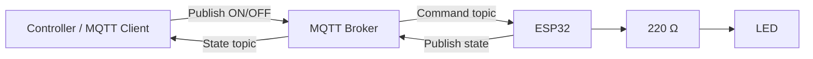

# 🔌 Project 33 — MQTT Remote Device Control Wiring

## Hardware

| Component | Quantity | Purpose |
|---|---:|---|
| ESP32 development board | 1 | Wi-Fi + MQTT endpoint |
| LED | 1 | Actuator |
| 220 Ω resistor | 1 | LED current limiting |
| Breadboard | 1 | Prototyping |
| Jumper wires | As required | Connections |
| USB cable | 1 | Power/programming |
| Wi-Fi network | 1 | Connectivity |
| MQTT broker | 1 | Message routing |
| MQTT client | 1 | Command/state testing |

---

## 💡 LED Wiring

| ESP32 | LED circuit |
|---|---|
| GPIO 5 | 220 Ω resistor |
| Resistor output | LED anode (+) |
| LED cathode (−) | GND |

```text
ESP32 GPIO 5
     │
     ▼
   220 Ω
     │
     ▼
 LED Anode (+)
 LED Cathode (-)
     │
     ▼
    GND
```

⚠️ **Important:** Never connect the LED directly to GPIO 5. Use the 220 Ω resistor.

---

## 🌐 Network Architecture

The physical circuit is small, but the complete project contains both hardware and network components:



---

## 📡 MQTT Topics

### Command

```text
iot-student-lab/project33/device/command
```

Payloads:

```text
ON
OFF
```

### State

```text
iot-student-lab/project33/device/state
```

Payloads:

```text
ON
OFF
```

---

## 🔄 Controller → ESP32

```text
Controller
    │
    │ PUBLISH "ON"
    ▼
MQTT Broker
    │
    │ DELIVER
    ▼
ESP32
    │
    ▼
GPIO 5 HIGH
    │
    ▼
LED ON
```

## 🔁 ESP32 → Controller

```text
ESP32
    │
    │ PUBLISH "ON"
    ▼
MQTT Broker
    │
    ▼
Controller
```

---

## 🧪 Wiring Verification

Before testing MQTT:

- [ ] LED anode is connected through 220 Ω.
- [ ] LED cathode is connected to GND.
- [ ] GPIO 5 is the signal pin.
- [ ] No GPIO is exposed to 5 V.
- [ ] ESP32 is powered through USB.
- [ ] Breadboard connections are secure.

### Fault-isolation order

```text
LED wiring
   ↓
GPIO test
   ↓
Wi-Fi
   ↓
MQTT broker
   ↓
Subscription
   ↓
Command topic
   ↓
Payload
   ↓
State publication
```

---

## ⚠️ Safety

This project uses a low-voltage LED only.

Do not connect mains appliances or exposed AC wiring to this circuit.

For future relay projects, use properly rated modules, suitable isolation, separate power where required, and low-voltage classroom loads.
