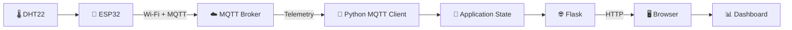
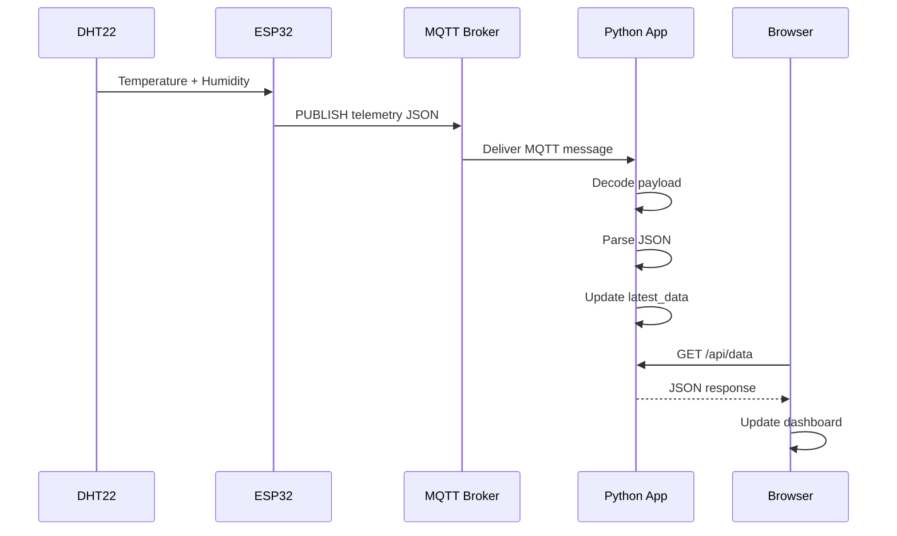
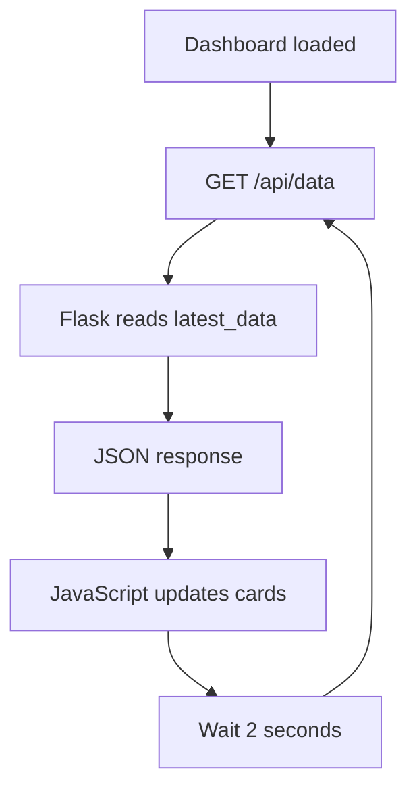
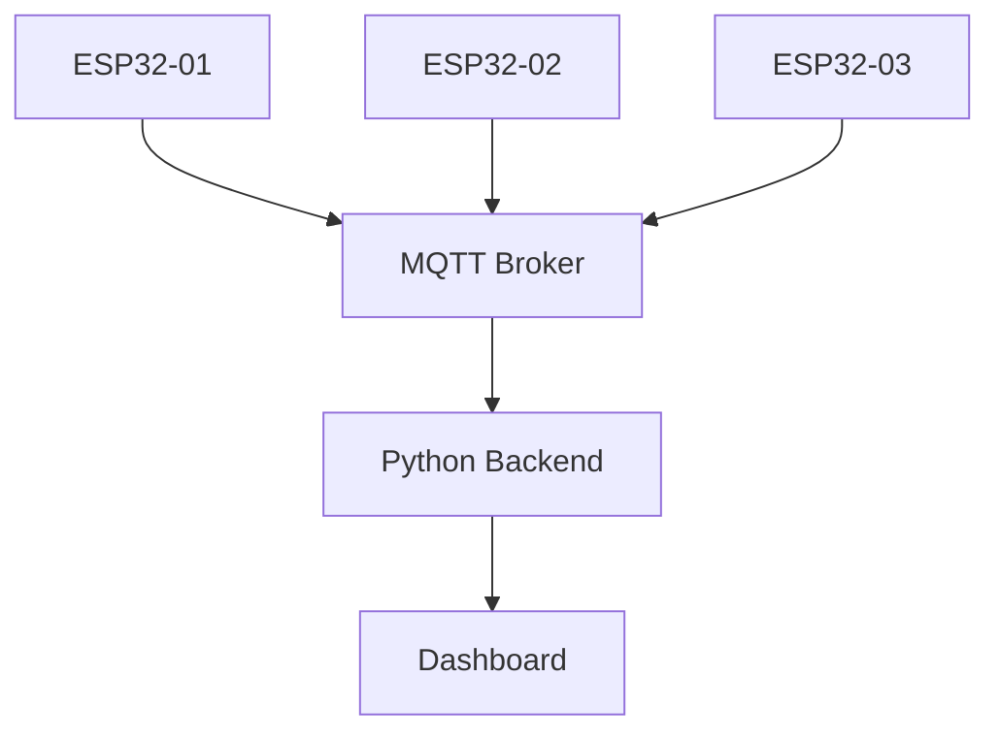

# 📊 Project 34 — IoT Dashboard & Data Visualization

> **Level 5 • Advanced IoT • MQTT → Python → Web Dashboard**

## 🎯 Project Overview

Project 34 introduces the **application and visualization layer** of the IoT system.

Projects 31–33 established MQTT communication, sensor telemetry, and remote control. Project 34 takes the telemetry produced by Project 32 and turns it into information a human can understand through a local web dashboard.

```text
DHT22 → ESP32 → Wi-Fi → MQTT Broker → Python MQTT Client → Flask → Browser → 📊 Dashboard
```

The central learning path is:

> **Embedded device → messaging → application → visualization**

---

## 🧠 Learning Objectives

Students will learn to:

- Explain why IoT systems need an application layer.
- Subscribe to MQTT telemetry using Python.
- Decode MQTT payloads and parse JSON.
- Maintain the latest application state.
- Build a lightweight Flask web application.
- Expose data through an HTTP API.
- Use browser-side JavaScript to update a dashboard.
- Understand polling and near-real-time visualization.
- Trace data across hardware, network, messaging, backend and frontend layers.
- Diagnose failures systematically.
- Distinguish live telemetry from historical data.
- Identify requirements for a production IoT dashboard.

---

# 🚀 What Are We Building?

Project 32 produces telemetry such as:

```json
{
  "reading": 12,
  "temperature": 25.60,
  "humidity": 61.20
}
```

Project 34 transforms it into human-readable information:

```text
┌──────────────────────────────────┐
│        IoT STUDENT LAB           │
│                                  │
│   🌡️ Temperature                 │
│       25.60 °C                   │
│                                  │
│   💧 Humidity                     │
│       61.20 %                    │
│                                  │
│   📈 Reading                      │
│       12                         │
│                                  │
│   🟢 MQTT: CONNECTED             │
└──────────────────────────────────┘
```

---

# 🔄 Project 31 → 34 Progression

| Project | Main capability | Direction |
|---|---|---|
| 31 | MQTT fundamentals | ESP32 → Broker → Subscriber |
| 32 | Sensor telemetry | Sensor → ESP32 → Broker |
| 33 | Remote control | Controller ↔ Broker ↔ ESP32 |
| **34** | **Dashboard & visualization** | **MQTT → Application → Browser** |
| 35 | Persistence | MQTT → Backend → Database |

```text
SEND
  ↓
SENSE + SEND
  ↓
RECEIVE + CONTROL + REPORT
  ↓
PROCESS + VISUALIZE
  ↓
STORE + ANALYZE
```

---

# 🧩 System Components

| Component | Role |
|---|---|
| DHT22 | Measures temperature and humidity |
| ESP32 | Reads sensor and publishes telemetry |
| Wi-Fi | Provides network connectivity |
| MQTT Broker | Routes telemetry messages |
| Python | Application/backend logic |
| Paho MQTT | Python MQTT client |
| Flask | Web framework |
| JavaScript | Browser-side dashboard logic |
| Browser | Presents information visually |

---

# 🌐 Complete Architecture



### Layered architecture

```text
┌────────────────────────────────────┐
│ PRESENTATION                       │
│ Browser + HTML + CSS + JavaScript │
├────────────────────────────────────┤
│ APPLICATION                        │
│ Flask + Python State              │
├────────────────────────────────────┤
│ MESSAGING                          │
│ MQTT + Broker                     │
├────────────────────────────────────┤
│ NETWORK                            │
│ Wi-Fi + IP + TCP                  │
├────────────────────────────────────┤
│ DEVICE                             │
│ ESP32 + DHT22                     │
└────────────────────────────────────┘
```

---

# 📡 MQTT Topic

The dashboard subscribes to:

```text
iot-student-lab/project32/telemetry
```

Expected payload:

```json
{
  "reading": 12,
  "temperature": 25.60,
  "humidity": 61.20
}
```

The topic and JSON structure form an **application-level communication contract**.

If the publisher changes either one, the consumer may need to change too.

---

# 🔁 End-to-End Data Flow



---

# 🐍 Python as an Integration Layer

The Python application has two major responsibilities:

### 1. MQTT consumer

Receives telemetry from the broker.

### 2. Web application

Makes the latest information available to the browser.

Therefore:

```text
MQTT World
     │
     ▼
Python Application
     │
     ▼
HTTP / Web World
```

This is a common integration pattern in IoT systems.

---

# 🧾 JSON Data Processing

The incoming MQTT message is a byte payload.

The application transforms it:

```text
MQTT bytes
   ↓
UTF-8 text
   ↓
JSON document
   ↓
Python dictionary
   ↓
temperature / humidity / reading
   ↓
Application state
```

JSON is useful because field names make the message self-describing.

---

# 🌐 Flask API

The application exposes:

| Route | Purpose |
|---|---|
| `/` | Dashboard page |
| `/api/data` | Current telemetry as JSON |

A request to:

```text
GET /api/data
```

may return:

```json
{
  "reading": 20,
  "temperature": 26.10,
  "humidity": 59.40,
  "timestamp": 1780000000,
  "connected": true
}
```

The browser does not need to understand MQTT.

Instead:

```text
ESP32 → MQTT → Python → HTTP → Browser
```

---

# 🔄 Dashboard Polling

The browser requests `/api/data` every two seconds.



This technique is called **polling**.

It provides a simple near-real-time experience.

More advanced systems may use:

- WebSockets
- Server-Sent Events
- streaming/event systems

---

# ⚡ Near-Real-Time vs Historical

The current dashboard shows the latest value.

```text
LIVE
  ✓ Latest reading

HISTORY
  ✗ Not stored permanently
```

To answer:

> “What was the temperature during the last 24 hours?”

the system needs persistent storage.

---

# 🧪 Testing Procedure

### Test 1 — Sensor node

Verify Project 32 independently:

```text
DHT22 → ESP32 → MQTT Broker
```

### Test 2 — Python application

Verify:

```text
Connected to MQTT broker.
Subscribed to:
iot-student-lab/project32/telemetry
```

### Test 3 — Dashboard

Open:

```text
http://localhost:5000
```

### Test 4 — Observe

Check:

- Temperature appears.
- Humidity appears.
- Reading number appears.
- MQTT status is shown.
- Last-update time changes.

---

# 📊 Observation Table

| Test | Expected result | Done |
|---|---|---|
| ESP32 online | Telemetry arrives | ☐ |
| Python connects | CONNECTED | ☐ |
| Topic subscribed | Subscription succeeds | ☐ |
| Dashboard opens | Page loads | ☐ |
| Temperature | Numeric value | ☐ |
| Humidity | Numeric value | ☐ |
| Reading | Reading number | ☐ |
| Refresh | Values update | ☐ |
| Invalid JSON | Error handled | ☐ |
| MQTT disconnect | Status changes | ☐ |

---

# 🧰 Troubleshooting

## Dashboard shows `--`

Trace the system:

```text
DHT22
 ↓
ESP32
 ↓
Wi-Fi
 ↓
MQTT Broker
 ↓
MQTT Topic
 ↓
Python Subscriber
 ↓
Application State
 ↓
Flask API
 ↓
Browser
```

Find the **first failing layer**.

### Python cannot connect

Check:

- MQTT broker address.
- MQTT port.
- Broker availability.

### Python connects but receives nothing

Check:

- Exact topic.
- Project 32 is publishing.
- Broker is the same.
- Subscription succeeded.

### JSON parsing fails

Expected structure:

```json
{
  "reading": 1,
  "temperature": 25.5,
  "humidity": 60
}
```

A plain-text payload will not match the current parser.

### Browser has an API error

Check:

- Flask is running.
- Port 5000 is available.
- `/api/data` returns valid JSON.
- Browser developer console for JavaScript errors.

---

# 🧪 Experiments

## Experiment 1 — Dashboard Identity

Add:

```text
Device: ESP32-01
```

Discuss whether the value is:

- hard-coded,
- received from MQTT,
- generated by the backend.

---

## Experiment 2 — Temperature Warning

Create a warning for:

```text
temperature > 30 °C
```

Display:

```text
⚠️ HIGH TEMPERATURE
```

Discuss whether the rule belongs on:

- ESP32,
- backend,
- browser.

---

## Experiment 3 — Humidity Warning

Add:

```text
humidity > 80 %
```

Test values below, at and above the threshold.

---

## Experiment 4 — Device ID

Extend telemetry:

```json
{
  "device_id": "esp32-01",
  "reading": 25,
  "temperature": 26.2,
  "humidity": 58.4
}
```

Display the device ID.

---

## Experiment 5 — Multiple Devices

Imagine:

```text
ESP32-01
ESP32-02
ESP32-03
```

Design a dashboard capable of displaying all three.



---

# 🏗️ Engineering Challenge — Historical Data

The current project stores only the latest reading.

To build a 24-hour temperature graph:

```text
ESP32
 ↓
MQTT
 ↓
Broker
 ↓
Python Backend
 ↓
Database
 ↓
Dashboard
```

This is the architectural direction of Project 35.

---

# 🔐 Security

This is an educational local dashboard.

It does not implement production-grade:

- authentication,
- authorization,
- TLS,
- secure credential management,
- persistent database security,
- rate limiting,
- audit logging,
- high availability.

Keep the broker and dashboard in a controlled lab environment.

---

# 🧠 Knowledge Check

1. Why is an application layer useful in IoT?
2. What does Paho MQTT do?
3. What does Flask provide?
4. Why is JSON useful?
5. What is `latest_data`?
6. What does `/api/data` return?
7. Why does the browser use HTTP?
8. What is polling?
9. Why is the dashboard near-real-time rather than historical?
10. What happens if Project 32 changes its JSON schema?
11. Why does the MQTT client run alongside Flask?
12. What would be required to support 100 devices?
13. What would be required for historical data?

---

# ✅ Completion Checklist

- [ ] Project 32 telemetry is available.
- [ ] MQTT broker is reachable.
- [ ] Python dependencies are installed.
- [ ] Python application connects.
- [ ] Telemetry topic is subscribed.
- [ ] JSON payload is parsed.
- [ ] Application state updates.
- [ ] Flask dashboard opens.
- [ ] `/api/data` returns JSON.
- [ ] Browser values update.
- [ ] MQTT status is visible.
- [ ] Student can explain MQTT → Python → HTTP.
- [ ] Student can trace DHT22 data to the browser.
- [ ] Student can explain why a database is needed for history.

---

# 🔭 Looking Ahead

Project 34 answers:

> **How do I visualize live IoT data?**

Project 35 asks:

> **How do I store IoT data so I can analyze it later?**

```text
31 ─ MQTT Fundamentals
 ↓
32 ─ Sensor Publisher
 ↓
33 ─ Remote Device Control
 ↓
34 ─ Dashboard & Visualization
 ↓
35 ─ Persistent IoT Data
```

> 🚀 **Project 34 is where raw telemetry becomes human-readable IoT information.**
