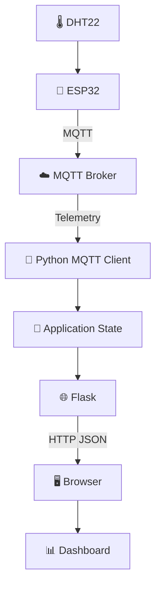
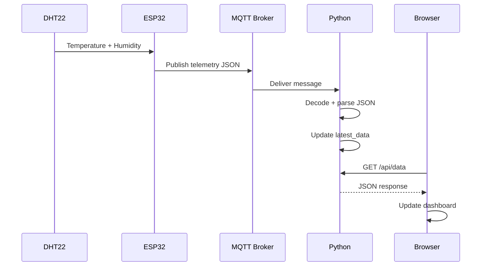
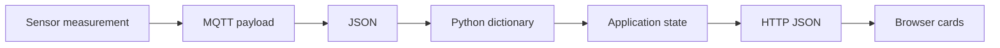
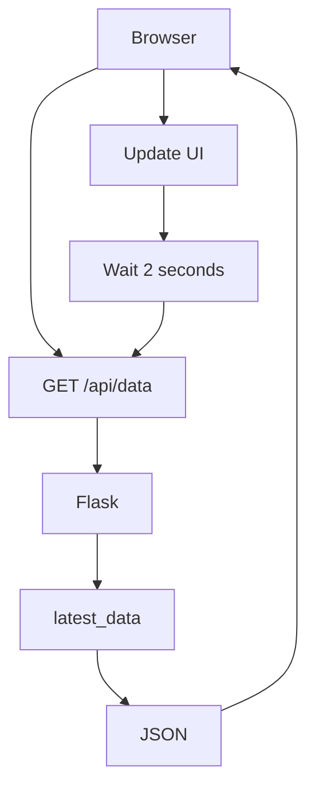
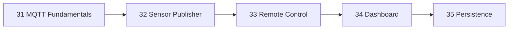

# ⚡ Project 34 — Circuit, Data Flow & Architecture

## 1. Complete System



## 2. End-to-End Sequence



## 3. Data Transformation



## 4. Browser Polling



## 5. Layered Architecture

```text
Presentation → Browser / HTML / CSS / JavaScript
Application  → Python / Flask
Messaging    → MQTT / Broker
Network      → Wi-Fi / IP / TCP
Device       → ESP32 / DHT22
```

## 6. Project Progression



## 7. Live vs Historical

```text
Project 34:
ESP32 → MQTT → Python → Dashboard
                         └── latest value

Project 35:
ESP32 → MQTT → Python → Database → Dashboard
                         └── historical values
```
