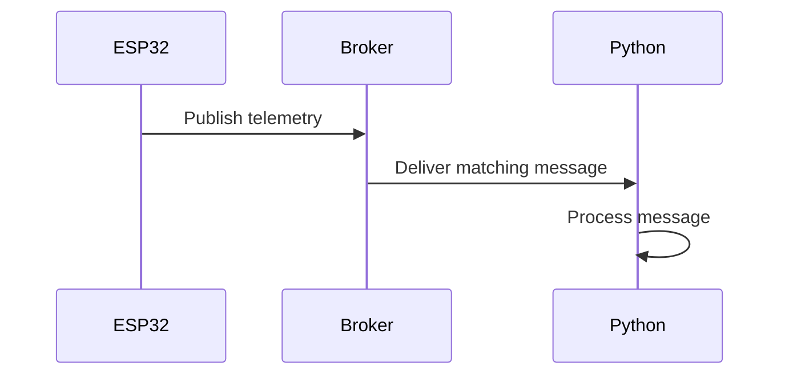
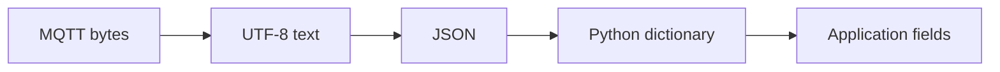
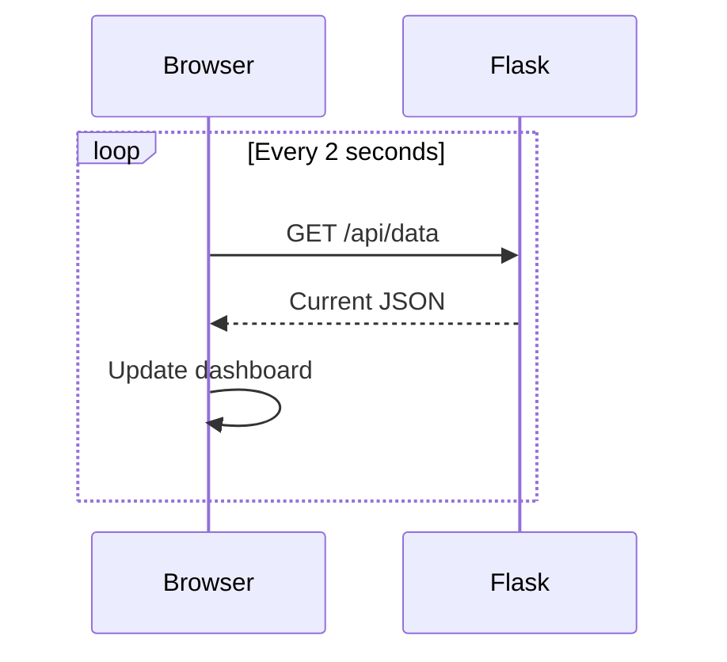
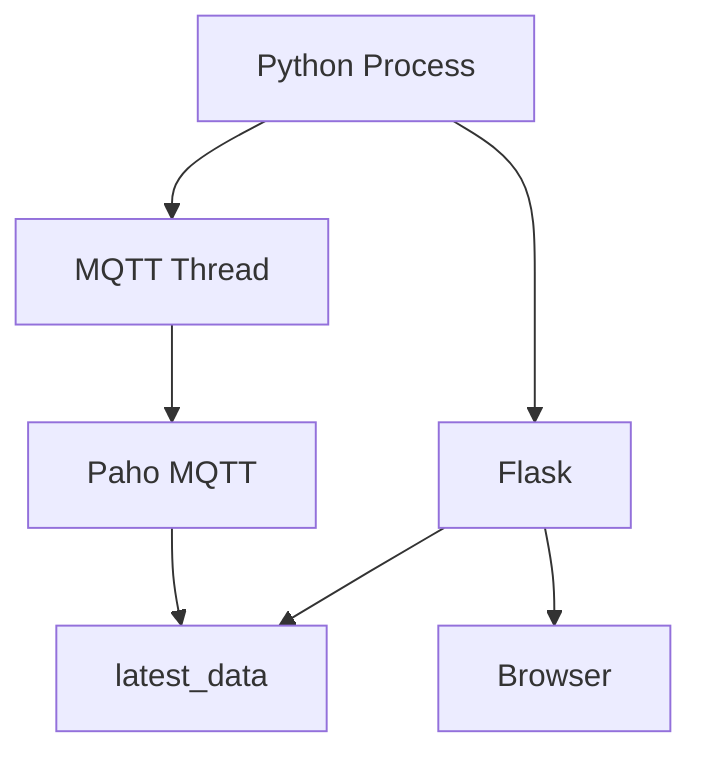
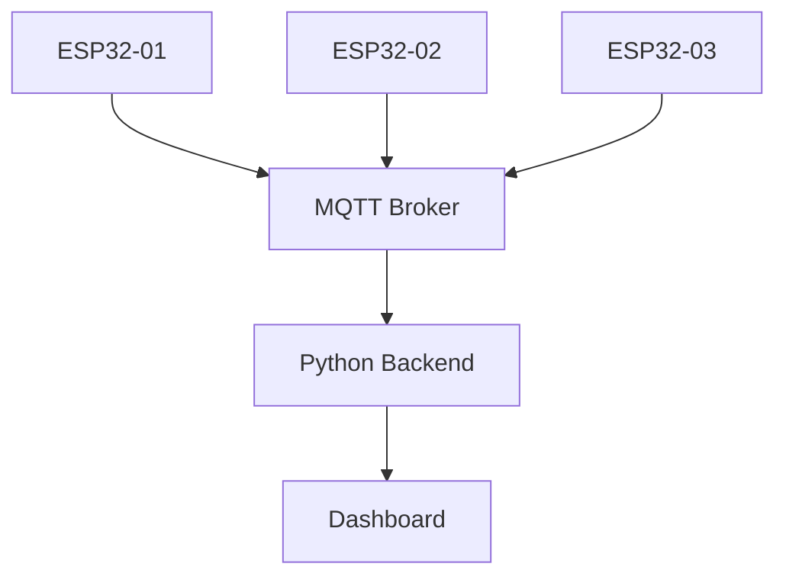
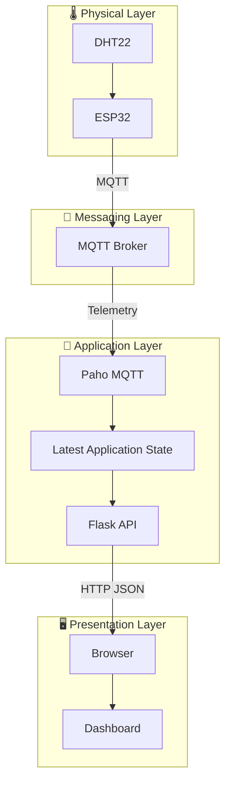

# 📘 Project 34 Notes — IoT Dashboard & Data Visualization

> **Classroom Chapter • Detailed Theory • Practical Reasoning • Experiments**

---

# 1. The Big Idea

Project 34 introduces the **application layer** of the IoT architecture.

A sensor reading is useful to a machine, but a human operator usually needs:

- context,
- readable values,
- status,
- timestamps,
- warnings,
- trends,
- controls,
- visualization.

Project 34 therefore transforms:

```text
DEVICE DATA
    ↓
MESSAGE
    ↓
APPLICATION
    ↓
VISUAL INFORMATION
```

The complete architecture is:

```text
DHT22
  ↓
ESP32
  ↓
Wi-Fi
  ↓
MQTT Broker
  ↓
Python MQTT Client
  ↓
Application State
  ↓
Flask
  ↓
HTTP
  ↓
Browser
  ↓
Dashboard
```

---

# 2. Why Project 34 Is an Important Level 5 Step

Earlier projects focused mainly on the device.

Project 31 taught the messaging model.

Project 32 connected a real sensor to MQTT telemetry.

Project 33 introduced commands and device state.

Project 34 moves beyond the device and asks:

> **What happens to IoT data after it leaves the embedded system?**

That question introduces software architecture, APIs, visualization and eventually data engineering.

---

# 3. The Application Layer

An IoT system can be viewed as layers:

```text
┌───────────────────────────────────┐
│ PRESENTATION                      │
│ Browser / Dashboard               │
├───────────────────────────────────┤
│ APPLICATION                       │
│ Python / Flask                    │
├───────────────────────────────────┤
│ MESSAGING                         │
│ MQTT / Broker                     │
├───────────────────────────────────┤
│ NETWORK                           │
│ Wi-Fi / IP / TCP                  │
├───────────────────────────────────┤
│ DEVICE                            │
│ ESP32 / DHT22                     │
└───────────────────────────────────┘
```

Each layer has a different responsibility.

### Device

Measures the physical world.

### Network

Moves data between systems.

### Messaging

Provides application-level message transport.

### Application

Processes and organizes data.

### Presentation

Makes information understandable to users.

---

# 4. Project 32 vs Project 34

## Project 32

```text
DHT22
 ↓
ESP32
 ↓
MQTT
 ↓
Subscriber
```

The primary goal was telemetry publishing.

## Project 34

```text
DHT22
 ↓
ESP32
 ↓
MQTT
 ↓
Python Application
 ↓
Flask
 ↓
Browser
```

The primary goal is **consuming and presenting telemetry**.

The ESP32 code does not need to know that a browser exists.

That separation is an important architectural principle.

---

# 5. MQTT Subscriber in Python

The Python program acts as an MQTT client.

It subscribes to:

```text
iot-student-lab/project32/telemetry
```

The broker delivers matching messages to the Python application.



The Python application is therefore a **consumer of IoT telemetry**.

---

# 6. Why Not Make the Browser an MQTT Client?

A browser can participate in messaging architectures with additional technologies, but this project intentionally uses Python as an intermediate application layer.

That gives students a clear architecture:

```text
Embedded device
      ↓
IoT messaging
      ↓
Backend application
      ↓
Web interface
```

This separation makes it possible to add:

- databases,
- authentication,
- business rules,
- analytics,
- multiple data sources,
- device management,
- APIs.

---

# 7. MQTT and HTTP Have Different Jobs

Students often confuse MQTT and HTTP because both move data.

They operate at different parts of the application architecture.

| Technology | Main role |
|---|---|
| Wi-Fi | Wireless network connectivity |
| IP | Network addressing |
| TCP | Transport |
| MQTT | IoT publish/subscribe messaging |
| HTTP | Web request/response |
| JSON | Structured data representation |
| HTML/CSS | User interface |
| JavaScript | Browser-side behavior |

The Project 34 bridge is:

```text
ESP32
  │
  │ MQTT
  ▼
Python
  │
  │ HTTP
  ▼
Browser
```

---

# 8. JSON as a Data Contract

Project 32 sends structured telemetry:

```json
{
  "reading": 12,
  "temperature": 25.60,
  "humidity": 61.20
}
```

This is more expressive than an unstructured string.

The Python program can access:

```text
data["temperature"]
data["humidity"]
data["reading"]
```

The field names create a simple schema.

---

# 9. What Is a Schema?

A schema describes the expected structure of data.

For Project 34:

```text
telemetry
├── reading
├── temperature
└── humidity
```

A conceptual schema could be:

| Field | Meaning |
|---|---|
| `reading` | Sequential reading number |
| `temperature` | Temperature in °C |
| `humidity` | Relative humidity in % |

If the publisher suddenly changes:

```text
temperature
```

to:

```text
temp
```

the current application will not automatically understand the new field.

This is why data contracts matter.

---

# 10. MQTT Payload Processing

The incoming message is represented as bytes.

The application performs:

```text
MQTT payload
    ↓
decode("utf-8")
    ↓
text
    ↓
json.loads()
    ↓
Python dictionary
```

The transformation can be visualized as:



This is a small example of **data transformation**.

---

# 11. Error Handling During Parsing

Network data should never be assumed to be perfect.

The application handles:

```text
JSONDecodeError
```

If invalid JSON arrives:

```text
MQTT message
     ↓
JSON parser
     ↓
Invalid JSON
     ↓
Error message
```

The application does not silently pretend that the data is valid.

This is an important software engineering principle.

---

# 12. Application State

The application keeps the latest data:

```text
latest_data
├── reading
├── temperature
├── humidity
├── timestamp
└── connected
```

This means the backend can answer:

> “What is the latest telemetry I received?”

It does not mean:

> “Show me every reading from the last week.”

That would require persistence.

---

# 13. Live State vs Historical State

This distinction is fundamental.

### Live state

```text
temperature = 25.6 °C
```

represents the latest known value.

### Historical data

```text
12:00 → 24.8
12:02 → 25.0
12:04 → 25.4
12:06 → 25.6
...
```

requires storage.

Therefore:

```text
Memory
  → latest state

Database
  → history
```

---

# 14. Timestamp

The application records:

```python
time.time()
```

This gives a Unix timestamp.

The browser converts it into a human-readable clock time.

Conceptually:

```text
MQTT message arrives
       ↓
time.time()
       ↓
Unix timestamp
       ↓
JavaScript Date
       ↓
Human-readable time
```

The timestamp tells the dashboard when the application received the data.

It should not automatically be interpreted as the exact physical time at which the DHT22 measurement occurred unless the system's timing semantics establish that relationship.

---

# 15. Flask

Flask is used to create the web application.

The project has two important routes.

```text
/
```

and:

```text
/api/data
```

### `/`

Provides the dashboard interface.

### `/api/data`

Provides current application state.

This separation introduces an important web architecture concept:

```text
Presentation
    ↕
API
    ↕
Application state
```

---

# 16. What Is an API?

API means **Application Programming Interface**.

In this project:

```text
GET /api/data
```

is a simple API endpoint.

The browser requests information.

The server responds with JSON.

```text
Browser
  │
  │ GET /api/data
  ▼
Flask
  │
  │ JSON
  ▼
Browser
```

An API provides a defined interface between software components.

---

# 17. Why JSON Is Also Used by the API

The same general data representation can travel through both layers:

```text
ESP32 → MQTT → JSON → Python
Python → HTTP → JSON → Browser
```

That consistency makes the architecture easier to understand and extend.

---

# 18. Browser-Side JavaScript

The browser executes:

```javascript
fetch("/api/data")
```

The result is parsed as JSON.

Then JavaScript updates:

```text
temperature
humidity
reading
connection
timestamp
```

The important concept is that the page does not need to reload completely.

Only the displayed values are updated.

---

# 19. Polling

The project calls:

```text
/api/data
```

every two seconds.

This is polling.



Polling is easy to understand and implement.

However, it creates repeated requests even if the data has not changed.

---

# 20. Why Not Use a 2-Second WebSocket?

WebSockets provide a different communication pattern:

```text
Persistent connection
       ↓
Server can push updates
       ↓
Browser receives them
```

This can be more appropriate for applications that need frequent real-time updates.

The project uses polling because it keeps the architecture accessible for students.

---

# 21. Near-Real-Time Visualization

Suppose the ESP32 publishes:

```text
12:00:00 → 25.0 °C
```

The dashboard may request data at:

```text
12:00:01
```

or:

```text
12:00:02
```

depending on timing.

Therefore the display is not mathematically instantaneous.

It is better described as:

> **near-real-time**

This vocabulary matters in engineering.

---

# 22. Threading

The Python application has two ongoing jobs:

```text
MQTT client
    +
Flask server
```

The MQTT client uses a long-running loop.

Flask also needs to serve browser requests.

The project therefore runs MQTT in a background thread.



This is an introduction to **concurrent application tasks**.

---

# 23. Shared Application State

Both MQTT processing and Flask access:

```text
latest_data
```

This is shared state.

In a small classroom application, this is manageable.

In larger applications, developers must think carefully about:

- synchronization,
- race conditions,
- atomic updates,
- thread safety,
- queues,
- databases,
- asynchronous programming.

The project gives students a practical reason to encounter these concepts.

---

# 24. Why a Database Is Not Yet Needed

The dashboard needs:

```text
latest temperature
latest humidity
latest reading
```

It can keep these in memory.

A database becomes important when requirements become:

```text
last hour
last day
last month
compare devices
calculate averages
plot trends
generate reports
```

Then the architecture changes.

---

# 25. Project 34 → Project 35

Project 34:

```text
ESP32
 ↓
MQTT
 ↓
Python
 ↓
Dashboard
```

Project 35:

```text
ESP32
 ↓
MQTT
 ↓
Python
 ↓
Database
 ↓
Dashboard
```

The database introduces persistence.

---

# 26. Historical Data Model

Imagine storing:

| Timestamp | Device | Temperature | Humidity |
|---|---|---:|---:|
| 12:00 | ESP32-01 | 25.1 | 60 |
| 12:02 | ESP32-01 | 25.3 | 61 |
| 12:04 | ESP32-01 | 25.6 | 61 |
| 12:06 | ESP32-01 | 25.8 | 62 |

Now the dashboard can calculate:

- minimum,
- maximum,
- average,
- rate of change,
- trends.

This is the beginning of IoT analytics.

---

# 27. Fault Isolation

A professional debugging process separates the system into layers.

```text
1. Sensor
2. ESP32
3. Wi-Fi
4. MQTT
5. Topic
6. Python
7. Application state
8. Flask
9. Browser
```

For example:

If the browser shows `--`, do not immediately assume the JavaScript is broken.

First ask:

```text
Did the ESP32 publish?
       ↓
Did the broker receive?
       ↓
Did Python subscribe?
       ↓
Did Python receive?
       ↓
Did JSON parse?
       ↓
Did latest_data update?
       ↓
Does /api/data return data?
       ↓
Does browser render it?
```

This is **fault isolation**.

---

# 28. Troubleshooting Matrix

| Symptom | Likely layer | First investigation |
|---|---|---|
| No sensor data | Sensor/device | Project 32 |
| No MQTT messages | MQTT | Broker/topic |
| Python cannot connect | Network/MQTT | Broker address/port |
| Python connects, no data | Topic | Exact topic |
| JSON error | Data contract | Payload structure |
| API empty | Application | `latest_data` |
| Dashboard opens but blank | Frontend/API | `/api/data` |
| Dashboard stops updating | Browser/backend | Polling/API |
| Status disconnected | MQTT | Broker connection |

---

# 29. Experiment — Temperature Warning

Add:

```text
temperature > 30 °C
```

Then display:

```text
⚠️ HIGH TEMPERATURE
```

The interesting engineering question is:

> **Where should the rule be implemented?**

### On ESP32

Advantages:

- immediate,
- works even if dashboard is unavailable.

### Backend

Advantages:

- centralized rules,
- easier to update.

### Browser

Advantages:

- simple presentation logic.

The correct answer depends on system requirements.

---

# 30. Experiment — Humidity Warning

Add:

```text
humidity > 80 %
```

Test:

```text
79 %
80 %
81 %
```

Observe threshold behavior.

Then ask:

> Should a warning disappear immediately when humidity falls below 80%, or should it require hysteresis?

This introduces a more advanced control concept.

---

# 31. Experiment — Add Device Identity

Add:

```json
"device_id": "esp32-01"
```

Now the backend can distinguish devices.

This becomes essential for multi-device systems.

---

# 32. Multiple Devices

Imagine:

```text
ESP32-01
ESP32-02
ESP32-03
```

The architecture becomes:



Now the backend must maintain multiple device states.

Conceptually:

```text
devices
├── esp32-01
│   ├── temperature
│   └── humidity
├── esp32-02
│   ├── temperature
│   └── humidity
└── esp32-03
    ├── temperature
    └── humidity
```

---

# 33. Topic Design for Multiple Devices

A scalable topic structure could be:

```text
iot-student-lab/devices/esp32-01/telemetry
iot-student-lab/devices/esp32-02/telemetry
iot-student-lab/devices/esp32-03/telemetry
```

Now the topic itself carries device identity.

Alternatively, device identity can be included in the payload.

Both approaches have trade-offs.

---

# 34. Topic vs Payload Identity

### Identity in topic

```text
devices/esp32-01/telemetry
```

### Identity in payload

```json
{
  "device_id": "esp32-01",
  "temperature": 25.5
}
```

### Both

Many systems use both.

Why?

The topic helps route messages.

The payload carries application data.

The exact architecture should be chosen deliberately rather than accidentally.

---

# 35. Historical Data Challenge

Suppose the teacher asks:

> “Show me the temperature trend for the last 24 hours.”

The current application cannot answer this reliably because it keeps only the latest reading.

The architecture must become:

```text
MQTT
 ↓
Ingestion
 ↓
Database
 ↓
Query
 ↓
Visualization
```

This is an **IoT data pipeline**.

---

# 36. Data Pipeline Thinking

A mature IoT system can be described as:

```text
SOURCE
  ↓
INGEST
  ↓
TRANSPORT
  ↓
PROCESS
  ↓
STORE
  ↓
QUERY
  ↓
VISUALIZE
  ↓
DECIDE
```

Project 34 covers much of:

```text
SOURCE
 ↓
INGEST
 ↓
TRANSPORT
 ↓
PROCESS
 ↓
VISUALIZE
```

Project 35 adds:

```text
STORE
 ↓
QUERY
```

---

# 37. Dashboard as a Human Interface

A dashboard should answer questions.

Examples:

### What is happening now?

```text
Temperature: 25.6 °C
Humidity: 61.2 %
```

### Is the system connected?

```text
MQTT: CONNECTED
```

### When was the data updated?

```text
Last update: 12:30:14
```

The dashboard should not merely look attractive.

Its visual elements should support interpretation.

---

# 38. Data Visualization Principles

Even a simple dashboard should consider:

- clarity,
- units,
- labels,
- update time,
- status,
- consistency,
- readable hierarchy.

For example:

Bad:

```text
25.6
61.2
12
```

Better:

```text
Temperature
25.6 °C

Humidity
61.2 %

Reading
12
```

Context turns numbers into information.

---

# 39. Production Considerations

This project is deliberately educational.

A production deployment would need additional engineering.

### Security

```text
Authentication
Authorization
TLS
Credential management
```

### Reliability

```text
Retries
Monitoring
Health checks
Persistent storage
Backups
```

### Scalability

```text
Multiple devices
Multiple users
Message volume
Database capacity
```

### Operations

```text
Logging
Metrics
Alerts
Deployment
Updates
```

---

# 40. Security of the MQTT Layer

The dashboard depends on an MQTT broker.

If an attacker can inject telemetry, the dashboard may display false information.

Therefore a production system needs mechanisms such as:

- authentication,
- topic authorization,
- TLS,
- device identity,
- secure credentials.

The project intentionally keeps these concerns out of the beginner implementation so the data flow remains clear.

---

# 41. Security of the Web Layer

The Flask application exposes a web interface.

A production application would also consider:

- authentication,
- authorization,
- secure transport,
- input validation,
- session security,
- rate limiting,
- secure deployment configuration.

The local educational server is not a production service.

---

# 42. Experiment — Break the Data Contract

Send a payload missing:

```text
humidity
```

Observe what happens.

Then send:

```json
{
  "reading": 1,
  "temperature": 25.5
}
```

The application uses `.get()` so missing values can become `None`.

This demonstrates why consumers should handle incomplete data deliberately.

---

# 43. Experiment — Invalid JSON

Try a malformed payload:

```text
{temperature: 25.5}
```

instead of valid JSON:

```json
{
  "temperature": 25.5
}
```

Observe the parsing error.

Discuss:

> Why is `temperature: 25.5` not equivalent to `"temperature": 25.5` in JSON?

---

# 44. Experiment — Change Refresh Rate

The browser currently refreshes every:

```text
2 seconds
```

Try:

```text
1 second
```

and:

```text
5 seconds
```

Discuss:

- network traffic,
- server load,
- perceived responsiveness,
- stale data.

This demonstrates that update frequency is an engineering trade-off.

---

# 45. Experiment — Add Min/Max

Maintain:

```text
minimum temperature
maximum temperature
```

during the current application session.

Now the dashboard can show:

```text
Current: 25.6 °C
Minimum: 23.8 °C
Maximum: 27.1 °C
```

This introduces basic analytics without requiring a database.

---

# 46. Experiment — Add an Uptime Counter

Track application uptime.

Display:

```text
Dashboard uptime:
00:14:32
```

Discuss the difference between:

```text
application uptime
```

and:

```text
device uptime
```

These are not necessarily the same.

---

# 47. Engineering Questions

1. Why is an application layer useful?
2. Why does Python subscribe to MQTT?
3. Why is Flask separate from MQTT?
4. What is JSON?
5. What is a schema?
6. What is `latest_data`?
7. What does `/api/data` provide?
8. What is polling?
9. Why is two-second polling near-real-time?
10. Why does MQTT run in a background thread?
11. What happens if the MQTT broker stops?
12. What happens if the browser closes?
13. What happens if Python restarts?
14. Why is historical data different from live state?
15. How would you support 100 devices?
16. How would you secure the system?
17. Where should warning rules be implemented?
18. What information should a dashboard show to a human operator?

---

# 48. Common Misconceptions

### “The dashboard talks directly to the DHT22.”

No.

```text
DHT22 → ESP32 → MQTT → Python → HTTP → Browser
```

### “MQTT is the dashboard.”

No.

MQTT transports messages.

The dashboard visualizes information.

### “Flask is an MQTT library.”

No.

Paho MQTT handles MQTT.

Flask handles the web application.

### “The database is required for live data.”

No.

The application can hold the latest value in memory.

A database becomes important for persistence and historical analysis.

### “Polling is the same as push.”

No.

Polling asks repeatedly.

Push mechanisms allow the server to send updates when events occur.

---

# 49. Student Practical Record

Record the following:

### MQTT topic

```text
________________________________________
```

### Example telemetry

```text
________________________________________
```

### Python connection result

```text
________________________________________
```

### Dashboard URL

```text
________________________________________
```

### Temperature observed

```text
________________________________________
```

### Humidity observed

```text
________________________________________
```

### One failure encountered

```text
________________________________________
```

### How it was isolated

```text
________________________________________
```

---

# 50. Final Architecture



---

# 51. Level 5 Progression

```text
31 ─ MQTT Fundamentals
        ↓
32 ─ ESP32 MQTT Sensor Publisher
        ↓
33 ─ MQTT Remote Device Control
        ↓
34 ─ IoT Dashboard & Visualization
        ↓
35 ─ Persistent IoT Data
```

The conceptual progression is:

```text
COMMUNICATE
     ↓
SENSE
     ↓
CONTROL
     ↓
VISUALIZE
     ↓
STORE
     ↓
ANALYZE
```

---

# 52. Final Takeaways

Students should understand:

### MQTT

```text
Broker
Topic
Publish
Subscribe
Payload
```

### Data

```text
JSON
Schema
Timestamp
Application state
```

### Web

```text
HTTP
API
Flask
JavaScript
Polling
```

### Architecture

```text
Device
 ↓
Messaging
 ↓
Application
 ↓
Presentation
```

### Engineering

```text
Fault isolation
Error handling
Scalability
Security
Persistence
```

> 🚀 **The major lesson of Project 34 is not simply how to make a web page. It is how to connect an embedded IoT system to an application layer that can transform machine-generated telemetry into useful information for people.**
