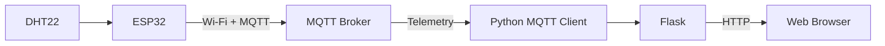

# 🔌 Project 34 — IoT Dashboard & Visualization Wiring

## Hardware

Project 34 uses the DHT22 + ESP32 sensor node established in Project 32.

| Component | Quantity | Role |
|---|---:|---|
| ESP32 | 1 | Sensor + MQTT publisher |
| DHT22 | 1 | Temperature/humidity sensor |
| 10 kΩ resistor* | 1 | Pull-up for bare DHT22 |
| Computer | 1 | Python dashboard |
| Wi-Fi network | 1 | Connectivity |
| MQTT broker | 1 | Message routing |

\*Many DHT22 modules already include a pull-up resistor.

---

## 🌡️ Physical Wiring

| DHT22 | ESP32 |
|---|---|
| VCC | 3.3V |
| DATA | GPIO 4 |
| NC | Not connected |
| GND | GND |

```text
DHT22
 ┌─────────────────┐
 │ Temperature     │
 │ + Humidity      │
 └────────┬────────┘
          │ DATA
          ▼
      ESP32 GPIO 4
```

---

## 🧠 What Changes?

The physical sensor circuit remains essentially the Project 32 circuit.

The major change is software architecture:

```text
Project 32
DHT22 → ESP32 → MQTT → Subscriber

Project 34
DHT22 → ESP32 → MQTT → Python → Flask → Browser
```

---

## 🌐 Complete Architecture



---

## 📡 MQTT Topic

```text
iot-student-lab/project32/telemetry
```

Expected payload:

```json
{
  "reading": 12,
  "temperature": 25.60,
  "humidity": 61.20
}
```

---

## 🧪 Verification Path

```text
DHT22
  ↓
ESP32
  ↓
Wi-Fi
  ↓
MQTT Broker
  ↓
Python Subscriber
  ↓
Flask API
  ↓
Browser
```

If the dashboard shows no data, identify the first failed layer.

---

## ⚠️ Safety

No mains-voltage circuit is required.

Use the low-voltage ESP32 + DHT22 setup from Project 32 and verify the exact sensor/module pinout before powering the circuit.
